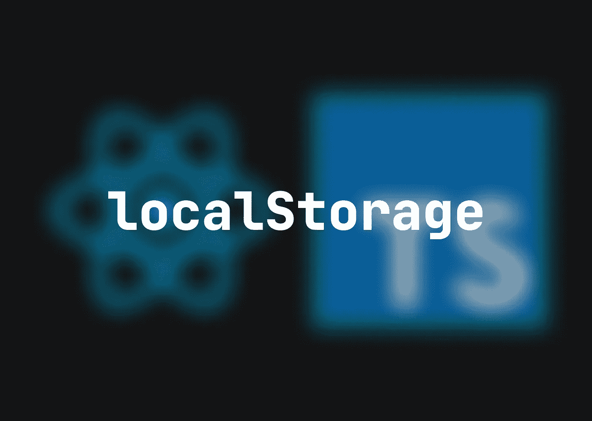

# 我如何在 React 中使用本地存储

> 原文：<https://medium.com/codex/how-i-use-localstorage-in-react-b4109f1e7a3?source=collection_archive---------5----------------------->

在 web 开发中使用`localStorage`是一个非常强大的工具。主题信息甚至产品数据都可以轻松保存在用户的浏览器存储中；在本文中，我将讨论如何在 React 应用程序中使用它。



对象的功能使用起来相当简单。可以用`key: string`访问数据，或者用`key: string`和`value: string`设置数据

```
🧑‍💻 **USING localStorage IN REACT IS SIMPLE**type Theme = 'dark' | 'light'const [theme, setTheme] = useState<Theme>(**localStorage.getItem('theme')** as Theme || 'light')useEffect(() => {
  **localStorage.setItem('theme', theme)**
}, [theme])
```

甚至对象或数组也可以用`JSON.stringify()`存储为一个值

```
👏 **OBJECTS AND ARRAYS SHOULD BE STORED WHEN DATA IS COMPLEX**useEffect(() => {
  const colors = ['#02D4F6', '#02D4B8', '🐴']
  const theme = {
    preferred: 'light',
    actual: 'dark',
    horse: '🐴'
  }
  **localStorage.setItem('list', JSON.stringify(colors))**
  **localStorage.setItem('list', JSON.stringify(theme))**
}, [])
```

因为我们只能保存`string`类型的数据，所以对象和数组必须总是在`setItem()`上`JSON.stringify()` ed，在`getItem()`上`JSON.parse()` d。这最终会变得多余，所以让我们创建一个实用程序来为我们完成这项工作

```
👔 **CREATE storage.ts IN src/utils**const storage = {
 **get: (key: string): string | null => {
    const result = localStorage.getItem(key)
    if (!result) return null
    try {
      return JSON.parse(result)
    } catch {
      return result
    }
  }**
}export default storage
```

我们自己的`storage`对象是使用`get`函数属性创建的。它的职责是使用一个`key`参数从`localStorage`获取一个项目，并尝试解析结果。如果结果是一个`string`，它将返回它而不进行解析。如果值是对象或数组，它可以解析并返回它。

现在我们可以用`set`扩展我们的效用

```
📈 **EXTEND UTILITY WITH set()**const storage = {
  get: (key: string): string | null => {
    const result = localStorage.getItem(key)
    if (!result) return null
    try {
      return JSON.parse(result)
    } catch {
      return result
    }
  },
  **set: (key: string, value: string | {} | []): void => {
    localStorage.setItem(
      key,
      typeof value === 'string' ? value : JSON.stringify(value)
    )
  }**
}export default storage
```

除了一个`key`，`set`还有一个`value`参数，可以是字符串，对象，或者数组。该函数的作用是将`localStorage`中`key`下的`value`保存，如果`value`的类型不是`string`，保存前必须`JSON.stringify()`该`value`。

当然，按照这种模式，您可以使用额外的`localStorage`功能来扩展这个实用程序的功能，比如`clear()`

```
🚀 **ADD MORE FIELDS**const storage = {
  get: (key: string): string | null => {
    const result = localStorage.getItem(key)
    if (!result) return null
    try {
      return JSON.parse(result)
    } catch {
      return result
    }
  },
  set: (key: string, value: string | {} | []): void => {
    localStorage.setItem(
      key,
      typeof value === 'string' ? value : JSON.stringify(value)
    )
  },
 **clear: (): void => {
    localStorage.clear()
  }**
}export default storage
```

现在使用非常简单；存储对象只需导入到页面或组件中，并使用适当的参数执行。

你对这个实现有什么感觉？这对你有意义吗？会让你的生活更轻松吗？请在评论区分享你的想法。

👋我希望这在你寻找新的学习材料时对你有用。感谢您花时间阅读这篇文章！如果你想在未来读到更多这样的故事，请订阅我的电子邮件列表。