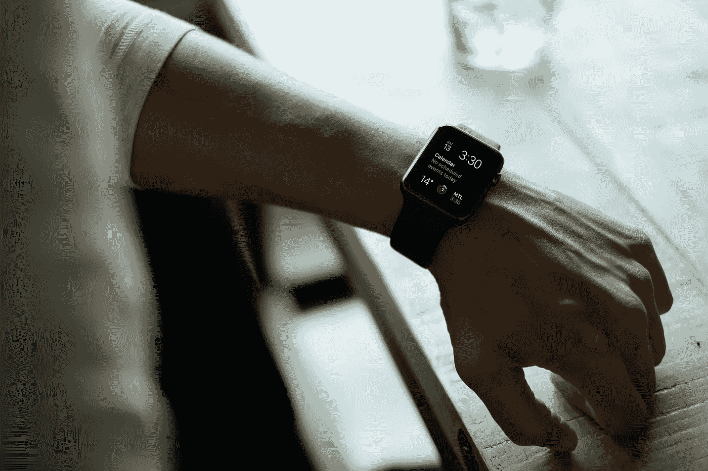
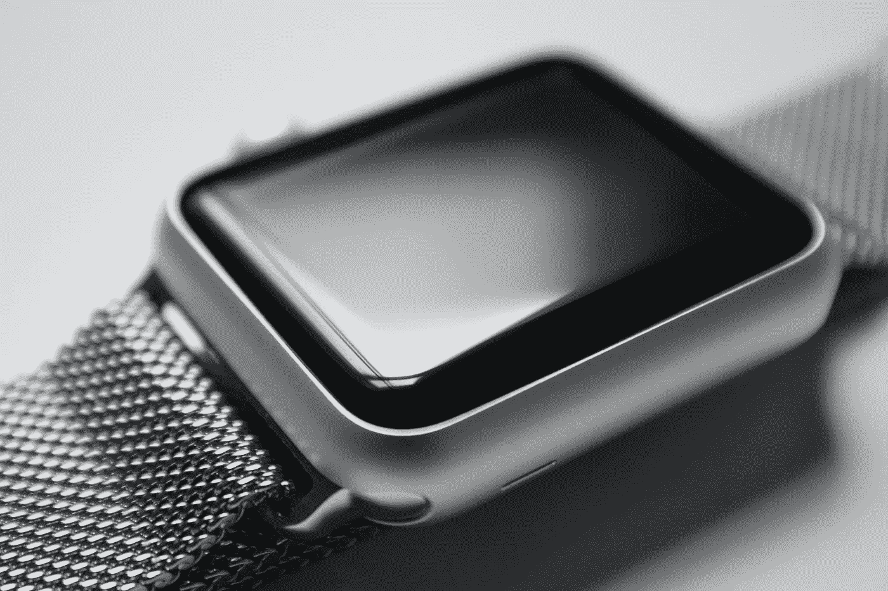
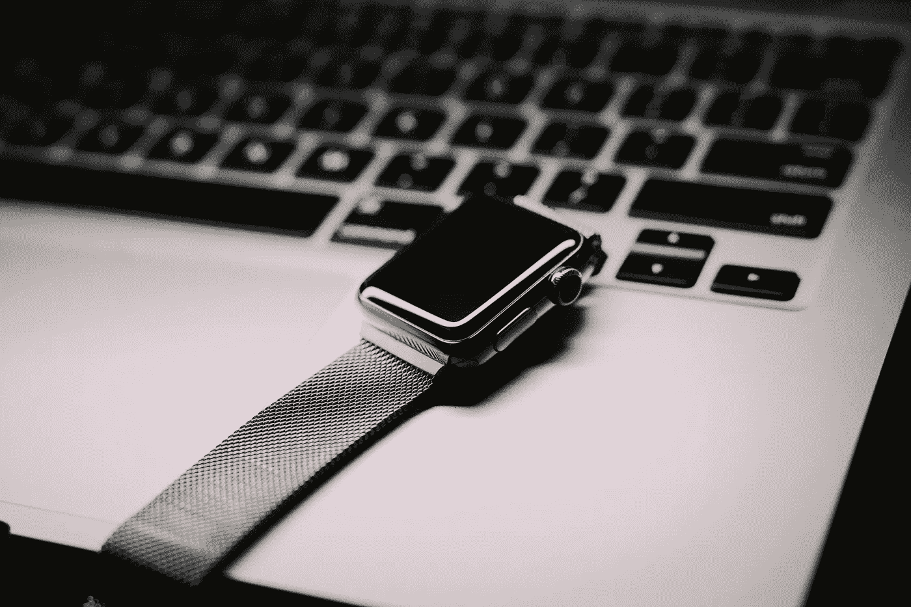
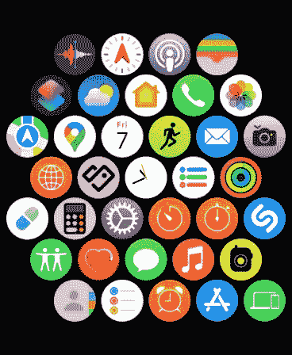

# 我如何使用 Apple Watch:个人观感

> 原文：<https://medium.com/codex/how-i-use-the-apple-watch-a-personal-look-fdc484158a5b?source=collection_archive---------14----------------------->

## 看看我怎么用我的 Apple Watch，看看它是否适合你。

Luke Chesser 在 Unsplash 上的照片

Apple Watch 是一款很棒的设备，但并不适合所有人。有些人不会喜欢它的外观，有些人不会欣赏它的健身功能。然而，有许多人有一块手表，因为出于某种原因，他们想在日常生活中使用它。

我不是那种拥有很多小玩意，同时戴着几块手表的人。如果你能把多块手表组合成一个什么都做的设备，而不是为了基本功能或你最喜欢的应用程序的通知而不得不购买单独的手表，我看不出戴多块手表有什么意义。

Apple Watch 绝对是我个人生活中重要的一部分。我决定写这篇文章，而不是每天花无数个小时在电脑前阅读新的应用程序，以了解其他人在使用什么。

> *看看我如何使用我的 Apple Watch，看看它是否适合你。*

然而，我并不认为自己是一个普通的智能手表用户，但它对我来说很好。我从未想过智能手表会对我有用，因为我上班时不需要它锻炼，晚上也不戴它。我想了很多关于我是否需要这个东西。但是在工作中，手表是有用的。我知道，如果有必要的话，我可以买一块简单的手表来看看时间。我以前戴的是“普通”手表，但我一直想试试智能手表。

此外，我使用 iPhone，Apple Watch 似乎是一个很好的伴侣。如果你们都像我一样在苹果生态系统中，这是一个显而易见和合乎逻辑的选择。但是苹果的智能手表并不便宜，虽然有一款如果你知道你为什么会用它的话是非常实惠的。

照片由 Polly Alexandra 在 Unsplash 上拍摄

# 目前上市的苹果手表

苹果官网提供了最新的 Apple Watch SE，Apple Watch Series 8，以及 Apple Watch Ultra。还有耐克和爱马仕的特别版，我就不描述了。

**Apple Watch Series 8** 是一款很棒的手表，有很多我不需要的功能，而且很贵。售价 399 美元。嗯，这取决于你如何看待它，如果你需要所有这些功能。我不需要一直显示，血氧，心电图，或温度传感。我理解那些需要智能手表上所有健康功能的人，但这不适合我。所以让我们来看看另一款 Apple Watch。

**苹果手表 Ultra** 。$799.为了一块智能手表。毫无疑问，这是一项了不起的技术，根据苹果公司的说法，它具有更好的电池，正常使用可达 36 小时。此外，我可以告诉你，它看起来比任何其他苹果手表都好，我可以继续下去。但这一切都要付出很高的代价。也许有一群人会最大限度地使用所有这些功能，但这款手表肯定不是为大多数人准备的。

**Apple Watch SE** 是我的完美伴侣。我拥有这款手表的第一代，我认为没有必要升级。我在考虑新 iPhone 的问题。目前的这个机构仍然做得很好。

 [## 该不该买最新的 iPhone 14？

### 当你想要 iPhone 14 又不确定是否需要的时候。

medium.com](/@tom-athos/should-you-buy-the-latest-iphone-14-b0fd48a2d381) 

它能做我想从智能手表上得到的一切。而且价格也恰到好处，一款 Apple Watch SE 2 249 美元，这款手表的最新一代，甚至比 SE 1 还便宜。我改变的是一个乐队。那种材料对我来说感觉不太好，所以我从劳特那里买了一支米兰乐队。非常适合像我一样出汗多的人，而且看起来也更优雅。

> *去你当地的苹果商店看看其他老款的苹果手表，因为它们仍然很棒。*

你还能找到 Apple Watch 系列 7 或 6 和 Apple Watch SE 1，而且它们更便宜。只是要注意不要选择 Apple Watch Series 3，一些商店仍在销售，因为对它的支持已经停止。

欧文·斯潘塞在 Unsplash 上拍摄的照片

# 我为什么使用苹果手表

最重要的是来自我手机的**通知。我曾经每隔几分钟就检查一下，看看我的 iPhone 上有没有新东西。新邮件、应用程序通知或其他内容。手腕上戴着智能手表，我可以停止这样做，我做到了。我拿起手机的次数减少了，这是我想要达到的水平。我知道我可以使用几乎任何其他智能手表来发送通知，但 Apple Watch 与 iPhone 的集成非常完美。**

当你在城市里旅行，需要用**导航**到地标时，Apple Watch 也很有帮助。我发现这很有用。

**用智能手表付款**简直是完美的补充。我甚至不需要附近有 iPhone 就能在商店付款。这是我每次买东西都会用到的东西。我再也不用实体银行卡了，也不确定上一次不得不从钱包里掏出卡是什么时候。由于我国银行的不灵活性，我使用*曲线*来添加银行卡，因此所有事情都通过该服务完成，并且运行良好。

> *另一个好处是用我的手表解锁其他苹果设备。我从没想过会这么方便，但确实如此。*

我启用了**站立提醒**，有时出于某种原因，我会记录我的户外散步或徒步旅行。可能更多的是为了好玩，而不是为了任何有用的信息。

我没有什么消耗电池的笨重东西，所以电池充足，从不担心。

> *用了一整天，我还有 60%左右的电量。*

但是使用两天后，你需要把它放在充电器上。不管怎样，我每天晚上都给它充电，一年后，电池的健康度达到了 98%。

这可能对 Siri 有用，但我从来没和她说过话。只是不适合我。我也不超时发信息(也许是表情符号)，也从不拿起电话打电话。对我来说，收到新消息的通知或接到电话就足够了。但我认为，对一些人来说，这些仍然是很好的补充。

> *如你所见，我对 Apple Watch 的使用很简单，但我发现它非常有用，尤其是在工作中。*

截图来自作者 Apple Watch

# 我的苹果手表上有什么

不多。主要是默认应用程序和一些其他应用程序:

*   **谷歌地图**:对我所在的地区来说，苹果地图不够准确或者显示的信息不够多，但我会尽可能地使用它们
*   **Stocard** 用于存储积分卡(商店实用)
*   shopylist:快速购物清单的有用应用

对于非苹果应用来说也就这么多了。我不喜欢在我的 iPhone 上安装其他应用程序。它占用了我的存储空间，对我来说也没什么用。我曾经在我的手表上有一个 *Things3* 应用程序，但我已经决定我根本不需要那个应用程序。苹果提醒和笔记对我来说已经足够了，但对于其他一些“维基个人资料”，我使用的是通过我的 NAS 设备上的 Docker 运行的 *Bookstack* 。

> *就像我之前写的，其他 app 的通知足以让我决定是否需要马上看这件事。*

# 结论

这是我对使用 Apple Watch 的看法。我知道我没有使用手表的所有功能，但它适合我，我不需要更多。此外，我想避免沉迷于手表和所有的传感器和提醒，我需要做些什么才能感觉更好，并为我的健康做些什么。我试着依靠我的直觉，而不是一些设备。

> 生活中有些事情我们必须自己去思考。

我对你如何使用智能手表非常感兴趣。请在评论中让我知道。

谢谢你到目前为止的阅读。我一直很感激。

*原载于 2022 年 10 月 7 日*[*https://www.tomathosblog.com*](https://www.tomathosblog.com/how-i-use-the-apple-watch-a-personal-look/)*。*