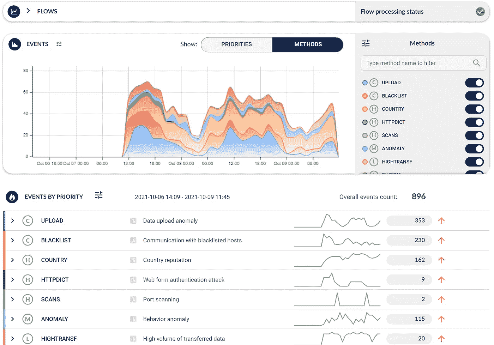
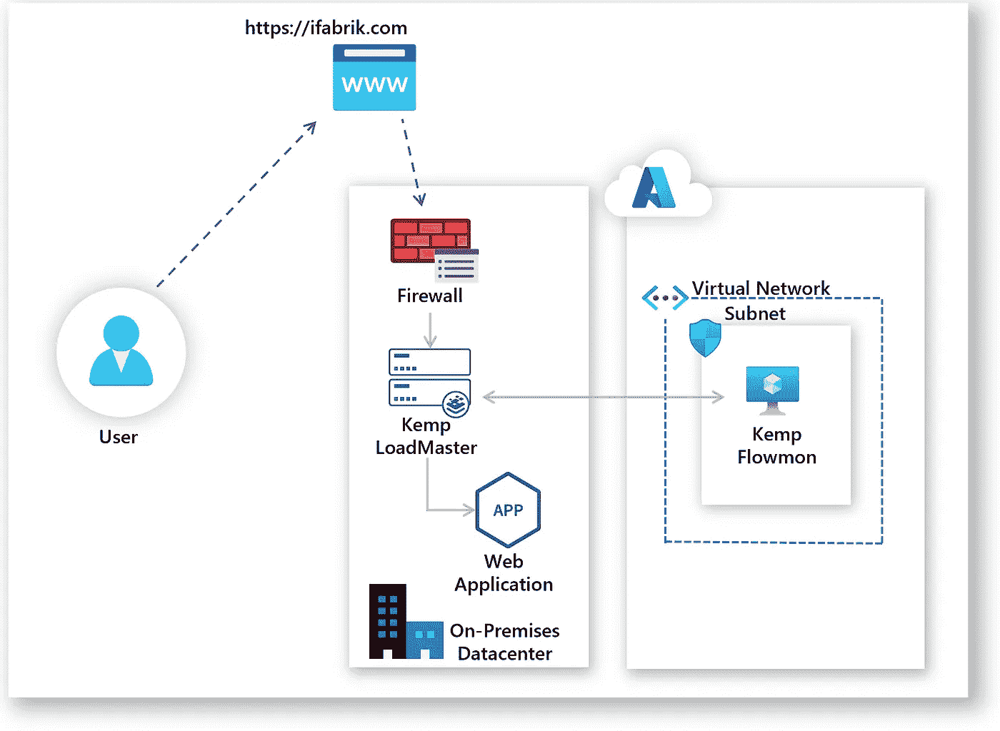
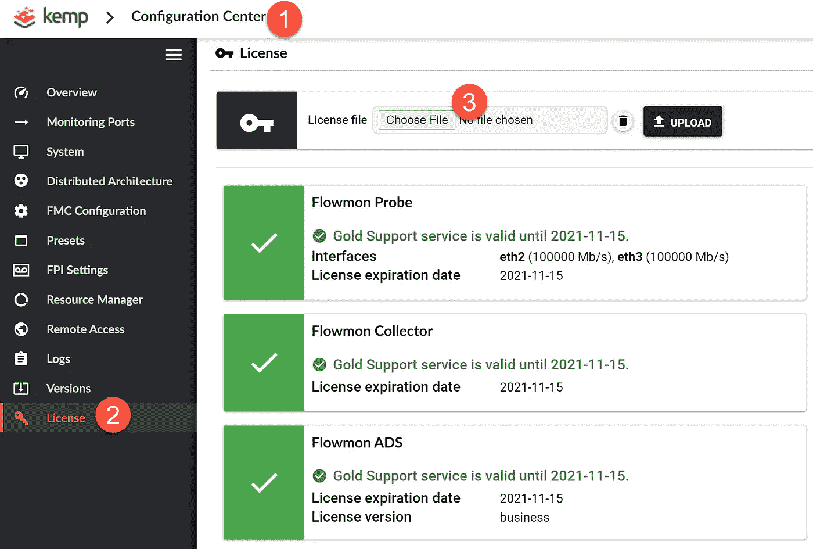
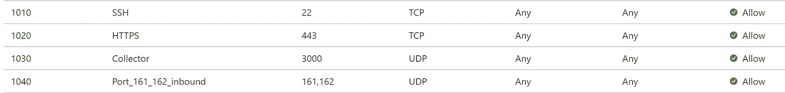
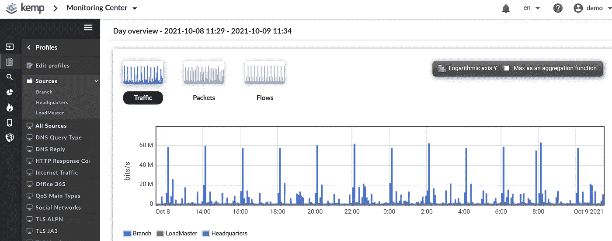
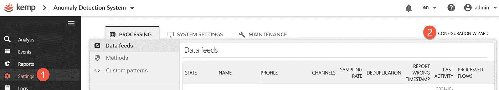
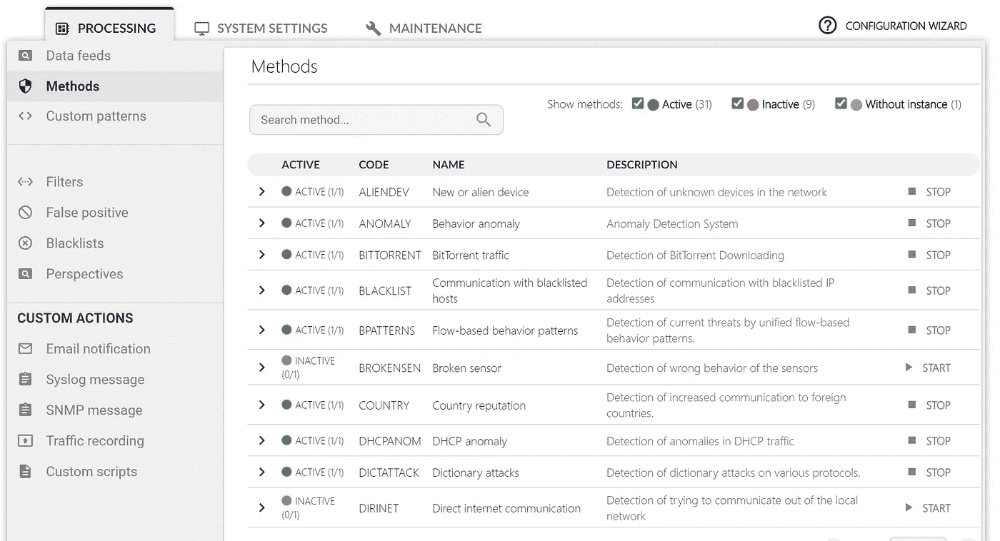
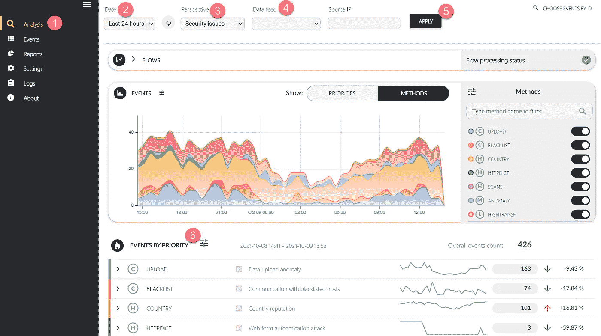
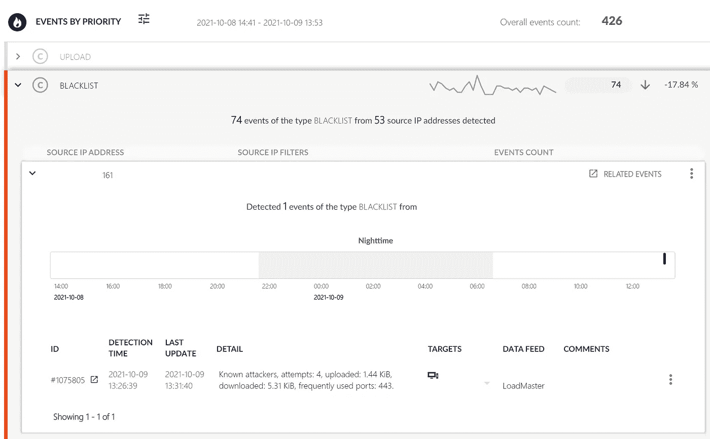
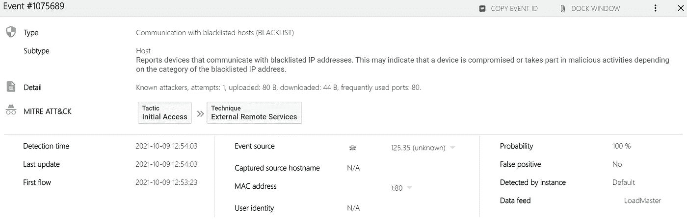

# 💪在 Azure 中部署解决方案以调查网络异常

> 原文：<https://medium.com/codex/how-i-used-bicep-to-deploy-a-comprehensive-solution-in-azure-to-investigate-network-anomalies-488d2a02ba15?source=collection_archive---------7----------------------->

了解如何使用 Azure Bicep 部署 NDR 解决方案，以揭示其他技术无法检测到的威胁。

如果您刚开始涉足网络安全领域，通过网络检测和响应功能保护工作负载可能会非常困难。

下面是一个 web 应用程序的初步发现:



异常检测

我们是怎么到这里的？首先，我们先明确一下术语。网络检测和响应(NDR)指的是一种渐进式安全解决方案，用于全面了解网络中已知和未知的威胁。

本文旨在与您分享我在 Azure 云中部署 NDR 解决方案的个人经验，以及检测威胁和做出响应所需的配置。

我将分享我如何在 Azure 中部署一个解决方案来检测在内部数据中心运行的应用程序的威胁和异常。

# 架构参考

下图显示了环境的高级概述。



## 先决条件:

*   有效的 Azure 订阅
*   拥有所有者/贡献者角色的用户
*   访问本地设备并能够发送网络遥测数据(NetFlow 或 IPFIX)

## 以下是要遵循的步骤:

*   使用 Bicep 在 Azure 中部署 Kemp Flowmon 网络虚拟设备(NVA)
*   许可和配置 NVA
*   在 Azure 中配置本地设备发送 Netflow/IPFIX 到 Kemp Flowmon
*   为异常检测配置肯普·弗洛门 NVA 公司

# 1.使用 Bicep 在 Azure 中部署 Kemp Flowmon 网络虚拟设备(NVA)

第一步是准备 NDR 环境。我们将在 Azure 中使用 Kemp Flowmon 虚拟机，使用 Azure Bicepto 的基础设施即代码来简化部署过程。

你可以参考这篇[文章](https://blog.azinsider.net/how-to-create-a-linux-virtual-machine-with-azure-bicep-template-e22f50f2baea)，它详细展示了如何使用 Bicep 在 Azure 中部署 Kemp Flowmon 设备。注意，您需要创建 SSH 密钥，并确保使用用户名' *flowmon* '。

下面是在 Azure 中部署 Kemp Flowmon NVA 的完整 Bicep 模板。

```
// The name of your Virtual Machine.
param vmName string = 'flowmonVm'// Username for the Virtual Machine.
param adminUsername string// Type of authentication to use on the Virtual Machine. SSH key is recommended.
param authenticationType string = 'sshPublicKey'// SSH Key or password for the Virtual Machine. SSH key is recommended.
[@secure](http://twitter.com/secure)()
param adminPasswordOrKey string// Unique DNS Name for the Public IP used to access the Virtual Machine.
param dnsLabelPrefix string = toLower('flowmon-${uniqueString(resourceGroup().id)}')// Location for all resources.
param location string = resourceGroup().location// The size of the VM.
param vmSize string = 'Standard_B4ms'// Name of the VNET.
param virtualNetworkName string = 'vNet'// Name of the subnet in the virtual network.
param subnetName string = 'Subnet'// Name of the Network Security Group.
param networkSecurityGroupName string = 'SecGroupNet'var publicIPAddressName = '${vmName}PublicIP'
var networkInterfaceName = '${vmName}Nic'
var subnetRef = '${vnet.id}/subnets/${subnetName}'
var osDiskType = 'Standard_LRS'
var subnetAddressPrefix = '10.5.0.0/24'
var addressPrefix = '10.5.0.0/16'
var linuxConfiguration = {
  disablePasswordAuthentication: true
  ssh: {
    publicKeys: [
      {
        path: '/home/${adminUsername}/.ssh/authorized_keys'
        keyData: adminPasswordOrKey
      }
    ]
  }
}resource nic 'Microsoft.Network/networkInterfaces@2020-06-01' = {
  name: networkInterfaceName
  location: location
  properties: {
    ipConfigurations: [
      {
        name: 'ipconfig1'
        properties: {
          subnet: {
            id: subnetRef
          }
          privateIPAllocationMethod: 'Dynamic'
          publicIPAddress: {
            id: publicIP.id
          }
        }
      }
    ]
    networkSecurityGroup: {
      id: nsg.id
    }
  }
}resource nsg 'Microsoft.Network/networkSecurityGroups@2020-06-01' = {
  name: networkSecurityGroupName
  location: location
  properties: {
    securityRules: [
      {
           name: 'SSH'
           properties : {
               protocol : 'Tcp' 
               sourcePortRange :  '*'
               destinationPortRange :  '22'
               sourceAddressPrefix :  '*'
               destinationAddressPrefix: '*'
               access:  'Allow'
               priority : 1010
               direction : 'Inbound'
               sourcePortRanges : []
               destinationPortRanges : []
               sourceAddressPrefixes : []
               destinationAddressPrefixes : []
          }
      }
      {
           name : 'HTTPS'
           properties : {
               protocol :  'Tcp'
               sourcePortRange :  '*'
               destinationPortRange :  '443'
               sourceAddressPrefix :  '*'
               destinationAddressPrefix :  '*'
               access :  'Allow'
               priority : 1020
               direction :  'Inbound'
               sourcePortRanges : []
               destinationPortRanges : []
               sourceAddressPrefixes : []
               destinationAddressPrefixes : []
          }
      }
      {
           name :  'Collector'
           properties : {
               protocol :  'Udp'
               sourcePortRange :  '*'
               destinationPortRange :  '3000'
               sourceAddressPrefix :  '*'
               destinationAddressPrefix :  '*'
               access :  'Allow'
               priority : 103
               direction :  'Inbound'
               sourcePortRanges : []
               destinationPortRanges : []
               sourceAddressPrefixes : []
               destinationAddressPrefixes : []
          }
      }
      {
           name :  'ALL'
           properties : {
               protocol :  '*'
               sourcePortRange :  '*'
               destinationPortRange :  '*'
               sourceAddressPrefix :  '*'
               destinationAddressPrefix : '*'
               access :  'Allow'
               priority : 1040
               direction :  'Inbound'
               sourcePortRanges : []
               destinationPortRanges : []
               sourceAddressPrefixes : []
               destinationAddressPrefixes : []
          }
      }
  ]
  }
}resource vnet 'Microsoft.Network/virtualNetworks@2020-06-01' = {
  name: virtualNetworkName
  location: location
  properties: {
    addressSpace: {
      addressPrefixes: [
        addressPrefix
      ]
    }
    subnets: [
      {
        name: subnetName
        properties: {
          addressPrefix: subnetAddressPrefix
          privateEndpointNetworkPolicies: 'Enabled'
          privateLinkServiceNetworkPolicies: 'Enabled'
        }
      }
    ]
  }
}resource publicIP 'Microsoft.Network/publicIPAddresses@2020-06-01' = {
  name: publicIPAddressName
  location: location
  properties: {
    publicIPAllocationMethod: 'Dynamic'
    publicIPAddressVersion: 'IPv4'
    dnsSettings: {
      domainNameLabel: dnsLabelPrefix
    }
    idleTimeoutInMinutes: 4
  }
  sku: {
    name: 'Basic'
  }
}resource vm 'Microsoft.Compute/virtualMachines@2021-03-01' = {
  name: vmName
  location: location
  properties: {
    hardwareProfile: {
      vmSize: vmSize
    }
    storageProfile: {
      osDisk: {
        createOption: 'FromImage'
        managedDisk: {
          storageAccountType: osDiskType
        }
      }
      imageReference: {
        publisher: 'flowmon'
        offer: 'flowmon_collector'
        sku: 'v1101-byol'
        version: 'latest'
      }
    }
    networkProfile: {
      networkInterfaces: [
        {
          id: nic.id
        }
      ]
    }
    osProfile: {
      computerName: vmName
      adminUsername: adminUsername
      adminPassword: adminPasswordOrKey
      linuxConfiguration: any(authenticationType == 'password' ? null : linuxConfiguration)
    }
    diagnosticsProfile: {
      bootDiagnostics: {
        enabled: true
      }
    }
  }
  plan: {
    name: 'v1101-byol'
    publisher: 'flowmon'
    product: 'flowmon_collector'
  }
}output administratorUsername string = adminUsername
```

一旦你在 Azure 中部署了这个虚拟机，下一步就是申请许可证，你可以从以下网址获得许可证:【https://www.flowmon.com/en/download-free-trial

# 2.许可和配置肯普·弗洛门 NVA 公司

许可证是我们需要上传到“配置中心”模块的文件。您可以转到配置中心>许可证>上传许可证，如下所示:



Kemp Flowmon-上传许可证

一旦您启用了许可证，我们将确保 NVA 可以接收来自不同设备的流量。

我们将从本地 Kemp LoadMaster 向 Azure 中的 Kemp Flowmon 发送网络遥测数据。我们正在讨论将网络遥测从本地设备传输到 Azure 中的 Kemp Flowmon 的能力。

Kemp Flowmon 设备是基于流的，这意味着它可以接收 NetFlow、SF Flow、jFlow、NetStram、IPFIX 等..来自不同的来源，如防火墙、核心交换机、负载平衡器。以下是兼容设备的完整列表:

兼容性列表

为了确保 NVA 可以接收流量，我们必须验证安全规则或 NSG。

Bicep 模板包含实现通信所需的 NSG。下图显示了为 NVA 启用的入站规则:



Kemp Flowmon —入站规则

我们已经在 Azure 中配置了 Kemp Flowmon 的基本设置。

下一步是配置本地设备将 Netflow/IPFIX 发送到 Azure 中的 Kemp Flowmon。

# 3.在 Azure 中配置本地设备发送 Netflow/IPFIX 到 Kemp Flowmon

Kemp Flowmon 设备是基于流的，这意味着它可以接收 NetFlow v5 /v9、s Flow、jFlow、NetStream、IPFIX 等。来自多个设备，包括 Alcatel、Brocade、Cisco、HP、华为、Juniper、VMware、IXIA、Gigamon、Checkpoint、Palo Alto、SonicWall、Fortinet 等。

在这个特定的环境中，我们在本地数据中心有一个 Kemp Loadmaster，因此我们能够在该设备上启用网络遥测，并将其发送到 Azure 中的 Kemp Flowmon 收集器。

要发送网络遥测，我们需要配置本地设备来发送 IPFIX 或任何其他支持的流类型，如下所示:


启用网络遥测

一旦这个选项被启用，我们将在几分钟后在 Azure 的 Kemp Flowmon NVA 中看到所有的网络遥测。

注意:在 Kemp LoadMaster v7.2.55 中，启用网络遥测后，我注意到资源消耗增加了 15%。

下一步是配置 Kemp Flowmon NVA 用于异常检测。

# 4.为异常检测配置肯普·弗洛门 NVA 公司

Kemp Flowmon 将在“监控中心”检测新源。从那里，我们可以创建一个“配置文件”,并从该特定来源中筛选出我们感兴趣的监控内容。

下图显示了“监控中心”和创建的一些配置文件:



Kemp Flowmon —监控中心

既然 Kemp Flowmon 检测到了要监控的源，我们将继续配置异常检测。我们将对名为“*异常检测系统*”的模块进行配置。该模块包含在试用许可证中。

这个 ADS 模块是一个安全解决方案，它使用人工智能和机器学习来检测隐藏在网络流量中的异常。

在 ADS 模块中，有一个配置向导可用于初始设置:



Kemp Flowmon —异常检测系统

在此配置向导中，我们提供了网络配置的参数。我们定义现有服务的服务器和 IP 地址范围:SMTP 服务器、DNS 服务器、DHCP、本地服务器等。

完成提供所有网络参数的过程后，您将能够启动 ADS 模块并查看您的数据馈送和应用于数据馈送的活动方法，如下所示:



Kemp 异常检测系统—方法

现在我们可以进行分析了。

在左侧菜单中，有一个“分析”选项；这将带您进入一个页面，您可以在其中浏览与数据馈送相关的所有事件。

下图显示了 Kemp LoadMaster 在 24 小时内的分析:



Kemp Flowmon 异常检测系统—分析

请注意，我们选择执行过去 24 小时的分析，并根据 Kemp LoadMaster 数据馈送上的安全问题进行筛选。

然后，ADS 将提供一个按优先级排序的最新事件列表。我们可以看到总体上有大量的事件，我们可以展开每个事件以获得更多的证据，如下所示。



Kemp Flowmon 异常检测系统—事件详情

在此视图中，您还可以深入查看详细信息，并验证这是误报还是威胁:



Kemp Flowmon 异常检测系统—事件详情

虽然大多数公司依赖外围安全和终端保护，但在当今的混合环境中，对网络行为的详细了解和对网络威胁的主动防御至关重要。

您可能已经注意到，这个解决方案不是侵入性的，因为我们不需要在服务器端执行额外的配置。该解决方案使用无服务器代理方法；因此，我们不需要在网络设备或服务器上安装任何代理。

[*在此加入****azin sider****邮箱列表。*](http://eepurl.com/gKmLdf)

*-戴夫·r·*