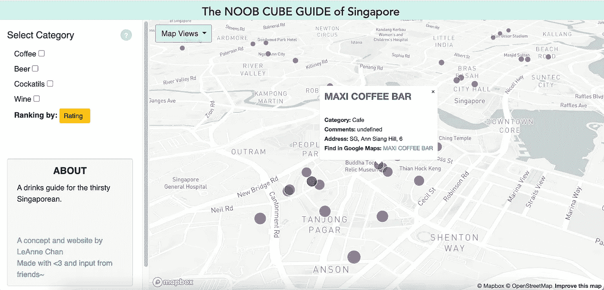

# 我如何将我的自定义谷歌地图列表抓取到一个 csv 文件中

> 原文：<https://medium.com/codex/how-i-web-scraped-my-custom-google-maps-list-into-a-csv-file-eb1172a85bf4?source=collection_archive---------3----------------------->

## 谷歌没有，所以我用 5 个步骤建立了我自己的。含有硒和美丽的 Soup。

它始于建立 *Noob Cube Guide* 的想法，这是一个基于地图的网站，记录了我的小城市新加坡的新咖啡店、鸡尾酒吧和餐馆。一个小日记的冒险允许我们在这个奇怪的时间 Covid 疫情。

！！原型！！Noob Cube 指南(即将推出，敬请关注！)