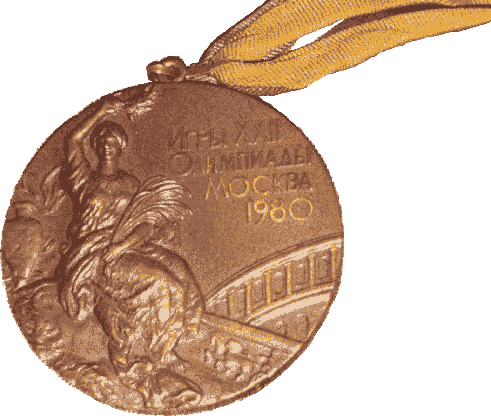

# 我是如何在追逐赛中获得铜牌的

> 原文：<https://medium.com/codex/how-i-won-a-bronze-medal-on-a-kaggle-competition-4abd0424c479?source=collection_archive---------6----------------------->

今天早上，我非常惊喜地醒来，发现一封来自 Kaggle 的电子邮件，告诉我我在 2021 年 5 月的表格比赛中获得了一枚铜牌。老实说，我并没有期望赢得任何东西，因为我从未在我参加的任何卡格尔比赛中获得过任何获胜的分数。