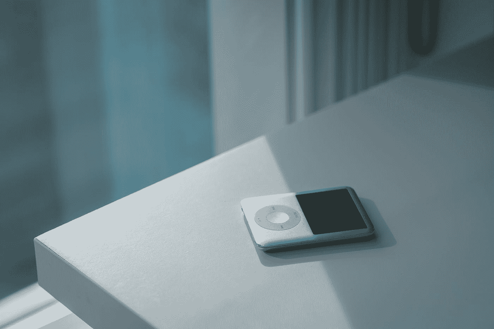

# iOS 15 将如何让 iPhone 更像 iPod

> 原文：<https://medium.com/codex/how-ios-15-will-make-the-iphone-more-like-the-ipod-38416f005951?source=collection_archive---------22----------------------->

## 一项新的关键功能即将推出…

照片由[王](https://unsplash.com/@sidem0n?utm_source=medium&utm_medium=referral)在 [Unsplash](https://unsplash.com?utm_source=medium&utm_medium=referral)

银色 iPod nano 是我个人拥有的第一批科技产品之一。我爸爸在里面放了一些他最喜欢的音乐，我在一次家庭旅行中听了几个小时。iPod 系列统治了这个行业很多年。我仍然深情地回想起我的手机，某些歌曲让我回想起握在手中的冰冷金属的触感。

iPod 的一个优点是它给用户一个特定的任务——听音乐。随着近年来 iPhone 和其他智能手机的崛起，这些设备没有单一用途。更确切地说，iPhone 可以是一个 iPod，一个网络浏览器，当然，也可以是一部电话，正如史蒂夫·乔布斯在宣布 iPhone 时指出的那样。从那时到现在，用例只增加了。

## iOS 15

输入 iOS 15 和一个关键功能，它可以帮助 iPhone 更像 iPod，因为它可以帮助我们在特定的用例中使用我们的设备。该功能是新的聚焦模式。聚焦模式是一种为 iPhone 创建不同预置的方式，可以启用特定的应用程序、通知等。

focus 的美妙之处在于，现在我们可以使用软件来决定我们希望我们的 iPhones 在特定时间如何工作。iPhone 不再是你社交网络的入口，而是一个用来工作的工具。反之亦然，因为能够回家和回家是很好的。

## 外卖食品

正如 iPod 对用户来说是一个神奇的设备，因为它有特定的功能，对焦模式可以帮助我们在需要时给 iPhone 提供特定的功能。这可以帮助我们专注于工作、学校、家庭，或者你希望你的 iPhone 成为工具的任何特定用例。

iPhone 增加的容量和功能令人难以置信。生态系统只会继续增长。我很兴奋地看到专注是如何帮助我利用所有这些潜力，让我成为最有效率的人。也许我甚至会做一个 iPod 的聚焦模式来坐着听音乐。