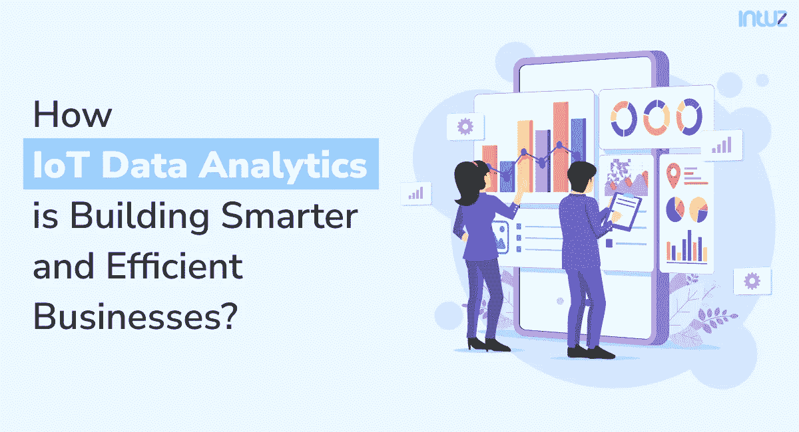
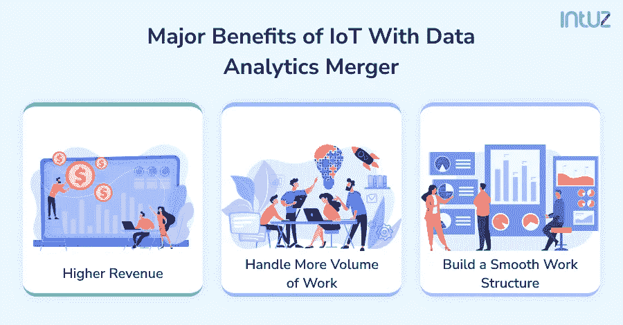
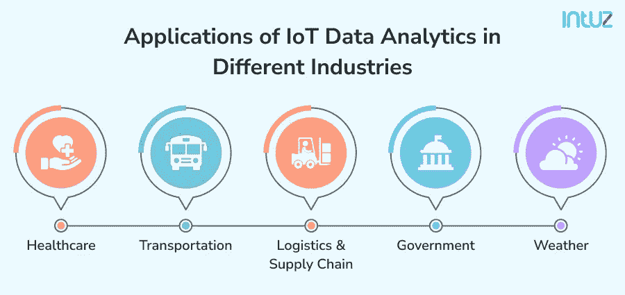

# 物联网数据分析如何构建更智能、更高效的企业？

> 原文：<https://medium.com/codex/how-iot-data-analytics-is-building-smarter-and-efficient-businesses-670998a161ec?source=collection_archive---------15----------------------->

物联网数据分析正在构建更智能、更高效的业务

人和机器每天都会产生数据。明天同一时间将会产生或创建大约 250 亿个数据。供你参考，1 万亿分之一是 1 后面跟着 18 个零。由于数据无处不在，而且对每个行业和组织都至关重要，因此利用数据并创建更高效的产品、服务、系统、运营和流程至关重要。

虽然数据无处不在，但我们也有相同的子类型，其中之一就是物联网数据。当支持物联网的机器创建的数据需要解释时，我们需要沉迷于物联网数据分析。有效的数据解释可以识别新的业务见解，并提供更好的机会。

通过物联网数据分析提供的见解和建议，管理和处理物联网数据分析以构建相关解决方案至关重要。了解传感器和控制器提供的信息有助于帮助组织从相同的资源中获得更多的收入，将自动化引入运营，并有助于预测。

在前面的章节中，您将会看到关于物联网数据分析及其对组织的重要性的详细信息。

# 什么是物联网数据、分析以及物联网数据的类型？

物联网数据代表物联网环境中机器和系统生成的信息和见解。这包括机器、系统和日常交互的人。这些数据由安装在机器上的传感器读取，并被发送到人类可以访问的界面。

物联网数据分析旨在了解这里生成的数据，并帮助构建有效的解决方案。目的是从大量数据中获取价值。随着数量的增加，物联网数据的种类和速度也在不断增长，从而完成了 3Vs 模型。

了解数据意味着你可以做出正确的决定，解决许多问题。然而，数据分析需要使用多种工具和解决方案来理解数据。物联网数据是异构的，我们需要使用正确的工具来保护来自这些数据的准确信息。

# 物联网数据的类型

我们可以把物联网数据分为两类；

*   **结构化数据:**

结构化数据最大的优点是它适合关系数据库管理系统。换句话说，这种类型的数据遵循一种逻辑模式和模型，该模式和模型清楚地定义了数据必须如何表示和组织。

结构化数据通常以表格形式排列，并组织成电子表格。物联网传感器生成的数据使用集成到系统中的结构化值。这包括温度、压力、湿度等。

*   **非结构化数据:**

非结构化数据没有逻辑模式和结构。此外，它不能用传统的编程系统和工具来理解和解码。

由于有预定义的数据模型和结构，不适合这些模型的信息是非结构化的。因为这些数据不容易理解，我们正在使用机器学习和认知计算等先进技术。

像自然语言处理(NLP)这样的技术被用来识别文本和解码语音，这也是非结构化医生的一种形式。

物联网传感器和系统会产生这两种类型的数据。这就是为什么我们需要使用简单到高级的物联网数据分析系统进行解释。

# 数据分析和物联网如何融合？

物联网数据分析可以采取四种不同的形式；

## **描述性物联网数据分析:**

描述性数据通过实时监控物联网设备来分析当前定位。它监控物联网设备和机器的状态，以验证系统是否按计划正常工作。连接到描述性物联网分析平台的界面主要显示 KPI 和传感器数据。

## **诊断物联网数据分析:**

诊断数据有助于识别问题，以构建更好的解决方案并进行修复。借助物联网诊断数据，我们可以比较多组信息，并创建可视化效果和趋势。一些组织还聘请具有特定领域知识和专业技能的物联网数据分析专家来诊断数据。

## **预测物联网数据分析:**

预测物联网数据分析有助于评估未来某些事件的可能性。未来的关联建立在当前信息的基础上，并与特定的时间框架相关。预测分析的好处是提前采取纠正措施并识别机会。

## **透视物联网数据分析:**

这更像是一种面向行动的数据分析方法。在分析结束时，用户将获得一个基于诊断的建议列表。此外，用户还将了解采取建议措施的原因。

# 由于物联网和数据分析的合并，公司将在三个主要方面受益。

物联网和数据分析的融合

*   **更高的收入:**

通过有效的分析，公司可以更深入地了解客户的偏好和选择。因此，这些公司可以为他们的客户定制服务和产品，从而带来更高的收入。最终，它会带来更高的销售额和更好的收入。

*   **处理更多的工作量:**

借助物联网数据分析，公司可以访问其资源的实时容量和功能。这包括机器和人力资源。随着他们能够更好地理解它们，操作可以扩展，并且可以处理更多的工作量，而不会影响服务质量和产出。

*   **建立顺畅的工作结构**:

借助物联网数据分析，可以轻松在组织中创建集合结构。机器生成的数据可以是结构化的，也可以是非结构化的，但是有了有效的分析软件，就可以转化为可读的信息。然后，我们可以使用这些数据来创建一个顺畅的工作流程。

# 物联网数据分析在不同行业的应用

物联网和数据分析在每个行业和组织中都有应用。这里我们列举了物联网数据分析在不同行业的一些用途和好处。

物联网数据分析的应用

## **医疗保健:**

物联网数据分析可以在医疗保健领域发挥拯救生命的作用。我们已经有几种类型的可穿戴设备将一个人的健康与数据库联系起来，并提供信息。除此之外，来自健身追踪器、生命支持设备、库存系统等的数据。，可以用来采取所需的行动。

## **交通:**

运输公司可以使用物联网分析来提高车队性能并有效管理运营。物联网数据分析可以提高燃油效率，监控车辆健康状况，建议实时交通路线变化，监控驾驶员表现等。

## **天气:**

在物联网数据分析的帮助下，天气预报和报告变得更加准确和高效。通过安装在不同位置的传感器，我们可以跟踪、分析和识别天气模式和条件。虽然这些方面在早期也是可能的，但有了物联网，分析变得更加准确、精确和快速。

## **政府:**

政府及其组织可以利用物联网数据分析来改善他们在所有领域的运作。物联网数据分析可以帮助监控和维护政府设施。这有助于降低不同类型工作的维护成本。

它可以帮助测量公用事业服务的效率，跟踪智能电表的性能，建议家庭进行优化消费等。最终，政府可以利用物联网数据分析为其公民提供更好的服务。

## **物流与供应链:**

对于物流和供应链组织来说，物联网对于分析运营数据非常有用。这包括跟踪车辆位置、管理包裹、燃料使用、分拣包裹、维护旅行日志等。所有这些方面的综合影响是，供应链和物流中的物联网可以帮助做出更好的决策。

# 结论

在各种类型的企业和行业中，理解数据变得越来越重要。随着物联网设备的安装越来越多，对所生成数据的理解对于运营盈利业务和优化现有系统变得至关重要。

然而，实施物联网数据分析解决方案可能会面临一些挑战，包括过多的数据、安全性和设备异常。当务之急是利用物联网数据分析工具解决这些问题，并安装安全的基础设施和固件来构建高效的物联网环境。

在实施物联网数据分析系统时，评估您的现有需求，并聘请专家将所需的系统集成到您的组织中，以获得最佳结果。