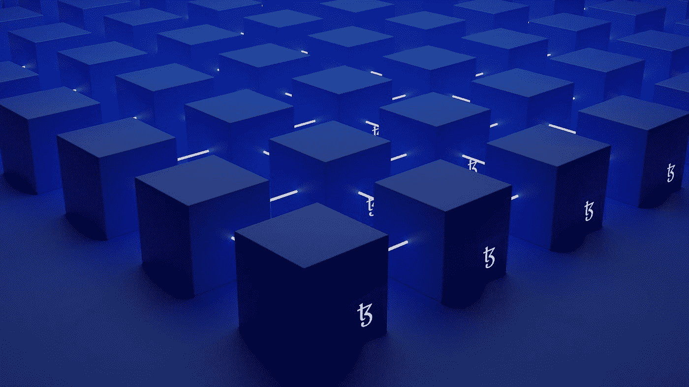

# 加密哈希在区块链技术中有什么用？

> 原文：<https://medium.com/codex/how-is-cryptographic-hashing-useful-in-blockchain-tech-734503bdea2d?source=collection_archive---------16----------------------->

由 [Unsplash](https://unsplash.com?utm_source=medium&utm_medium=referral) 上的 [Shubham Dhage](https://unsplash.com/@theshubhamdhage?utm_source=medium&utm_medium=referral) 拍摄的照片

在之前的文章中，我们讨论了区块链的加密技术，以及为什么它对于区块链生态系统的安全是必要的。今天的文章将讨论加密哈希在区块链技术中如何有用？

我们知道，密码学是指开发协议来防止第三方访问和查看数据的做法。现代密码应用结合了各种学科，如物理、数学、计算机科学、工程等。

加密哈希是将任何数据形式转换为唯一文本字符串的过程。任何数据都可以被散列，无论其类型、规模、长度或大小如何。结果是一个固定长度的字符串。

当区块链首次用于加密货币时，它对不同长度的交易采用了预先确定的哈希算法。散列过程不受输入长度的影响。哈希是给输出的名称。

区块链#密码学中的一个重要亮点是加密哈希。它是区块链技术的基本组成部分。区块链最重要的特性是不变性，这是通过哈希实现的。加密哈希加密不需要使用密钥。

又读:[区块链技术中的 Hash 是什么？—区块链 Shiksha](https://blockchainshiksha.com/hash-in-blockchain/)

相比之下，加密中的散列使用密码或算法从输入中生成特定长度的散列值。哈希是将任意长度的字符串作为输入并产生固定长度输出的过程。SHA-256 散列函数的使用是区块链中最典型的散列应用之一。

加密散列函数有几个有助于它们在区块链加密中使用的显著特征。这里有一个使加密哈希函数适合区块链应用程序的特征概述。

1.  确定性加密哈希函数:无论您输入多少次特定的输入，哈希函数总是返回相同长度的输出。因此，无论您输入 3 个字符的字符串还是 200 个字符的字符串，都会得到精确的长度输出，即 32 个字符的固定字符串，由数字和字母组合而成。
2.  输出的唯一性是加密散列函数出现的第二个重要特征。即使使用加密哈希函数应用两个不同的输入，也会创建准确的输出。因此，它们可以为避免冲突提供独特的功能。
3.  加密散列函数也与不可逆特性密切相关。使用当前的技术和技巧，几乎不可能从输出中推断出原始输入。
4.  更快的散列计算是另一个重要特征，它确立了散列函数在区块链和密码学中的重要性。散列函数可以更快地生成输出，增加了更快完成事务的可能性。
5.  雪崩效应也是加密哈希算法的一个显著特征。雪崩效应表明，输入结果的微小变化会导致完全不同的输出。

安全哈希算法(#SHA)是使用最广泛的加密哈希函数，有许多变体，包括#SHA1、#SHA256、#MD5 和#SHA512。每个加密哈希函数都有一个不同的函数，如下所示:

(1) MD5，也称为消息摘要算法，有助于生成 128 位哈希值。

(2) SHA1 是 NIST 设计的 SHA 的改进版本，由 FIPS 或联邦信息处理标准发布。

(3)sha 256 函数使用 32 位字计算哈希值，消息摘要的长度为 256 位。

(4)sha 512 函数使用 64 位字计算哈希值，消息摘要长度为 512 位。

因此，加密哈希函数提供了独特的数学优势和各种吸引人的属性。那么，加密哈希算法的属性与加密在区块链中的作用有什么关系呢？

# 哈希函数的属性确保了以下优势:

<1>在不披露特定信息的情况下获取该信息的所有权证明

<2>防止未经授权的交易变更

❤>交易确认在不完全了解交易的情况下进行验证

<4>交易带宽减少

<5>为交易创建密码难题

**最后的想法:**加密哈希函数消除了对密钥的需求，就像公钥加密一样。通过合适的资源，您可以了解更多关于加密及其在区块链中的应用的信息。

请随意评论下面的方框。团队区块链 Shiksha 愿意与您交流。

*原载于 2022 年 5 月 18 日 https://blockchainshiksha.com**[*。*](https://blockchainshiksha.com/cryptographic-hashing-in-blockchain-tech/)*