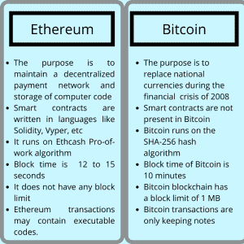

# 以太坊和比特币有什么不同？你需要知道

> 原文：<https://medium.com/codex/how-is-ethereum-different-than-bitcoin-you-need-to-know-5e63c8c8028a?source=collection_archive---------13----------------------->

比特币和以太坊是流行的加密货币，极大地促进了该行业的发展。比特币是第一种形成的加密货币，被视为数字黄金或“黄金 2.0”，而以太坊是一种全球分散的计算机。

由于其类似于贵金属的耐久性和稀缺性，以及易于存储和分割，[比特币](https://bitcoin.org/en/)被称为“数字黄金”[以太坊](https://ethereum.org/en/layer-2/)是世界去中心化的计算机。没有中央权威机构控制以太坊网络，以太坊网络也支持分散式应用(Dapps)。

根据许多指标，比特币和以太坊是排名前两位的加密货币。这些指标包括市场估值、唯一钱包地址和加密货币交易所交易量。加密货币流通供应的总美元价值是其市值或市值。钱包地址是代表加密货币网络账户的独特字符集合。

比特币和以太坊有一些共同的特征，包括可以放在数字钱包中，使用字母数字字符串作为地址，以及在加密货币交易所进行交易。它们是建立在可公开访问的分布式分类账上的数字资产，被称为区块链。

以太坊 Vs 比特币

比特币和以太坊是去中心化的加密货币，这意味着它们既不由中央当局或其他金融机构发行，也不受其监管。作为替代，他们依靠计算机运行他们网络的副本，称为节点，以保证每个网络用户都知道最新的发展。

这两种加密货币之间存在显著差异。这些区别使他们与众不同，并引发了不同的争议，有些人认为 BTC 和 ETH 是竞争对手。实际上，因为它们服务于不同的目标，所以它们可以相互补充。BTC 是一个钱庄。另一方面，ETH 被用来参与基于以太坊区块链的应用。在市场低迷时期，保险箱资产的价值应该被保留或增加。

**什么是比特币？**

第一种可以在没有中央机构的情况下运行的加密货币是比特币。创世纪区块是区块链上的第一个数据区块，由神秘的创始人中本聪于 2009 年 1 月开采。从那以后，比特币的受欢迎程度稳步上升。比特币是作为一种点对点(P2P)电子现金系统开发的，因此各方可以进行分散交易。

比特币是第一个基于区块链(DLT)的加密技术。拜占庭将军的问题，概括了分散的系统在决定一个单一的真理时的困难，被区块链技术克服了。比特币使用区块链和工作证明(Pow)来解决拜占庭将军问题。一群矿工解决了这个问题，他们都扮演着将军的角色。每个节点都试图验证等同于发给将军的消息的事务。

公众可以访问比特币区块链，它包含了每一笔交易的历史记录，同时在众多节点间传播，以避免篡改。当识别出不同版本的散列时，其他网络参与者拒绝它，这被称为篡改。

加密哈希跟踪篡改，篡改是一长串数字，每个节点必须相同。比特币网络使用 SHA-256 哈希函数处理数据集并将其转换为哈希，该函数将数据转换为那些长串数字。当检测到有效的散列时，它被广播到网络并存储在新的块中。

比特币区块链矿工通过一种电力机制来构建和广播这些块，在这种机制中，节点使用大量的计算能力来执行哈希运算。网络参与者使用工作证明达成协议。

比特币的挖掘和共识机制确保恶意行为者无法改变其他用户的余额或花费他们的资金两次，同时保持网络运行，几乎不停机。随着时间的推移，比特币越来越受欢迎，因为它是一种防篡改的加密货币，比特币持有者可以在任何时候进行交易，而无需中介或央行的干预。

虽然比特币最初是一种交易媒介，方便购买产品，但投资者将其作为价值储存手段。

**以太坊是什么？**

以太坊利用区块链构建了一台分散式计算机，从而更进一步。相比之下，比特币使用技术来进行金融交易，并允许每笔交易都附带节点和消息。

以太坊是一个去中心化、开源、分布式的区块链网络，由它的原生货币以太网(ETH)提供动力，以太网用于进行交易并与建立在以太坊网络之上的应用程序进行通信。

智能合约用于开发分散应用程序，即 DApps，这是一种在没有中央机构干预的情况下运行的程序。

以太坊的编程语言 Solidity 被用来创建在区块链上运行的智能合约。由于智能合约的使用，以太坊的潜在应用很多。在以太坊网络上，分散应用的新实验正在进行，提供金融服务和不可伪造的令牌(NFT ),作为智能合约使开发者能够创造的例子。虽然比特币是一种交易媒介和价值储存手段，但以太与以太坊网络应用程序相连。用户必须在以太网上支付交易费用，创建智能合约，并使用 DApps。

相关:[以太坊的结构是怎样的？初学者终极指南(blockchainshiksha.com)](https://blockchainshiksha.com/ethereum-layers-ultimate-guide/)

# BTC 和瑞士联邦理工学院的主要区别

虽然以太坊和比特币使用了分布式账本和加密概念，但它们的技术实现有很大不同。例如，虽然比特币旨在以黄金的数字版本存储价值，但以太被用于推动以太坊网络及其应用。

比特币和以太坊网络都创造了新的代币。比特币使用 Omni layer，这是一个在比特币网络上生产和交易货币的平台。Omni 层的采用基于 stablecoins。另一方面，以太坊令牌遵循许多标准，其中最受欢迎的是 ERC-20。

ERC-20 标准为网络令牌规定了一套规则。ERC-20 标准要求开发者在发行他们的令牌之前实现各种功能。这些服务包括提供关于代币总量的信息，显示用户地址上的账户余额，以及允许在地址之间转移资金。

虽然比特币交易主要是金融交易，但通过将它们编码到数据字段中，可以将笔记和消息附加到交易中。以太坊交易可能包括建立智能合约、与现有智能合约交互或运行自动执行智能合约应用的可执行代码。

在这两个网络上，公共钱包地址是不同的。这些钱包地址是独一无二的标识符，允许用户接收资金，类似于国际银行账号(IBAN)，这是金融机构用来确定客户账户的银行和国家的独一无二的标识符。在比特币上，地址可能以 1、3 或“bc1”开头，而在以太坊上，它们以“0x”开头。

虽然比特币和以太坊都依赖于工作证明共识，但以太坊正在向利益证明共识方法过渡。利益证明基于交易验证者在网络中的利益。用户把他们的 ETH 作为验证者，验证者是检查交易以确保网络不被篡改的组织。

利害关系证明共识方法通过将挖掘能力分配给验证者令牌的一部分，减少了达成共识所需的能量，而不是让挖掘者拥有专门的处理器。在一个利害关系证明网络中，成为验证者更容易。它对验证者的准入门槛更低，对去中心化更有抵抗力。

ERC-20 代币也被用来代表以太坊区块链上的比特币。

在以太坊网络上，有各种令牌化版本的比特币。比特币以 1:1 的比例支持这些，这意味着每一个代表比特币的 ERC 20 代币就有一个 BTC 被拘留。以太坊上的令牌化比特币版本使用户能够在使用去中心化应用程序的同时保留他们的 BTC。例如，代币持有者可以借出他们的 BTC 来赚取利息。

可扩展性困难困扰着比特币和以太坊网络。虽然比特币平均每秒可以处理 7 笔交易，但以太坊网络每秒可以处理大约 30 笔交易。另一方面，Visa 每秒处理大约 1，700 笔交易，并声称能够扩展到 24，000 笔。

随着使用这两种区块链的人数不断增加，比特币和以太坊已经接近其容量极限，需要解决方案来处理更多的用户。当块空间需求超过容量时，两个网络的交易成本都会增加。

BTC 和瑞士联邦理工学院采用不同的技术来解决可扩展性难题。比特币中引入了隔离见证(SegWit)等技术进步，它从广播到网络的每个块中的可用空间中“隔离”一些数据。SegWit 更好地利用了每个比特币区块中有限的 1 MB 可用空间。

此外，开发人员正在开发一个名为 Lightning Network 的第二层扩展解决方案，它将在主区块链中添加一个事务层。闪电网络上的交易速度快，费用低，因为它们是通过用户构建的支付渠道进行的。

Lightning Network 的用户生成支付渠道由 BTC 预先提供资金，可以允许大多数交易从主要区块链迁移到这个二层网络。

支持者预计闪电网络将能够每秒处理 1500 万次交易。在核心比特币区块链上结算的交易是那些打开和关闭闪电网络支付通道的交易。

以太坊还在开发可在核心以太坊网络和第二层网络上工作的扩展解决方案。分片是以太坊扩展其主要区块链的主要赌注，它将通过生成被称为“分片”的新区块链来提高交易速度并最大限度地减少网络拥塞

Lightning Network 的用户生成支付渠道由 BTC 预先提供资金，可以允许大多数交易从主要区块链迁移到这个二层网络。

支持者预计闪电网络将能够每秒处理 1500 万次交易。只有那些交易在核心的比特币区块链上结算，该比特币“打开和关闭闪电网络支付通道”。这意味着交易不是在比特币网络本身结算的。

以太坊还在开发可在核心以太坊网络和第二层网络上工作的扩展解决方案。分片是以太坊扩展其主要区块链的主要赌注，它将通过生成被称为“分片”的新区块链来最大限度地减少网络拥塞，同时提高每秒的交易量

运行以太坊区块链的每台设备的随机存取内存(RAM)和存储需求将显著降低，因为碎片链可能有助于将运行以太坊所需的处理资源分散到 64 个网络。

在将几个交易直接发送到以太坊区块链之前进行聚合的服务器是以太坊平台上第二层扩展解决方案的基础。这些事务如何被分组并广播到以太坊在不同的实现中有很大的不同。侧链是以太坊第二层解决方案的另一个术语。侧链是以太网之外的独立网络。

由于协议允许用户将令牌从一个网络转移到另一个网络，使他们能够以更低的交易成本使用基于以太网的应用程序，因此它们是可互操作的。比特币和以太坊使用各种缩放策略来最大限度地减少网络拥塞，并提高每秒的交易数量。

在本文中，我们讨论了两个领先的区块链网络，以太坊和比特币。更多有趣的讨论敬请关注。

区块链 Shiksha

*原载于 2022 年 8 月 10 日*[*【https://blockchainshiksha.com】*](https://blockchainshiksha.com/how-ethereum-vs-bitcoin-beginners-guide/)*。*