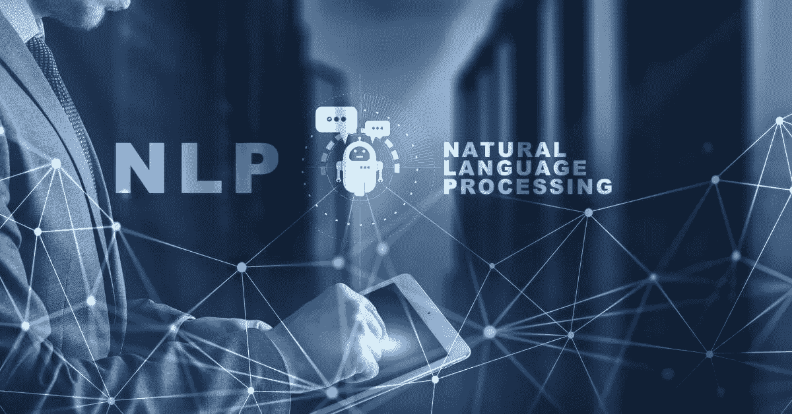
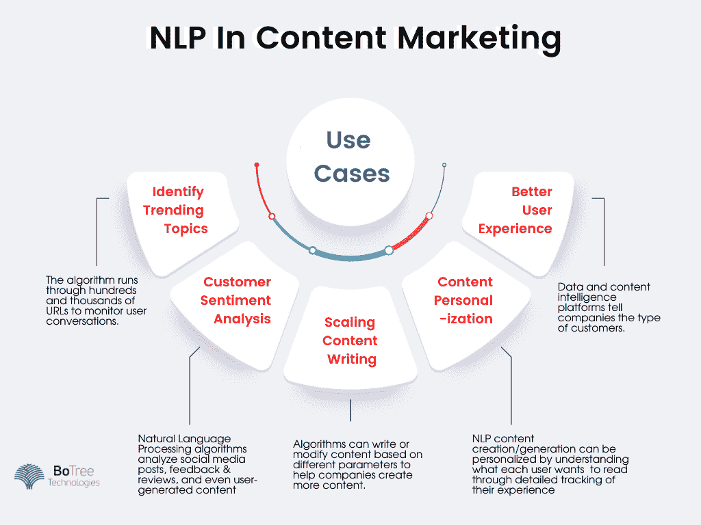

# 自然语言处理在内容营销中有什么用？

> 原文：<https://medium.com/codex/how-is-natural-language-processing-useful-in-content-marketing-8bf8cc59616e?source=collection_archive---------28----------------------->

自然语言处理(NLP)是人工智能的高级实现。它专注于使用人工智能和智能算法分析和处理自然语言。自然语言处理技术的主要例子是虚拟助手，如 Siri 和 Alexa。它们为类似人类的对话创造了一个环境——这是许多自然语言处理应用中的一种。

据估计，与 2025 年相比，2025 年[全球 NLP 市场将增长 14 倍。市场规模预计将达到 430 亿美元。在机器学习/人工智能中使用 NLP 将推动最大限度的增长。](https://www.statista.com/statistics/607891/worldwide-natural-language-processing-market-revenues/#:~:text=The%20NLP%20market%20is%20predicted,interpret%20and%20manipulate%20human%20language.)

自然语言处理有服务于多个行业的用例。其中包括:

*   预测文本
*   语言翻译
*   虚拟助手
*   文本处理
*   数据分析
*   文本过滤
*   智能搜索

Google translate 使用 NLP 来翻译语言，而不是单词到单词的翻译。文字处理器使用自然语言处理来检查语法准确性。客户服务中心使用聊天机器人中的 [NLP 回复普通查询。NLP 的使用案例遍布全球。](https://www.botreetechnologies.com/chatbot-development)

无论是医疗保健、保险、银行、汽车还是教育领域的[自然语言处理，自然语言处理在商业领域的应用正以两倍的速度增长。最新进入这个名单的是内容营销行业。](https://www.botreetechnologies.com/healthcare-app-development)

> ***阅读更多:*** [***为商家解锁数据和 AI 的力量***](https://www.botreetechnologies.com/blog/unlocking-the-power-of-data-and-ai-for-businesses/)

**什么是内容营销中的 NLP？**

营销中的自然语言处理，尤其是内容营销，正在经历巨大的增长。它会影响公司创建的内容类型以及创建方式。该技术帮助我们理解某些关键词、内容的上下文，以及人们为什么阅读他们所阅读的内容。

让我们看一个例子 NLP 的情感分析功能使公司能够识别围绕其品牌的情感。当人们在社交媒体上谈论一种产品时，NLP 算法会分析这种情绪，让公司决定他们应该将营销工作的重点放在哪里。几家公司为多个行业的情感分析提供 NLP 和 [AI 服务](https://www.botreetechnologies.com/artificial-intelligence-solutions)。

> ***结账:*** [***机器学习(ML)可以改善你业务的 5 种方式***](https://www.botreetechnologies.com/blog/5-ways-machine-learning-can-improve-your-business/)

**NLP 在内容营销中的使用案例**

自然语言处理内容和数字实施侧重于确定人们为什么阅读内容，创建什么类型的内容，以及如何从该内容中获得最佳结果。

NLP 总体上侧重于如何向每个目标用户提供个性化的营销体验。通过 NLP，公司可以了解用户的行为，他们的偏好，以及是什么让他们点击某些内容。

以下是自然语言处理技术如何帮助内容营销-

**确定趋势话题**

*   人工智能和自然语言处理内容的一个重要好处是识别在线趋势话题。该算法通过成百上千个网址来监控社交媒体和网站上的用户对话，以识别每个人都在谈论什么。
*   BoTree Technologies 为 IMMEDIA 创建了一个类似的算法。该算法解析成千上万的网址，并根据关键词识别出流行的主题类型。通过提供大多数读者想看的内容，它给了公司竞争优势。

**客户情绪分析**

*   大概 NLP 研究在内容营销方面最大的成果之一就是情感分析。自然语言处理算法分析社交媒体帖子、反馈和评论，甚至用户生成的内容，以确定客户对产品或主题的感受。
*   像 Monkeylearn、Lexalytics、Brandwatch 和 Social Searcher 这样的工具是情感分析工具的几个例子，可以帮助公司了解他们的客户对他们的产品的想法和感受。
*   这些工具是基于规则的自动算法，用于理解围绕某个主题的情感。一些政治家利用这些工具来倾听人们在选举中对他们的评价。一家[人工智能开发公司](https://www.botreetechnologies.com/)可以根据公司想听的内容构建情感分析算法。

**缩放内容写入**

*   通常，公司需要大量内容来提高参与度，并让客户看到。NLP 内容写作使他们能够通过 AI 和 NLP 软件创建大量内容。算法可以根据不同的参数编写或修改内容，以帮助公司制作更多内容。
*   一个这样的例子是，当公司想要给某些文章添加反向链接，并将它们发布在第三方网站上。这些内容可以由机器人生成。
*   另一个例子是当公司需要在他们的电子商务商店上写成千上万的产品描述时。(NLP)内容营销中的自然语言处理技术减少了编写此类描述所需的时间。

**内容个性化**

*   NLP 在营销和内容创作中的一个棘手实现是个性化。通过详细跟踪每个用户在网站上的体验，了解他们想要阅读的内容，可以个性化 NLP 内容的创建/生成。
*   例如，NLP 跟踪算法可以跟踪用户突出显示、滚动最多并停留更长时间的内容部分。当频率高时，内容作者可以创建符合这些标准的文章，从而导致更多相关的受众阅读内容。
*   目标内容增加了整个内容营销工作的投资回报率。 [NLP 算法](https://www.botreetechnologies.com/blog/top-machine-learning-models-and-algorithms/)还可以根据位置、人口统计和其他参数建议个性化内容。

**改善用户体验**

*   用户体验是内容营销的关键——就像其他行业一样。数据和内容智能平台告诉公司什么类型的客户正在阅读他们的内容，他们的兴趣，位置等。它有助于创建提供更好用户体验的特定内容。
*   自然语言处理内容不限于书面文本。推荐引擎识别用户的搜索查询、他们的偏好，并提供符合他们兴趣的推荐。
*   当客户通过搜索结果得到他们想要的东西时，用户体验也会得到改善。它包括使用 NLP 研究来寻找匹配用户意图的关键字，并提供最佳搜索结果。

> ***结账:*** [***机器学习(ML)可以改善你业务的 5 种方式***](https://www.botreetechnologies.com/blog/5-ways-machine-learning-can-improve-your-business/)

**巨大的秘密利益——用户旅程跟踪中的自然语言处理**

除了上面提到的一切——还有一件事，自然语言处理可以用来获得最大回报。NLP 算法可以帮助公司理解每个用户的整个旅程——他们的网络搜索查询、他们登陆的页面、他们消费的内容、他们参与的社交媒体帖子、评论和反馈等。

识别用户旅程让公司对以下事情有一个确切的想法-

*   每个阶段要交付的内容类型
*   应该交付内容的平台
*   他们需要改进和更新的内容
*   人们对他们的评价
*   人们最常联想到的搜索查询

> ***结帐:***[***Twitter 上的案例分析情感分析:分析使用 AI & NLP***](https://www.botreetechnologies.com/case-studies/twitter-sentiment-analysis)

**总结**

自然语言处理为内容营销人员提供了对客户需求的洞察。内容是所有数字营销活动的基石。我们了解 NLP 在内容营销中的使用案例，包括情感分析、识别趋势主题和通过机器人创建内容。

最后，我们看了 NLP 在内容营销中的大秘密——用户旅程的跟踪。当公司能够追踪他们的用户使用什么类型的内容，以及内容营销努力的回报在哪里翻倍时。

内容营销中的自然语言处理将确保内容与业务目标保持一致。为此，公司需要雇佣像 BoTree Technologies 这样的[定制软件开发公司](https://www.botreetechnologies.com/)来构建 NLP 和[机器学习解决方案](https://www.botreetechnologies.com/machine-learning-solutions)以满足内容营销中不断变化的需求。

[**联系我们**](https://www.botreetechnologies.com/contact) **今天免费咨询。**

*原载于 2021 年 7 月 9 日*[*https://www.botreetechnologies.com*](https://www.botreetechnologies.com/blog/how-is-nlp-useful-in-content-marketing/)*。*