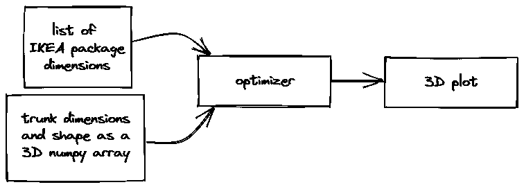
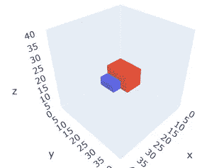
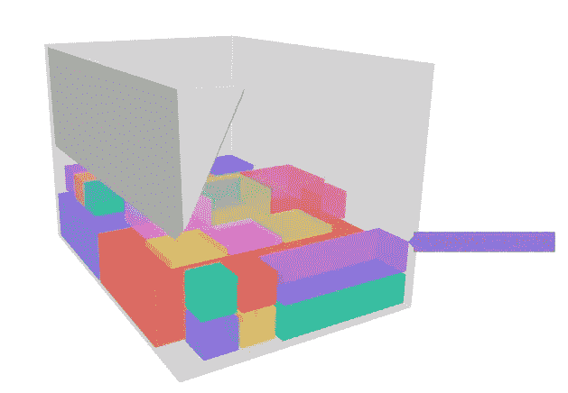
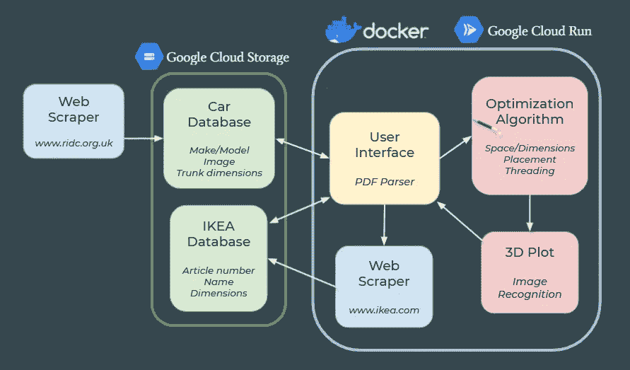

# 如何用两周时间将一些宜家包装放进汽车

> 原文：<https://medium.com/codex/how-it-took-2-weeks-to-put-some-ikea-packages-into-a-car-80776e307dc9?source=collection_archive---------21----------------------->

*|[*GitHub*](https://github.com/freichel/willitfit)*

*Le Wagon 的数据科学训练营的高潮是我们分成四个小组，在各种数据相关项目上工作两周。我们的团队可能有一个最不“数据科学”的想法要解决:*

> *给定一辆汽车和一些宜家包装，计算它们是否合适，如果合适，展示如何合适。*

*但这并没有阻止我们使用在数据科学问题背景下学到的大量工具，并在这里应用它们。*

# *1.设置*

*我们的团队领导 Flo 在周一早上带着 4 个模块的计划来了，为了尽快交付 MVP(最低可行产品),他让我们朝着正确的方向前进:*

*   *使用网络刮刀收集和储存宜家包装尺寸*
*   *生成汽车行李箱的尺寸*
*   *找出将包裹装进行李箱的最佳方法的优化算法*
*   *优化器输出的交互式 3D 图*

**

**一个非常基础的 MVP(用*[*Excalidraw*](https://excalidraw.com/)*)*绘制)*

*每个模块都有明确定义的输入和输出，因此每个模块的输出可以简单地输入下一个模块。值得注意的是，拥有一个真正的*、*产品会缺少一些东西，但足以突出未预见的障碍、低效的方向，以及我们与 4 个相对新手在 2 周内实际可以实现的目标。*

*在完成了 MVP 目标、设置了 GitHub、Trello 板和一个新的 python 环境之后，我们给自己分配了一个模块，打开了我们的 Jupyter 笔记本，开始了工作。*

# *2.3D 绘图*

*我负责策划。我知道**输入**，能够直接投入是非常令人兴奋的。*

*   *包装及其尺寸列表*
*   *3D numpy 阵列形式的“卷空间”,填充有上述包*

*我知道我的**输出**:*

*   *交互式 3D 绘图*

*我是如何走到这一步的，现在完全取决于我自己。在整个训练营中，我们主要使用 matplotlib 和 seaborn 来可视化数据；在交互性方面，我们接触了一些 ipywidgets 和 plotly express。*

*鉴于我们的*体积空间*被表示为 1cm×1cm×1cm 的立方体，使用[体素](https://en.wikipedia.org/wiki/Voxel)似乎是一个伟大的想法。更好的是，matplotlib 已经有了一个用于绘制体素的[内置方法，开箱即用看起来相当不错……但是 matplotlib 并不是真正的交互式，交互性是我们 MVP 的一部分，所以继续寻找更合适的东西。](https://matplotlib.org/stable/gallery/mplot3d/voxels.html)*

*我最终在 plotly 文档中找到了[plotly graph object 3D mesh plots](https://plotly.com/python/3d-mesh/)。已经是一个立方体的例子，这应该很容易！只需给出你的对象的每个顶点的坐标，plotly 就会在它们之间画一个网格……听起来不错，但是现在我有一个问题:我没有坐标。我有一个 3D numpy 数组，其中我知道哪些体素是空的，是汽车的一部分还是包裹的一部分。我有包的列表，但是我不知道每个包在哪里，也不知道它们是如何定位的。我可以通过匹配包尺寸和 numpy 数组来解决这个问题，但是这听起来像是对一些在优化步骤中已经知道的东西进行了大量的处理。*

*那么最简单的解决方法是什么呢？ ***沟通！****

***我**:“嘿，Florian *【谁负责优化】*，你能给我每个包的位置作为输出吗？”
**Flo** :“是”*(可以转述也可以不转述)**

*太好了，更新我们的 GitHub 自述文件，问题解决了！*

**

*用 Plotly 绘制 2 个三维长方体*

# *3.给窗户建模*

*3D numpy 数组的一部分是我们想要切掉汽车轮廓的一部分，将其标记为不可用。我们也希望能够在剧情中展现这一点。使用同样的方法，我们可以简单地将每个体素视为一个顶点，并在它们之间绘制一个网格。我的一部分是乐观的，认为会有一些引擎盖下的优化*(又名* *魔法)*发生，将使这成为一个可行的解决方案，但没有这样的运气，它是**难以置信地慢**。除此之外，当处理重叠平面中的多个形状时，我们可能会得到一些奇怪的结果。由于看不到清晰的解决方案，我把它作为一个可选择的开关，作为一个稍后的*“待办事项】*。*

*最终，我想到了使用 [scipy 的卷积](https://docs.scipy.org/doc/scipy/reference/generated/scipy.ndimage.convolve.html)，一种最初用于 2D 图像边缘检测的方法，来使用相同的方法找到不可用空间的角落，从而显著提高处理速度。*

# *4.汇集了第一个 MVP*

*在最初的几天里，每个人都取得了惊人的进步，Kasia 使用 Selenium 构建了一个用于获取宜家包装数据的 web scraper，zi-Fan 找到了一个包含大约 1800 辆汽车后备箱尺寸的网站，并使用 BeautifulSoup 来抓取这些数据，Florian 构建了优化程序的基础，我有一个可以工作的绘图仪。我们使用 Streamlit 作为一个简单的前端，并使用 FastAPI 将这一切结合在一起。*

*有点令人惊讶的是，一旦所有的模块都插在一起，它似乎都工作了。一方面，这是美丽的，让我们都松了一口气，另一方面，“作品”可能是一种延伸。很明显，有很多东西实际上没有按照预期的方式工作(例如，项目看起来像是以一种无视重力的方式堆叠起来，整个应用程序花费了*非常*长的时间)，但我们有一个很好的前进方向。*

**

*使用实际的汽车尺寸和实际的宜家包装，输出稍微复杂一些*

# *5.开源代码库*

*正是在这里，我们放弃了将 Trello 作为目标和跟踪的主要工具，并将重点转移到使用 GitHub 问题上。这对我们来说是一种有效的工作方式。如果我们完成了当天的主要任务，我们可以简单地查看问题/功能列表中的内容，然后选择要处理的内容，而不管是谁开始了本模块。*

*然而，代码审查拉请求是一件棘手的事情，由于时间有限，我们没有使用 TDD(测试驱动开发)方法。所以在某种程度上，这使得检查彼此的代码变得更加重要，但是由于每个人每天都在添加功能，所以大家都相信无论什么代码都是有效的。*

# *6.Docker &谷歌云平台*

*出于简单起见，我们最初计划只使用 [Heroku](https://www.heroku.com/) ，但是我们很快选择了安全起见(考虑到突破 Heroku 的免费 500mb 限制)，并决定使用谷歌云平台。我们的目标是在第一周结束前将*的东西部署到网上，我们在周四和周五非常努力地将整个堆栈链接在一起，将项目的大部分打包到 Docker 中，并将其部署到 Google Cloud Run 上。**

**我们最大的担心是，一旦放入 Docker 容器和/或展开，我们的 IKEA webscraper ( [Selenium](https://selenium-python.readthedocs.io/) )将无法按预期运行。我们的每台计算机(一台 Mac，两台 WSL，一台本机运行 Linux)都遇到了问题，需要不同的解决方案才能让 Selenium 的 chrome 驱动程序正常工作。令我们[惊讶的是](https://media.giphy.com/media/qgkrtsDy4MhLq/giphy.gif)这相对来说并不痛苦！**

**能够展示一个(看起来)有效的 MVP 是一种解脱。在这一点上仍然有一些主要的突出问题:整个应用程序非常慢，优化器输出/绘图方向仍然不太正确。**

# **7.特征蠕变**

**当我们进入第二周的时候，很明显，我们需要暂停我们的创造力，在为演示日做准备的时候，努力修复错误，清理我们所拥有的东西。不知何故，我们仍然设法在整个星期偷偷加入了一些额外的功能，但更重要的是设法修复了比我们引入的更多的 bug！由于家庭责任，我们的项目负责人(意料之中的)消失了，所以我决定确保我们的团队能够在周五交付一些值得我们骄傲的东西。**

****

**演示幻灯片之一:项目如何结合在一起的简化视图**

# **8.结束语**

**我很荣幸能够在 Le Wagon 的第 606 批数据科学演示日结束时展示该演示。反馈非常好(包括一位首席教师宣称，他真诚地认为这是他在数据科学训练营中看到的最好的项目)。
[*你可以在这里*](https://youtu.be/mrGO8s3Bhrk?t=4470) *观看这个演示日的录像！(开始于 1:14:30)***

**我们在这个项目中面临的最大挑战之一是，我们试图做的许多事情还没有用我们在公开项目中可用的工具来完成。这意味着我们必须弄清楚如何以创造性的，也许是非传统的方式应用这些工具，以便得到我们所追求的解决方案。**

**这个项目另一个特别有趣的地方是，虽然目前的范围集中在宜家包装和我们拥有尺寸的约 1800 辆汽车上，但这当然也适用于其他使用案例，如包装运输车辆或仓库存储。**

**随着我们四个人找到自己与数据相关的职业道路，我们打算继续致力于这个项目。**

**请随时在 LinkedIn 上联系我们:**

*   **[张秀坤·瓦格纳](https://www.linkedin.com/in/dominik-mall/)(我)**
*   **弗洛里安·赖歇尔**
*   **[Katarzyna Cieslik](https://www.linkedin.com/in/k-cieslik/)**
*   **[唐子凡](https://www.linkedin.com/in/tzufan-tang/)**

**浏览我们的 GitHub 回购:【https://github.com/freichel/willitfit **

**或者试试演示版: [www.will-it-fit.xyz](http://www.will-it-fit.xyz)**