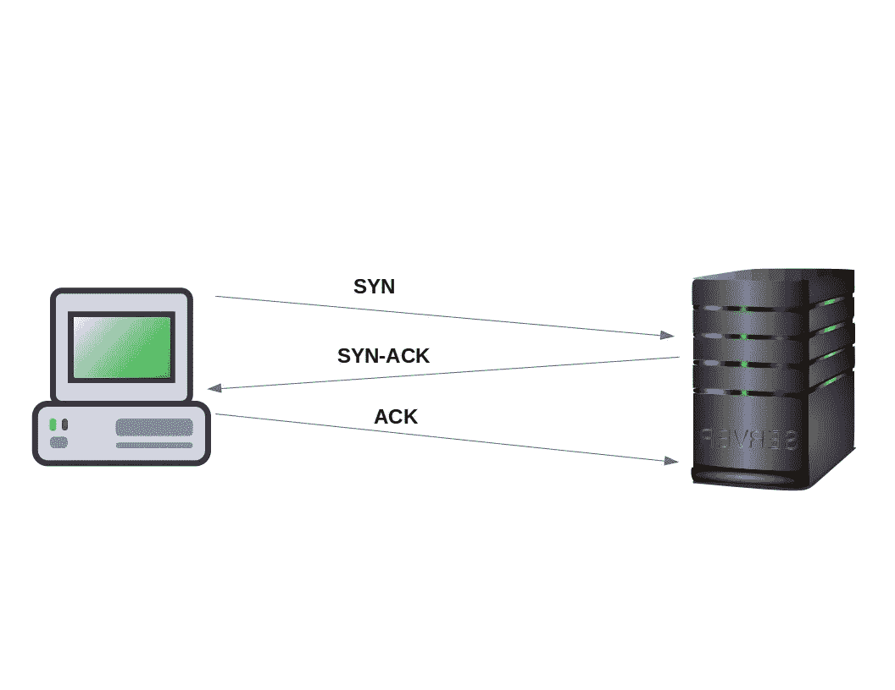
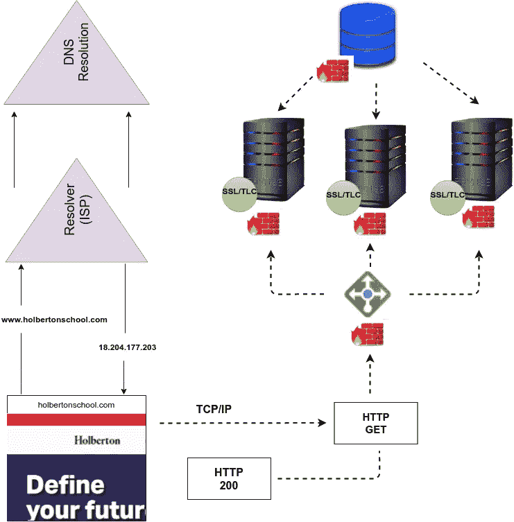
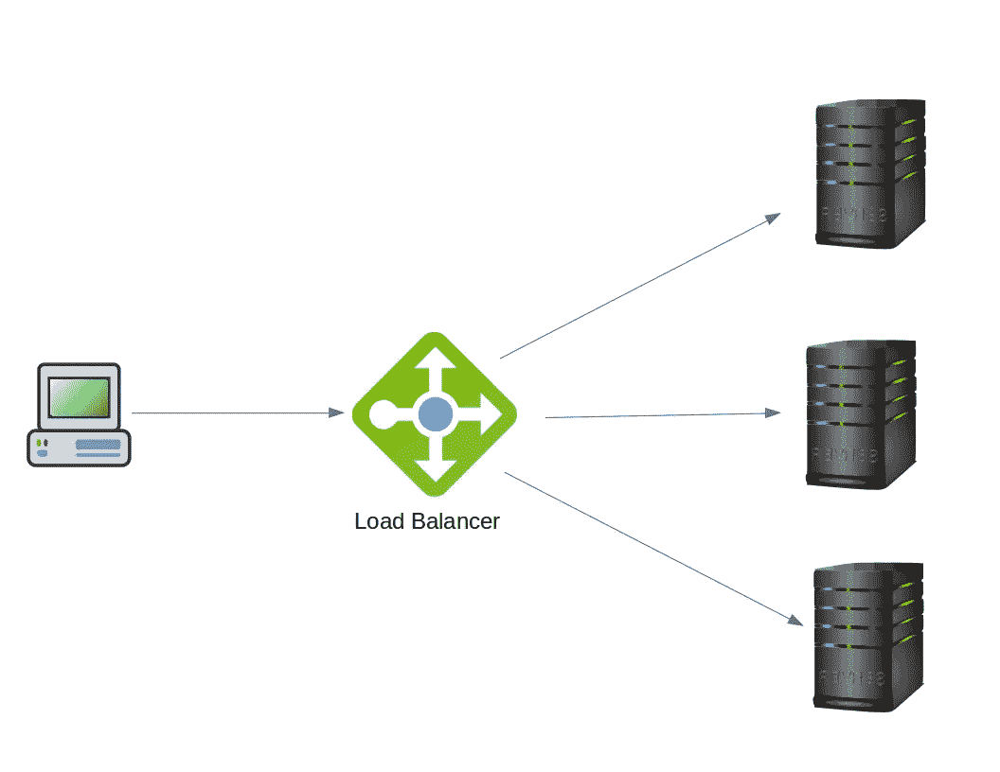
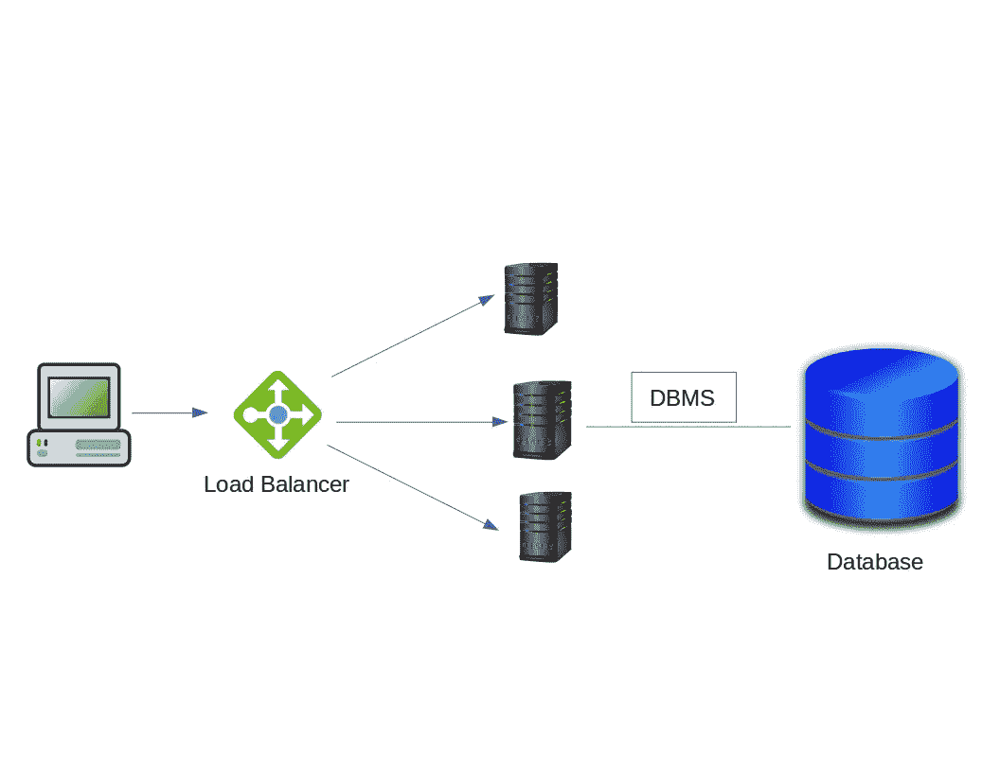

# 工作原理:从浏览器访问网站

> 原文：<https://medium.com/codex/how-it-works-visiting-a-website-from-your-browser-d54fb9401b75?source=collection_archive---------7----------------------->

## 当你输入一个网址并按回车键时会发生什么？

当你在浏览器的地址栏中输入一个网站的地址时，就像[https://www.holbertonschool.com](https://www.holbertonschool.com/)一样，尽管你在几秒钟内就能看到这个网站，但后台仍会发生多个步骤。

## **步骤一:**网址

当然，第一步是你把网站的 URL 输入到地址中，然后按回车键，你可能一天要做很多次。

什么是 URL？

URL 代表**统一资源定位符**。URL 只不过是 web 上给定的唯一资源的地址。一个 URL 由不同的部分组成，有些是强制性的，有些是可选的。让我们考虑这个例子:

上面显示的 URL 结构有不同的部分，有不同的用途，让我们讨论一下主要的部分:

*   Scheme (protocol) :它告诉 web 服务器在访问互联网上的资源时使用哪种协议。在本例中，它是 HTTPS(安全超文本传输协议)，这是目前最常见的方案。
*   **域名:**表示正在请求哪个 web 服务器。[www.holbertonschool.com](http://www.holbertonschool.com/)’是示例中的域。可以使用 IP 地址，但因为不太方便，所以很少使用。我们可以进一步将该域分为几个部分，如下所示:

1.  *子域*:URL 中的子域表示网络浏览器应该提供给你的网站的哪一部分。
2.  *二级域名*:是网站名称。它帮助人们知道他们正在访问某个品牌的网站。例如，访问“holbertonschool.com”的人知道他们在 holbertonschool 的网站上，不需要更多的信息。
3.  *顶级域名*:指定贵组织在互联网上注册的实体类型。比如，“。com”是为商业实体和”。edu”是为学术机构设计的。

*   **端口**:用于访问 web 服务器上资源的唯一编号。如果 web 服务器使用标准端口，它通常会被省略(在本例中，它被省略，因此它使用 HTTPS 协议的标准端口，即 HTTP 的 443 端口是 80 端口)。
*   **文件路径(path)** :告诉你的网络浏览器加载一个特定的页面。在本例中，'/methodology '是路径。如果未指定路径(即仅输入域名)，则浏览器会加载默认页面，这通常有助于您导航到网站中的其他页面。

上面的讨论只介绍了 URL 的基本部分。然而，一个 URL 有额外的部分没有包括在上面的讨论中，更多关于 URL 的信息，你可以在这里使用引用。

## **第二步** : DNS

计算机和其他网络设备使用 IP 地址进行通信，以便在互联网上相互识别。URL 是人类友好的，IP 地址是计算机友好的。

因此，当你输入网址 https://www.holbertonschool.com[时，你加载该页面的请求被发送到 DNS 服务器，DNS 服务器查找 WWW.holbertonschool.com](https://www.holbertonschool.com/)[的域名](http://WWW.holbertonschool.com/)以找到其对应的 IP 地址。没有 IP 地址，电脑就不知道你在找什么。

***什么是 DNS？***

DNS 代表**域名系统**。DNS 是一种将域名转换成 IP 地址的技术。DNS 是互联网的电话簿。

***DNS 是如何工作的？***

为了理解 DNS 解析过程，您需要了解加载网页所涉及的四个 DNS 服务器。您的计算机在初始请求后参与了解决过程。

1. **DNS 解析器**:通常是您的 ISP(互联网服务提供商)，但也可以由您的无线运营商或第三方提供商运营。解析器知道它需要询问哪些其他 DNS 服务器来回答查询“WWW.holbertonschool.com 的 IP 地址是什么？”。它还保留频繁请求的域名的 IP 地址缓存。所有解析器都必须知道一件事:在哪里定位根服务器。递归器可以被认为是一个图书管理员，他被要求去图书馆的某个地方找一本特定的书。也叫*递归 DNS 名称服务器*。

2.**根域名服务器**:是任何域名解析的第一步。它可以被认为是图书馆中指向不同书架的索引。它作为其他更具体位置的参考。根服务器知道顶级域名的位置。com，。网，。org)、国家代码顶级域名(。不可以。et，。uk)、国际化顶级域名，即以国家/地区本地字符书写的 ccTLDs、基础设施 TLD 和通用 TLD(。热，。披萨，。APP，…)。

3. **TLD 域名服务器**:顶级域名(TLD)服务器可以被认为是图书馆中一个特定的书架。它是域名的最后一部分，即完全限定域名最后一个点后面的标签。例如，在 WWW.holbertonschool.com 的域名[中，顶级域名是 com。大多数顶级域名(TLD)的协调属于互联网名称与数字地址分配机构(ICANN)。](http://WWW.holbertonschool.com/)

4.**权威域名服务器**:为 DNS 查询提供原始的、权威的答案。这是域管理员为域配置 DNS 记录的地方。这个最终的域名服务器可以被认为是书架上的一本字典。

***DNS 查找中的步骤***

1.  你输入网址，[https://www.holbertonschool.com](https://www.holbertonschool.com/)，然后点击回车。
2.  首先，您的浏览器通过检查自己的缓存和操作系统的缓存来检查它是否知道该域的 IP 地址。如果不存在，操作系统调用解析器。
3.  当解析器收到请求时，它首先检查缓存。如果该网站的地址没有缓存在解析器的系统中，它将需要向权威的 DNS 层次结构请求帮助以获得答案。然而，为了到达权威服务器，解析器首先向根名称服务器发送请求。
4.  根服务器用 TLD DNS 服务器的地址响应解析器(在本例中。com)。解析器存储这些信息以供将来参考。
5.  然后，解析器向 TLD 服务器发送请求。
6.  TLD 服务器用域的权威名称服务器的名称和 IP 地址进行响应(这被称为**胶合记录**)。解析器存储地址。下图显示了 holbertonschool.com 的权威服务器以及其中一台服务器的 IP 地址。
7.  解析器向名称服务器发送查询。
8.  名称服务器以[https://www.holbertonschool.com](https://www.holbertonschool.com/)的 IP 地址响应。
9.  解析器用域的 IP 地址响应您的操作系统。
10.  操作系统将其提供给浏览器。

如果没有 DNS，你将不得不记住 IP 地址列表，而不是网站名称或 URL。更多**趣事**和 DNS 解析过程的详细描述，查看 [**本**](https://howdns.works/) **。**

## **步骤 3** :浏览器向网站发送连接请求

一旦你的浏览器获得了网站的 IP 地址，它就开始建立连接。使用**三次握手**(又名 SYN-SYN-ACK)来完成设置过程。这种握手的目的是为了让两台想要交流信息的计算机能够在传输数据(如浏览器请求)之前协商传输的基础。

在讨论三次握手过程之前，让我们首先讨论用于协商和启动会话的消息的含义。

1.  **SYN** (同步):用于发起和建立连接。它还可以帮助您同步设备之间的序列号。
2.  **ACK** (确认):帮助向对方确认已经收到 SYN。
3.  **SYN-ACK**(Synchronize-acknowledge):来自本地设备的 SYN 消息和先前数据包的 ACK。
4.  **FIN** :用于终止连接。

***三次握手过程***

**步骤 1** : 您的浏览器(客户端)与 web 服务器建立连接。它发送一个带有 SYN 的数据段，并通知服务器客户机应该是它的序列号。

**步骤 2** :在此步骤中，服务器用 SYN-ACK 信号集响应客户端请求。ACK 帮助您表示收到的数据段的响应，SYN 表示数据段应该以什么序列号开始。

**第三步**:然后你的浏览器用一个 ACK 信号给服务器来响应 web 服务器，两者就建立了一个稳定的连接。

三次握手

序列号是随机的，它表示发送方将要传输的数据的序列号的开始。

## **第四步** : SSL/TLS 证书

在浏览器和服务器建立稳定的连接后，浏览器会首先检查服务器是否提供一些安全性。在我们讨论你的浏览器如何检查安全性之前，让我们先谈谈 SSL/TLS。

***什么是 SSL？***

缩写“SSL”代表**安全套接字层**。SSL 是标准的安全技术，用于在服务器和客户端之间创建加密的网络链接，确保传递的所有数据都是保密和安全的。TLS 代表**传输层安全**。

您可能已经注意到，在浏览互联网时，某些网站使用 HTTP，而其他网站使用 HTTPS(我们的示例使用的就是它)。这两种协议的区别在于 SSL 证书。HTTPS 的 S 代表安全。您的计算机和启用 HTTPS 的网站的 web 服务器之间的通信使用 SSL 证书加密。

为什么需要 SSL？SSL/TLS 是应用程序用来通过网络安全通信的协议，可防止篡改和窃听电子邮件、网页浏览、消息传递和其他协议。客户端和服务器之间传输的任何信息都受到 SSL 证书的保护。加密被用来做到这一点。

现在，让我们来谈谈你的浏览器如何检查安全性。浏览器下载 web 服务器的证书，其中包含 web 服务器的公钥。此证书是用可信证书颁发机构的私钥签名的。主要证书颁发机构的公钥预装在您的浏览器中。您的浏览器使用这个公钥来验证 web 服务器的证书确实是由可信的证书颁发机构签署的。

在您的浏览器对服务器进行验证和身份验证后，您的浏览器将使用公钥生成共享对称密钥，该密钥将用于加密此连接中的流量。生成的密钥将用 web 服务器的公钥加密，然后发送回 web 服务器。这确保了只有服务器解密密钥，因为它有私钥。

## **第五步**:浏览器下载网站数据

接下来，您的浏览器向网站发送请求，要求下载其数据。这包含一些关于您使用的浏览器和连接目的的附加信息。

服务器接收这个请求，然后生成一个特定格式的响应。它会将此响应发送回您的浏览器。

您的浏览器收到响应，并使用它来呈现您请求的网站。

## **第六步**:就这样？

一旦你的浏览器显示网站，你的浏览器工作可能不会完成。如果您单击某个链接，这些步骤将重新开始。如果你向页面发送一些信息，它就用这些信息来执行一个动作。根据网站的不同，您的浏览器可能需要在后台与服务器进行交互。

当一切都走到一起

## **最后一件事……优秀奖**

以下是 web 服务和托管过程的重要组成部分。

***负载平衡器***

网站必须服务成千上万(如果不是数百万的话)来自用户的同时请求，并且必须以快速和可靠的方式返回正确的文本、图像、视频或应用数据。为了满足这种高需求，通常需要添加更多的服务器，以便在多台服务器之间分配负载。

负载平衡器位于服务器的前面，并将客户端请求路由到所有能够响应的服务器。它将工作负载分布在多个单独的系统或一组系统上，以减少单个系统的负载量。这确保了服务器提供的服务的可靠性、效率和可用性。

负载平衡器

以下是负载平衡器的主要功能:

*   跨多台服务器高效地分配请求或网络负载
*   通过仅向在线服务器发送请求，确保高可用性和可靠性
*   提供按需扩展和缩减的灵活性。

负载平衡器可以是硬件或软件。关于负载平衡的更多信息，请点击查看[。](https://www.thegeekstuff.com/2016/01/load-balancer-intro/)

***防火墙***

防火墙是过滤进出服务器的所有流量的硬件、软件或两者的实现。SSL/TLS 是在互联网上安全传输数据的关键步骤，但它不考虑来源的可信度。在这种情况下，防火墙介入并利用分组过滤器、应用网关、电路级网关和代理服务器的组合来确保分组不包含恶意内容。

***数据库***

数据库是组织起来的信息的集合，以便于访问、管理和更新。现代网站大多对数据有复杂的操作，或者呈现动态数据。这个操作应该由一个单独的数据库来处理。数据库通常在单独的服务器中实现。数据库存储和检索数据，管理更新，提供从 web 服务器的同时访问，提供安全性，确保数据的完整性，以及数据备份。为了管理数据库服务器中的数据，使用了数据库管理系统(DBMSs)。

带有数据库系统的虚拟主机

***应用服务器***

应用服务器是一种专门设计的可以运行应用程序的服务器。它是托管应用程序的服务器。它的主要工作是支持最终用户客户端和服务器端应用程序代码(通常称为业务逻辑)之间的交互，以生成和交付动态内容，如交易结果、决策支持或实时分析。

Web 服务器是为网页服务而设计的，它不能运行要求苛刻的 web 应用程序。但是应用服务器确保处理能力和内存来运行这些要求苛刻的 web 应用程序。它还提供了运行特定应用程序的环境。

## 参考

[https://tec admin . net/authoritative-non-authoritative-DNS-server/](https://tecadmin.net/authoritative-non-authoritative-dns-server/)
[https://www.cloudflare.com/learning/dns/what-is-dns/](https://www.cloudflare.com/learning/dns/what-is-dns/)
[https://www.guru99.com/tcp-3-way-handshake.html](https://www.guru99.com/tcp-3-way-handshake.html)
[https://developer . Mozilla . org/en-US/docs/Glossary/TCP _ handshake](https://developer.mozilla.org/en-US/docs/Glossary/TCP_handshake)
[https://developer . Mozilla . org/en-US/docs/Learn/Common _ questions/What _ is _ a _ URL](https://developer.mozilla.org/en-US/docs/Learn/Common_questions/What_is_a_URL)
[https://howdns.works/](https://howdns.works/)UTM _ source = about SSL&UTM _ medium = coupon page&UTM _ campaign = cheap coupon page&UTM _ content =/how-SSL-certificate-work/
[https://www.nginx.com/resources/glossary/load-balancing/](https://www.nginx.com/resources/glossary/load-balancing/)
[https://www . oreilly . com/library/view/we b-database-applications/0596005431/ch01 . html](https://www.oreilly.com/library/view/web-database-applications/0596005431/ch01.html)