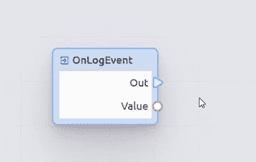
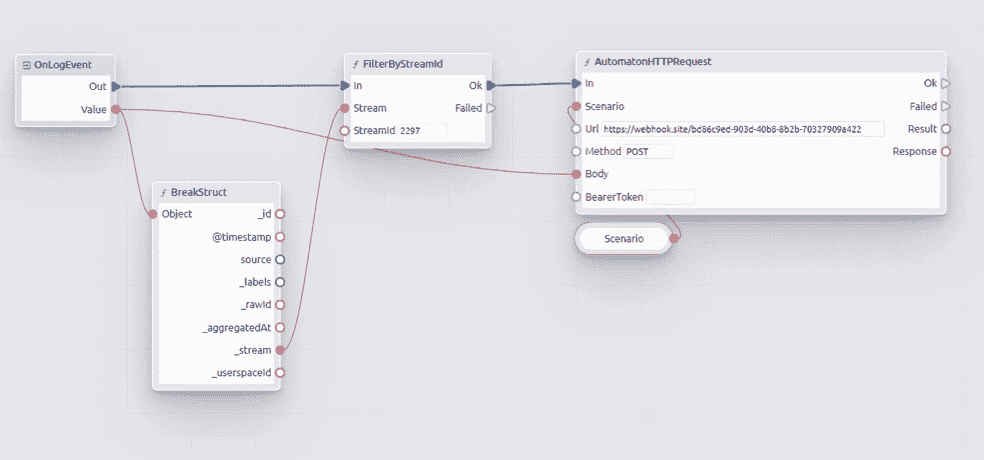

# 低编码如何节省成本、金钱和你的神经系统。Acure.io 示例

> 原文：<https://medium.com/codex/how-low-coding-saves-costs-money-and-your-nervous-system-acure-io-example-918b214d736?source=collection_archive---------12----------------------->

在我之前的一篇文章中，我谈到了 AIOps 系统如何帮助解决业务问题。但不只是管理者有需求。越来越多的，当创建一个产品时，IT 系统的开发者转向那些将使用这个产品的人的需求——IT 专家，他们将不得不在将来实现、维护，如果必要的话，修改系统。因此，最近开发人员经常选择支持低代码引擎。

# **更少的代码——更少的成本**

低代码是一种软件开发方法，在图形界面中建模，最少手工编码。只需拖放可视块来构建脚本。使用低代码，您可以轻松地改进应用程序、设置集成和创建自动化场景，而无需编写数百行复杂的代码。

Gartner 估计，到 2024 年，低代码将负责超过 65%的应用程序开发活动。难怪。低代码节省了开发成本和时间。不需要涉及极其昂贵的实现团队来设置系统并进一步维护它，或者等到供应商滚动、测试、回滚、测试并发布一个特性。没有特殊编程技能的 IT 通才，自己也能轻松搞定。

那么 Acure 呢，我们也与时俱进，最近实现了低代码引擎。在这篇文章中，我想展示如何在我们的平台上实现低代码。

# **CMDB 自动发现**

借助 Acure 中的自动化脚本，用户可以显著扩展系统的功能。新服务内置于现有系统中，允许您创建任意的事件处理管道。新的自动化功能建立在低代码可视化编程引擎及其自己的脚本和执行系统上，允许用户使用可视化块并在它们之间建立链接来创建任意事件处理场景。

场景可以是自定义的，也可以由开发人员自己作为成熟的服务提供。未来服务之间的交互将通过建立路线图来确定，这将允许您将单个场景组合成单个解决方案。路线图决定了特定类型的场景将处理哪些事件。在当前版本中，用户可以使用 CMDB 自动发现类型，该类型处理通过流进入系统的事件，并被定制为使用资源服务模型。

# **创建一个简单的场景**

自动化场景的创建从用关于其所有者和名称的信息填写表单并选择根节点开始。

创建后，我们进入场景构建器页面。

默认情况下，有一个 start 块，每当相应的事件到达时，它就运行我们的脚本。

首先，我们需要创建一个规则，以便对特定事件执行序列。为此，我们需要一些块形式的函数。我们通过右键单击空白区域从上下文菜单中添加它们。

让我们构建一个简单的规则，只接收来自特定流的事件。

为此，我们将添加 *FiltredByStreamId* 函数，并以这样一种方式连接序列，即当事件到达系统时，脚本检查它来自的流的 Id，如果过滤成功，脚本将继续运行。

脚本函数的执行顺序由蓝色箭头表示——确切的引脚。

请注意，除了精确引脚，还有数据引脚。如果前者负责序列，那么后者负责发送和接收数据。

现在让我们分析一下我们的函数。要执行它，必须向它提供输入数据。在我们的例子中，该函数请求一个输入流模型和过滤参数(流 id)。

我们必须从初级事件中获得初始数据，即从那里获得流模型。为了做到这一点，我们使用基函数分解原始结构，并与我们的过滤器建立连接。

现在我们需要指定所需的参数(我们从先前创建的流中获取)，并将其复制粘贴到 *FiltredByStreamId* 块中。

搞定了。简单的规则已经准备好了。现在，只有当事件来自我们指定的流时，才会执行进一步的操作。

作为一个动作，我们可以使用一个特殊的函数发送一个测试请求:设置它并发送我们的主事件作为请求体。

为了让场景工作，必须编译并激活它。

让我们重现向线程分派事件的过程。

如果一切都设置正确，那么应该显示一个请求，其中主体是我们的事件。我们看到我们的请求和事件，确认一切都是正确的。

让我们看看编辑器中可用的其他工具。

左侧面板包含当前场景的对象。在这里，您可以创建和管理局部变量、结构和整个函数。在这里，可以将它们添加到屏幕上，以便在脚本中使用，或者选择它们进行进一步的定制。

设置在右边的面板中，我们填写所有必需的字段，如果是本地函数，编写可执行代码。

这项服务的一个重要特性是，用户可以导出脚本并与其他人共享。反过来，接收者使用导入工具创建该脚本的精确副本。

# **结论**

在本文中，我展示了如何不用硬编码来构建简单的脚本。当然，这只是一个简短的介绍，Acure 中 engine 的功能更多。在接下来的文章中，我将讨论变量、结构、数据类型，并展示如何创建完整的场景。现在，留下你的反馈并分享你的忏悔:你是优秀文本编码的专家还是相信可视化编程的力量？