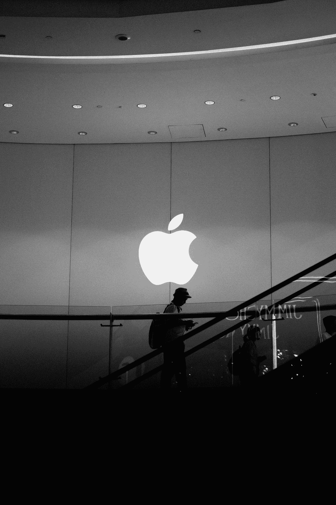

# 使用 M1 MacBook Air 一周后，Mac OS 与 Chrome OS 的对比如何

> 原文：<https://medium.com/codex/how-mac-os-vs-chrome-os-compare-after-one-week-using-the-m1-macbook-air-bdd5e5855276?source=collection_archive---------1----------------------->

## 操作系统

## 从谷歌 Pixelbook Go 转移到 M1 MacBook Air

照片由 [Unsplash](https://unsplash.com?utm_source=medium&utm_medium=referral) 上的 [Alireza Khoddam](https://unsplash.com/@alixrezax?utm_source=medium&utm_medium=referral) 拍摄

我的 M1 MacBook Air 已经用了一周了。总的经验是积极的，但也不是没有学习曲线。以下是我的经历，主要的不同之处…