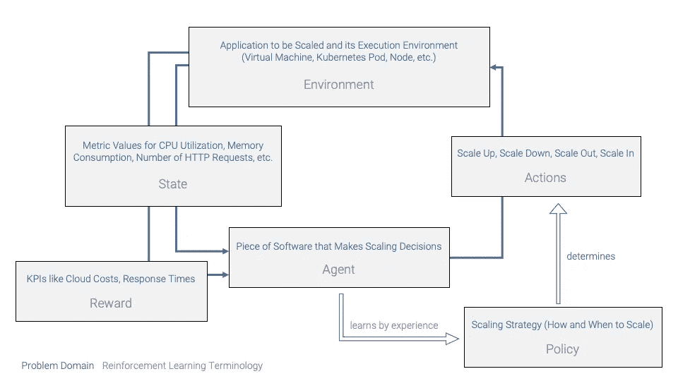
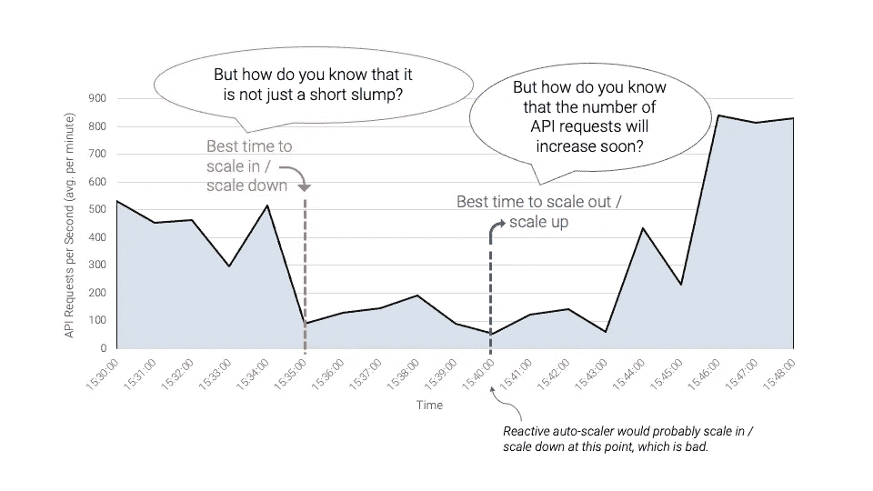

# 机器学习如何用于人工智能驱动的自动缩放

> 原文：<https://medium.com/codex/how-machine-learning-can-be-used-for-ai-powered-autoscaling-9d03385ff8a?source=collection_archive---------5----------------------->

许多公司基于微服务架构风格构建他们的 IT 服务，并在 Kubernetes 等容器虚拟化基础设施上运行它们，以提高可伸缩性。

然而，尽管微服务可以通过并行运行多个实例来帮助提高性能，但它们并不能自动提供自动扩展的解决方案。这同样适用于容器虚拟化的基础设施。它们允许轻松地横向和纵向扩展应用程序。但是实例的数量和每个实例分配的资源还没有决定。启动新实例或停止备用实例的时间也是如此。

在本文中，我演示了如何通过预测未来的应用程序工作负载来使用机器学习来改进自动缩放。我还解释了为什么 ML 本身不能解决自动缩放的问题，但仍然需要人工智能的操作(ops)团队。

# 反应式自动缩放

通常，web 应用程序的伸缩策略基于不同的指标，如
过去几分钟内 API 请求的平均(或最大)响应时间
应用程序运行的节点的 CPU 利用率
每秒传入的 HTTP 请求数。

*扩展策略是定义如何以及何时扩展的策略。一个非常简单的扩展策略是，每秒每 100 个传入的 HTTP 请求应该有一个微服务实例。例如，如果每秒有 500 个 HTTP 请求，这意味着有 5 个微服务实例。*

经过几个月的运营经验，ops 团队对应用程序工作负载或传入 API 请求数量的增长速度有了合理的理解。此外，它们还能识别峰值最有可能出现的时间。基于这一经验，他们定义了一个扩展策略，允许应用程序在可接受的响应时间内为所有请求提供服务。

然而，除了提供必要数量的资源之外，允许系统呼吸也很重要。这可以通过提供备用实例或超额配置资源作为安全余量来实现。

安全余量也很重要，因为启动新的应用程序实例通常需要一些时间。对于有状态的应用程序，这个时间甚至更长，因为数据必须在准备好之前复制到新的实例中。

因此，例如，如果现在有五个实例就足以满足所有请求，那么扩展策略可能仍然定义运行七个实例，以应对未来几分钟内请求数量或峰值的快速增长。这是一种合理的方法，不需要任何机器学习。但是过度配置资源是浪费金钱，尤其是在云环境中，您需要为自己使用的资源付费。

在接下来的部分中，我们将探索和讨论通过机器学习和其他人工智能方法来缓解过度供应需求的方法。

# 基于强化学习的自动缩放

为了改进自动扩展并减少过度配置的需求，我们可能希望使用强化学习来找到最佳的扩展策略。概括来说，扩展策略定义了扩展的方式和时间。乍一看，这似乎是一个伟大的想法:一个人工智能**代理**将*学习*不同工作负载情况下的最佳扩展策略。因此，它将

纵向扩展(为一个节点分配更多的 CPU 和内存资源)
横向扩展(启动一个额外的应用程序实例)
纵向扩展(为一个节点分配更少的资源)
或纵向扩展(停止一个应用程序实例)

同时观察 CPU 利用率、API 响应时间和每秒请求数等指标。在与系统的交互过程中，AI 代理将“记住”每个扩展决策对预定义 KPI(如计算成本和 API 响应时间)的影响。因此，随着时间的推移，AI 代理将了解在给定某些度量值(代表应用程序工作负载)的情况下，哪些扩展决策会导致高 KPI 值。因此，自动学习了缩放策略。

用强化学习的术语来说，应用程序、其运行时环境以及运行它的节点就是**环境**。观察到的指标代表环境**状态**。可能的缩放决策是代理的一组**动作**。KPI 是代理试图最大化的**奖励**。代理通过制定和应用扩展决策学习的扩展策略是通过与系统交互学习的**策略**。我在下图中展示了自动缩放术语到强化学习术语的映射。

自动缩放术语到强化学习术语的映射。

这个模型看起来不错，但是对这样一个人工智能代理的训练工作将是巨大的，如果不是说对大多数用例不可行的话。这是因为代理必须做出许多(即数百万个)缩放决策，以了解它们对 KPI 的影响。更糟糕的是，这些缩放决策在训练阶段的开始会非常糟糕，因为 AI 代理没有任何关于自动缩放的先验知识。在生产环境中，这种糟糕的扩展决策是不可接受的，例如当工作负载(例如，API 请求的数量)增加时，停止正在运行的应用程序实例而不是启动新的实例。客户可能会遇到服务短缺并请求超时。

在生产环境中训练 AI 代理的替代方法是建立一个专门的训练环境。然而，以反映真实用户行为的方式来模拟用户交互，从而反映交互随时间的真实分布，至少与解决自动缩放问题本身一样具有挑战性。想想看:如果你可以很好地模拟用户交互，以反映真实的用户行为，那么你已经解决了自动缩放的问题，因为你确切地知道用户将做什么，以及在特定的时间点你预期有多少用户。因此，在模拟的训练环境中训练 AI 智能体也是不可能的。因此，强化学习不适合自动缩放——至少不适合上述方式。

# 利用基于 ML 的工作负载预测进行主动自动扩展

所以，如果强化学习不能用于自动缩放，你可能想知道机器学习怎么能用于自动缩放…缺乏代表性的训练环境不总是一个问题吗？

幸运的是，机器学习*可以*用于自动缩放。它只是不能(容易地)用于学习整个自动缩放策略。反而是把 ops 团队的经验和机器学习算法的实力结合起来要好得多。使用这种方法，运营团队将继续定义扩展策略，但机器学习将提供新的信息:预测的未来指标值，如分别在接下来的两分钟、五分钟和十分钟内的 API 请求的预期数量。这样，运营团队就可以定义一个扩展策略，该策略不仅依赖于当前和过去的应用程序工作负载，还依赖于预测的未来工作负载。

为什么这比开始描述的反应式自动伸缩方法更好？我举个例子解释一下。我在下图中说明了这一点。

主动自动扩展与被动自动扩展。

想象一下，在过去的一个小时中，每秒钟大约有 500 个 API 请求，这个数字在十分钟内下降到每秒 100 个 API 请求(棕色虚线)。被动的自动伸缩策略可能会在 API 请求数量减少五分钟后放大或缩小(蓝色虚线)。然而，如果您可以利用机器学习来预测 API 请求的数量将在 5 分钟后增长到每秒 800 个，您可以使用此信息在每秒只有 100 个 API 请求的 valley 中启动一个额外的应用程序实例，而不是停止已经运行的应用程序。除此之外，有了关于预测的未来工作负载的信息，当您预计工作负载将在一段时间内保持较低水平(图中的棕色虚线)时，您可以立即缩减/扩大，而不是等到您猜测较低的工作负载不只是短暂的下降，而是值得缩减/扩大。这将减少过度调配，并使调配的资源更好地适应实际应用程序工作负载。

我将这种方法称为“主动自动扩展”，因为它不仅能对当前和过去的应用程序工作负载做出反应，还能预测未来的工作负载，从而做出主动扩展决策。

# 预测未来的应用程序工作负载

现在的挑战是预测未来的应用程序工作负载。由于应用程序工作负载通常由指标表示，因此预测指标值作为未来应用程序工作负载的指标似乎是很自然的。您选择预测哪些指标主要取决于您的应用程序类型和托管环境。对于一个 web API 应用程序，每秒的 API 请求数和这些请求的响应时间可能会有所帮助。对于像数据库或身份和访问管理(IAM)应用程序这样的数据驱动型系统，最相关的指标可能取决于您的读访问次数多还是写访问次数多，因为这会影响用数据填充新应用程序实例所需的时间。如果您的应用程序进行繁重的计算，您可能希望预测它的 CPU 使用率。

如您所见，有些指标比其他指标更有助于您的自动伸缩策略。通常，您的运营团队可以判断哪些指标值对他们定义扩展策略最有价值。您应该使用机器学习来预测这些指标的值，因为像神经网络这样的机器学习模型可以在这些指标的时间序列数据中找到隐藏的相关性和长期相关性。

在我的下一篇关于基于人工智能的自动缩放的文章中，我将描述如何使用神经网络实现指标预测，什么样的神经网络架构最适合，以及在训练机器学习模型并将其部署到生产中时会出现什么样的实际挑战。

我希望我可以提供一些关于机器学习如何支持自动缩放的见解。如果你有任何问题，请不要犹豫与我联系。