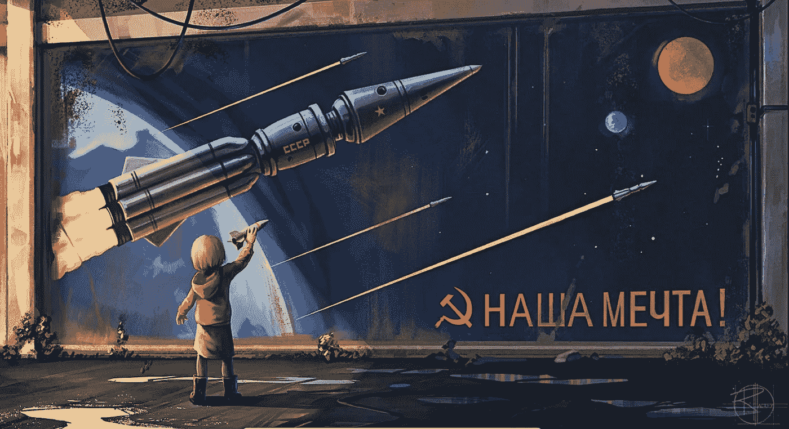

# 你的产品应该有多少 bug？

> 原文：<https://medium.com/codex/how-many-bugs-should-your-product-have-fd7edd1c61d?source=collection_archive---------13----------------------->

从 [pxfuel](https://www.pxfuel.com/en/free-photo-osegt) 开始。

我是那些预订了[赛博朋克 2077](https://www.cyberpunk.net/us/en/) 的白痴之一。

我这样做是因为我一直想要一个主角，我只能假设这是所谓的“电子莫霍克发型”。在开始我的第一次治疗时，我给我的兄弟们发了一个截图。我相信那是一个抽着赛博雪茄的超人的肖像。我的一个兄弟，他不是“核心玩家”，但*玩过*《荒野之息》(对此我给予部分肯定)，他有一个有趣的回答:

答案，或者更确切地说，可能是许多答案中的一个，肯定*不值得一篇一千字的文章——是广泛适用的:**赛博朋克 2077 有这么多 bug，因为赛博朋克 2077 比它自己的稳定版本更有野心**。*

你想要一个稳定的赛博朋克 2077？这个游戏已经存在，它叫做 *Far Cry 12: The Just Cause* 。

# **你的产品应该有多少 bug*？***

对于我们这些创业型的人来说，这不是我们在吃辣鸡翅时进行的伪哲学对话，这是我们需要问的关于我们产品的真正问题。我们什么时候把各自的宝贝拿出来给人看？我们什么时候向世界展示它们？什么时候一个产品真的可以保证… *准备好了？*

我想我有一个经验估计。

> "在一个足够短的时间内，雄心和稳定是成反比的."

我把它格式化成很酷的样子，因为听起来很聪明。

这给了我们一个可以使用的图表，你知道我喜欢图表。

你可以看到，随着我们野心的增加，稳定性*直线下降*。即使是极小的野心也会让我们陷入稳定的深渊。这是宇宙的深层魔力，而不仅仅是产品开发的事情。我想我在[之前已经](/codex/the-binary-search-methodology-3cd21fc66531)[经历过几次](/coinmonks/why-proof-of-work-is-elegant-and-proof-of-stake-is-not-4988cdc8805f)，但这种影响在软件中尤为明显，一个[缺失](https://embeddedgurus.com/barr-code/2014/03/apples-gotofail-ssl-security-bug-was-easily-preventable/) `[{](https://embeddedgurus.com/barr-code/2014/03/apples-gotofail-ssl-security-bug-was-easily-preventable/)` [可以破解数十亿个设备上的加密](https://embeddedgurus.com/barr-code/2014/03/apples-gotofail-ssl-security-bug-was-easily-preventable/)。

【宝石】| [宝石](https://www.flickr.com/photos/fdecomite/8461755849/in/photolist-dTJHde-7puLS5-52XUCn-dTQbUu-dTJJ9Z-hhL2f-hhKY1-hhL2P-hhL1h-hhKYU-dTJxw8-dTQjCj-dTQh3C-4y6nX9-2fbAvZ-2j8LPrP-dTJzpD-dTQiPL-dTJBZM-dTQdDo-dTQevQ-dTJCNV-7eTK53-dTQhXC-aabGoK-yvMYs-aabGbT-aabNNR-c2kSP5-aa2TaE-7u27sE-7TktVK-doJvt-77vk7e-4zsrME-ypbRJ-4pbdgb-4ABC6y-4RGDDN-Gchfak-5jKW6y-2k2vQKP-Rn3vBR-e1T6C-xQR9Px-2kFrMQU-24218dC-Q9qfMs-y51gk1-8irieK)

# 稻草人

我们来挑一个和赛博朋克极其相似的游戏:宝石迷阵。《宝石迷阵》是由优秀的人制作的优秀游戏(嗯，不是会计界的杰瑞德)——我听说在这一点上相当稳定；但是*野心*几乎不存在。

我们想象自己站在站台上，俯视铁轨。我们看到，在远处，Bejeweled 的涂鸦覆盖守车——但火车只走了几英尺就停下来了。雄心列车刚刚离开车站。

最容易防弹的代码是不存在的代码。最容易得到正确的特征是那些根本不存在的特征。

另一方面，赛博朋克…

你看，所有雄心勃勃的游戏都在我们的稳定性与雄心曲线的右侧。

《火车》|[IMAI 俊之](https://www.flickr.com/photos/matsuyuki/11493812004/in/photolist-ivEMSu-4K2ke3-9yNyTe-4JX6k4-4K2jWy-5oobDt-34aHh6-4JX6ov-4K2jEo-CVhj3i-ojmYVz-qTSpok-5iAf2-ayDzbH-bwPtxf-tpJYE6-opSeGF-9HFXL9-6jqZtn-ZQh67S-3esDtz-xzvPU-fBY8s6-ccSscy-4qp6Ei-b4z2EM-7fdLEL-241Vany-6rSzAP-2maBUX-6r6Ztk-ftnkT-g7FGN-99bLy-5Zcbee-b5KDEK-aJVGMP-bVTYy4-4Dm4SF-pjy53x-4h6uip-g7stn-4uhwMi-4rQVwQ-B41FVj-6TgFe-6p71PT-4YjhJW-5CAbav-oLgDE8)

西伯利亚大铁路全长近 6000 英里，连接莫斯科和符拉迪沃斯托克——大部分线路笔直如箭:穿过群山，越过湖泊([不必要地穿过一些湖泊的中央](https://www.damninteresting.com/building-the-bam/))，从车站站台上你不可能看到赛博朋克列车。稳定性像西伯利亚荒野中的石头一样下降，朝着绝对混乱的渐近线下降，就在符拉迪沃斯托克附近——如果继续这样，在赛博朋克中开始一个新游戏可能会召唤一个完全由鳍和废弃牙膏管组成的地狱般的生物。真的说不准。

因此，我们只能沿着轨道前进，除了权衡和价值判断之外，手中没有任何工具。伟大的工具*这些*是。

我们应该在这些轨道的哪里发布产品？什么时候可以向别人要钱？如果每个产品都采用赛博朋克的方式，我想我会更不高兴，但事实上，我得到了一张去远东联邦区第二大城市[的票，上面有我的名字。我渴望一些比付费取胜的皇家军事战役更有野心的东西。](https://en.wikipedia.org/wiki/Vladivostok)

《依然令人心酸》| [罗恩·弗雷泽](https://www.flickr.com/photos/tomronworldwide/51161901000/in/photolist-2kX17Ho-2gmZwfT-ajys1K-2kuf9Z2-2kYzWss-tQvHK4-2kuN2Ug-nz8xQ-HtV5Eh-4Rsg1Z-zwo6T-JCbDM-4DjDWc-4qMS5V-e1Pkxi-3g23i-GETHGa-fvJhXq-uMB9r6-2hmSsR1-zws5j-2kQWhct-2kR9nXT-Y5zLUz-abxDTE-2mFjF3o-AEzxZV-a9yhzJ-2iqa4SJ-arXCbY-2m8CDcP-EuYq5C-57V25v-wzuby3-aaSNP-uuLE1C-2kQKtt4-uLTU9w-2kX18ed-3fZYT-uMB9Wp-62Goo2-6A39UK-RSNN-pyjtD-29yAS37-349X6i-2mjLvgd-a9vud6-LGCzS)

# 你在说什么？

首先，*不要把上面基于苏联的混合比喻与发布伪劣产品的绿灯混淆。你不是听我说你的产品可以是垃圾。*

然而， *do* 记住“生产就绪”并不是一个绝对的衡量标准。有些产品还没有准备好投入生产，因为缺陷使它们无法使用。我承认上一代游戏机上的赛博朋克……[在这个桶里很稳固](https://www.polygon.com/2020/12/14/22173762/cyberpunk-2077-cd-projekt-red-apology-base-ps4-xbox-one-bugs-issues-glitches)。其他“无 bug”产品还没有准备好生产，原因完全不同:*因为他们没有野心*。他们什么都不做。它们相当于一杯牛奶和一大碗温和的淀粉。

如果一个产品缺乏野心，为什么一开始就要制造它呢？

向外界发布错误代码可能绝对意味着你是一个糟糕的开发人员，但这不是必要条件——仅仅是充分条件。其他时候，一个有缺陷的产品是野心、艺术和梦想的陈述。

也许我们中的一些人应该沿着这条曲线走得更远一点:承担更多的野心…和更多的错误。