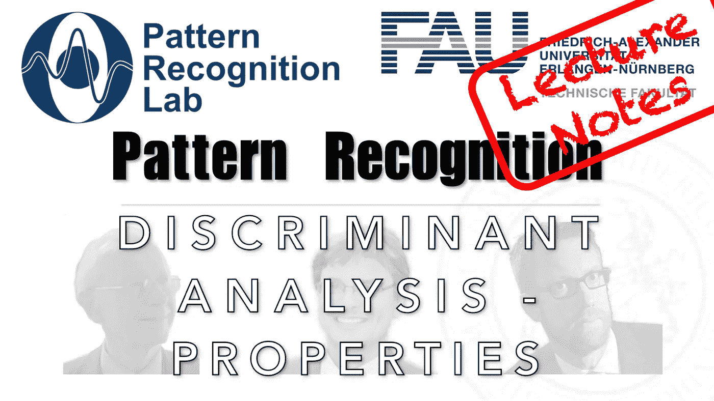

# 在一个线性分离的空间中，我们需要多少个维度？

> 原文：<https://medium.com/codex/how-many-dimensions-do-we-need-in-a-linearly-separating-space-fd760380dac7?source=collection_archive---------19----------------------->

## 模式识别中的 FAU 讲义，[抄本](http://medium.com/codex)

## 线性判别分析—性质

下图 [CC BY 4.0](https://creativecommons.org/licenses/by/4.0/) 来自[模式识别讲座](https://www.youtube.com/playlist?list=PLpOGQvPCDQzsWvT_bqmexrJ359RTQQuMO)

**这些是 FAU 的 YouTube 讲座** [**模式识别**](https://www.youtube.com/playlist?list=PLpOGQvPCDQzsWvT_bqmexrJ359RTQQuMO) **的讲义。这是讲座视频&** [**配套幻灯片**](https://doi.org/10.5281/zenodo.4429576) **的完整抄本。幻灯片的来源可用** …