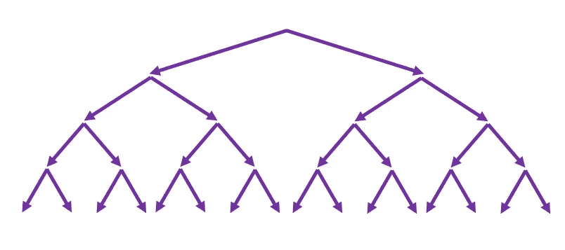

# 一个字符串的长度可以比它在内存中的大小大多少倍？

> 原文：<https://medium.com/codex/how-many-times-a-string-length-can-be-greater-than-its-size-in-memory-857bbe5b30ac?source=collection_archive---------6----------------------->

## 512，000，000 个字符长的字符串需要大约 1 MB 的内存

## JavaScript 字符串的最大长度

根据 ECMAScript 规范，一个字符串包含的字符不能超过 9，007，199，254，740，991 个(2⁵ -1)。显然，可达到的最大长度也取决于…