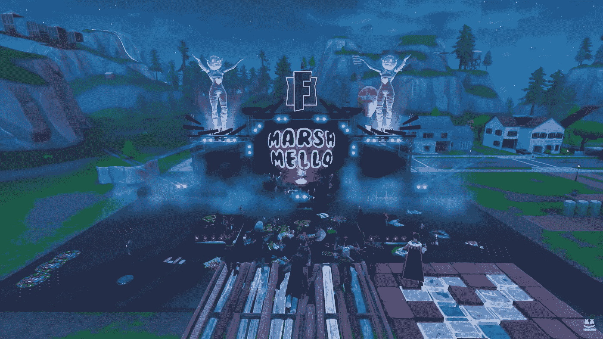
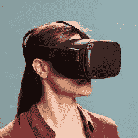

# 元宇宙将如何起步，我们希望它成功吗？

> 原文：<https://medium.com/codex/how-metaverse-will-start-and-would-we-want-it-to-succeed-ddb3f9c596a3?source=collection_archive---------5----------------------->

堡垒之夜宇宙的一场马希梅洛音乐会。现实世界的 DJ 在堡垒之夜的**元宇宙**演奏。

具有讽刺意味的是，这本书创造了“元宇宙”这个术语，却是关于**为什么它不是一个好主意！**

我记得在尼尔·斯蒂芬森 1992 年创作的赛博朋克经典作品《冰雪奇缘》中读到过“元宇宙”这个词。我是在 2005 年读的这本书，当时正值互联网革命的高潮。

在书中，人们作为数字化身，逃进了一个被称为元宇宙的**替代现实世界，以逃避沉闷、反乌托邦的现实。一个被少数大公司控制的现实。**

书中的元宇宙是一个极其令人上瘾的世界，人们从不脱离现实，不惜一切代价逃避现实。这也是一个有阶级意识的世界，有钱人可以进入元宇宙最好的地方。其余的都被看不起。他们的头像也看起来模糊不清，以表明他们的地位低下！

该书的情节是关于小说的主人公与时间赛跑，以防止一种病毒被上传到被钩住的用户的大脑中，这将产生数字和现实生活的后果。

元宇宙是一个警告，而不是一个值得效仿的东西！

因此，脸书变成了 Meta，突然之间，元宇宙成了一个很酷的新名词。当然，谷歌、苹果、微软以及其他公司已经为元宇宙的未来努力了一段时间。

那么让我们来分析一下元宇宙到底是什么意思？

## 元宇宙基本上是四样东西

**One** ，一个个人和公司运营自己空间的数字世界(很像在现实世界中为你的家庭和办公室申请一个空间并支付租金)。

**第二个**，化身本质上是你的独特身份，理论上可以按照多元宇宙的法则过着由你决定的生活。

**第三个**，数字持久性和同步性，本质上意味着它的所有实时性和无论发生什么变化，都是永久的

**第四个**，以加密作为信任因素的数字货币和数字资产的数字经济

> 这是这个想法有趣的部分——以上所有的都已经以这样或那样的形式存在了。

*想想看*

互联网上已经有很多公司了。过去几年表明，物理办公室也是可选的。虚拟形象、数字同步性和数字经济是任何游戏玩家都会立刻感到宾至如归的东西。

表面上是免费游戏的《堡垒之夜》从玩家的微交易中赚了数十亿美元，这些玩家喜欢给自己的虚拟角色穿上狼皮衣服，出去和其他穿着不同的虚拟角色一决高下。像《红色死亡救赎 2》这样的多人游戏世界是一个**活生生的世界**，在这个世界里，你是许多角色中的一个，这个世界没有你也会继续存在。

随着加密货币和 NFT 的兴起，多元宇宙可能是他们走出投机交易并最终在阳光下找到自己位置的答案。

> 但是事情是这样的——如果所有的元素都已经存在，那么是什么让所有的元素成为多元宇宙呢？

**啊，最搞笑的答案来了——耳机！**

是的，我们经常在高科技广告中看到的耳机。这将会给我们带来一场革命。

对于任何有机会试穿的人来说，共同的感觉是——一种平淡无奇的体验。VR(虚拟现实)头戴设备目前还不能提供真正的多元宇宙所需的深度沉浸感，以使你将它与现实混淆。

扎克伯格自己也承认了这一点，并指出 Meta(以前的脸书)需要花费数十亿美元，才能让多元宇宙成为现实。

对你来说，元宇宙将如何开始？

**很正常！**

尽管完美可能还需要十年(如果不是更久的话)——随着耳机的改进，预计会开始看到一些有趣的变化，特别是在一些领域。

其中，**工作空间**(没有笨拙变焦的虚拟化身的虚拟会议失败)**教育**(虚拟教室，老师‘看见’你，摄像机不能关！).期待电子商务**或虚拟商务**的创新。**加密货币**将开始成为主流，**数字资产所有权(如 NFTs)** 将开始变得更加普遍。

许多人预计，这将是该技术能够带我们走的最远距离，因为在主流改编成本不变得过高的情况下，如何使该技术身临其境可能会受到实际限制。

但是假设，只是假设，Meta(或者其他人)成功了。我们都可以进入完全沉浸式的元宇宙，在那里我们所有的感官(包括触觉——带有智能传感器)都可以被愚弄，相信数字是真实的。

## 假设《冰雪奇缘》中的元宇宙真的成真了？

简·麦克戈尼格尔在她的书《现实被打破》中写道，为什么游戏如此令人上瘾。因为它给了我们一种现实生活中所缺乏的控制力。如果你坚持下去，游戏可以让你成为你想成为的人。

**现实总是会在比较中吸取教训。**

再加上大型科技公司完善的大脑黑客技术——元宇宙可能是一个人们会永远迷失的世界。如果游戏康复中心只为屏幕上的游戏开放，元宇宙会打开潘多拉的盒子吗？

> 一个真正身临其境的元宇宙，一个统一的体验很可能会击垮我们。

我们正接近旧石器时代人类大脑和身体所能承受的极限。随着社交媒体和不断吸引注意力的娱乐，所有这些都是永久的，我们已经有了注意力障碍，数字成瘾，抑郁，焦虑和孤独。随着我们无法区分假新闻和真实新闻，导致批判性思维的丧失，部落主义正在增长。所有高薪工作都是久坐不动的，这导致了肥胖的流行。

**一个完美的元宇宙可以炸掉所有这些因素。**

但是在我们接近它之前还有一段距离。就目前而言，这是一项正在进行的工作，就像科学中的所有事情一样，最终结果可能是两种情况。这将是一次有趣的旅行。

但话说回来，想想视频游戏在不到十年的时间里在逼真的图形和可信的世界构建方面走过的路程吧。例如，参见 2020 年推出的《我们最后的部分 2》。

《最后的我们》第二部中的艾比

因此，距离拥有一个真正的元宇宙可能并不遥远。

在那之前，在 Amazon Prime 上观看“Ready Player One ”,通过元宇宙可能带来的未来世界进行一次安全、有趣的嬉戏。或者玩“我们最后的第二部分”！