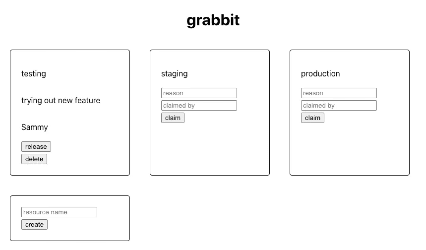

# 迈克尔·库里如何选择 Wasp 来构建 Grabbit:管理 StudentBeans 开发资源的内部工具

> 原文：<https://medium.com/codex/how-michael-curry-chose-wasp-to-build-grabbit-an-internal-tool-for-managing-dev-resources-at-8f76740c7648?source=collection_archive---------10----------------------->

迈克尔·库里是位于伦敦的一家元宇宙和模拟公司[的高级前端工程师。在空闲时间，他喜欢学习编译器。](https://www.improbable.io/)

在他之前在 StudentBeans 的职位上，他经历了多个工程团队竞争同一个开发环境的问题(例如，测试、试运行等等)。然后他发现了 Wasp，决定做点什么！

请继续阅读，了解 Michael 为什么选择 Wasp 来构建和部署一个用于管理 StudentBeans 开发环境的内部工具。

# 问题:开发环境之战

StudentBeans 有一个基于微服务的架构，支持多种环境—测试、试运行、生产等。团队练习 CI/CD，一天部署多次。在如此快速的开发速度下，多个工程团队试图同时声明相同的开发环境是相对经常发生的。

对于团队来说，没有一种简单的方法来同步谁在使用哪个环境，这最终会导致意想不到的变化、混乱和开发时间的延长。

# 解决方案:Grabbit——按需声明并发布开发环境

在上述事件重复了第 n 次后，团队聚在一起进行尸检。他们决定他们的新开发过程应该是这样的:

*   合并您的更改
*   声明您要部署到的环境(例如，测试、试运行等)
*   部署您的更改
*   测试您的更改
*   一旦你完成了这个环境，就释放它，这样其他人就可以要求它了

其他需求是在内部构建解决方案以节省资金，并且不要在上面花费超过几个小时，因为他们仍然需要为正在进行的 sprint 提供一些重要的功能。

# Wasp 快速成型的威力

迈克尔在 Wasp 第一次在 T2 发布 HackerNews 时了解到了 Wasp，它立即引起了他的注意。作为一名编程语言爱好者，他立即理解了 DSL 方法的价值，以及它如何能够极大地简化开发过程，同时不妨碍他在需要时使用自己喜欢的技术栈(React，Node.js)。

此外，尽管 Michael 拥有全栈经验，但他当时的主要优势还是在前端。Wasp 看起来是一个很好的方式，可以不用处理繁琐的后端设置和布线(设置数据库，计算 API 等等)，并且可以专注于 UX。

> *当我第一次在 HN 了解 Wasp 时，我对它的 DSL 方法感到非常兴奋。我用 Wasp 运行程序的速度之快令人惊讶——我在一个小时内就有了第一个版本！这种语言也相当简单明了，与 React & Node.js 配合得很好+它去掉了大量的样板文件。*
> 
> *—迈克尔·库里—格拉比特*

# 现成的部署

一旦 Michael 对 Grabbit 的第一个版本感到满意，并与团队确认它符合他们期望的流程，剩下唯一要做的事情就是部署它！众所周知，这一步会变得非常复杂，尤其是如果您还不熟悉通常附带的大量配置选项的话。

Wasp CLI 附带了一个`wasp build`命令，可以为您完成所有繁重的工作——它创建了一个包含静态前端文件的目录，您可以轻松地将这些文件部署到 Netlify 中，另一方面，它还为后端创建了一个 Docker 映像。由于 Heroku 正在结束其免费计划，我们的建议是部署到 Fly.io，对此提供了详细的指南。你可以在这里找到[详细的部署说明](https://wasp-lang.dev/docs/deploying)。

在 Michael 的案例中，他在 VPN 后面部署了 Grabbit，因为它是一个内部工具，而且这个过程由于有一个现成的 Dockerfile 而变得很容易。

# 从 MVP 到羽翼未丰的 SaaS

上面展示的 Grabbit 的功能非常简单(创建一个资源→声明它→释放它)，它可以很容易地在一些无代码工具中实现，或者，如果我们真的想变得简单，用一个 Trello 板。那么，为什么要使用 Wasp 呢？

一个原因是开发人员知道并且更喜欢他们的工具和信任代码，而不是无代码的解决方案，尤其是当需求仍在发展，并且还不清楚他们是否会“陷入”某个封闭的系统时。迈克尔也有类似的想法——当他在自己的公司发现这个问题时，他意识到其他人肯定也面临着同样的问题。这就是为什么他的计划是不断改进 Grabbit，并最终将其作为独立的 SaaS 提供。

这就是 Wasp 的用武之地——他可以在几个小时内开发和部署 Grabbit 的初始版本，但最终仍然会有一个平台，他可以通过自己选择的堆栈 React & Node.js 无限扩展代码的能力，同时还可以使用他每天在工作中使用的 npm 包。

一旦他开始添加更多的高级功能，如多用户身份验证支持、电子邮件通知以及与 CI/CD 的集成，无代码工具就不再管用了。通过这种方式，他让自己和公司免于丢掉一个 MVP，并随着产品的发展从头开始(必须学习新技术并弄清楚如何设置)。