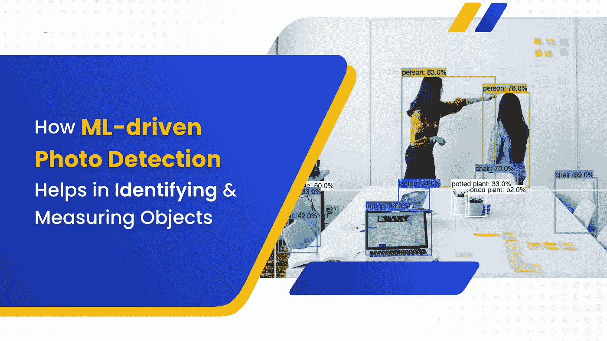
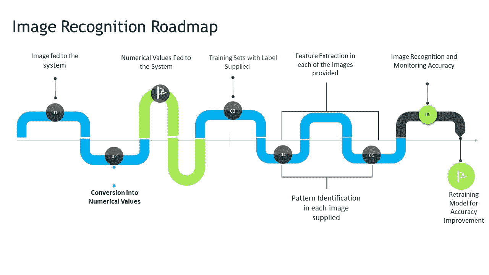

# ML 驱动的图像识别如何帮助识别和测量物体

> 原文：<https://medium.com/codex/how-ml-driven-image-recognition-helps-in-identifying-and-measuring-objects-596d6cb3d721?source=collection_archive---------10----------------------->

现在机器学习和人工智能被广泛应用。例如，我们可能会使用 Siri 来安排我们的下一次商务会议，或者只是浏览一下我们的手机来打开它们。在 IT 行业，人工智能和机器视觉是热门话题。

AI 使用各种工具和方法来模仿人类智能，并使用应用于各种小工具的各种算法来复制它。机器学习中图片识别的困难在被称为计算机视觉的信息技术领域中被研究。计算机视觉关注的是计算机分析和理解图像和电影的能力。

本文涵盖了人工智能在计算机视觉和图像识别方面的应用(AI)。深度学习现在用于人工智能视觉的各种实际应用中，包括照片识别。

# 最大似然驱动图像识别的定义

识别图像中有趣的特征和确定它所属的类别是与图像识别相关的两个问题。

当我们在视觉上检查一个物体或场景时，我们本能地将项目识别为独特的实例，并将它们与不同的意义相关联；“图像识别”、“照片识别”和“图片识别”之间没有区别

机器人能够检测和识别物体，但这是一项非常困难的操作，需要大量的处理能力。人工智能辅助的图像识别研究长期以来一直是计算机视觉领域的研究热点。

将观察到的物体分类成许多种类是图像识别的统一目标，尽管随着时间的推移，发展了几种技术来复制人类视觉。

因此，它通常被称为对象识别。特别是深度学习技术，在之前的几年中，已经在各种机器学习和图像解释应用中取得了巨大的成功。

因此，在有效性(每秒计算的帧数/FPS)和适应性方面，深度学习图像识别方法产生了最大的结果。我们将在本帖中进一步讨论用于图片识别的顶级深度学习技术和人工智能算法。

*   **图像识别与机器学习**

虽然图像识别和机器学习看起来很相似，但它们并不相同。

实际上，对象检测、图像识别和分类技术只是使用图像识别经常需要的机器学习任务的几个例子。

*   **图像识别与物体定位**

机器学习的另一个有时被误认为图像识别的领域是对象定位。在图像中定位一个或多个项目并在它们周围创建线段的过程称为对象定位。

但是，对发现的项目进行分类不是对象定位的一部分。

*   **图像识别与照片检测**

光电探测和图像识别通常作为同义词使用。但是有一些重要的技术差异。

光电探测包括将照片作为输入，并在照片中定位各种物体。计算机在图片中寻找面部模式的一个应用是面部检测。

由于我们的注意力只集中在探测上，我们不在乎我们发现的物体是否有任何意义。光电探测必须能够区分不同的物体，才能计算出图像中不同物体的数量。因此，围绕每个唯一的项目创建边界框。

另一方面，检测图片中感兴趣的项目并确定它们属于哪个分类或类别的挑战被称为图像识别。

# 计算机视觉的市场能力和范围

随着时间的推移，基于计算机的视觉行业发展迅猛。目前估值为 119.4 亿美元，预计到 2023 年将增至 173.8 亿美元，2018 年至 2023 年 CAGR 为 7.80%。

这是对移动设备、无人机(民用和军用)以及半自动和自动驾驶车辆需求增加的结果。工业 4.0 和数字化在制造业中的广泛使用是推动计算机视觉需求的另一个因素。

由于计算机视觉处理和理解主要来自各种应用的视觉源的数据的能力的扩展，这些应用包括医学成像分析、自动车辆中的物体识别、用于安全目的的图像识别等。许多公司都在投资图像识别。

图像识别是识别照片中的物体、人物、位置和行为的能力。它结合了人工智能、训练有素的算法和机器视觉技术来检测来自相机系统的图像。

在很大程度上，由于机器学习的最新进展以及计算机处理能力的提高，图像识别席卷了全世界。

# 图像识别是如何工作的？

一系列定量数据显示为数字图像。与每个图像像素相关的信息由这些图代替。矩阵中众多像素的平均亮度由单个整数表示。

图片中不同像素的强度和位置是提供给识别算法的数据。为了在作为教育过程的一部分呈现给他们的连续图像中绘制出链接或模式，系统使用这种知识。

当训练过程结束时，系统在测试集上的性能被评估。

改变神经网络中使用的间歇权重，以提高系统识别图片能力的精度。下图完整显示了图像识别的路线图。

# 图像识别的挑战

虽然图像识别有助于身份识别，并以各种方式支持许多行业，但图像识别模型存在一些已知的挑战。

*   **视点变化**

这些东西并不像它们在照片中看起来的那样定向；相反，他们在现实生活中的定位是不同的。当呈现这样的照片时，图像识别系统预测错误的值。图片识别的基本问题是算法不能理解图像的方向调整得有多好。

*   **规模变异**

图片中物品的分类受到尺寸差异的显著影响。当你越靠近图像，它就显得越大，反之亦然。它显示错误的发现并改变图像的尺寸。

*   **变形**

你似乎意识到了这样一个事实:任何事物都可能被改变而保持不变。图像告诉计算机相信一个物体在图像中只能呈现特定的形式。我们知道，物体的实际形状和外观可能与图像不同，导致系统产生错误的结果。

*   **类间变异**

该类中有几个独特的对象。尽管它们的尺寸和形状不同，但它们都是同一类的成员。此外，还有各种座位、瓶子和按钮配置。

*   **遮挡**

有些东西很难看到整个图像，这导致系统只接收到部分数据。有必要开发一种灵敏的方法，对所有这些变化做出响应，并使用广泛的信息样本。

为了充分训练神经网络模型，训练数据集应该包含来自单个类或多个类的实例。训练集的多样性确保了模型在根据测试数据进行评估时能够提供准确的预测。然而，大多数样本都是随机排列的，所以要确定是否有足够的数据，需要耗费大量的人力。

# 基于机器学习的图像识别

传统的机器学习技术一直是图像识别的行业标准，直到 GPU(图形处理单元)强大到足以执行神经网络的大规模并行计算需求。

在这方面，让我们看看图像识别的前三种机器学习技术:

*   **支持向量机**

为了使支持向量机起作用，创建具有和不具有目标对象的两个图像的直方图。

然后，软件查看测试图片，并通过将来自训练直方图的值与来自图像的各个区域的值进行对比来寻找匹配。

*   **捆绑特性模型**

为了完成它们的职责，像尺度不变特征变换(SIFT)和最大稳定极值区域(MSER)这样的特征模型束需要扫描的图像和要找到的对象的参考样本照片。

为了发现匹配，该模型然后将目标图片的不同部分与来自样本图像的不同特征进行比较。

*   **维奥拉-琼斯算法**

在 CNN(卷积神经网络)被开发出来之前，一种被称为 Viola-Jones 的著名面部识别方法使用面部扫描来提取属性，然后将其放入一个增强分类器中。这产生了大量的增强分类器，然后用于分析测试图像。

测试图像不能匹配，除非它从以下类别中的每一个得到肯定的回答。

# ML 驱动的图像识别用例

机器学习图像识别是一种广泛使用的技术，对许多行业和我们的日常生活有着巨大的影响。因为图片识别应用程序的列表是无穷无尽的，所以我们来谈谈不同商业行业中最有趣的几个用例。让我们讨论这一突破的几个实际应用。

*   **医疗保健**

尽管医生受过广泛的教育，有丰富的专业知识，但他们还是会像其他人一样偶尔犯错，尤其是当涉及到几个病人的时候。因此，一些医疗保健组织已经实施了图像识别系统，为各种医学专业的专家提供帮助。

MRI、CT 和 X 射线是利用机器学习算法来评估患者放射数据的显著用例。医生可以利用神经网络设计来精确诊断和发现偏差，以提高结果处理的整体效率。

*   **制造**

每天检查厂房内的重要位置是生产线分析的一部分。为了确定最终产品的质量并减少瑕疵，经常使用图像识别。如果制造业企业能够评估其员工的健康状况，它们将更容易监管众多系统性业务。

*   **自动驾驶汽车**

自动驾驶汽车使用图像识别来评估交通状况，并采取适当的行动。物流部门可以使用具有机器视觉的小型机器人来帮助定位和移动物品。它可以在数据库中跟踪产品的移动历史，并防止被盗。

现代汽车中包含的众多驾驶员辅助功能通过让您避开碰撞和防止失控来帮助您安全驾驶。由于 ML 算法，车辆可以识别当前的环境、交通标志和道路上的其他事物。自动驾驶汽车预计将是未来这种技术的最发达形式。

*   **军事监视**

通过识别边境地区的不当活动，图像识别可以实现自动决策，从而防止渗透并保护士兵的生命安全。

*   **电子商务**

电子商务是目前增长显著的行业之一。深度学习驱动的视觉搜索已经成为 2022 年的电子商务趋势之一。今天的消费者希望使用谷歌镜头拍摄时尚商品的图像，然后利用这些信息找到他们可能在哪里购买这些商品。

通过使用照片识别技术，组织可以精确地识别他们的目标市场，并了解他们的个性、习惯和兴趣。这种技术在电子商务中被用来检测社交媒体图像中的徽标和品牌名称。

*   **教育**

深度学习技术增强了教育部门的几个方面。目前，在线学习非常普遍，在这种情况下，很难通过网络摄像头监控学生的面部表情。人工神经网络模型有助于分析学生的肢体语言、面部表情和参与过程。

此外，考试期间的自动监考、数字化教学材料、出勤跟踪、字符识别和校园安全都可以通过图像识别实现。

*   **社交媒体**

每天，社交媒体网站必须处理数百张照片和视频。图像识别使得通过图像编目对照片集合进行分类成为可能。它还自动进行内容审核，以防止在社交媒体上发布非法内容。

观看社交网站上提及其业务的文字帖子也能让你深入了解人们如何看待、参与和谈论他们的公司。

*   **视力障碍辅助设备**

视觉障碍有时被称为视力受损，是指能够有效地看到足以导致无法通过标准程序解决的问题的能力。最初，社交媒体主要是基于文本的，但今天的技术开始考虑视觉障碍。

通过图像识别，社交媒体上的导航和设计变得更加简单，为视力有障碍的用户提供了独特的体验。Aipoly 就是这样一款用来寻找和识别物体的软件。一旦用户将手机摄像头对准他们想了解更多的东西，程序就会描述他们看到的东西。

该软件采用机器学习来识别特定的对象结果。

# 结束了！

综上所述，尽管图像识别和机器学习看起来是尖端技术，但实际上它们在今天相当普遍。

这既有利于大公司和新锐创业公司，也有利于中小型本地公司。我们希望我们上面分享的模型已经说服了你。

# Quytech 将如何提供帮助？

总而言之，我们认为这个博客已经为你的询问提供了所有可能的解决方案。此外，如果您有任何问题，您可以直接联系 Quytech。

此外，Quytech 协助您在 ML 驱动的应用开发中提供端到端服务，以及后期开发服务。如果你正在寻找一个有着成功记录的应用程序开发企业，Quytech 是最重要的选择之一。

还是，不解？为什么要选 Quytech？

Quytech 的开发团队已经在研究一系列应用类别中图片识别的可能性。Quytech，正如这篇博客中所展示的，可能会帮助您理解机器学习驱动的图像识别技术如何在一系列领域中实现。

联系 [**Quytech**](https://www.quytech.com/) 了解更多可能性。开发团队擅长开发使用 ML 驱动技术的应用程序。