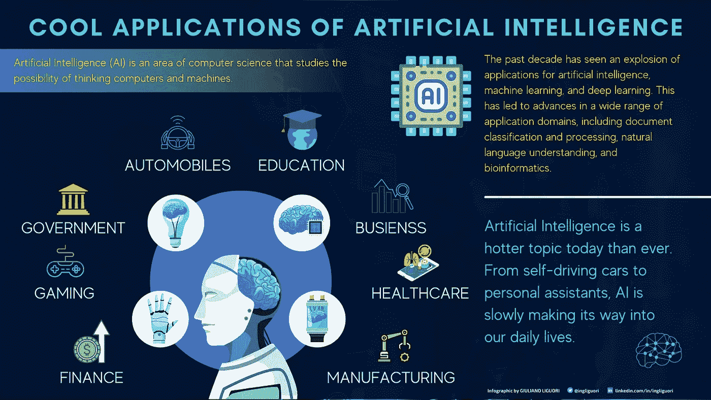
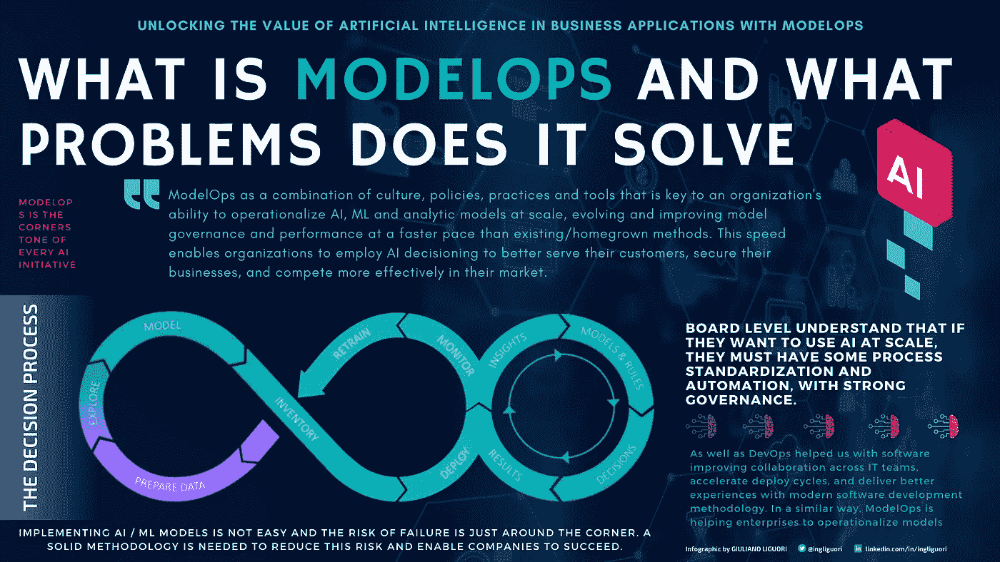
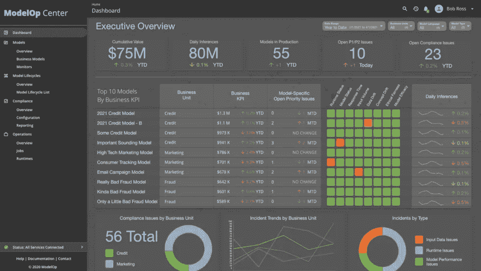
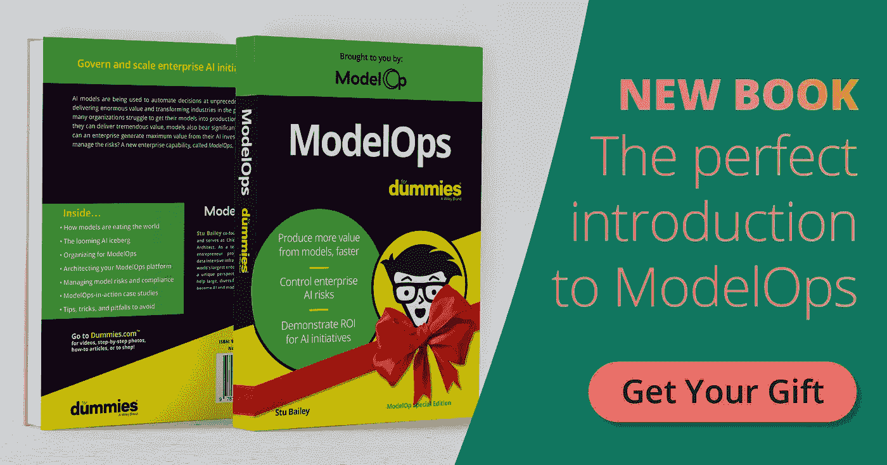

# ModelOps 如何帮助你执行你的人工智能策略

> 原文：<https://medium.com/codex/how-modelops-helps-you-execute-your-ai-strategy-a8c007d49623?source=collection_archive---------5----------------------->

## 模型操作化真的有必要吗？每一天，公司都在数据科学家、软件工程师和人工智能应用上花费数百万美元。这些公司大多没有充分利用投资的策略。他们不知道如何利用他们的技术投资对收入或利润产生最大影响。

# 人工智能的酷应用。

人工智能是当今比以往任何时候都更热门的话题。从自动驾驶汽车到个人助理，人工智能正在慢慢进入我们的日常生活。人工智能(AI)是计算机科学的一个领域，研究思考计算机和机器的可能性。

更何况在很多方面已经不是理论而是现实了。已经有许多应用程序是在人工智能的帮助下开发的，包括商业应用程序。

过去十年见证了人工智能、机器学习和深度学习应用的爆炸式增长。这导致了广泛应用领域的进步，包括文档分类和处理、自然语言理解和生物信息学。越来越多高效的语音处理和图像分类方法正被成功地应用于机器人和计算机视觉领域。我们正在目睹深度学习在网络搜索算法、翻译、语音识别、图像和照片分类器中的使用呈指数级增长。此外，人工智能已经允许我们在很少或没有人工干预的情况下自动化重复的任务。

作者创造的形象

# 人工智能是未来。你准备好管理风险了吗？

最近有很多关于与人工智能潜力相关的价值承诺的谈论。然而，对许多组织来说，人工智能的投资回报被证明是困难的，更糟糕的是，他们认为自己落后于那些克服了挑战的人。通常，讨论都围绕着那些基本的、起作用的技术，但是这些技术不足以产生商业结果。对于大多数组织来说，对人工智能的兴趣最初集中在分析和机器学习模型的交付上，作为其开发的第一阶段的工件。另一方面，它们与信息技术和业务交付流程相结合的方面，即它们的"可操作化"方面被忽视了。

考虑到将人工智能模型集成到业务工作流程中并实现首批收益需要几个月的时间，后一个方面对于减少“价值实现时间”至关重要。

这有许多原因，但一个关键的原因是，AI 需要不同于传统软件开发的技能。大多数公司都有数据科学家，他们可以创建模型和算法，为他们的人工智能系统提供支持，但很少有技术人员可以创建和维护软件基础设施，使这些模型和大规模算法得以运行。在高层次上，人工智能所需的软件基础设施可能看起来与传统软件开发所需的类似。但在更低的层面，需要不同的技巧和思维。最适合构建这种基础架构的人是那些在技术、流程管理以及业务和创新战略愿景方面都有经验的人。

复杂背后的原因各不相同。缺乏安全性和隐私性、数据量和质量不足、可访问性挑战、对使用案例和相关优势的理解有限、内部技能不足等等。这种情况的真正风险是让重要的利益相关者对人工智能给他们的组织带来的好处和变革性影响产生怀疑。对人工智能的热情可能会消退，人工智能将被视为仅仅是另一种技术，而不是可以从根本上改变组织运营方式的东西。

> 另请阅读 [*使用 ModelOps*](https://towardsdatascience.com/scale-and-govern-ai-initiatives-with-modelops-afdc33ce1171) 扩展和治理人工智能计划

# 模型操作

我们能做些什么来处理这种复杂性呢？当然，数据是所有相互依赖关系背后的公共元素。虽然有必要在技术方面开展工作，但也有必要考虑工作实践和运营模式方面。所有这些都是以工业化的方式将数据和人工智能集成到运营和业务流程中所必需的。

ModelOps(人工智能模型操作化)无疑是任何人工智能战略的核心。ModelOps 是一种使预测分析和机器学习工作流可操作的整体方法。团队受益于将这些工作流付诸行动，充分利用它们，同时最大限度地减少重复任务上的浪费时间，让他们专注于真正重要的事情。Gartner 定义了 ModelOps，这些实践的目标是自动化数据科学项目中出现的一组常见操作，如模型培训管道、版本控制、数据管理、实验监控、测试和分发。它旨在运营所有预测分析、机器学习和人工智能模型。它有助于构建自动化测试过程，沿着项目交付管道检测编码错误。

作者创造的形象

> 另请阅读[安全可靠人工智能模型操作](/codex/model-operations-for-secure-and-reliable-ai-2cf0ced9945b)

# ModelOp 中心:一个连接你和模特世界的平台。

投入巨资开发人工智能模型的组织可以做很多事情来提高效率。他们可以通过从传统的手动操作转变为行业最佳的模式操作来优化流程、简化活动并增加利润。像 [ModelOp Center](https://www.modelop.com/product/) 这样的 ModelOps 平台可以自动化模型操作的所有方面，无论模型的类型、开发方式或运行位置如何。自动化有许多好处。它改进了决策，以增加交付周期并最大限度地提高生产率和产能。它帮助企业更好地规划，并通过最大限度地减少人员成本来削减成本。它有助于捕获用手动方法可能会丢失的数据。

[ModelOp Center](https://www.modelop.com/product/) 是一个创新的解决方案，可以自动化模型操作的所有方面，无论模型的类型、开发程度或运行地点如何。使用 ModelOp Center 的平台，组织可以轻松有效地自动化和管理模型操作流程。除了为其内部团队提供显著的运营效率改进，ModelOp Center 的客户还受益于降低的成本和对模型运营的更好控制。

客户可以选择在他们的环境中安装 [ModelOp Center](https://www.modelop.com/) ，无论是内部部署还是在他们的私有云中，无论是 AWS、Azure 还是谷歌云平台(GCP)。

模型中心—来源 modelop.com

> 另请阅读[使用 ModelOps 扩展和管理人工智能计划](https://towardsdatascience.com/scale-and-govern-ai-initiatives-with-modelops-afdc33ce1171)

# 假人模型操作介绍:完全指南。

《傻瓜模型》是一本好书。

采取的立场是，没有人读这本书是一个哑巴，以前没有，以后也没有。这本书是为那些希望在未来的模型驱动中生存和发展的董事会和首席执行官们而写的。这本书不是给数据科学家看的，它的目标是负责创新管理的领导者，他们负责将他们的组织转变为模型驱动的企业。他们不创造人工智能模型；他们只是用它们来做生意。他们有责任通过证明任何人工智能项目的实际投资回报率来为他们的组织提供价值。这本书是为那些想要保护他们的业务免受模型风险和遵从性问题影响的人准备的。

有很多关于 Python，C ++，以及如何训练 AI/ML 模型的阅读。但每个人似乎都在发现人工智能的真正问题:企业如何将这些东西投入运营和规模化。这是我推荐你读这本书的真正原因，因为它聚焦于商业和风险管理的主题。

在我看来,《傻瓜模型操作》是领导者的必读读物，旨在:

*   衡量他们对人工智能的投资回报；
*   捕获整个企业中模型的 360 度视图；
*   管理模型风险和合规性问题。

这本书不同于任何一本关于人工智能的书。它是由业务主管为业务主管编写的，可以轻松浏览通常非常技术性的主题，而不是为数据科学家编写的。

假人模型——来源 modelop.com

你可以在这里得到你的免费拷贝[https://bit.ly/MdlOpsB](https://bit.ly/MdlOpsB)

# 结论

*   模型操作是任何组织的企业人工智能战略的核心能力。它是一种可以用来融合和集中各种人工智能工件、平台和解决方案的技术，同时确保可扩展性和治理。
*   通过将业务流程集成到 ModelOp Center 中，我们不仅解决了模型的部署、监控和治理，还在运营、IT 和数据科学之间架起了一座桥梁。
*   无论你是人工智能或人工智能领域的资深人士，还是刚刚开始探索可能性，傻瓜模型操作这本书将教你如何利用模型操作，让你的组织更具竞争力。

> 还可以阅读[在你的人工智能战略中包含模型运算](https://towardsdatascience.com/including-modelops-in-your-ai-strategy-f3a7bb4831dd) **关注我的每日技术和创新更新**

[https://bit.ly/m/ingliguori](https://bit.ly/m/ingliguori)

# 参考

*   [假人模型操作](https://bit.ly/MdlOpsB)
*   Modelop 的[网站](http://www.modelop.com/)
*   [2021 年模型运行状态报告](https://www.modelop.com/resources/ai-transformation-with-modelops/state-of-modelops-2021-report/)
*   [Gartner《模型操作创新洞察》报告](https://go.modelop.com/gartner_innovation_insights_for_modelops?utm_medium=web)
*   [人工智能工程之旅](https://www.modelop.com/wp-content/uploads/2021/05/Gartner-Keynote-Presentation-2021-04-15.pdf)
*   [ModelOps 在企业规模上实施人工智能的关键](https://www.modelop.com/wp-content/uploads/2021/02/Key-to-Operationalizing-AI-at-Scale.pdf)
*   [ModelOps 是企业 AI 的关键](https://www.forbes.com/sites/cognitiveworld/2020/03/31/modelops-is-the-key-to-enterprise-ai/?sh=168152846f5a)