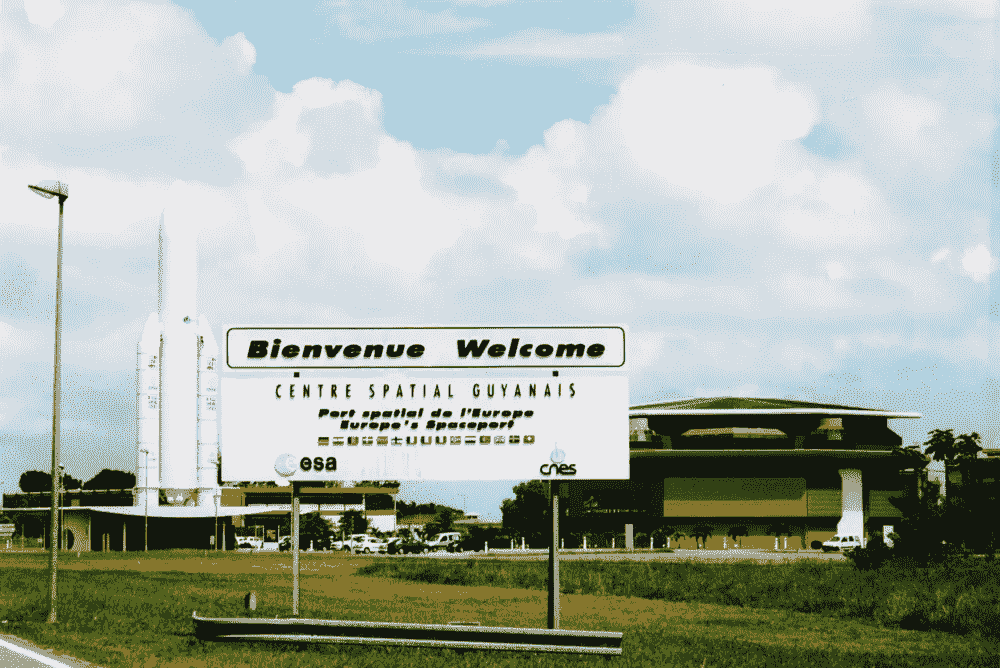
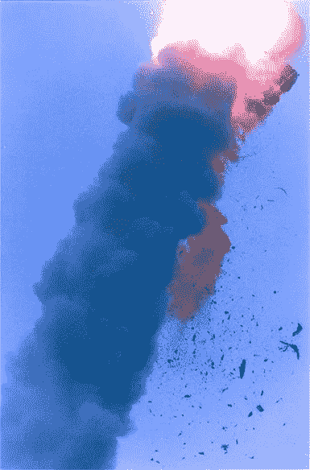
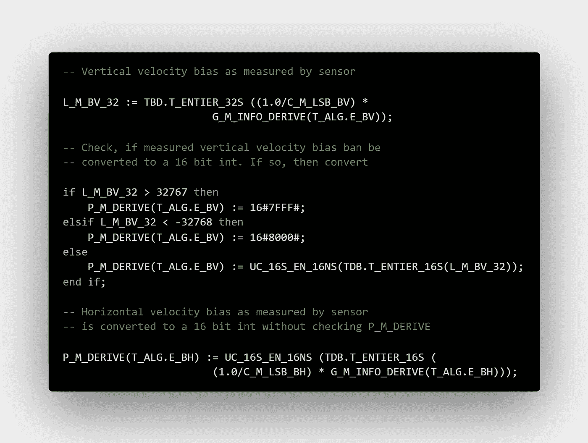

# 一个字节多少钱

> 原文：<https://medium.com/codex/how-much-a-byte-cost-5efc8e4110c8?source=collection_archive---------2----------------------->

## [法典](http://medium.com/codex)

## 一个字节到底值多少钱？
这个问题是有害的，麻痹了我的思想。

[欧文·赫斯里](https://unsplash.com/@erwanhesry?utm_source=medium&utm_medium=referral)在 [Unsplash](https://unsplash.com?utm_source=medium&utm_medium=referral) 上的照片

你可能想知道这篇文章的主题是什么。也许你发现了对肯德里克·拉马尔的*一美元多少钱*的引用。
那么，肯德里克的歌和字节有什么共同点呢？嗯……老实说，没什么。

整篇文章仅仅是一个讲故事的实验。现在，事不宜迟，让我们开始我们的故事。

# 昂贵的一课

> 一个字节到底值多少钱？这个问题是有害的，麻痹了我的思想

那是 1996 年——准确地说是 6 月 4 日——欧洲航天局准备从法属圭亚那的库鲁基地发射一枚名为阿丽亚娜 5 号的全新火箭。这是阿丽亚娜 5 号的处女航，没有多少幻想就被命名为 501 号航班。

库鲁航天中心 benot Prieur/维基共享资源

天空中有几朵云，微风习习，是发射的好天气。

阿丽亚娜 5 号是一个 40 多米高的庞然大物，它高高耸立在空中，准备履行其逃离重力的职责。

技术操作人员、科学家、准备发射的工程师和海边的观众之间的紧张情绪显而易见。

倒计时开始了。随着血液开始涌入工程师大脑中的逻辑网络，他们的情绪迅速消退。

*十。
九。
八。*

海滩上的普通游客和太空爱好者正朝着库鲁航天中心的方向，等待着火箭开始摆脱重力。他们不知道是在发射前几秒钟还是几分钟。

他们一直摇摆不定，从每当新的声音或烟雾从发射平台出现时紧张加剧的时刻，到过去几分钟似乎平静的时刻。

*七个。
六个。
五个。*

中途。
*到目前为止，一切顺利*——窥见任务控制室里每个人的内心，因为他们有心灵感应。

*四个。
三个。
两条。
一个。*

每个人的心都漏跳了一拍。

去吧。

它正在起飞。火箭升空了！现在放松还为时过早，但快乐还是有的。这是个好兆头，不是吗？

不幸的是，没有。阿丽亚娜 5 号的首次飞行并不成功，事实恰恰相反。

# 失败

> 人们难以置信地盯着他们的监视器。

离起飞已经过去了十秒钟。
一切都进行得很顺利。

秒变成了二十秒，然后三十秒。任务按计划进行。操作员的肌肉终于开始放松了一些。

*又一个* *七秒钟过去了。* 恐慌在控制室内蔓延。疯狂的键盘噪音突然出现。已经太晚了。

又过了十分之几。平静和寂静像一秒钟前的恐慌一样迅速传遍了整个房间。火箭确实偏离了轨道，然后在 3700 米的高空爆炸。

任务操作人员非常惊讶。

*为什么？什么？怎么会？
火箭为什么会爆炸？
什么错误？这样一个灾难性的错误怎么会被忽视呢？*

阿丽亚娜 5 号航班 501 爆炸。环境敏感区

# 原因

> 罪恶感和怨恨感

灾难发生后，欧空局开始调查是什么原因导致火箭偏离轨道并爆炸。

调查委员会发现一个令人惊讶的微不足道的编程错误是最终导致阿丽亚娜 5 号失事的事件雪球的根源。

错误发生在一个经过充分测试的组件中，惯性参考平台，继承自阿丽亚娜 4 号，它的哥哥。

与它的兄弟相比，阿丽亚娜 5 的水平加速度更高，当它试图将过大的 64 位浮点数转换为 16 位有符号整数时，在 IRS 中引起了转换错误。
与其兄弟相比，Ariane 5 的水平加速度更高，导致数据从 64 位浮点数转换为 16 位有符号整数。

简单来说，把它想象成试图把一瓶水装进一个玻璃杯:之前一切都很顺利，突然，一切都不顺利了，水开始溢出玻璃杯，溢到桌子上。当水开始溢出时，501 航班的转折点在大约 3700 米处。

不正确的转换引发了错误的异常警告。
异常导致主惯性参考平台和回收惯性参考平台冻结(因为它们是相同的)。IRS 故障导致火箭突然偏离轨道，随后爆炸。

尽管这被普遍认为是唯一的失败原因，但导致失败的设计错误更值得探究。此外，光是溢出的*就不会造成火箭损失。*

*在导致灾难的事件链中起主导作用的是编码不良的异常处理程序。
处理程序是负责处理运行时错误的软件组件。如果设计得当，它们可以在关键情况下保持执行的正确性。他们将代码执行“拉回正轨”被广泛接受的观点是，设计更好的处理程序本可以避免这场惨败。*

*许多人走得更远，把灾难归咎于整个软件设计过程。事实上，阿丽亚娜 4 号以前的发射从未导致水平加速度大到足以产生溢出。*

*因此，在经验证据的支持下，程序员去除了溢出检查以加速代码执行。这对阿丽亚娜 4 号来说是正确的。*

*但是当由阿丽亚娜 5 号继承时，两种火箭的差异应该导致对所做的假设和额外的代码测试的审查。*

*不幸的是，他们没有。*

**

*真正导致灾难的代码片段。*

# *结论*

*这个故事的主要要点是:*

1.  *软件不是一个笑话，好的软件设计在关键环境中是不可或缺的*
2.  *正确的错误处理对于限制意外的代码行为至关重要*
3.  *同一组件的测试在不同的场景中可能会有所不同。*

*最后，我们现在可以回答我们最初的问题:一个字节值多少钱？*

# *一个字节多少钱？*

*火箭和货物损失的估计成本约为 3.7 亿美元。转换试图将一个 8 字节的变量放入 2 字节中，因此有 6 个字节丢失。在这些前提下，粗略的每字节成本约为*

> *六千万美元。*

*如果你认为现在花不到 20 美元就能买到一个 128 GB 的 USB，这是一个难以置信的数字。*

*[1] *堆栈溢出*。[类型转换——在 Ada 语言中，将 64 位浮点数赋给 16 位整数怎么可能出现代码错误？—堆栈溢出](https://stackoverflow.com/questions/52792505/how-is-it-possible-in-ada-to-have-a-code-failure-from-assigning-a-64bit-floati)*