# 你应该(合理地)拥有多少比特币？

> 原文：<https://medium.com/codex/how-much-bitcoin-should-you-reasonably-own-ae9b66cfb3d?source=collection_archive---------1----------------------->

## 使用 Python、现代投资组合理论、夏普比率和蒙特卡洛模拟，对有加密风险的投资组合进行量化的数据驱动指南。

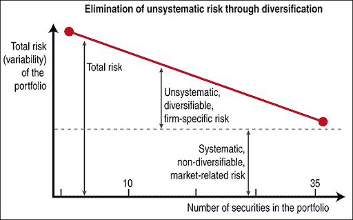

系统风险和非系统风险的图形分类。多样化可以降低非系统风险。[来源](http://premium.working-money.com/wm/display.asp?art=826)

# 问题是——加密如何影响你的投资组合波动性？

假设你是一个 20 多岁的普通人，有大约[16000](https://www.synchronybank.com/blog/median-retirement-savings-by-age/)美元的退休储蓄。你对“投资”略知一二，你的大部分资金都投资于先锋总股票市场指数和先锋美国债券指数。你也喜欢在 Robinhood 上玩一些个人选股和加密货币，因为*如果我在下一个大的加密货币爆炸之前找到它呢？？想象一下，如果我今天投入 1000 美元，而它像 ETH 一样在一年内上涨了 9150%，会发生什么？我会是***！！**

*所以你决定扔一千块给罗宾汉，看看会发生什么。赚钱没那么难。毕竟——你在两个月内已经在 AMC 和 BB 上获得了 50%的收益，那么为什么每个人都对试图在一年内只获得 7%或 8%的收益感到兴奋呢？*

*在这篇文章中，我们将试图量化你在这个策略上真正承担了多少风险。**具体来说，我将尝试回答的问题有:***

*   ***与你通常的股票和债券指数相比，比特币的风险有多大(或者*在特定时间段内*有多高)？***
*   ***将比特币加入你的投资组合会对你的整体风险和回报产生怎样的影响？***

*此外，我将:*

*   *通过现代投资组合理论和马科维茨有效边界等概念解释投资组合多样化的重要性。*
*   *比较现代投资组合中各种资产的风险和波动性，特别是由股票、债券和比特币组成的示例投资组合。*
*   *演示如何计算资产相关系数，以强调当投资组合仅由正相关资产组成时，过度暴露于风险是多么容易。*
*   *使用蒙特卡罗模拟生成各种配置的投资组合，并使用夏普比率确定最佳配置。*

*为了进行这个分析，我将使用 Python 库，比如 yfinance、Pandas、Matplotlib、NumPy 等等。让我们开始吧。*

# *什么是现代投资组合理论(MPT)？*

*在我们讨论暴露于密码的风险之前，让我们先来讨论现代投资组合理论的更高层次的话题。直接来自[wiki](https://en.wikipedia.org/wiki/Modern_portfolio_theory):**现代投资组合理论** ( **MPT** )，或**均值-方差分析**，是一个数学框架，用于组合资产组合，使得给定风险水平下的预期回报最大化。”*

*MPT 建立的前提是投资多种资产(指数化)比只持有一种或几种资产(选股)风险小。更专业地说，你可以通过分散投资到负相关的资产来降低投资组合的风险。*

*这是长期以来的传统智慧，对于任何对个人理财、财务独立或一般投资感兴趣的人来说，都不应该是新闻。*

*[哈里·马科维茨](https://en.wikipedia.org/wiki/Harry_Markowitz)在 50 年代引入了 MPT，以及**有效边界**(图 1 )的概念。*

*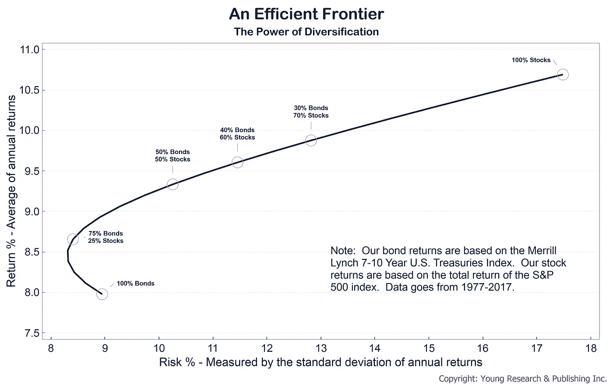*

***图一。**有效边界图([来源](https://www.youngresearch.com/authors/ejsmith/risk-and-reward-an-efficient-frontier/))*

*边界本身是在给定风险水平下提供最高回报水平的所有最优投资组合的集合。沿线的任何投资组合都是最优的，而线下方和右边区域的任何投资组合都是次优的。X 轴是风险，以年回报率的标准差衡量，而 Y 轴是年回报率。我想重申的主要观点是，你可以通过投资低协方差或负协方差的资产来降低投资组合回报的标准差(风险)。对于给定的风险水平，有无数的投资组合可以被构建来产生更高或更低的回报。作为一个投资者，你的目标应该是找到一个位于曲线上的投资组合，这样你就可以在你选择的可接受风险水平下获得最大的回报。*

> *注:如果你想了解更多关于 [MPT](https://www.investopedia.com/terms/m/modernportfoliotheory.asp) 和[有效前沿](https://www.investopedia.com/terms/e/efficientfrontier.asp#:~:text=The%20efficient%20frontier%20is%20the,for%20the%20level%20of%20risk.)的信息，请查阅 Investopedia 上的这些文章。*

# *与股票和债券相比，比特币的风险有多大？*

*资产收益的标准偏差也可以称为风险或波动性。回报率大大偏离平均值的股票被认为风险更大。试图量化这种风险的第一步是提取各种资产的一些财务数据，并计算它们的回报。对于这个例子，我将使用:*

*   ***^GSPC** ，标准普尔 500 指数的代号，代表股票。*
*   ***BND** ，先锋全债指数基金，代表债券。*
*   *以及**BTC-美元**，又名比特币。*

*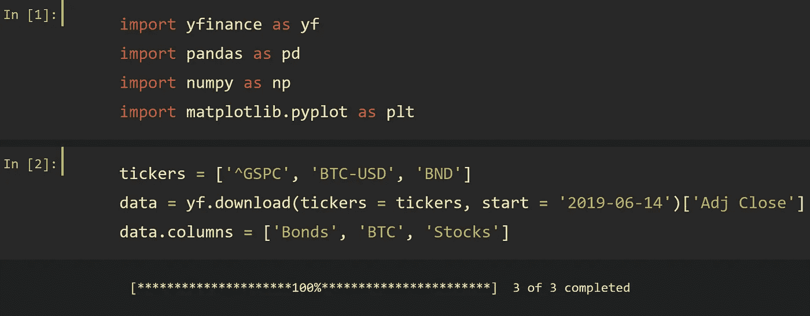*

*对于这个分析，我选择了一个 **2 年期**作为时间框架。接下来，我们将找到每项资产的**对数回报率**，以便我们可以在指定的时间框架内分别检查它们。*

*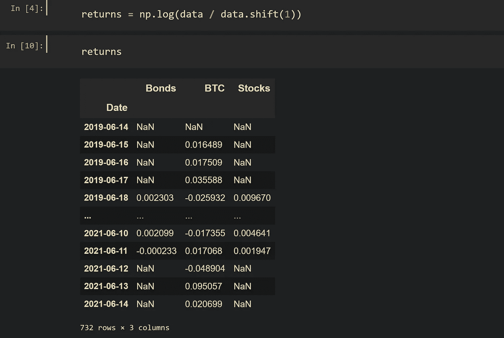*

> *啊哦！是方法论警察。计算对数回报率或简单回报率有很多不同的利弊。对于这个例子，一个合适的方法是计算资产对数回报率的算术平均值，就像我在这里所做的那样。另一个合适的方法是计算简单回报的几何平均值。比较资产表现的一个可能不正确的方法是只计算简单回报的算术平均值。如果这一切听起来令人困惑，这里有一个很好的关于这个话题的讨论。需要注意的重要一点是，由于复利回报的复杂性以及+5%和-5%不会抵消 0%的事实，在进行适当的计算时需要考虑许多因素。鉴于这篇文章仅用于演示目的，我对所选的方法没意见。*

*这向我们展示了资产的每日日志回报。要查看年化金额，将平均日回报率乘以每种资产在一年中的交易天数:股票和债券为 250 天，比特币为 365 天。(252 在技术上更准确，但差别可以忽略不计。)*

*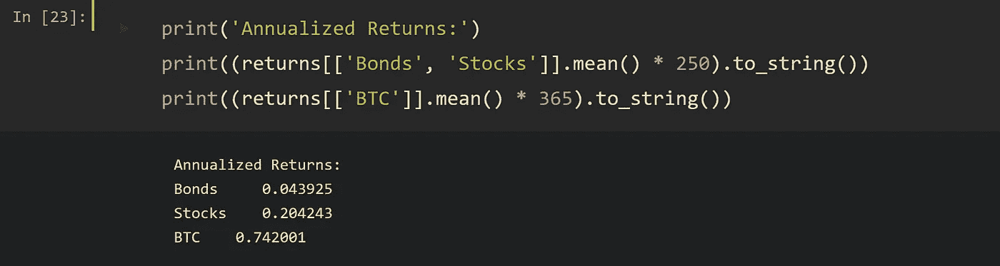*

*为了计算标准差，我们可以使用熊猫**。std()** 法。按照与之前相同的逻辑，我们需要按年计算这个数字。然而，由于将方差转换为标准差所涉及的代数，我们还需要计算交易日数的平方根，而不是简单地乘以交易日数:*

*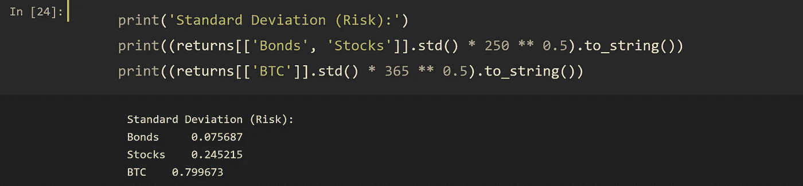*

*从这里我们可以直观地总结 Tableau 中的数据——显示比特币有着显著更高的回报，同时也承载着显著更高的风险(**图 2** )。*

*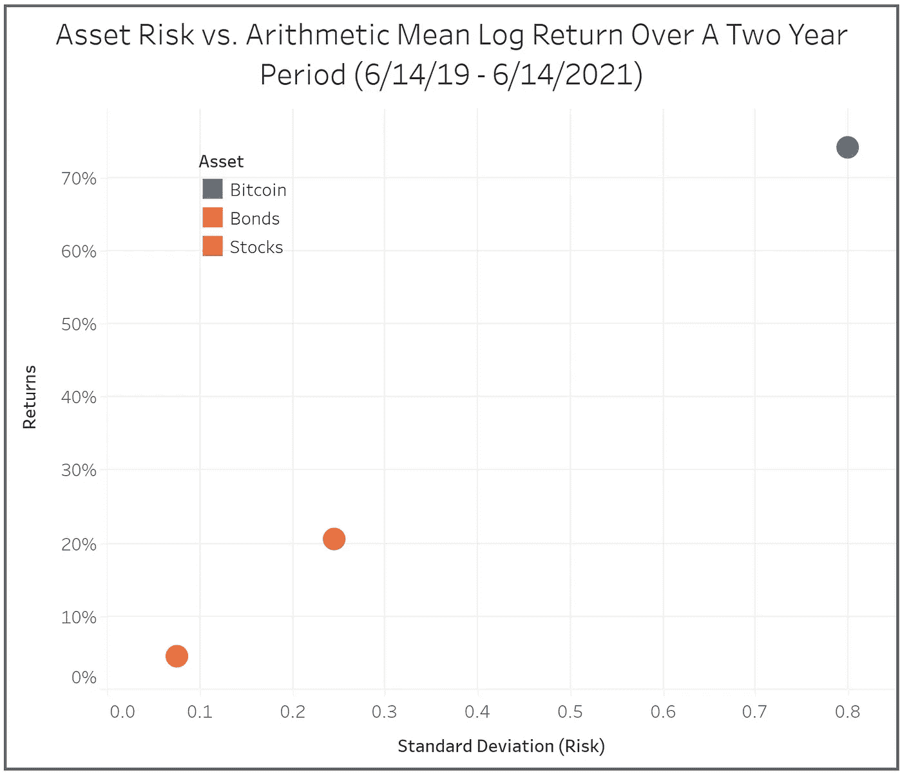*

***图二**。资产风险与 2 年期内的年化对数回报。来源:沃克·佩恩*

*从这个图表中，我们可以回答我们之前的第一个问题— **与典型的股票和债券指数相比，比特币的风险有多大？***

**在这特定的两年期间*，BTC 提供了比 SP500 高约**3.7 倍**的回报。随着更高的回报，对更大的波动性的预期也存在——BTC 的标准差比 SP500 高 3.3 倍。*

> *又到了大家最喜欢的财务免责声明:**过去的业绩并不能保证未来的结果**。请注意，我并没有对未来可能发生的事情做出任何断言——我只是陈述了我在这个给定时间范围内的具体分析结果。尽管回报很高，但这绝对不是 100%提升比特币的建议。*

*图 2 中有趣的一点是，相对于股票和债券，BTC 提供了更大的单位风险收益增长。正因为如此，在这个时间段，BTC 似乎是一个“好”的投资。我自己同期的罗斯个人退休帐户投资组合证实了这一结论(下面的**图 3** )。(注意图 3 中的**时间段与上面分析中使用的时间段不完全相同，因为我的罗斯个人退休帐户是在 2019 年 11 月创建的，因此没有 2019 年 6 月至 10 月之间的数据。)***

*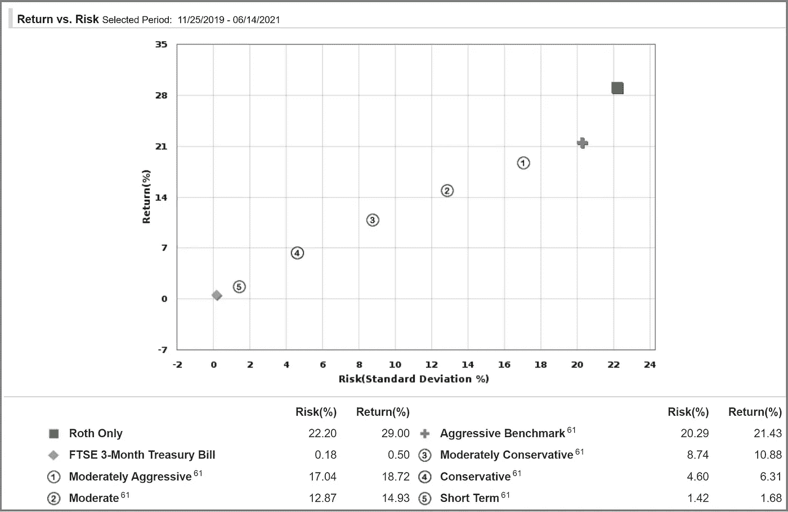*

***图 3。**查尔斯·施瓦布投资组合收益率工具。来源:沃克·佩恩*

*这张图是我自己的查尔斯·施瓦布·罗斯个人退休账户的截图，描绘了各种基准投资组合的风险和回报以及我自己的(绿色方块)。如果你想象一个基于基准投资组合的最佳拟合线性回归线，你可以看到我自己的会位于该线之上，表明它通过在给定风险水平下产生大于预期的回报而胜过了预测的风险回报关系。我的投资组合风险(和随后的回报)如此之高的原因是，我在这个账户中对 BTC(通过 GBTC)有很大的敞口。根据我们在**图 2** 中计算的数据，BTC 的风险敞口以我们预期的方式影响了我的投资组合——更高的风险，但更高的回报。*

*注意**图 1、图 2 和图 3** 是如何相互吻合的。**图 1** 显示的是理论有效前沿，**图 3** 显示的是该前沿的一个真实应用，**图 2** 只是我们自己计算的**图 3** 的一个子集。*

*本节的结论是，在给定的两年期内，BTC 是一种极其不稳定的资产。尽管如此，它确实提供了足够的回报来弥补风险。*

> *在我们继续之前，最后一个注意事项。我想强调的是，我把比特币和其他密码视为高度投机的资产。从给定的背景来看，这很难讲，但在任何给定的时间，我的比特币流动性净值从未超过 5%。根据我的配置，我的罗斯个人退休帐户被标为“极端激进”的投资组合，因为我想利用该帐户的税收优势。事实上，我的总投资组合(当你考虑我的罗斯个人退休帐户和我的应税投资账户时)要保守得多。*

# *将比特币加入你的投资组合会如何影响你的整体风险和回报状况？*

## *计算相关性*

*在讨论特定资产的风险时，要考虑的一个重要参数是它与投资组合其余部分的相关性。就像我们在现代投资组合理论中讨论的那样，你可以通过投资负相关的资产来降低整体投资组合的风险。那么，从逻辑上来说，我们会在图 3 中看到像我这样的投资组合中的正相关资产。为了验证这一点，我们可以使用熊猫**。corr()** 计算我们 3 个示例资产的相关矩阵的方法:*

*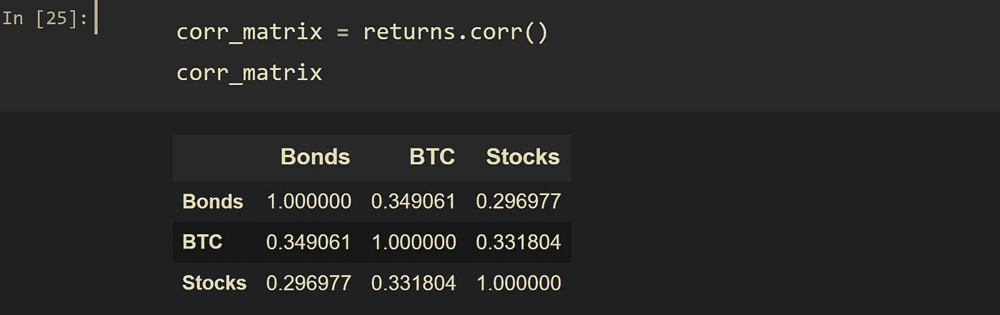*

*在此期间，比特币似乎与股票和债券都呈正相关。事实上，甚至股票和债券本身也是正相关的。主要观点是，这个投资组合在这段时间内承担了极高的风险，并且没有利用负相关风险缓解的概念。这一次对我来说效果不错，但本可以让*轻松地走上另一条路。**

## *夏普比率和蒙特卡罗模拟*

*我们要做的最后一项分析是，确定在此期间股票、债券和比特币之间的“理想”资产配置。为了确定这一点，我们将使用一个称为 [**夏普比率**](https://www.investopedia.com/terms/s/sharperatio.asp) 的指标，该指标用于在考虑投资风险的情况下，通过了解投资回报来比较资产。具体来说，它是“超过每单位波动性或总风险的无风险利率的平均回报。”**它描述了你因承担高风险资产的波动性而获得的超额回报。***

*为了找到这段时间内夏普比率最高的投资组合，我们将在股票、债券和比特币这三种资产之间模拟数千个权重不同的投资组合。例如，你可以有一个投资组合，其中 25%是债券，25%是股票，50%是比特币。或者一个 80%股票，10%债券，10%比特币。在这种情况下，**蒙特卡洛模拟只需生成数千个随机投资组合权重，以估计不同的可能风险与回报曲线。***

*以下代码片段演示了如何使用 Python 中的简单 for 循环创建此模拟:*

*演示金融投资组合风险和回报的蒙特卡罗模拟的代码片段。这段代码是从一个单独的帖子[这里](https://codingandfun.com/portfolio-risk-and-returns-python/)修改/改编而来的。*

*输出是一个有 5000 行的数据框架，每行是一个单独的投资组合，每个资产都有随机生成的权重，以及相关的回报、方差和夏普比率:*

*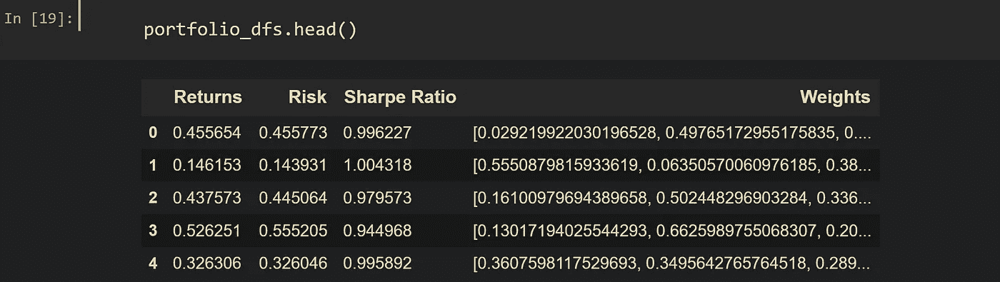*

*有了这个数据集，我们可以使用一些 Pandas DataFrame 操作来识别一些有趣的投资组合，如 **iloc()、idxmax()、idxmin()等。***

*例如，我们可以找到夏普比率最高的投资组合，并看到它的年化回报率为 23%，由 37%的债券、17%的比特币和 45%的股票组成:*

*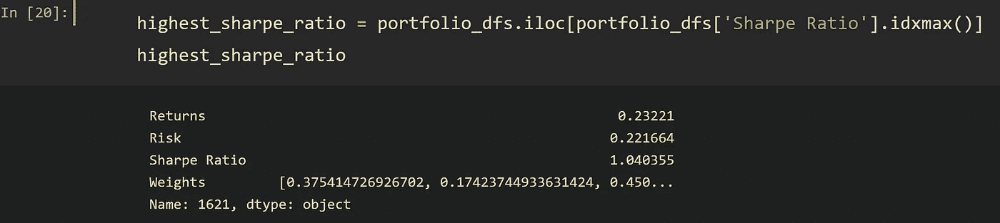*

*或者，我们可以找到风险最小的投资组合，有趣的是，它不是由 100%的债券组成，而是由大约 98%的债券、0.5%的比特币和 1.5%的股票组成:*

*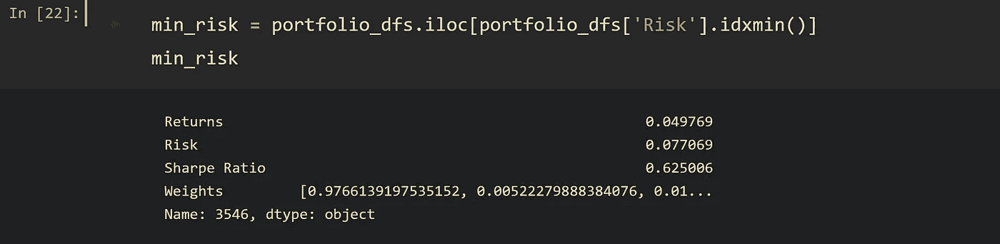*

*与上面的“最优”投资组合(夏普比率最高的投资组合)相比，存在另一个波动性接近 4 倍的配置:*

*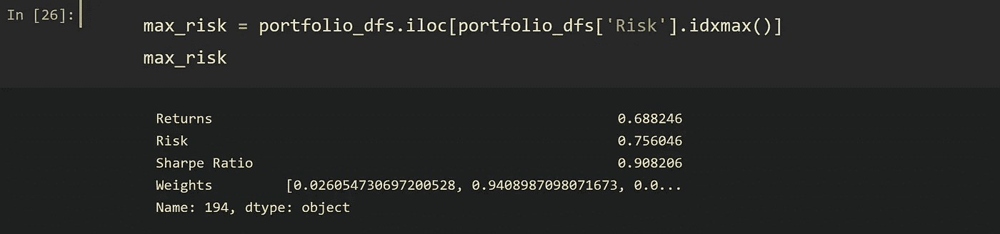*

*因此，比特币对投资组合的影响(*在这个特定时间段内)*是显而易见的——随着配置的增加，风险和回报也在增加。回顾一下我们之前的例子，平均年龄为 20 多岁，以下是两年期内由 80%股票和 20%债券组成的投资组合的价值:*

*   *年化回报率:17.5%*
*   *标准偏差:0.20*
*   *夏普比率:0.86*

*现在，如果我们决定在 BTC“玩”1000 美元(例如，通过从债券中获得一些配置)，我们将有大约 6.25%的配置(1000 美元/16000 美元)在比特币中，80%在股票中，13.75%在债券中:*

*   *年化回报率:22%*
*   *标准偏差:0.23*
*   *夏普比率:0.95*

*上述例子表明，通过将我们的一些原始投资组合转移到 BTC，我们实际上提高了我们的风险调整回报率，如夏普比率所示。这实际上与我最初的假设相反，为了科学起见，我将把它包括在内。但这是有道理的——在这特定的两年期间，BTC 的相对年化回报率足够高，值得承受波动性的增加。不过，还要注意的是，6%的比特币风险敞口会增加 15%的整体投资组合风险(0.20 至 0.23)。*

*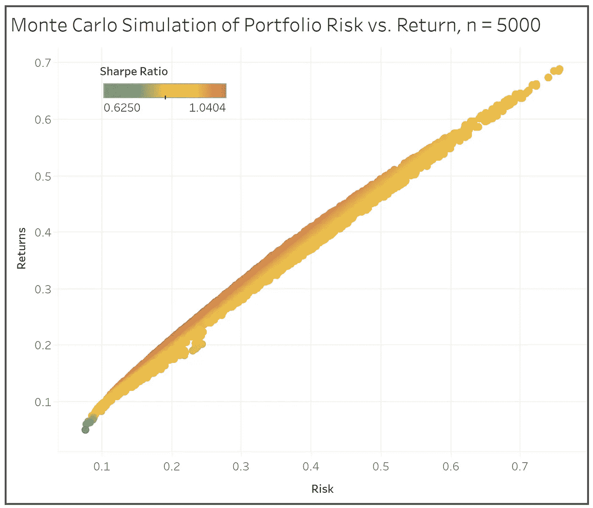*

***图 4** 。由股票、债券和比特币组成的 5000 个随机生成的投资组合的风险与回报图，用夏普比率着色。来源:沃克·佩恩*

***图 4** 显示了数据框架中的所有 5000 个投资组合，它们的风险与回报差，以及夏普比率分布。正如我们所料，夏普比率最高的投资组合位于有效边界的顶部。这是因为在给定的风险水平下，沿顶部边缘的投资组合代表着可能的最高回报。*

*有了这个框架，你现在可以对你想要的任何数量和组合的资产进行同样的模拟，看看对它们的投资会如何影响你的整体投资组合。*

# *结束了*

*总之，我们现在对现代投资组合理论和资产相关性对投资组合风险的重要性有了更好的理解。比特币在这里通常被用作加密货币的代理，它以不可思议的波动性为代价提供了巨大的回报。投资者(或者，在大多数情况下，投机者)在进入具有极高方差的资产时应该小心谨慎，并且不应该忽视所述方差对其整体投资组合的影响——即使是少量的风险暴露也可以显著改变投资组合的风险/回报状况。*

> *我希望你喜欢这篇文章。如果您有任何意见、问题、顾虑或更正(我肯定有很多)，请随时在下面提出。*