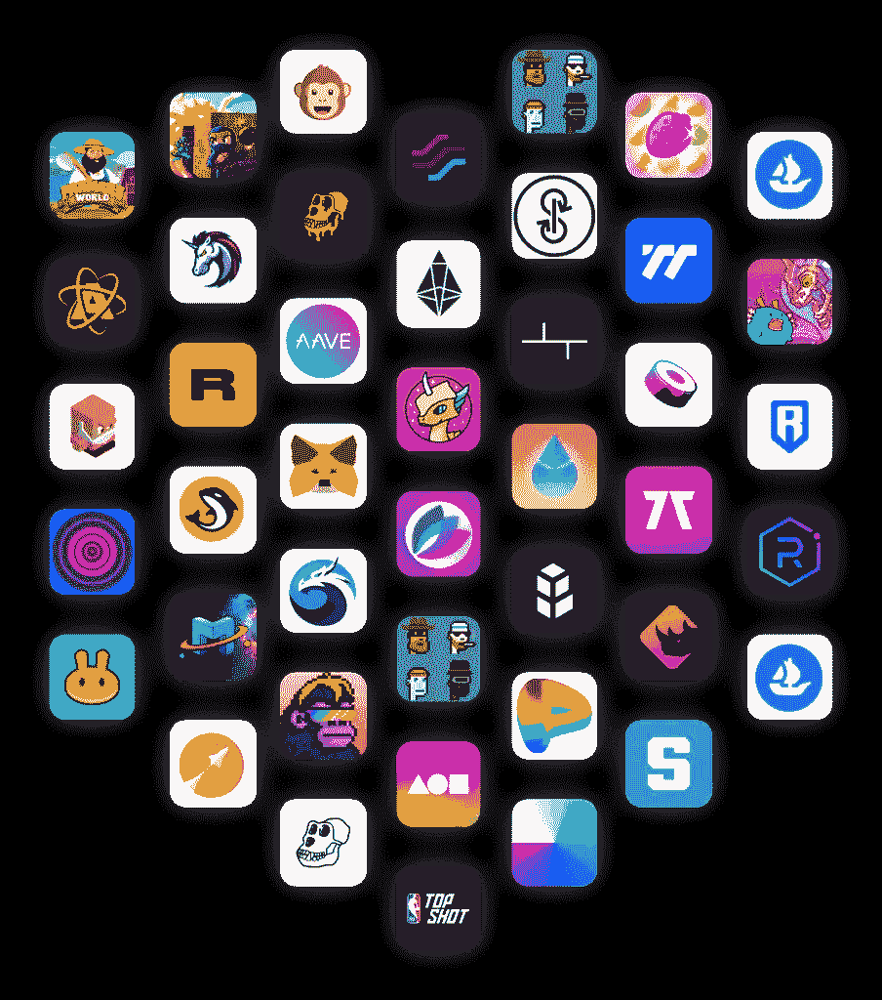

# 构建一个去中心化的应用程序需要多少成本(DApp)？有免费选项吗？

> 原文：<https://medium.com/codex/how-much-does-it-cost-to-build-a-decentralized-application-dapp-are-there-free-options-ac52428d05aa?source=collection_archive---------4----------------------->

区块链技术已经到来！它是现在和未来。

由于人们对加密货币和区块链技术的兴趣不断增加，我们每天都听到比特币、以太币、恒星币等加密货币价格上涨的消息。

虽然对区块链技术的巨大兴趣在很大程度上可以归因于加密货币，但还有许多其他应用程序建立在区块链技术上。

例如，以太坊是一项区块链技术，它为 Dapps(去中心化应用程序)、Defi(去中心化金融系统)、NFTs(不可替代令牌)、智能合同和其他数字应用程序等改变游戏规则的技术提供了动力。

区块链技术在当今世界被企业用来构建安全、经济高效的应用程序。像所有的申请一样，公司在进行区块链开发项目之前需要起草一份预算。

建造一个 DApp 要花多少钱？在这篇文章中找出这个问题的答案。

# **影响建造 DApp 成本的因素**

图片来源: [Bunzz 博客](https://blog.bunzz.dev/how-much-does-it-cost-to-build-a-dapp-are-there-free-options/)

## **1。涉及的开发人员的成本和类型？**

影响 DApp 开发成本的第一个因素是你选择开发 DApp 的方法。您可以选择雇佣自由软件开发人员来构建区块链应用程序，雇佣代理服务，或者使用内部开发团队来构建。

雇佣一个菜鸟自由开发人员的成本在 30，000 到 50，000 美元之间，但是雇佣一个专家区块链开发人员的成本在 50，000 到 90，000 美元之间。使用内部软件开发团队将花费 500，000 美元到 2，000，000 美元，这是由于雇佣和培训区块链应用程序开发人员的成本。

第三个选择是雇佣一个代理机构，这被认为是最好的选择，因为代理机构通常有很多构建类似于你的分散式应用程序的经验。

代理机构的规模决定了定价，我们可以将它们分为三类:大型代理机构、中型代理机构和小型代理机构。

小型机构最有可能刚刚起步，在选择项目时不会那么挑剔，因为他们希望将项目添加到他们的投资组合中。他们通常由 10 到 50 名开发人员组成一个团队，根据项目的复杂程度，费用在 5000 到 50000 美元之间。

中型机构在选择项目时更有选择性，因为他们通常有固定的工作。中型机构平均由 500 到 1000 名开发人员组成，在这里构建一个区块链应用程序的成本在 25，000 到 200，000 美元之间。

大型机构在选择建设项目时非常挑剔。他们通常有 3000 多名开发人员，成本从 45 万美元到 150 万美元不等。

## **2。应用的行业**

影响 DApp 成本的另一个重要因素是要构建的应用的行业。不同行业的需求是价格变化的原因。

例如，社交媒体行业的 DApp 需要高级别的身份认证和授权，而金融行业的 DApp 则需要更高级别的身份认证。因此，你在金融行业花在身份认证上的钱会比社交媒体行业多。

其他要考虑的变量包括:在每个给定时间与应用程序交互的用户数量以及行业合规性要求。下面显示了一些常见行业中 DApps 的不同成本:

1.  医疗保健费用在 5.5 万美元到 10 万美元以上
2.  社交媒体成本在 45-10 万美元以上
3.  公共部门成本在 7 万美元到 10 万美元以上
4.  金融业成本在 5 万到 10 万美元以上
5.  按需行业成本在 4 万美元到 8 万美元以上

## **3。要构建的应用程序的复杂性**

不同因素的组合决定了 DApp 的复杂性。这些因素包括:

***要用的平台* :** 无数的平台可以用来从头开始建造 DApp，以太坊是最受欢迎的。其他可以使用的平台包括 Ripple、NEO 和 OpenChain。最重要的是确保您选择的平台与 DApp 要创建的行业相兼容。

例如，虽然以太坊可以用于大多数行业的 DApp，但 Ripple 最适合用于金融行业的 DApp，而 OpenChain 最适合数字资产管理。

***共识机制*** :这是一个用于维护区块链的安全性和验证区块链内交易真实性的系统。大多数 DApps 使用三种最常见的共识算法之一:工作证明(PoW)、利益证明(PoS)和委托利益证明(DPoS)。

***技术栈* :** 技术栈是用于构建应用的编程语言、技术、工具和框架/库的组合。由 MongoDB、Express、ReactJs 和 NodeJs 组成的 MERN 栈是用于构建 web 应用程序的流行技术栈。当构建区块链应用程序时，情况完全不同，因此您需要确保选择正确的产品来实现有效的开发。

让我们来看看需要的一些主要技术:

## **API**

API 在区块链应用程序开发中主要用于身份验证、监控、处理智能合同、审计、创建密钥对和地址以及其他用例。虽然有开源 API 可供使用，但上一句中提到的用例需要定制的 API。

## **UI&UX/前端**

对于用户来说，UI/UX 设计可以说是 DApp 最重要的部分，因为这是他们看到的应用程序的一部分，也是他们直接与之交互的部分。因此，通过使用最好的现代技术，使应用程序的这一部分尽可能吸引用户是很重要的。

## **证明**

在构建整个区块链应用程序之前，应该有一个原型来展示该应用程序将具有的一些主要特性。

有两种方法可以做到这一点，要么使用 POC 方法，要么使用 MVP 方法。POC 意味着概念证明，而 MVP 意味着最小可行产品。建议走哪种 MVP 方式，这样可以展示 DApp 的主要特色。

# **结论**

构建 Dapp 需要巨大的努力和昂贵的过程。这需要仔细的计划和预算。事实上，有经验的区块链开发商并不多，这也是建造 DApp 非常昂贵的原因之一。其他原因包括将要建设的 DApp 及其产业的复杂性。

# 有其他选择吗？

既然我们知道构建 DApp 和其他区块链应用程序的成本有多高，现在的问题是:“有其他选择吗”？这就是 [Bunzz](http://bunzz.dev/) 的用武之地。

[Bunzz](http://bunzz.dev/) 是 Lastrust 开发的一款应用，帮助用户构建和部署 Dapps、智能合约、NFTs 以及其他基于区块链的应用，无需编写任何代码。

[Bunzz](http://bunzz.dev/) 让没有区块链专业知识和/或不了解任何区块链编程语言的用户有机会轻松构建基于区块链的应用程序，而无需任何代码。

使用 Bunzz 将大大降低建设 DApp 的成本，因为你不再需要花很多钱雇佣有经验的区块链开发者。

想知道用 Bunzz 造一个 DApp 要花多少钱吗？嗯，是免费的！尽快跳跃探索平台。

从这里开始使用 Bunzz 平台:[app.bunzz.dev/](http://app.bunzz.dev/)

欢迎加入我们的不和谐社区，寻求你可能需要的任何帮助:[https://discord.com/invite/rjfvZzDEaN](https://discord.com/invite/rjfvZzDEaN)

最初由 Babajide Oyafemi 于 [Bunzz](https://blog.bunzz.dev/how-much-does-it-cost-to-build-a-dapp-are-there-free-options/) 发布