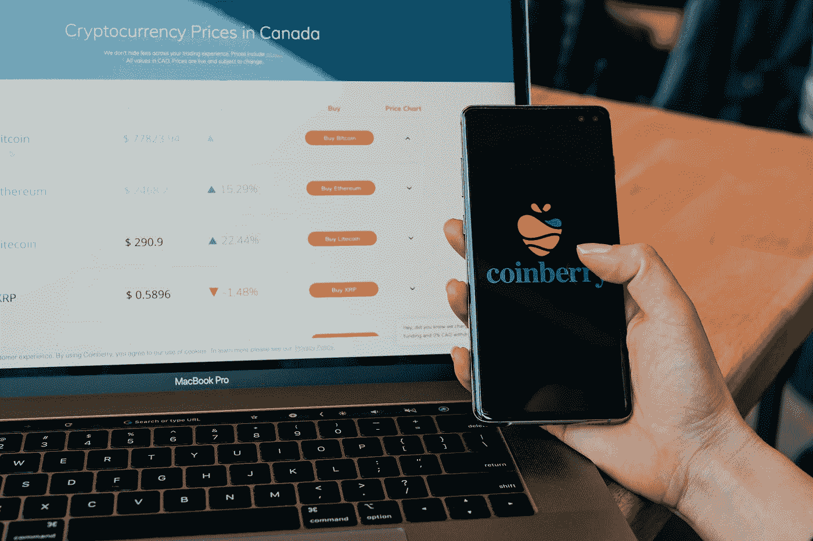

# 做一个炒股 App 要多少钱？

> 原文：<https://medium.com/codex/how-much-does-it-cost-to-build-a-stock-trading-app-97dbf0b9a40c?source=collection_archive---------34----------------------->

## 创建像 Robinhood、WeBull 这样的股票交易应用程序的成本

科技日报在 [Unsplash](https://unsplash.com?utm_source=medium&utm_medium=referral) 上拍摄的

## 股票交易应用程序开发成本明细

*   8500 美元的测试和质量保证
*   8000 美元的项目管理费用(占总预算的 12-15%)
*   30000 美元的交易应用开发成本
*   **股票交易应用程序的平均开发成本为 55，000 美元**

当股票经纪人依靠代理商进行交易时，他们似乎回到了过去。现在，交易只需点击几下鼠标。像其他基于应用的东西一样，交易应用也是趋势之一。股票交易应用程序为交易员提供了一个清晰有序的视角，让他们在不受任何第三方干预的情况下买卖股票。

交易员不能忽视 Robinhood 等股票交易应用提供的便利。股票交易平台从最初的几天就迅速吸引了所有人的眼球，并为用户提供了交易领域的最佳机会。

**什么是炒股 App？**

这是一个简单的股票买卖、管理和更新投资组合的在线平台。此外，交易员可以获得关于最佳交易策略的最佳知识，从而在金融科技行业获得最佳收益。自动股票交易应用程序使用户能够完全控制所有有助于更好交易选择的事情，适合长期和短期投资。

**股票交易应用的工作**

所有的交易应用程序都以同样的方式工作。用户必须创建一个应用程序帐户，并连接银行帐户。然后用户可以选择一次性转账或定期存款。现在用户可以很容易地买卖股票。交易应用上的所有交易功能对所有用户几乎都是免费的，但当涉及到一些特定功能时，用户需要付费。这些交易应用采用基于佣金的盈利策略。

## **让我们了解一下成功的交易 app 常用的变现策略？**

股票交易业务正在转向在线股票交易的移动应用程序，以提高年收入并获得额外利润。你想知道他们是如何通过交易应用享受巨额收入的吗？阅读下一页，了解流行的在线股票交易应用的赚钱策略。

**交易费用**

交易应用向在应用上成功交易的用户收取一定金额的费用。于是，交易平台自动从用户账户中扣除应收费金额来挣钱。

**应用内广告**

应用程序所有者可以在交易应用程序上显示保险公司或金融科技公司的广告，以使用户了解有关交易的事情。这些广告是可以跳过的。

**付费会员**

大多数功能对所有用户都是免费的。但是某些额外的和高级的选项对想要为这个设施付费的用户是开放的。付费会员是从交易应用中赚取高额利润的最有效的技术。而且，用户通过这个获得额外的收益。因此，对于用户和平台所有者来说，这是一个双赢的局面。

**产品销售**

该应用通过这种货币化方法提供不同的产品。产品清单包括共同基金、保险和许多其他东西。

**快速提醒**

用户可以通过支付一定费用的应用程序获得早期预警功能。这些提醒是关于在其他用户出现在应用程序之前销售产品。交易应用通过这种货币化方法赚了不少钱。

# **为什么要投资一款股票交易 App？**

股票交易应用程序是热门话题，因为这些应用程序提供免费交易，具有出色的功能，让交易市场的爱好者。这些应用是金融科技行业的热门应用之一。对金融行业交易应用的浓厚兴趣持续了一段时间。证据是，2019 年，安卓金融科技应用的渗透率为 12.75%。在这一年里，人们预计企业家们对金融交易市场的兴趣肯定会增加。

# 制作一个成功的股票交易应用程序需要具备哪些特征？

**便捷入住**

对于用户来说，签到过程应该简单易行，这样他们在开始与应用程序交互时就不会感到困扰。该应用程序应提供多种签到选项，如个人识别码，生物识别等。健壮和安全的登记方法为用户的详细信息和帐户提供了高度的安全性。

**配置文件创建**

在创建配置文件的过程中，必须为用户提供保存其详细信息和通知首选项的选项。同时，这也是一种有效的策略，允许用户以他们想要的方式借记他们的账户。

**正在交易的股票**

股票交易 app 最突出的特点就是高效投放和处理股票的功能。使用股票交易应用程序，用户应该能够执行股票订单并监控资金流。

**实时更新**

用户应该能够实时查看他们的投资组合，并准确了解他们在市场中的位置。在投资股市时，交易应用程序应该为他们提供最新的更新。该功能可以帮助股票交易者做出明智的投资。

**存款**

必须允许交易者尽快检查他们的存款状态。它能使他们检查他们的位置和获利的机会。

**推送通知**

在股票交易应用程序中集成推送通知功能可以在整个过程中保持用户的参与度。推送通知有助于用户了解他们的股票走势。此外，用户可以在方便的时候设置时间或关闭推送通知。

**分析学**

分析这些数据可以让你的股票交易投资策略产生巨大的变化。因此，交易者会喜欢有黄金机会看统计图表，以更好地了解股票市场和趋势。

**新闻提要**

为了让你的股票交易应用程序与众不同，你可以添加新闻订阅选项。关于股票投资的学习机会是新手交易者在你的平台上学习的好方法。他们可以了解最新的 IPO 细节、并购等。

**搜索选项**

除了上面提到的所有功能，如果用户不能搜索并找到他们想要的东西，一个交易应用就不可能成功。为此，必须提供高级搜索选项和过滤器，以便用户根据需要轻松搜索活跃股票。灵活的搜索使用户能够查看当前市场上的股票价格。

了解了股票交易应用程序的所有基本功能后，你就可以开始开发自己的应用程序了。你可以联系像我们这样最好的金融科技应用程序开发公司，他们知道所有要仔细遵循的小技术，以便为他们的客户提供最好的服务。

**股票交易 App 开发流程**

大多数公司都遵循敏捷方法进行金融科技应用开发。整个过程分为小模块和不同阶段，以顺利进行一切。下面是一步一步的开发过程:

**研究-** 在研究阶段，你需要分析市场上运行的成功股票交易应用背后的理念。为了构建一个理想的应用程序，你可以收集需求，包括所有相关的数据，如设计策略、功能、用户需求等。

**开发方法-** 平台、托管云服务、用于基本和非核心功能的第三方 API 以及其他关键工具都是开发人员需要考虑的因素。

**用户界面设计-** 用户界面是最先抓住用户眼球的东西。它应该很容易为所有级别的用户导航。应用程序设计师必须考虑各种功能，如随机振荡器、图形、折线图和条形图以及烛台。

**开发流程-** 这里有无数的板块:移动和 web，前端和后端，iOS 和 Android。开发人员使用高科技技术堆栈和工具来满足客户的需求。

**测试和交付:**到确定最佳性能，QA 工程师用多个设备对平台进行深度测试。要在市场上开发出完美的产品，需要正确的技术支持和故障排除。

# **搭建一个交易平台需要多少钱？**

要计算开发一个罗宾汉克隆应用的成本，必须考虑几个因素。通过充分理解这些元素，您将能够确定什么影响开发股票交易应用程序的成本。

下面是一个股票交易软件的费用明细，看看决定价格的因素有哪些。

# 影响股票交易应用程序成本的因素

**App 的设计**

交易程序的设计很简单。然而，他们确实采用了一些在其他类似的信息丰富的应用程序中找不到的微交互组件。这些因素增加了开发股票交易平台的成本。如果你想给你的用户留下印象，你应该包括推送提醒、图标和定制等功能。

一个聪明的设计会吸引人们更频繁地使用你的应用程序，并从长远来看防止他们放弃它。构建 Robinhood clone 应用程序的成本会很低，因为它比更复杂的设计功能需要更多的独创性。

## 后端和前端开发

交易程序是以简单明了的方式设计的。然而，它们确实使用了各种微交互元素，这些元素是其他信息丰富的应用程序所不具备的。这些变量提高了建立股票交易应用程序的成本。你还应该加入推送提醒、图标和个性化等功能，给你的用户留下印象。

如果设计得好，人们会更频繁地使用你的应用程序，从长远来看，他们不太可能放弃它。因为它比更先进的设计方面需要更多的创造性，所以开发一个应用程序的成本将是最小的。

## 测试

测试像 Robinhood 这样的应用程序是开发的一个关键阶段，因为该应用程序实时处理人们的资金，并对交易收取费用。在测试它的时候，你需要确保它在市场开放的时候工作良好，所有的 API 都正常运行，并且同步完美。

## 平台选择

一个股票交易应用程序最好能在 Android 和 iOS 上运行。因此，在各种平台上发布你的应用程序会提高股票交易应用程序的开发成本。最好从一个平台开始，然后一步一步来。这将有助于你一开始就省钱。一旦你的应用大受欢迎，你可以把它扩展到其他平台。

## 应用程序开发公司

你的股票交易应用程序的价格也将由你选择的应用程序开发业务决定。一个有信誉的 app 开发企业，在各个领域都有经验，可以提供专业的资源，打造高质量的服务。虽然这会增加开发费用，但服务质量不会受到影响，而且过程会明显加快。

**总预计成本**

解决方案的复杂性、其功能集和其他方面，如连接支付网关和云服务，都会影响开发成本。平均来说，制作一个本地移动应用需要 4 周到 12 周的时间。正如预期的那样，开发人员的时薪可能在 15-20 美元到 100 美元之间。

考虑到这一点，一个股票交易应用程序可能会花费您大约 25，000 美元到 60，000 美元。

> 平均来说，开发一个股票交易移动应用程序的总成本是 55，000 美元。

开发股票交易应用程序并不是一件容易的事情，因为它涉及到在正确的时间完成复杂的里程碑，以根据客户的业务需求按时交付功能丰富的产品。因此，选择一个技术娴熟、专注的开发团队，对于决定你打算何时像 Robinhood 一样推出自己的股票交易 app 至关重要。您可以联系我们的专家了解更多详情，并随时开始这一过程。我们很高兴和你一起工作！