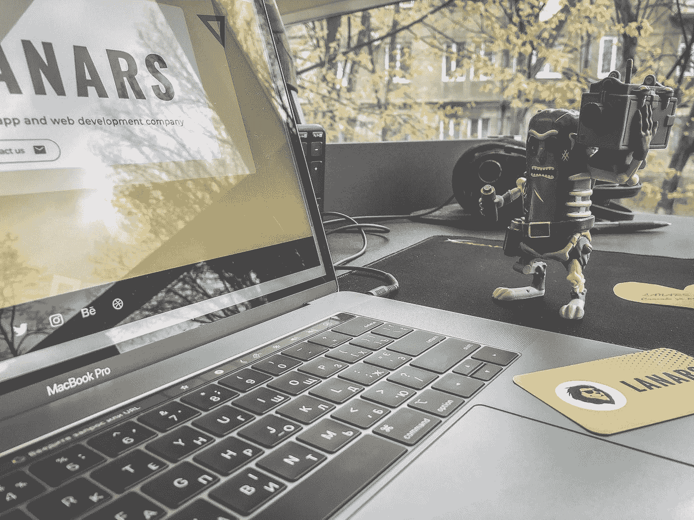

# 做一个 app 要多少钱？

> 原文：<https://medium.com/codex/how-much-does-it-cost-to-make-an-app-27fa7dfe2817?source=collection_archive---------17----------------------->

2019 年，如果你梦想成功的可持续商业，你需要在 App Store 和 Play Market 中寻找你的客户。全世界已经有 10 亿智能手机用户，他们中的大多数人每天花 [3 个小时](https://www.emarketer.com/content/mobile-time-spent-2018)与他们的设备联系。几乎所有的时间他们都在使用移动应用程序。

大多数成功的应用涵盖以下领域:游戏…