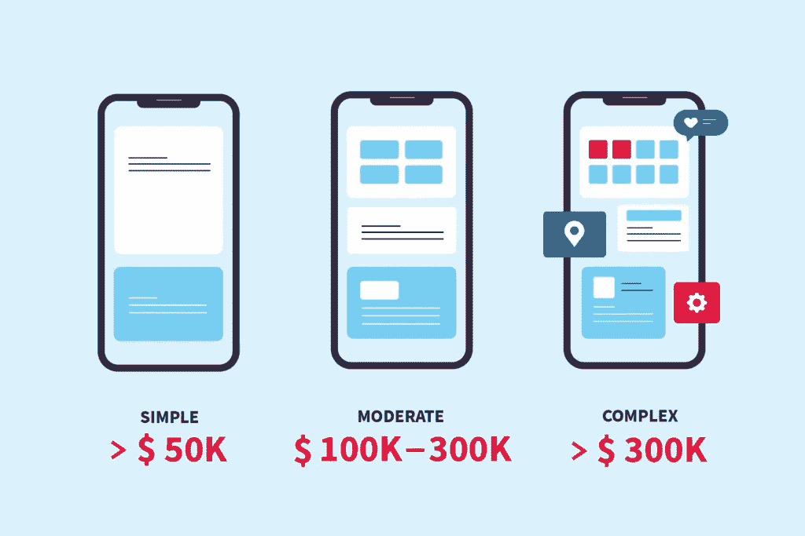
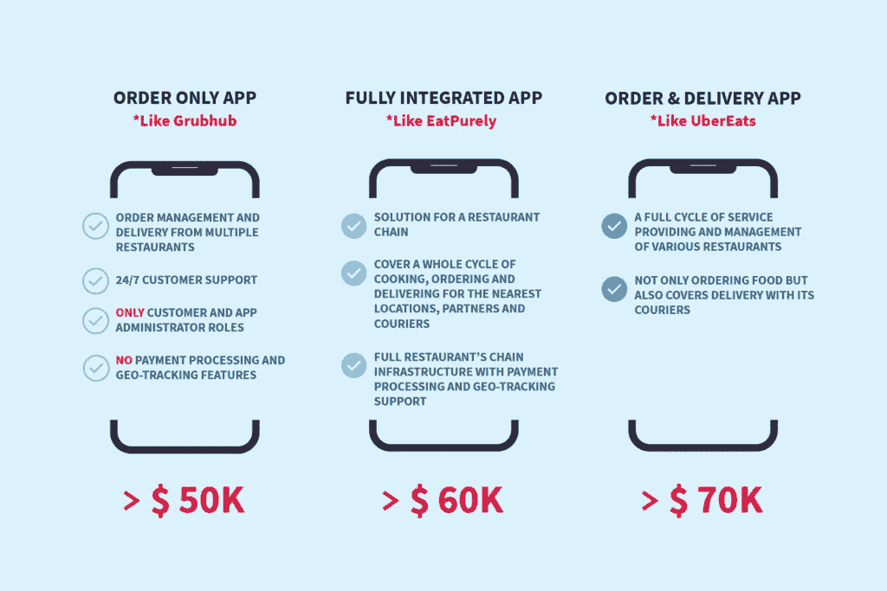
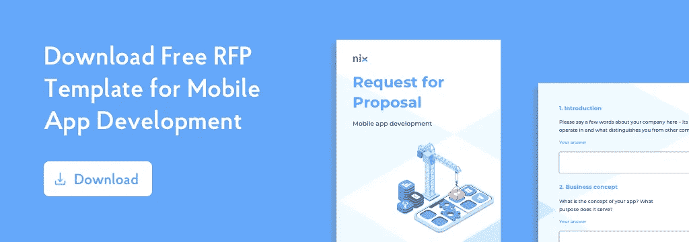
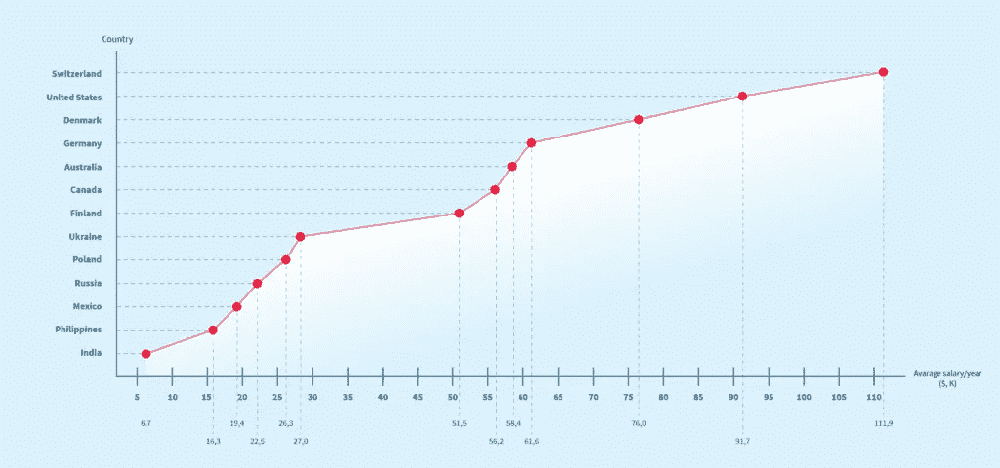

# 做一个 App 要多少钱？忙碌人群简明指南— NIX United

> 原文：<https://medium.com/codex/how-much-does-it-cost-to-make-an-app-brief-guide-for-busy-people-nix-united-b9345647a473?source=collection_archive---------8----------------------->

在我们的世界里，[总人口的 48.33%](https://www.bankmycell.com/blog/how-many-phones-are-in-the-world) 拥有智能手机。这个设备已经不仅仅是一个配件，而是我们生活中不可或缺的一部分。我们相互交流，订购食物和出租车，购物，学习，接受医疗服务，并经常通过移动应用程序完成工作。现代企业，无论规模大小，都已经使用或试图使用移动解决方案作为企业系统的一部分。在当前环境下，这是在特定市场保持竞争力的必备能力，而不是额外的能力。此外，许多公司仅围绕移动应用程序开展业务。

做一个 app 要多少钱？当涉及到在公司流程中开发和使用移动应用程序时，这个问题首先会出现在高层管理中。

这篇文章是由[认证的经验丰富的软件工程师](https://nix-united.com/industry-recognition/)为商务人士制作的压缩指南，里面充满了有用内容的链接。看完这些，你就会明白移动开发价格形成的原理，知道为什么一个 app 可能要 5 万美元，另一个要 15 万美元。还有一些透明而直接的建议，可以帮助您计划该应用程序的成本，从而满足您的业务需求。

1.  [影响价格标签的技术因素](https://nix-united.com/blog/how-much-does-it-cost-to-make-an-app-a-simple-answer-to-a-complex-question/#tech_factors_impact_price)
2.  [功能越多，成本越高](https://nix-united.com/blog/how-much-does-it-cost-to-make-an-app-a-simple-answer-to-a-complex-question/#features_cost)
3.  [为不同平台制作应用的成本](https://nix-united.com/blog/how-much-does-it-cost-to-make-an-app-a-simple-answer-to-a-complex-question/#cost_make_app_platforms)
4.  [成本如何取决于开发公司](https://nix-united.com/blog/how-much-does-it-cost-to-make-an-app-a-simple-answer-to-a-complex-question/#cost_depends_development_company)
5.  [移动应用开发中的隐性成本](https://nix-united.com/blog/how-much-does-it-cost-to-make-an-app-a-simple-answer-to-a-complex-question/#hidden_costs_mobile_app_development)
6.  [结论](https://nix-united.com/blog/how-much-does-it-cost-to-make-an-app-a-simple-answer-to-a-complex-question/#conclusion)

# 影响价格标签的技术因素

移动应用程序是一个复杂的产品，由许多组件组成。有许多因素和变量会影响应用程序开发的最终价格。为了清楚起见，我们将它们分成两大组进行分析。第一组包含与发动机罩下的东西直接相关的技术因素。有在开发中使用的特性、工具和技术，或者由 app 特性平台使用。第二组包含与服务提供商相关的因素:他们的资质、公司规模、位置等。让我们详细回顾一下它们，并确定它们对最终成本的影响程度。

与制作玩具相比，制作移动应用程序更容易。盒子里的元素越多，玩的花样越多，你要付出的代价就越高。根据同样的原理，制作一个应用程序的成本也会增加。

即使开发简单的移动应用程序也是一个多层次的过程。它通常包括以下阶段:业务分析、UI 和 UX 设计、代码编程、质量保证和项目管理。一些应用程序还可能需要实施额外的安全措施、后端和 API 开发，以便与外部系统集成。这些阶段的存在和工作范围直接影响项目的最终成本。

**忠告:**

当然，您可以通过绕过业务分析、测试、项目管理或其他乍一看似乎是补充性和不必要的服务来降低开发成本。但是，我们不建议这样做。记住:守财奴总是付两次钱。

# 功能越多，制作一个应用的成本就越高

在回答“我的企业做一个 app 要多少钱？”必须有严格的功能要求，以了解应用程序中应该配备什么功能。每个功能的部署都需要专家的帮助，即额外的支出。当每个按钮和功能处理特定的业务任务时，该解决方案具有成本效益。如果你想用白纸黑字画些东西，你不会买一盒彩色铅笔，因为除了一支，其他的都没用。

让我们看看几个食品配送应用程序，根据不同的功能集，估算一下每个应用程序的制作成本。

在我们的文章中有更多有用的见解[如何开发现代食品配送应用](https://nix-united.com/blog/how-to-develop-a-modern-food-delivery-app/)和[食品配送服务的隐藏成本——为什么你需要自己的应用](https://nix-united.com/blog/the-hidden-cost-of-food-delivery-services-why-you-need-your-own-app/)。

第二个方面是不同的特性需要不同的努力来实现。与使用自定义 API 和从头编写的功能的软件相比，仅基于本机组件和典型解决方案的应用程序需要更少的编码时间。例如，推送通知和视频通话的实施成本与具有多个权限级别的复杂实时数据分析能力有很大区别。

**忠告:**

为了准确地确定应用程序需要哪些功能来有效地覆盖您的所有业务任务，我们建议咨询合格的业务分析师。乍一看，自己确定关键特性列表似乎没有什么复杂的。尽管如此，专业人士从不同的角度看问题，并注意到你可能会忽略的重要的微妙之处。他们的经验和技能将帮助你包括所有必要的功能，不会忘记任何东西或添加不必要的东西，这是你必须支付的。

# 做一个不同平台的 App 要多少钱？

虽然 iOS 和 Android 的原生移动应用程序是使用完全不同的工具、技术和 SDK 构建的，但为每种应用程序制作一个移动应用程序所需的努力并没有太大的差异。然而，假设你计划在两个移动平台上使用该应用程序。在这种情况下，您将支付开发两个独立的应用程序，这将使整个产品的价格翻倍。另一种方法是使用跨平台技术，如 ReactNative 或 Flutter。在这种情况下，开发人员创建一个运行在 iOS 和 Android 上的单一代码库，从而大幅削减成本。

**一句忠告:**

尽管跨平台解决方案显著降低了制作应用程序的成本，但这并不是所有问题的解决方案，而且与本地开发相比还有缺点。远离所有的移动应用，建议并可以基于 Flutter、React Native 或其他跨平台技术进行构建。

要了解更多关于最流行的跨平台框架及其用例，请阅读我们的文章[为什么使用 React Native 进行移动应用开发](https://nix-united.com/blog/why-use-react-native-for-mobile-app-development/)和[什么是 Flutter 以及为什么使用 Flutter 进行应用开发](https://nix-united.com/blog/the-pros-and-cons-of-flutter-in-mobile-application-development/)。

# 制作一个 App 的成本如何取决于开发公司

正如我们在开头提到的，“做一个 app 要多少钱”这个问题的答案取决于两个支柱:应用程序的复杂性，它实现的功能，以及谁构建了应用程序。

如果你没有内部的移动开发者，你需要找到为你开发应用的专家。就本地软件开发公司、外包软件工程公司和自由职业者而言，有几个选项可供选择。每个变体都有相应的优点和缺点。

与大中型离岸和本地公司相比，雇佣自由职业者是创建应用程序最便宜的方式。然而，只有当它是一个具有基本功能的小型或简单的应用程序时，这才是一个合适的变体。

您已经知道，大型复杂的应用程序需要不同专家的参与，以涵盖所有开发方面，如设计、后端、测试等。一个自由职业者可以是一个万事通，但更有可能的是，你必须雇佣一些专家；因此，更多的管理负担将放在你的肩上。

# 一个 App 的制作成本是多少？:本地供应商与离岸公司

假设您创建了一个移动应用程序来提高业务绩效和利用新功能。在这种情况下，基本功能不太可能满足您的业务需求并获得理想的结果。你可能需要一个定制的，功能齐全的移动应用程序，由一个专家开发可能需要很长时间。在这种情况下，建议去专门创建一站式解决方案并涵盖开发过程所有方面的成熟软件开发公司。核心问题是在本地合同或外包公司之间。

我们的专家就如何外包应用开发并取得成功撰写了详细的指南。里面的总结回答了所有与软件开发外包相关的最常见的问题。

移动开发者的工资直接影响应用开发成本。我们来看看不同国家的 iOS 开发者收入如何:

基于 Glassdoor 和 Payscale 数据

鉴于世界各地经济发展的不同阶段，根据国家的不同，开发人员的年收入可能相差十倍。移动应用程序开发的价格与工资成比例增长。

要查看详细的研究，请参阅我们的文章[2020 年美国和全球 iOS 开发人员平均工资](https://nix-united.com/blog/average-ios-developer-salary-in-us-and-worldwide-2020/#salary_worldwide)

除了影响制作一个应用程序的成本的主要因素之外，还有几个方面对普通人来说可能并不明显。它们不是强制性的，你在你的 app 开发过程中可能不会面对；但是，我们不能忽视它们。所有这些都可以分为四组:功能服务(短信、推送通知、聊天机器人)、应用基础设施(服务器、cdn)和 IT 支持服务(应用更新、漏洞修复、新功能实现)。

# 功能服务

假设您希望您的应用程序向您的用户发送短信，通过推送通知或电子邮件进行通知，并使用聊天机器人与他们交流。在这种情况下，您需要订购提供此功能的特殊服务。许多通信平台提供这些服务，并提供集成到应用程序中的特殊 API。Twilio、MessageBird、Plivo、Infobit 和许多其他公司根据所需的功能和每月的消息数量提供不同的定价方案。

# 基础设施服务

这是关于应用程序托管的服务器、数据存储和应用程序可以利用的其他外部服务。最好的例子就是亚马逊 AWS、Azure 和谷歌云平台。这些云计算平台提供各种工具和服务，为应用程序配备高级特性和功能。其中有一些比较贵。除了计划应用程序开发预算之外，您还应该考虑它们的集成和定期支付使用费用。

# 信息技术支持服务

移动应用程序不是静态对象。它们需要不断的更新和新特性的实现。市场每天都在变化，保持步伐并实施创新解决方案以保持竞争力至关重要。另一种情况是，当你的预算有限，应用程序的第一个版本是 MVP，只有必要的主要功能，但你计划进一步开发其他功能。此外，移动平台、第三方工具和技术也在不断发展。一段时间后，如果没有重大更新，应用程序可能会过时和不可用。

# 结论

我们希望这篇文章能让所有希望回答“一个应用程序的制作成本是多少？”这个问题的人更清楚地了解这种情况现在，你知道了影响应用程序开发成本的主要因素，以及开发类似流行移动应用程序的粗略估计。

我们最后的建议是:每个移动应用都是独一无二的产品。只有合格的专家才能精确估计它们的开发成本。NIX 是一家软件开发公司，拥有 50 多名移动开发工程师，他们随时准备帮助您为任何业务领域创建移动应用程序。联系我们以获得关于构建高效移动解决方案的高质量支持和服务。

*原载于 2021 年 5 月 28 日 https://nix-united.com***。**