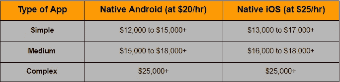

# 2022 年做一个 App 要多少钱？

> 原文：<https://medium.com/codex/how-much-does-it-cost-to-make-an-app-in-2021-9aadb3d68349?source=collection_archive---------2----------------------->

据预测，到 2023 年，移动应用行业的收入将达到 9320 亿美元，已经成为一个新兴的企业名称。你有没有想过计划为你的企业建立一个应用程序？

无论你是一个进步的创业公司，中小企业品牌，还是一个在市场上有着接地气地位的大企业，每个想创建高质量移动应用程序的人都会问同一个问题，开发一个应用程序要花多少钱？

老实说，有很多在线计算器可以用来得到大概的想法；但是他们会给你一个价格标签为 20，000 美元到 35，000 美元的评估，一个拥有无数功能的应用程序。拥有基本功能的小型应用程序价格在 1 万至 5 万美元左右。

在你被这些成本所迷惑之前，让我告诉你，这只是一个吸引你注意力的营销陷阱。你通过在线计算器得到的估算永远不会给你提供开发成本的明细。其次，如果你注意到了，为什么花费 20，000 美元和 35，000 美元之间有巨大的差距？

事实是，应用程序开发成本受各种因素和参数的影响。因此，要获得应用程序开发的真实估计，您需要密切了解每个因素是如何影响价格的。

好消息是，您不必去任何地方，因为我们已经在本文中涵盖了所有有助于您深入理解的主要因素。

> 因此，我们在这里讨论了:

*   ***全球范围内做一个 App 要多少钱？*** *-在阿联酋、迪拜、美国、印度等地建立应用程序的成本。*
*   ***打造一个 App 需要多长时间？*** *-基本
    -中等
    -复杂*
*   ***影响 App 开发成本的因素有哪些？*** *-按复杂度划分的应用开发成本
    -按平台(Android/iOS 或跨平台)划分的应用开发成本
    -按位置划分的应用开发成本
    -按开发阶段划分的应用开发成本
    (调研&规划、应用开发团队、设计 UX/UI、用户特性、后端和前端、应用测试、部署和发布、应用维护)*
*   ***知名创业公司花了多少钱？***

> 让我们深入了解每一点，以便更好地理解..

## **1。在地球上建一个 App 要多少钱？**

构建一个定制的移动应用需要多少成本？某离合器公司对全球领先的 [**移动应用开发公司**](https://www.xicom.ae/services/mobile-app-development/) 进行了一项调查，以了解移动应用开发的平均成本。它得出了令人惊讶的数据:

“应用程序开发的平均成本从 25，275 美元到 171，450 美元不等，但可能会攀升至 500，000 美元或更高”。

但现实是，计算出全球定制移动应用开发的成本是一项艰巨的任务。即使是专家[的调查报告](https://www.formotus.com/blog/figuring-the-costs-of-custom-mobile-business-app-development)也不会给你相同的答案。

> **让我们看看。**

*   VDC 对企业应用程序开发人员的调查发现，移动应用程序每个应用程序的平均成本为 14 万美元。
*   Kinvey 对首席信息官的调查发现，应用程序开发的平均价格将是每个应用程序 27 万美元。
*   一项 EMM 调查显示，超过 75%的企业在移动解决方案上的预算超过 25 万美元。

然而，在现实生活中，实际的应用程序开发与这些数字相差甚远。

*“为了帮助您了解应用程序开发的全球成本，我们将开发者的平均每小时成本定为 25 美元。一个基本的要花 25000 美元，中等复杂的要花 30000 美元，复杂的要花 50000 美元以上。”*

## **在阿联酋创建应用的平均成本**

但是，世界上有成千上万的软件开发公司，它们不仅声称自己是最好的，而且还确保交付优秀的解决方案。在你直接进入 [**雇佣一个应用开发者**](https://www.xicom.ae/solutions/hire-developers/) 的流程之前，有很多参数需要评估，包括一个历史悠久或最近成立的公司，经验丰富或较新，本地或国外，昂贵或便宜等等。通过评估这些参数来寻找和雇佣最好的技术团队，不仅对初创公司来说是困惑的，对创业者来说也是困惑的。

但最重要的是，企业中常见的神话是“好东西有昂贵的价格标签”，或者新兴公司没有足够的经验来提供高质量的产品。如果你也对应用程序开发成本进行了相同的无偏分析，那么看看开发应用程序的成本，它会随着开发者每小时的成本而发生很大的变化。

不同的地理位置提供不同的平均小时成本，这导致了应用程序在全球范围内的整体成本差异。

> **那么在全球范围内打造一个 app 需要多少成本呢？这是一个信息图表，这个快速的想法成本很高:**

“令人惊讶的是，价格最高的应用程序开发人员在北美，每小时 150 美元，而在印度，技术最好的开发人员的价格要便宜 7 倍。唯一的区别是，与美国相比，印度的开发商竞争最激烈，生活成本最低。”

## **2。做一个 App 需要多长时间？**

开发一个 app 需要多少时间？这是计算应用程序开发成本时要考虑的主要参数之一。但是，痛苦的事实是，开发一个应用程序没有标准时间，因为开发过程的每个阶段都需要不同的时间来完成，这取决于复杂性。

所以当开发一个应用程序时，它需要一个多星期，大量的研究和规划，沟通，开发周期，应用程序测试，应用程序部署等等。因此，根据专家的计算，调查显示开发时间取决于复杂性，可能是:

*   ***4 到 6 周，用于创建一个具有最少基本功能的简单应用程序。***
*   ***6 到 9 周，用于开发具有适当定制功能的复杂应用程序。***
*   ***10 个月以上，用于开发具有尖端功能的高级应用程序。***

对天数(8 小时)、周数和月数的粗略估计将进一步转换为小时数，然后用开发人员的每小时成本进行计算，以开发时间的观点来理解应用程序的最终成本。

## **3。影响 App 开发成本的因素有哪些？**

互联网上有成千上万的博客和文章声称 [**雇佣移动应用开发者**](https://www.xicom.ae/services/mobile-app-developers/) 并以 1 万到 2 万美元的价格开发你的应用。但事实是，有多少人真正用这个成本开发了自己的应用程序？

> 我确定没有人！

因为 app 开发没有固定成本。价格从几千美元到数百万美元不等。但基本的应用程序开发成本计算取决于应用程序开发人员每小时的成本。

根据对定制应用程序开发成本的调查反馈，我们发现全球不同的公司每小时收费在 10 美元到 150 美元之间，平均每小时 45 美元。

而对于高端应用程序开发解决方案，费率在每小时 12 美元到 200 美元之间，平均每小时 100 美元。总成本将取决于项目所需的技术开发人员数量以及他们在每个开发阶段投入的时间。

但是在您直接进入询问软件开发公司的过程之前，理解总成本将取决于几个因素是很重要的。定制的移动应用程序有各种规模、设计、实用性和功能，每个参数都需要大量的开发工作。而每一个都影响着 app 开发成本。

> 因此，让我们了解影响移动应用开发成本的重要参数:

*   **A)按复杂程度划分的应用开发成本**

应用程序的复杂性将直接影响应用程序开发的时间和成本。主要是，用户特征，应用程序功能，屏幕数量，设计的复杂性，后端，前端增加了应用程序的复杂性。随着每一层复杂性的增加，应用程序开发的时间、成本和工作量都在增加。

> 下面是对不同复杂程度的开发时间和成本的粗略估计:

*   **B)按平台(Android/iOS 或跨平台)划分的应用开发成本**

平台的选择在许多方面影响着应用程序开发的成本。为了让它明白，只要想一想，原生 Android 应用程序开发的成本会和混合应用程序一样吗？不要！

如果你打算为一个单一的平台开发一个应用程序，开发成本没有太大的区别。但如果你打算通过多个平台锁定用户，并决定为多个平台开发一款应用，你需要为每个平台付费。

所以在这里，在你 [**为任何特定平台雇佣应用开发者**](https://www.xicom.ae/solutions/hire-developers/) 之前，他们需要了解 Android 和 iOS 的市场份额、目标受众、各种设备、操作系统要求、应用服务和技术要求。每个平台的应用程序开发需要不同的编程语言，使用不同的工具和不同的 API。

**Android 或 iOS 原生应用:**它们基本上是针对特定的准则和设备硬件而开发的。要构建原生应用程序，你需要一种特定于平台的编程语言，而当你既需要原生 Android 又需要原生 iOS 时，这种编程语言是昂贵的。

> 以下是开发原生 iOS 和 Android 应用的粗略估计。

**混合应用:**相比之下，当你的目标是大量受众、跨平台可用性和快速上市时，混合应用可以节省 60%的开发成本。有许多领先的跨平台应用程序开发框架可以帮助您使用相同的代码库构建在各种设备上运行的多个应用程序。

> 以下是对不同框架选择的应用程序开发成本的粗略估计:

*   **C)各地区的应用开发成本**

最受欢迎的雇佣应用开发者的地方是美国、阿联酋、印度、加拿大、南美、英国、欧洲、澳大利亚、东南亚等等。但是开发者的时薪根据地理位置有很大的不同。因此，在计算应用程序开发成本时，将开发者的位置考虑在内很重要。

> 根据调查，这是一张地图，显示了不同国家每个平台开发人员的每小时成本。

显然，在 [**雇佣应用程序开发公司**](https://www.xicom.ae/services/mobile-app-development/) 时，美国应用程序开发人员的平均成本为每小时 100 至 150 美元，其次是加拿大，每小时 60 至 90 美元。

另一方面，每小时开发成本为 15 至 25 美元的印度和阿联酋似乎以廉价可靠的应用开发解决方案而闻名。

但是最重要的是，应用开发者的成本并不能保证你的应用开发质量。有时候便宜的 app 开发费用可能会帮你省钱，而昂贵的费用只是为了公司的名声。

*   **D)按开发阶段划分的应用开发成本**

当你决定创建一个应用程序时，你不能指望你的软件开发公司通知你每个阶段将获得的开发成本明细。他们只是先分析你的需求，然后给你提供项目评估。但可以肯定的是，在他们给你报价之前，他们会估计每个开发阶段需要的时间。

> 下面是主要影响应用程序开发成本的开发阶段的成本和时间明细:

**i)项目策划与研究:**大多数公司往往忽略了开发的这个阶段，直接奔向 [**雇佣一个 app 开发者团队**](https://www.xicom.ae/services/mobile-app-development/) 。但事实是，规划和研究将帮助你以更好的方式概述项目，并为你的项目确定新的机会。

> **计划阶段必须包括:**

*   市场研究和商业分析
*   确定项目需求
*   定义项目的范围
*   决定应用程序的功能和目标
*   决定项目所需的技术组合
*   为项目规划时间和预算

那么定义项目策略需要多少时间呢？通常，应用程序的规划和研究需要 30 到 80 个小时，根据应用程序的复杂程度，可能需要 250 个小时。但是规划阶段可以为客户和开发团队提供文档完整的指南，帮助他们完成开发阶段。

**ii)设计应用程序的开发成本:**要让你的应用程序看起来吸引人，设计得好很重要。因此，大多数开发公司都致力于设计和用户体验。

> **应用内，UI/UX 设计更多的是应用的呈现，包括:**

*   用户研究和分析
*   信息架构
*   应用导航
*   金属丝框架
*   徽标、图标、颜色
*   渲染设计
*   应用程序界面
*   原型

应用程序开发的这一阶段将需要 36 到 70 个小时，如果是复杂的应用程序，可能需要 300 个小时。对于高度用户优化的设计，创建这一阶段应用程序的费用将在 2000 美元至 10000 美元之间。

**iii)开发用户功能的成本:**如上所述，app 的复杂程度将决定开发 app 功能所需的时间和成本。虽然用户功能在很大程度上增加了应用程序的复杂性和成本，但在决定开发一组功能之前，没有明确的答案。

为了了解开发成本，应用程序制造商被要求大致提供开发三组用户功能所需的时间——简单、复杂和高级。

> **下面是每套 app 的用户特征、时间和成本的分叉:**

**iv)开发后端和前端的成本:**后端和前端是 app 的心脏和灵魂。它们是商业应用成功的最决定性因素之一。为了让你的商业应用平稳运行，你需要一个管理面板来帮助你监控活动、盈利策略或服务。

> 因此，这里是对管理功能，成本和开发时间的粗略估计。

现在来看应用的后端和前端。无论你开发了一个多么优秀的应用程序，如果它有一个薄弱的后端，那将是一个巨大的失败，反之亦然。为了简单起见，你需要 [**雇用一名后端/前端开发人员**](https://www.xicom.ae/services/mobile-app-developers/) ，这可能会花费你 25 美元/小时到 35 美元/小时，对于高端应用程序，这一费用会高达 100 美元/小时。

**v)应用程序测试的成本**

应用程序的严格测试将确保移动应用程序的质量，并确保其顺利运行。应用程序测试可以给用户带来无缝的应用程序体验，没有 UI 墙、错误、崩溃或任何其他问题。

为了测试你的应用，你需要雇佣一个应用保证工程师，让你的应用在多种设备上运行，以确定错误的范围。所需的时间和成本取决于测试程序的类型、应用程序的目的、复杂性和屏幕数量。

> **手机 app 的主要测试包括:**

*   质量保证
*   用户体验测试
*   功能测试
*   性能试验
*   安全测试
*   设备和平台测试

对于简单的应用程序，一些基本的测试运行就足够了，并且可以在更短的时间内完成。复杂和高级应用程序需要多次测试，因为它们具有高级功能。

**VI)App 部署的成本:**将一个 App 发布到 app store，如果是按照 app store 的指引开发的，通常需要的时间最少。所以这是一个关键时刻，必须留给 [**移动应用开发公司**](https://www.xicom.ae/services/mobile-app-development/) 。

如果你认为发布你的应用程序很简单，那么你可能错了。它的流程非常详细，需要大量关于应用程序的信息，这些信息直接影响应用程序部署的成功。

通常，苹果应用商店收取 99 美元的标准年费，而谷歌 play 商店收取 25 美元的一次性开发者费用来发布一个移动应用。但除了将应用上传到商店，还有很多优化和管理工作要做。因此开发人员通常需要 8 到 50 个小时来满足这些需求。因此，应用程序的平均部署成本可能在 200 美元到 550 美元之间。

**VII)App 维护和支持成本:**你的工作还没有结束！即使是最优秀的应用程序也需要持续的支持和维护，才能顺利运行并确保出色的用户体验。

> **支持和维护活动可能包括:**

*   基础设施和第三方 API 费用
*   继续修复错误和应用程序更新
*   代码优化
*   故障排除
*   开发新功能
*   更新为最新的操作系统版本
*   应用稳定性和性能

通常情况下，手机 app 开发公司平均每年收取 25%的开发费用。

## **4。知名创业公司花了多少钱？**

如果你只是回到几年前，你会发布像优步，Instagram，脸书，Whatsapp，Talabat，亚马逊这样的应用程序，Postmates 已经迅速占领了世界，并成为新兴企业的最大灵感。

因此，应用程序开发公司每天都会收到潜在客户的许多问题,“开发一个像优步这样的应用程序到底要花多少钱?”或者建立一个像 Instagram 这样的社交媒体应用程序需要多少成本？”。

在这里，回答这些问题似乎很简单，但实际上，它们并不简单，因为这些应用程序是由高级功能和复杂的架构组成的。

> 因此，让我们带您浏览一下世界著名的应用程序示例，并比较一下大概的应用程序开发成本。

*   Instagram 最初的开发成本是单个平台 5 万美元左右。
*   优步筹集了 25 万美元以上的收入，最初投资了 6 万美元用于应用程序开发。
*   WhatsApp 最初的 iOS 版本售价为 4.5 万美元。
*   Postmates 在种子阶段筹集了 75 万多美元。
*   Snapchat 有一个大型社交媒体网络，2012 年筹集了 48.5 万美元，这对于今天超过 30 亿美元的资金来说只是沧海一粟。

这些都是基于开发人员每小时平均成本和实际开发时间的预算。

如果你的创业商业模式也在某种程度上类似于这些流行的应用程序，那么你需要向技术专家提出疑问，他们有最好的替代方案来帮助你获得应用程序，并使你获得数百万的收入。

# **总结**

在这篇博客的结尾，你肯定对一个应用程序的开发成本是如何计算的有了深刻的理解。上述数据和见解是粗略的估计，但非常接近现实生活中的统计数据。如果你打算聘请一家 [**手机 app 开发公司**](https://www.xicom.ae/services/mobile-app-development/) ，那么这些制作一个 app 的成本和时间估算真的会帮助你了解整个流程。事实上，我们的指南不仅提供了应用程序开发预算的真实明细，还帮助您挑选适合您业务需求的技术专家。

因此，如果您对开发一个应用程序的成本有任何疑问，无论它是基本的、中等的还是复杂的，您都可以 [**与我们**](https://www.xicom.ae/contact/) 联系，让我们的业务分析师为您提供最佳的成本估算和解决方案。