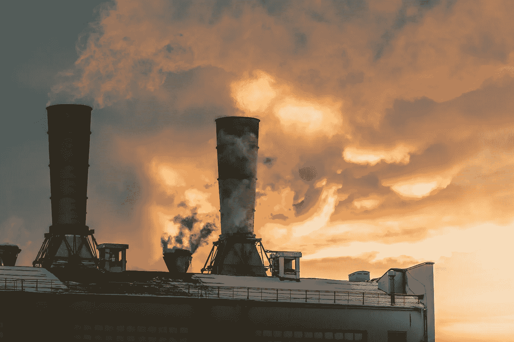

# 科技能抹去多少污染？

> 原文：<https://medium.com/codex/how-much-pollution-can-technology-erase-2cf3ca29838b?source=collection_archive---------10----------------------->

## [法典](https://medium.com/codex)

## 这需要多长时间才能有所改变？

照片由[维塔利·弗拉索夫](https://www.pexels.com/@ihasdslr?utm_content=attributionCopyText&utm_medium=referral&utm_source=pexels)从[派克斯](https://www.pexels.com/photo/low-angle-photography-of-building-1737779/?utm_content=attributionCopyText&utm_medium=referral&utm_source=pexels)拍摄

在过去的几十年里，污染一直在稳步增长，并且逐年恶化，这对任何人来说都不应该感到惊讶。最重要的是，污染增长的速度不会很快放缓。