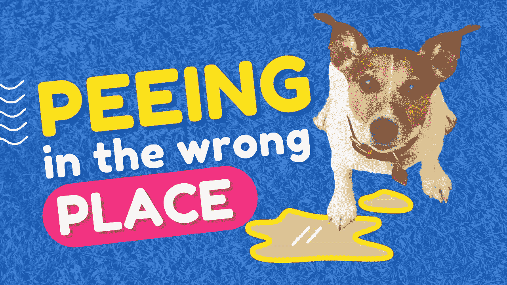

# 除非你想被解雇，否则如何做一个开发人员

> 原文：<https://medium.com/codex/how-not-to-act-as-a-freelancer-unless-you-want-to-be-resigned-f49a6f8100cd?source=collection_archive---------9----------------------->

## 我是一场闹剧的目击者。请永远不要模仿这种行为

图片由[作者](http://www.arnoldcode.com)经由 Canva.com 制作

自由职业就是引入你的专业知识。如果你没有这方面的专业知识，至少要带着真诚，关心，和对主题的兴趣。

这些价值观正是公司雇佣自由职业者时所需要的。他们需要…