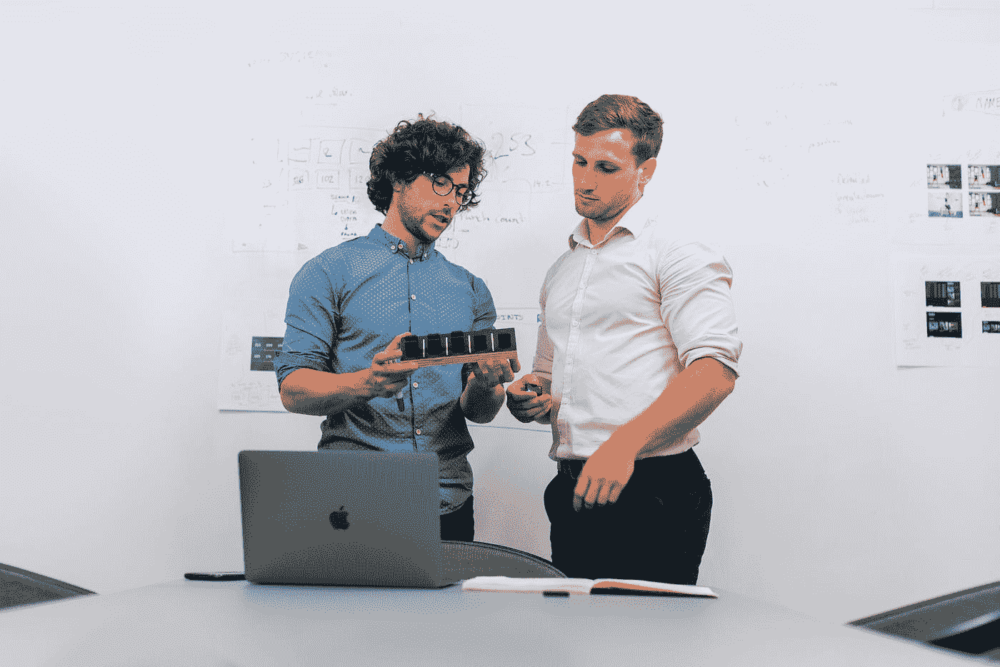

# 我们的学长如何甜言蜜语地让我们认为编程并不难

> 原文：<https://medium.com/codex/how-our-senior-sweet-talk-us-into-thinking-programming-isnt-hard-c95c5ecf4a95?source=collection_archive---------15----------------------->

## 而且一直都有效。

在 [Unsplash](https://unsplash.com?utm_source=medium&utm_medium=referral) 上拍摄的 [ThisisEngineering RAEng](https://unsplash.com/@thisisengineering?utm_source=medium&utm_medium=referral)

有趣的是，高级程序员有时表现得好像他们知道编程中的一切。一种常见的情况是，他们用甜言蜜语让我们认为编程并不复杂。这是他们的专长之一。令人惊讶的是，每当他们说以下内容时，每个人都同意他们的观点: