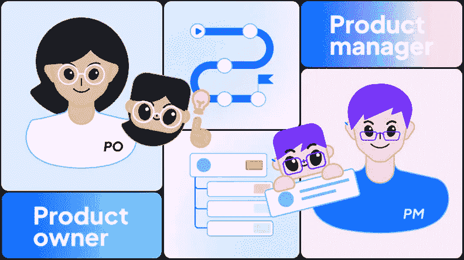
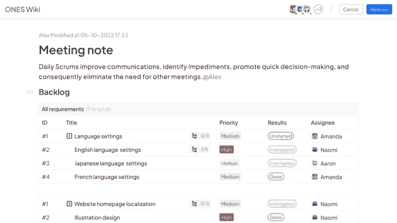
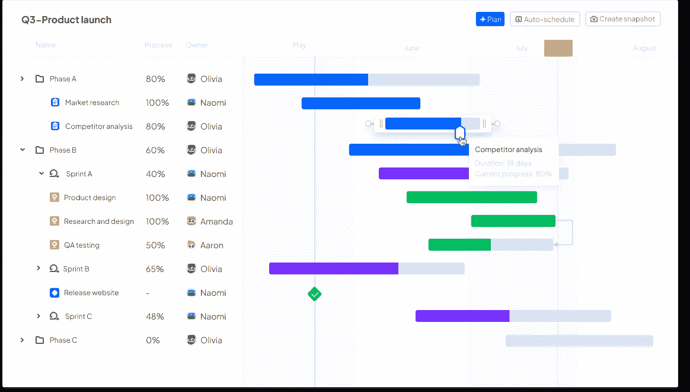
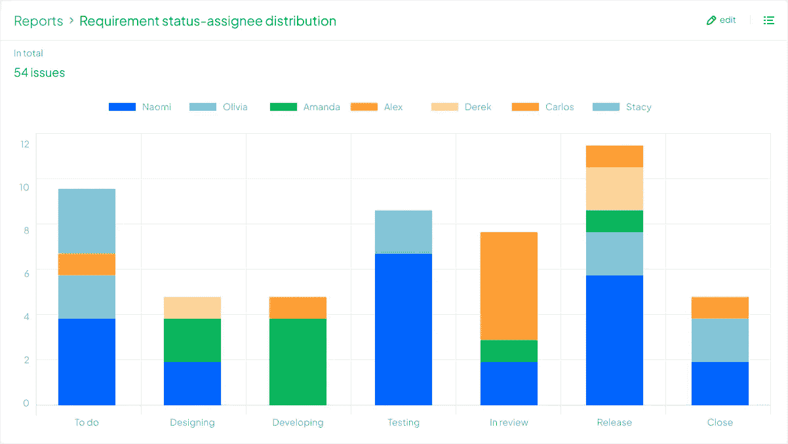

# PO 和 PM 在开发团队中是如何定位的？

> 原文：<https://medium.com/codex/how-po-and-pm-are-positioned-in-a-development-team-4dd6f575d49f?source=collection_archive---------18----------------------->

Scrum 是一个框架，用于需求和内部/外部环境快速变化的场景，并且需要快速交付。根据“第 14 届敏捷年度报告”, 75%的被调查者实践 Scrum 或者一种融合了 Scrum 的混合技术。然而，大多数公司没有**产品负责人(PO)** ，或者认为 PO 相当于敏捷团队中的**产品经理(PM)** ，设立 PM 只是作为 PO 的替代品。

那么 PO 等同于 PM 吗？它们之间有什么区别？这两个角色在开发团队中是如何定位的？

# 理解角色的职责，创建一个优秀的团队

在快速和迭代的软件开发中，一个标准的团队应该同时拥有 POs 和 pm。

## 什么是产品负责人？

源自 Scrum， **PO 主要负责“产品价值最大化”**。

A **产品负责人(PO)** 应确定:

作为产品的首席执行官，PO 领导利益相关者

*   产品的发展方向和愿景
*   定义内容
*   优先
*   产品发布的交付日期
*   对产品的投资回报率负责

**产品构想**、**产品建模**、**多维度实现产品价值**，包括运营、数据、市场。

## 什么是产品经理？

**PM** 是 IT 行业最常见的角色，最终负责“**向市场**交付好的产品”。

是产品战略和计划(PM)的主要制定者，重点关注:

*   了解用户需求
*   将产品概念转化为可用的功能
*   在产品的整个生命周期中管理产品
*   确定**目标客户及其需求**
*   完成**产品需求文件**，原型和流程图
*   写出详细的产品性能要求
*   最终确定实施计划

项目经理应该确保高质量、高效率地发布产品。

采购订单和项目管理对企业来说都是不可或缺的。只有明确职责，保证一致的团队角色分配，才能打造优秀的产品团队，提高工作效率。

以下技巧可以帮助销售点和销售经理从零开始高效合作，不断向市场提供高价值产品。

## 高效协作，交付高价值产品

**提示 1。分享知识库并不断探索**

在产品开发的早期阶段，人员创建一个可行的计划。**产品负责人**对产品待办事项列表中的故事进行优先级排序，**产品经理**基于对 PO 需求的理解阐明故事的细节，将需求转化为产品可交付成果，并与架构师、开发人员、测试人员和运营**进行讨论。在此过程中，PO 和 PM 需要共同构建知识库，并同步项目文档和知识。**

[**ONES Wiki**](https://ones.com/products/wiki) 使 POs 和 pm 能够创建用户故事，描述产品的功能架构、市场背景、用户需求、版本管理和计划，并通过在线评论快速反馈。ONES Wiki 还可以与 [ONES Project](https://ones.com/products/project) 中的项目链接，允许用户将问题表插入页面，快速匹配需求和文档，提高开发管理效率。

**提示 2。建立协作平台，快速交付产品**

在产品开发期间，**产品负责人**可能会更改需求，以符合战略目标或客户需求。为了避免延迟，PO 和 PM 需要建立一个协作平台，v **实现开发进度**，并且**尽早识别和控制影响项目进度的风险**，实现从故事创作到最终交付的全过程管理。

有了 [ONES 项目](https://ones.com/products/project)，团队可以创建项目里程碑，监控项目进度，并确保整体项目目标的实现。

**提示 3。为持续改进进行项目回顾**

项目完成后，在适当的时候，与**产品负责人**和**产品经理**以及团队成员一起从不同的角度进行项目回顾，总结经验教训，不断改进开发过程，实现闭环开发管理。

通过提供 [**质量报告**](https://ones.com/products/testcase) 和**各种数据报告**，ONES.com 帮助团队分析项目中遇到的问题，获得经验，并为未来的改进制定计划。

# 结论

总而言之， [**开发管理**](https://ones.com/) 是一个复杂的过程，需要 POs 和 pm 之间的协作来确保稳定的开发节奏和业务进度。

**ONES.com 开发管理**解决方案支持整个流程，以促进包括 POs、pm、开发人员、测试人员和运营人员在内的角色之间的协作，从而提高生产力、保证产品质量和加快产品发布。

*原载于 2022 年 10 月 27 日 https://blog.ones.com**[*。*](https://blog.ones.com/product-owner-vs-product-manager)*