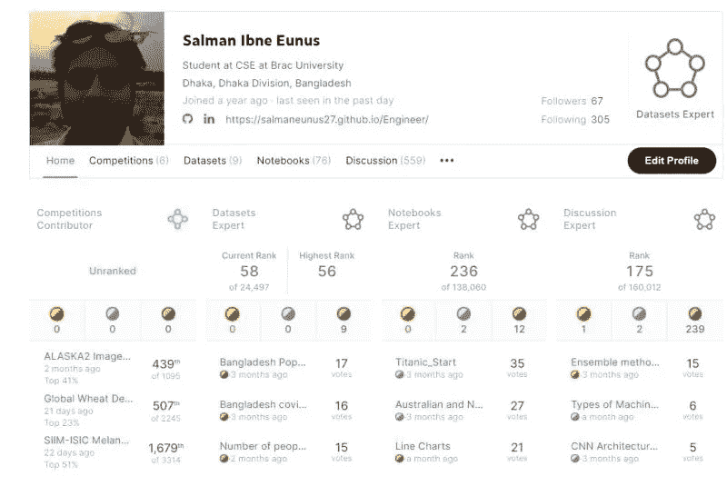

# Quarantine 如何将我带入数据科学，以及我如何成为 Kaggle 3x 专家。

> 原文：<https://medium.com/codex/how-quarantine-brought-me-into-data-science-and-kaggle-6e948e356399?source=collection_archive---------0----------------------->

这一切都是从封锁开始的时候开始的，那时我终于有足够的时间去做我很久以来真正想做的事情。我在为我本科最后一年的研究工作寻找深入学习机器学习的资源。我也开始看 Andrew NG 的斯坦福机器学习课程的视频。当时对机器学习和人工智能只有一些基本的概念。我所在的大学也提供了在 Coursera 上免费学习课程的机会。我一直想在 Coursera 上学习一些课程，但在封锁之前，因为学习和其他许多事情正在进行，所以不可能全神贯注。封锁一开始，我就决定花大部分时间在 Coursera 上看机器学习视频。另一方面，我也经常分心，花一些时间看其他 CS 的东西和教程。

> ***一开始我在尝试软件开发，看了 web 开发、Android studio、Unity、Javasrcipt、Nodejs、bootstrap 等视频教程，但随着时间的推移，我转向了数据科学，仿佛被某种神奇的力量拉走了，最终似乎将所有的点连接起来。***

有一天，我看到了一份 IBM 的简短指南，其中讨论了机器学习及其算法的基础知识，以及数据科学和分析如何用于商业场景。这本指南引起了我的注意，因为我参与了一家机器人和人工智能初创公司，我认为我可能能够实现机器学习和数据科学，以改善初创公司的业务。因此，我通读了朱迪思·赫维茨和丹尼尔·基尔希的《傻瓜机器学习》一书。我在一两天内完成了 75 页的整个指南，其中谈到了机器学习和机器学习算法的基本概念，并给出了一些关于如何在实际生活中实现它的想法。在书的最后，它提供了一些最著名的学习数据科学和机器学习的在线资源的名称。该列表包括一些令人惊叹的资源，如——Medium:Inside Machine Learning，CognitiveClass.ai，Coursera，Udacity，当然还有 Kaggle。

> ***我突然觉得“***[***Kaggle***](https://www.kaggle.com/)***”这个名字在我脑海里响了一阵。我记得一年前，我参加了 Brac 大学*** [**的一个机器学习入门研讨会，在那里我听到了这个名字，并在没有任何想法或知识的情况下创建了一个帐户。**](http://www.bracu.ac.bd)

所以，我在谷歌上搜索这个名字，找到了我的账户，但仍然不知道该怎么处理它。当时我正在 Coursera 上做另一门课，名为“[Google 如何做机器学习](https://www.coursera.org/learn/google-machine-learning)”，是 Google Cloud 培训团队做的。这门课程帮助我掌握了基本的机器学习概念，并且较少关注编码。完成这门课程后，我觉得在深入学习机器学习编程之前，我需要复习一下基本的 Python 技能。所以我找到了密执安大学的一堆课程，题目是“面向所有人的[编程(Python 入门)】](https://www.coursera.org/learn/python)和查尔斯·拉塞尔·塞弗兰的 [Python 数据结构](https://www.coursera.org/learn/python-data)。这两个课程真的极大地帮助我提高了我的 Python 技能。

在封锁初期，许多在线平台免费提供一些精彩的课程。所以我也从 datacamp 学习了 R 入门课程。与此同时，很巧的是，我在 LinkedIn 上看到了 Abhishek Thakur 的简介，他当时是世界上第一位 Kaggle 3x 级大师，现在是 4x 级大师。我还在 YouTube 上看到了 Kaggle 在成为 3x 特级大师后对他的采访。我看了整个采访，他是如何取得如此伟大成就的故事给了我很多启发。这个视频让我对 Kaggle 有了一个想法，我开始在谷歌上搜索如何开始我的 Kaggle 之旅，发现 Kaggle 提供了一些基本的 [Kaggle 课程](https://www.kaggle.com/learn/overview)，它们将指导我如何快速开始。这可能是我进入一个令人惊叹的数据世界的旅程的开始。

我在 kaggle 上做的第一个迷你课程是一个介绍性的[机器学习](https://www.kaggle.com/learn/intro-to-machine-learning)课程，但我喜欢它的一点是，它为我提供了实现机器学习模型基础知识的实践，如决策树和随机森林，也为我提供了如何开始我作为 kaggler 之旅的想法。于是，我开始在 Kaggle 和 Coursera 上同时做机器学习和数据科学的课程。那时我的学习曲线相当高，因为我除了专注于数据科学之外无事可做。当时我在 Coursera 上参加了另一个由密歇根大学举办的[课程](https://www.kaggle.com/learn/intro-to-machine-learning)，这让我对数据科学和分析的世界有了更广泛的了解。

我很快就适应了基本的机器学习思想，并将我的注意力转向获得一些关于深度学习和神经网络的见解，一如既往地，吴恩达是救世主！[来自吴恩达的神经网络和深度学习](https://www.coursera.org/account/accomplishments/verify/G8PYDSJXR4E7)课程给了我一个关于神经网络基础知识以及神经网络如何用于计算机视觉场景的具体想法。吴君如的独特品质之一是能够以简单易懂的方式解释复杂的概念。然后我在 kaggle 上做了更多的课程，比如——中间机器学习、数据可视化、深度学习、熊猫数据操纵等。在接下来的两个月里，我的数据科学和数据处理技能变得前所未有的强大，我逐渐开始制作笔记本并探索各种 kaggle 数据集。我还通过在 kaggle 论坛上创建讨论话题，与 kaggle 社区分享我从 coursera 和其他平台中学到的东西。因此，大约两个月后，我获得了我的第一个系列铜牌，并成为了一名讨论专家。我也观察和学习了其他卡格勒人如何为社区收集数据集，我也幸运地从互联网上找到了一些与新冠肺炎相关的数据集，这些数据集提供了关于新冠肺炎情况的数据。此外，当我在笔记本、讨论和数据集方面获得铜牌时，它不断激励我更加努力地工作。结果不到一个月，我就成了 Kaggle 笔记本专家，一两个月后也成了数据集专家。当时，我是孟加拉国首批 Kaggle 3x 专家之一。

我认为这只是我旅行的开始。我仍有很长的路要走，但我在这个平台上所取得的成就和学到的东西极大地改变了我的生活，让我梦想更伟大、更辉煌的事情。我真的爱上了数据科学，我希望这份爱和热情伴随我一生。