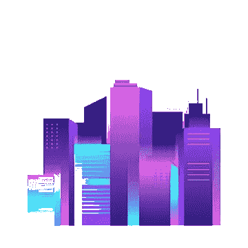
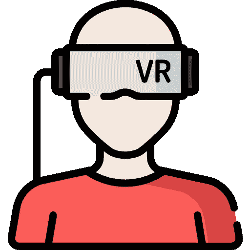
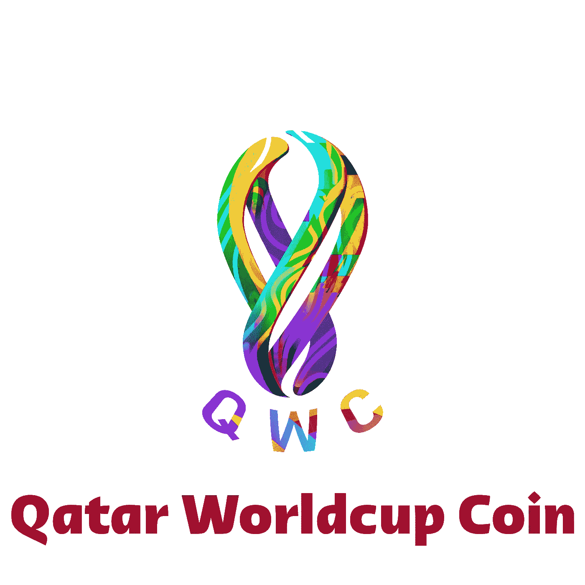

# QWC 如何为卡塔尔世界杯利用元宇宙和区块链？

> 原文：<https://medium.com/codex/how-qwc-is-utilizing-metaverse-blockchain-for-qatar-worldcup-4c1561fca1e6?source=collection_archive---------18----------------------->

术语“[元宇宙](https://www.worldcup-coin.com)”在最近几年很流行，并承诺在不太遥远的将来会带来震撼的结果。它是一个虚拟的、数字的和三维的宇宙，通过各种虚拟空间与现实世界环境的混合而生成。

用户能够在进入其存在的数字领域后，使用他们的数字化身在元宇宙内导航和交互。

# 虚拟空间

通过多种类型的虚拟环境的合并而生成的虚拟、数字和三维世界被称为元宇宙。

用户可以使用他们的虚拟身份以数字化身的形式加入这个数字环境，在里面，他们可以自由地在元宇宙的不同地方漫游，做一些事情，如购物，与朋友出去玩，或结识新朋友，就像他们在现实世界中一样。

唯一的区别是，消费者可以享受完全沉浸式的体验，而不必离开自己的家。

**更简单地说，以前局限于物理世界不同地点的活动现在将在元宇宙内以数字化方式进行。**

元宇宙不能和现存的任何东西相比。它是一个可以互操作的网络，包含实时显示的 3D 虚拟世界。这些虚拟生态系统旨在支持无限数量的用户。

用户可以以持久和同步的方式与他们交互。在这种遭遇中，用户的唯一性将被完整地保留。

此外，元宇宙可以在大规模上运行，并维护对象、身份、权利、交互、支付和历史等数据的一致性。 [**QWC**](https://www.worldcup-coin.com) **正在利用元宇宙安排你可以在虚拟体育场内看到的比赛。**

# 混合现实

首先，有混合现实，它结合了增强现实(AR)和虚拟现实(VR)的元素。所有这些都是场景和视觉效果的例子，这些场景和视觉效果都是数字生成的，或者叠加在现实世界之上，或者代替现实世界使用。

一个完全构建和计算机化的世界被称为虚拟现实。即虚拟现实视频游戏。增强现实指的是叠加了数字材料或视觉效果的实际环境。

混合现实指的是现实世界与虚拟物品的结合，虚拟物品可以对其周围环境做出反应，并且用户可以与之进行交互。

当我们使用 VR、AR 或 MR 技术时，我们必须依赖特殊的头盔，它能给我们一个新的视角来代替旧的视角。以 Oculus Quest 为例。

用户在覆盖他们眼睛的位置佩戴这些耳机。它们通常每只手都有一个控制器，因此用户可以与显示给他们的虚拟环境进行交互。这允许用户对体验有更多的控制。

# 区块链

区块链仅仅是交易的数字日志，它被复制并在组成区块链的整个计算机系统网络中传播。这使得区块链非常安全。

链中的每个块存储许多交易，并且每当区块链上发生新的交易时，该交易的记录被添加到网络中所有参与者的分类账中。

术语“分布式分类账技术”指的是一种非集中式的数据库，由不同的参与者管理(DLT)。

区块链技术的使用允许以多种不同的方式实现分散的安全性和信任。首先，在整个存储过程中，新鲜的块始终以线性和时间顺序保存。

换句话说，它们总是被附加到区块链的“结尾”。一旦一个块被放到区块链的末端，返回并改变该块的内容是非常困难的，除非网络的大多数已经同意这样做。

如果没有发生这种情况，那么块不能被改变。这是因为每个数据块不仅包括自己的哈希，还包括之前数据块的哈希以及之前讨论过的时间戳。

# 加密货币代币

短语“[加密令牌](https://www.worldcup-coin.com)”可以指虚拟货币的唯一令牌，也可以指加密货币的计量单位。这些代币是可以交易的可替换资产或实用工具，并且存储在它们各自网络的各自区块链上。

加密令牌通常用于众筹过程中，但除此之外，它们还可能用于各种其他目的。

创建、分发、销售和流通这些代币的传统程序被称为初始硬币发行(ICO)，它包括一种为项目开发获取资金支持的众筹。

# QWC 代币

由于一个名为 [QWC](https://www.worldcup-coin.com) 的项目，用户将能够进入加密货币足球的世界，该项目旨在将足球运动和加密货币结合起来。 [QWC](https://www.worldcup-coin.com) 是一种数字资产，让人们能够建立自己的数字货币。

[QWC](https://www.worldcup-coin.com) 工作时不会危及他们的安全。他们正在合并 BSC 和 NFT 技术，目的是为所有客户提供更好的服务。

因为它基于 BSC(币安智能链),这项技术除了保证数字资产的可追溯性和不变性之外，还保证了数字资产的真实性。

在过去两年中，许多加密货币公司和平台在职业足球领域进行了大量投资。当务之急是杜绝冠状病毒在卡塔尔足球比赛中的传播。

# 足球比赛的 QWC

冠状病毒的传播对体育运动的财务状况产生了重大影响，职业足球也未能免受这些影响。

电晕对足球的负面影响，包括电晕对球员、裁判、俱乐部和足球俱乐部的电视转播权以及球迷的重要性的影响，以及空置体育场对俱乐部经济的影响，以及电晕对足球的财务损失等，包括职业足球未能幸免的事实

QWC 的目标和路线图是融入 NFT 世界，并将其扩展到当地足球联赛和女子足球比赛。这是足球与加密货币越来越多联系的另一个方面，加密货币被称为 NFT(不可替代的代币)领域。

这个方面包括俱乐部和国家联盟产生他们自己的数字资产，如照片或电影，可以买卖。

[我们的推特](https://twitter.com/QwcOfficial)

[我们的白皮书](https://worldcup-coin.com/wp-content/uploads/2022/06/whitepaper.pdf)

[我们的电报组](https://t.me/qwcofficial)