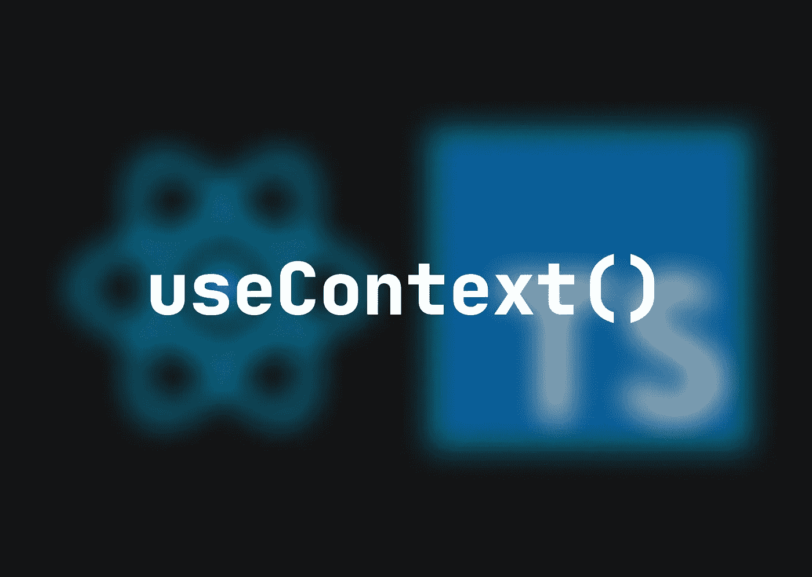

# React.js 上下文如何工作(TypeScript)

> 原文：<https://medium.com/codex/how-react-js-context-works-typescript-72de02036f71?source=collection_archive---------3----------------------->

如果您的 React 应用程序不断扩展，它最终会达到需要全局状态的时候。有许多可用的解决方案；现在，我将演示最简单的一个，它是在 React 中有意开发的:React 上下文



假设您或您的客户希望升级应用程序，以允许用户在亮暗模式之间进行选择。这意味着您必须以某种方式为每个应用程序组件提供对实际主题信息的访问。

对于应用程序中有限数量的组件，您可以使用`props`来实现

```
🏑 **IN A SMALL APPLICATION YOU CAN PASS ANY INFORMATION WITH PROPS**
const Navbar = () => {
  const theme = useMemo(() => {
    return props.theme
  }, [])
  return(
    <div className={theme === 'light' ? 'light' : 'dark'}>
      ...
    </div>
  )
}
const Component = (props: { theme: string }) => {
  const theme = useMemo(() => {
    return props.theme
  }, [])
  return(
    <div className={theme === 'light' ? 'light' : 'dark'}>
      ...
    </div>
  )
}
const Main = () => {
  return(
    <div>
      <Navbar theme='light' />
      <Component theme='light' />
    </div>
  )
}
```

你可以这样做，但这实际上是多余的，而且一点也不鼓励。更不用说如果你在许多不同的层上有许多组件会发生什么。在这种情况下，您必须跨多个级别提供`props`,这些级别不一定需要知道传递给低级组件的信息。

```
⛔️ **YOU SHOULD AVOID SENDING PROPS THROUGH MANY LAYERS WHEN USING A LOT OF COMPONENTS**
const Main = () => {
  return(
    <div>
      <Layout theme='light' />
    </div>
  )
}
const Layout = (props: { theme: string }) => {
  return(
    <div>
      <Navbar theme={props.theme} />
      <Wrapper theme={props.theme} />
    </div>
  )
}
const Wrapper = (props: { theme: string }) => {
  ...
}
```

但是，如果有一种方法可以让您的应用程序访问全局上下文呢？这将是很棒的，因为你可以提供全球信息，而不需要通过`props`到任何级别和任何组件。


反应上下文是你所寻求的。这一次，不需要任何更多的库依赖，因此我们不会经历安装过程，我们将从一个名为`contexts.ts`的`src`新文件开始

```
📝 **CREATE A NEW FILE**
src/contexts.tsx
```

为了保持在应用程序中提供实际主题信息的例子，我们将使用基于`theme`的命名约定来创建主题信息`Context`和主题信息`Provider`

```
👍 **CREATE THE THEME CONTEXT AND THE INFORMATION PROVIDER**
import React from 'react'
export const ThemeContext = React.createContext('')
export const ThemeProvider = ThemeContext.Provider
```

下一步是用`Provider`包装`Main`或`App`组件，并创建一个`theme`状态

```
🌯 **WRAP YOUR MAIN COMPONENT WITH THE PROVIDER AND CREATE A THEME STATE**
import { ThemeProvider } from "../contexts";
import { useState } from "react";
const Main = () => {
  **const [theme, setTheme] = useState<'light' | 'dark'>('light')**
  return(
    **<ThemeProvider value={theme}>**
      <Component />
      <button onClick={() => {setTheme('light')}}>LIGHT</button>
      <button onClick={() => {setTheme('dark')}}>DARK</button>
    **</ThemeProvider>**
  )
}
export default Main
```

花点时间谈谈上面发生的事。您创建了一个具有两个可能值`light`或`dark`的`theme`状态。之后，您将这个状态作为一个值传递给了`Provider`包装器。这意味着如果你点击其中一个`button`到`set`到`theme`，那么`Provider`包装器中的更新信息(当然还有`Context`中的)也会改变。

只剩下一件事，这个故事的主要目的:用`useContext()`钩子利用你的`Component`中的这个`theme`信息上下文

```
🚀 **USE THE THEME CONTEXT IN ANY COMPONENT THAT'S WRAPPED IN THE PROVIDER**
import { useContext } from 'react';
import { ThemeContext } from "../contexts";
const Component = () => {
  **const theme = useContext(ThemeContext)**
  return(
    **<div className={theme === 'light' ? 'light' : 'dark'}>**
      ...
    **</div>**
  )
}
export default Component
```

这意味着您可以简单地使用`useContext()`钩子从`ThemeContext`中获取主题信息来设计`ThemeProvider`中包装的任何组件。

恭喜您，您已经成功地创建了一个简单的 React 应用程序上下文，而无需借助 Redux 等更复杂的全局状态管理工具！

👋我希望这在你寻找新的学习材料时对你有用。**感谢您抽出时间阅读本文！**

如果你从我的文章中更好地理解了一些东西，☕️，你可以给我买杯咖啡来支持我

📯**订阅我的电子邮件列表**，如果你想在未来读到更多这样的故事，请在这里或在 [Twitter](https://twitter.com/daanwords) **上关注我！**