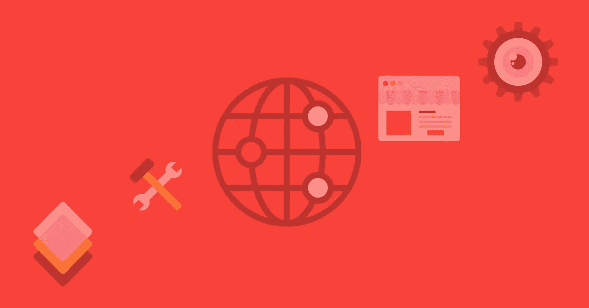

# Scrapy 如何让网页抓取变得简单

> 原文：<https://medium.com/codex/how-scrapy-makes-web-crawling-easy-3ed1fc84d7a1?source=collection_archive---------16----------------------->



如果你对网络抓取感兴趣，或者你可能已经有一些提取数据的脚本，但是不熟悉 [Scrapy](https://scrapy.org/) ，那么这篇文章就是为你准备的。我将快速浏览 Scrapy 的基本原理，以及为什么我认为它是大规模刮除的正确选择。我希望你能很快看到这个令人敬畏的框架的价值，并有兴趣了解更多，并考虑将其用于你的下一个大项目。

# 什么是 Scrapy？

Scrapy 是一个用 Python 写的网络抓取框架。您可以利用 Python 丰富的数据科学生态系统和 Scrapy，这使得开发更加容易。

虽然导言公正，这篇短文旨在向您展示您可以从 Scrapy 中获得多少价值，并向您介绍它的一些基本概念。这不是对 web 抓取或 Python 的介绍，所以我假设您对这种语言有基本的了解，并且至少了解 HTTP 请求是如何工作的。

# Scrapy 与其他流行选项相比如何？

如果你以前学过 Python web 抓取教程，你很可能会遇到 BeautifulSoup 和 requests 库。这些提供了一种从网页中提取数据的快速方法，但没有提供 Scrapy 用于大多数任务的项目结构和合理的默认值。你必须自己处理重定向、重试、cookies 等等，而 Scrapy 可以开箱即用。

你可能认为你可以用 Selenium 或 Puppeteer 这样的无头浏览器逃脱，毕竟，那会更难阻止。事实是，你可以少花很多资源，但如果你有成百上千的刮刀，那就要付出代价了。

# 你如何设置 Scrapy？

Scrapy 是一个 Python 包，和其他包一样。您可以在 virtualenv 中安装 pip，如下所示:

```
$ pip install scrapy
```

你需要理解的两个概念是 Scrapy 项目和蜘蛛。一个项目包装了多个蜘蛛，你可以把一个蜘蛛想象成一个特定网站的抓取配置。安装后，您可以像这样启动一个项目:

```
$ scrapy startproject myprojectname
```

一个项目将封装所有的蜘蛛、实用程序，甚至部署配置。

# 如何抓取一个简单的网页？

蜘蛛处理特定网站所需的一切。它将向网页发出请求，并接收返回的响应。它的职责是处理这些响应并产生更多的请求或数据。

在实际的 Python 代码中，蜘蛛只不过是一个继承自`scrapy.Spider`的 Python 类。这里有一个基本的例子:

```
import scrapy 
class MySpider(scrapy.Spider): 
name = 'zyte_blog' start_urls = ['https://zyte.com/blog'] def parse(self, response): 
for href in response.css('div.post-header h2 a::attr(href)').getall(): 
yield scrapy.Request(href) yield scrapy.Request( 
url=response.css('a.next-posts-link::attr(href)').get(), callback=self.parse_blog_post, 
) def parse_blog_post(self, response): 
yield { 
'url': response.url, 
'title': response.css('span#hs_cos_wrapper_name::text').get(), 
}
```

`start_urls`是开始抓取的 URL 列表。每个都将产生一个请求，其响应将在回调中接收。默认回调为`parse`。如您所见，回调只是处理响应并产生更多请求或数据点的类方法。

# 如何用 Scrapy 从 HTML 中提取数据点？

你可以用 Scrapy 的选择器！在`response`对象上有 CSS 选择器可以直接实现这个功能:

```
link = response.css('a.next-posts-link::attr(href)').get() # extract using class 
title = response.css('span#hs_cos_wrapper_name::text').get() # extract using id
```

还有 XPath 选择器，它提供了您最可能需要的更强大的选项。下面是使用 XPath 的相同选择器:

```
link = response.xpath('//a[contains(@class, "next-posts-link")]/a/@href').get() # extract using class 
title = response.xpath('//span[@id="hs_cos_wrapper_name"]/text()').get() # extract using id
```

接下来，您需要一种将数据返回到可解析格式的方法。有一些功能强大的实用程序，如项目和项目加载器，但最简单的形式是将数据存储到 Python 字典中:

```
yield { 
'url': response.url, 
'title': response.css('span#hs_cos_wrapper_name::text').get(), 
}
```

# 你如何运行一个刺痒蜘蛛？

在您的项目目录中，使用上面的示例项目，您可以运行:

```
$ scrapy crawl zyte_blog
```

这将把抓取的数据显示到标准输出中，并记录大量日志，但是您可以通过添加几个选项轻松地只将实际数据重定向到 CSV 或 JSON 格式:

```
$ scrapy crawl zyte_blog -o blog_posts.csv
```

CSV 文件的内容:

```
url,title 
[https://zyte.com/blog/how-to-get-high-success-rates-with-proxies-3-steps-to-scale-up,How](https://zyte.com/blog/how-to-get-high-success-rates-with-proxies-3-steps-to-scale-up,How) to Get High Success Rates With Proxies: 3 Steps to Scale Up 
[https://zyte.com/blog/data-center-proxies-vs.-residential-proxies,Data](https://zyte.com/blog/data-center-proxies-vs.-residential-proxies,Data) Center Proxies vs. Residential Proxies [https://zyte.com/blog/price-intelligence-questions-answered,Your](https://zyte.com/blog/price-intelligence-questions-answered,Your) Price Intelligence Questions Answered 
...
```

# 怎么处理被屏蔽？

Scrapy 使得管理复杂的会话逻辑变得容易。随着你添加更多的蜘蛛和你的项目变得更加复杂，Scrapy 允许你以各种方式阻止禁令。

调整请求的最基本方法是设置标题。例如，您可以像这样添加一个`Accept`头:

```
scrapy.Request(url, headers={'accept': '*/*', 'user-agent': 'some user-agent value'})
```

你可能已经想到，一定有更好的方法来设置它，而不是为每个单独的请求设置它，你是对的！Scrapy 允许你为每个蜘蛛设置默认的标题和选项，如下所示:

```
custom_settings = { 
'DEFAULT_REQUEST_HEADERS': {'accept': '*/*'}, 
'USER_AGENT': 'some user-agent value', 
}
```

这既可以在单个蜘蛛上设置，也可以在 Scrapy 为你定义的`settings.py`文件中设置。

**但是等等……还有更多！**

你也可以使用[中间件](https://docs.scrapy.org/en/latest/topics/downloader-middleware.html)来做到这一点。这些可以用于跨蜘蛛添加标题和更多。

中间件是 Scrapy 的另一个强大的特性，因为它们允许你处理重定向、重试、cookies 等等。这正是 Scrapy 开箱即用的东西！

使用中间件，你可以[尊重特定网站的 robots.txt 配置](https://docs.scrapy.org/en/latest/topics/downloader-middleware.html#module-scrapy.downloadermiddlewares.robotstxt),以确保你不会抓取你不应该抓取的内容。

# 刮的时候如何做到“善良”？

网络抓取会对网站产生负面影响，这不是你想要的。为了更好地节省时间，你需要在你的请求之间增加合理的延迟。您可以使用现有的[自动节流中间件](https://docs.scrapy.org/en/latest/topics/autothrottle.html)轻松做到这一点。

你也可以设置一个时间间隔，这样你就不会看起来像一个机器人，每 2 秒请求一次，但产生 1 到 5 秒的请求！

# Scrapy 如何处理代理？

Scrapy 中有很多方法可以使用代理。您可以为单个请求设置它们，如下所示:

```
scrapy.Request( 
url, 
meta={'proxy': 'host:port'}, 
)
```

或者使用现有的 [http 代理中间件](https://docs.scrapy.org/en/latest/_modules/scrapy/downloadermiddlewares/httpproxy.html)，为每个单独的请求设置它。

如果你正在使用智能代理管理器([或者想要](https://www.zyte.com/smart-proxy-manager/))，你可以使用[官方中间件](https://scrapy-crawlera.readthedocs.io/en/latest)来设置它。

# Scrapy 如何帮助你处理数据？

Scrapy 还为您提供项目，以帮助定义您的数据结构。下面是一个简单的定义:

```
import scrapy class BlogItem(scrapy.Item): 
title = scrapy.Field() 
url = scrapy.Field()
```

您也可以使用数据类！

```
from dataclasses import dataclass @dataclass 
class BlogItem: 
title: str 
url: str
```

[项目加载器](https://docs.scrapy.org/en/latest/topics/loaders.html)是数据格式化的下一步。为了理解它们在哪里变得有用，您可以想象多个蜘蛛使用同一个项目并需要相同的格式。例如，去掉“描述”字段的空格并合并字符串列表。他们可以做一些非常复杂的事情！

用于处理项目的管道也是一种选择。它们可以用于根据某些字段过滤重复的项目，或者添加/验证计算值(例如根据时间戳删除项目)。

# 阅读更多

这只是一个概述，Scrapy 中直接包含了许多其他特性，以及社区创建的许多扩展、中间件和管道。以下是您可能感兴趣的资源列表:

Scrapy 是一个成熟的开源项目，有许多活跃的贡献者，已经存在多年了。它得到了很好的支持，所以你会发现几乎所有你能想到的东西都有[文档](https://docs.scrapy.org/en/latest/)和[教程](https://docs.scrapy.org/en/latest/intro/tutorial.html)，还有很多社区开发的插件。

*最初发表于*[*【https://www.zyte.com】*](https://www.zyte.com/blog/how-scrapy-makes-web-crawling-easy/)*。*