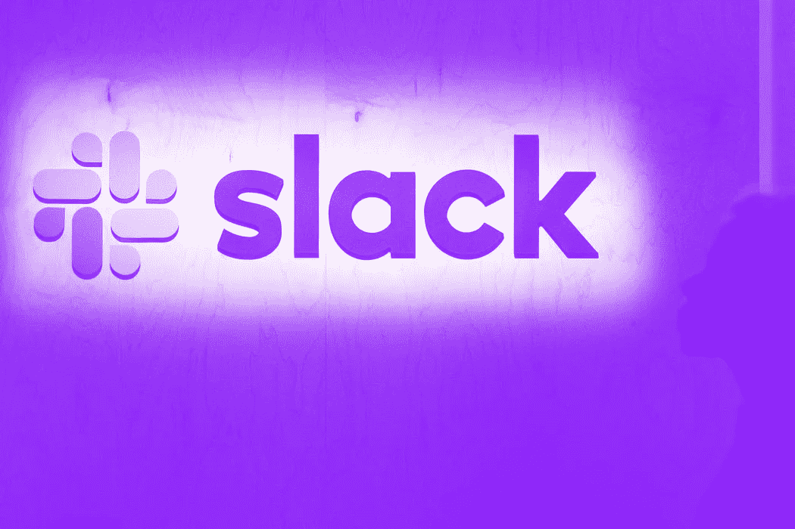

# Slack 是如何设计其 API 的

> 原文：<https://medium.com/codex/how-slack-designs-its-apis-6a0367c356f7?source=collection_archive---------16----------------------->

## 在本周的时事通讯中，学习设计一个 API 的整个过程，然后是 Slack 和更多内容

图片由诺亚·伯杰在盖蒂图片社拍摄

这是 CrunchX 的第十五版，这里是我们认为值得花时间的故事和资源。

# 1.6 个数据监控工具，你可以用来跟踪你的品牌活动

数据监控工具有助于将大量数据可视化为可理解的信息集，这对于规划公司的特定品牌活动非常有帮助。本文描述了这里可以使用的 6 种不同的工具，Hootsuite 和 Alteryx Designer 是其中的两种。由 Ryan Ayers 撰写的关于数据经济的文章，由 Christianlauer 编辑选择。点击此处阅读文章:

[https://data conomy . com/2022/05/6-数据-监测-工具-品牌-活动/](https://dataconomy.com/2022/05/6-data-monitoring-tools-brands-campaign/)

# 2.AWS 文档和术语表

如果你非常喜欢云服务，我们中的许多人现在都是，特别是 AWS，可能很难记住甚至发现你想使用的服务以及如何与它们交互。AWS 通用参考([链接](https://docs.aws.amazon.com/general/latest/gr/Welcome.html))是一个非常有用的资源——但对我来说，词汇表([链接](https://docs.aws.amazon.com/general/latest/gr/glos-chap.html))可能是最有用的 AWS 页面(也可以作为离线 PDF — [链接](https://docs.aws.amazon.com/general/latest/gr/aws-general.pdf#glos-chap) —如果你被锁在一个没有互联网接入的数据中心内……)。斯图尔特·伍利博士的编辑选择。

# 3.eksctl 文档

谈到 AWS，如果你喜欢集群并且是 Kubernetes 俱乐部的成员，你可能会对使用 eks CTL(LINK:[https://eks CTL . io](https://eksctl.io))作为管理亚马逊 EKS(弹性 Kubernetes 服务)上的集群的简单工具感兴趣。与 Terraform 和 get can 等其他解决方案相比，它的复杂性更低，可以快速轻松地实现集群，尤其是在您开始尝试或研究 pod 问题时，并且不需要更复杂的设置开销。eksctl 现在被 AWS 官方支持为 CLI EKS 接口，AWS 自己的文档可以在[这里](https://docs.aws.amazon.com/eks/latest/userguide/eksctl.html)找到。由[Stuart wool ley](https://medium.com/u/a435b5883828?source=post_page-----6a0367c356f7--------------------------------)博士编辑选择并在此查看文档:

[https://docs . AWS . Amazon . com/eks/latest/user guide/eks CTL . html](https://docs.aws.amazon.com/eks/latest/userguide/eksctl.html)

# 4.数据管理的未来:已经到来

分析师认为，数据结构将成为数据管理的未来。这些数据结构可以被视为将特定数据流程相互连接的集成层。这些分析师还认为，这种数据结构方法在不久的将来会变得更加重要，因为数据正以指数级的速度快速增长，并且传播范围越来越广，因此这种新方法必须在更短的时间内得到进一步发展，以满足公司的需求。由 Navin Sharma 在 Datanami 上撰写，由 [Christianlauer](https://medium.com/u/2696f801a31a?source=post_page-----6a0367c356f7--------------------------------) 编辑选择。点击此处阅读文章:

[https://www . datanami . com/2022/05/05/the-future-of-data-management-its-already-here/](https://www.datanami.com/2022/05/05/the-future-of-data-management-its-already-here/)

# 5.竞争性程序员手册

这里有一本很好的关于编程基础的电子书。非常适合准备编码面试。由于这本书涵盖了编程基础，这将使你的编码挑战变得容易得多。我真的很喜欢关于摊销分析的部分，因为这是大多数开发人员所忽略的。由 Antti Laaksonen 撰写，由 Milo ivko VI 编辑选择。在这里阅读这本书:

[https://cses.fi/book/book.pdf](https://cses.fi/book/book.pdf)

# 6.构建数据素养:CDO 需要知道什么

数据素养是指一个人以正确的方式阅读、理解、处理和交流数据的能力。因此，CDO(首席数据官)必须具备上述标准，才能尽职尽责地开展工作。本文通过具体的最佳实践示例，描述了 CDO 们在填补职位空缺时必须了解的内容。由 Nathan Eddy 在《信息周刊》上撰写，由 Christianlauer 编辑选择。点击此处阅读文章:

[https://www . information week . com/big-data/building-data-literacy-what-CDOs-need-to-know](https://www.informationweek.com/big-data/building-data-literacy-what-cdos-need-to-know)

# 7.我们如何在 Slack 设计我们的 API

关于如何设计 API 的优秀指南。我想我们都同意这些是事实上的 API 设计原则。如果更多的开发人员遵循“避免破坏性改变”，我这个周末就不会改变代码:d .由 Saurabh Sahni 和 Taylor Singletary 撰写的关于 Slack Engineering 的文章和由[Milo ivkovi](https://medium.com/u/3ee57b082bb?source=post_page-----6a0367c356f7--------------------------------)撰写的编辑选择。点击此处阅读文章:

[https://slack.engineering/how-we-design-our-apis-at-slack/](https://slack.engineering/how-we-design-our-apis-at-slack/)

# 8.2022 年要考虑的 5 个最佳数据科学项目

当今的全球就业市场非常需要数据科学家。本文描述了 5 个有助于获得数据科学领域重要知识的教育项目。它还区分了虚拟程序和物理程序，并提到了它们各自的优缺点。由 Auria Moore 在 Datafloq 上撰写，由 Christian lauer[编辑选择。点击此处阅读文章:](https://medium.com/u/2696f801a31a?source=post_page-----6a0367c356f7--------------------------------)

[https://data floq . com/read/the-5-best-data-science-programs-to-consider-in-2022/](https://datafloq.com/read/the-5-best-data-science-programs-to-consider-in-2022/)

# 9.苹果芯片独家遭遇全球首个“预兆”DMP 漏洞

研究人员发现了苹果硅芯片中的一个关键漏洞，使它们容易受到类似英特尔 Spectre/Meltdown 灾难的数据泄露。由弗朗西斯科·皮雷斯在《汤姆的硬件》上撰写，由安东尼·特伦斯编辑。点击此处阅读文章:

[https://www . toms hardware . com/news/apple-silicon-exclusive-hit-with-world-first-augury-DMP-vulnerability](https://www.tomshardware.com/news/apple-silicon-exclusively-hit-with-world-first-augury-dmp-vulnerability)

# 10.苹果、谷歌和微软联手开发新的免密码技术

为了加强互联网的安全性，科技巨头苹果、谷歌和微软承诺支持无密码登录系统。由科琳·哈格蒂撰写科普文章，由[安东尼·特伦斯](https://medium.com/u/e178959c822?source=post_page-----6a0367c356f7--------------------------------)编辑选择。点击此处阅读文章:

[https://www . pop sci . com/technology/apple-Google-Microsoft-password-sign in/](https://www.popsci.com/technology/apple-google-microsoft-passwordless-signin/)

# 结束语

这是我们本周的精选。希望你发现了一些新的、鼓舞人心的、惊人的、疯狂的科技新闻。非常感谢您花时间阅读本版 CrunchX。下周请留意下一期。

## 问候，

法典小组