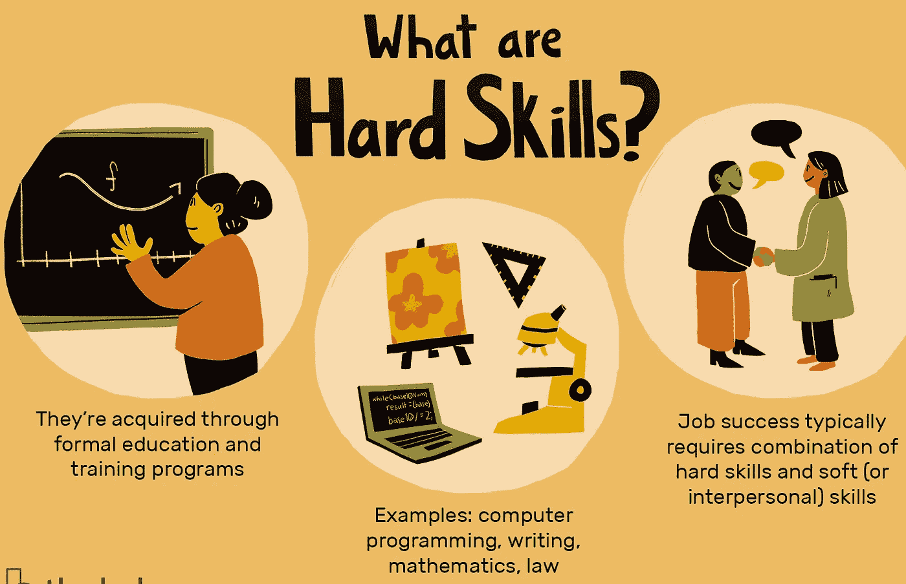

# 软技能如何帮助你找到工作？

> 原文：<https://medium.com/codex/how-soft-skills-can-help-you-to-get-a-job-597c6f35097f?source=collection_archive---------13----------------------->

## 大多数人认为在编程领域只有硬技能(编码技能)是必不可少的。这是一个巨大的错误。有了软技能(沟通技巧)，你可以不仅仅是一个典型的开发者。让我们来谈谈软技能如何帮助你找到工作。

你是不是也是那种认为在你的开发者生涯中只有编码就足够成长的人？或者说，编码知识是否足以在该领域找到工作？完全不对。我们来看看为什么。

首先，我们必须了解什么是软技能和硬技能，以及它们之间的区别。在学习“Hello World”之前，我们不能经历复杂的函数，对吗？😑

# 什么是硬技能？

硬技能，也称为技术技能，是工作特有的，与每个职位和资历水平相关。换句话说，每个公司的每个职位都需要一份独特的硬技能清单。例如，一个会计需要知道如何核对银行对账单，而这些知识对于开发人员来说是不必要的。同时，一个前端开发者需要知道如何获取 API，而这些知识对于一个游戏设计师来说并不重要。

所以，你的编码技能在软件领域是硬技能。如果你的代码干净、良好、没有错误(如果可能的话🤐)，说明你有过硬的硬技能。

# 什么是软技能？

软技能，比较有特点，跟性格有关。例如，如果你的公司重视协作，你会更愿意雇佣那些团队合作精神强、能与他人良好沟通的员工。另一方面，网络和建立关系的技能对于销售和营销角色来说可能是必不可少的。

所以，作为软件开发人员，我们必须解决问题，对吗？而且，正如我在这个领域看到的，人们在理解这个问题上浪费了很多时间。由于对问题的误解，任务被积压下来，你在同一项任务上浪费的时间超过了你所需要的。当然不仅仅是理解问题，这是个例子。

# 软技能和硬技能的区别？

硬技能和软技能的主要区别在于它们是如何获得的。硬技能大多是通过某种类型的教育训练或获得的。他们可以通过认证获得。但是软技能是发展出来的技能。他们可以被训练，但是通常围绕着个性。

# 为什么软技能很重要？

是的，随着时间的推移，软技能越来越重要。现在人们都在寻找软技能发达的员工。因为多亏了他们，你的团队才会协调得越来越好。而且这还不是唯一的加分。

正如我在 LinkedIn 上看到的，大多数从未被雇佣过的开发人员总是犯同样的错误。他们不宣传自己。人们大多分享他们的 GitHub 页面，仅此而已。但是，可能有 1%的人在他们的 GitHub repos 上编辑 readme。

我们来逻辑思考一下，谁会愿意下载你的代码，理解你的代码，打开你的代码去了解你做了什么？你是史蒂夫·乔布斯还是一个受欢迎的高级开发人员来让人们下载你的项目？如果你是一名寻找初级开发人员的人力资源人员，你会更喜欢在 GitHub repos 上有详细易懂的自述和演示链接的人，还是有更好的项目但没有信息的人？

实际上,“软技能”的基础是——不需要有人要求你修改你的 GitHub repo 的自述文件。如果你有很好的软技能，你必须自己去思考。

# 最后的想法

简而言之，不要做一个“编码者”，努力做一个“开发者”。如果你是一名程序员，你的生活将以完成任务而结束。如果你是一个有足够软技能的开发者，你会惊讶于你职业生涯的快速提升。

你对软技能对于找工作的重要性有什么看法吗？大家在评论里讨论吧！此外，如果你喜欢从内容，你可以通过下面的提示支持我😇。下一个话题再见。