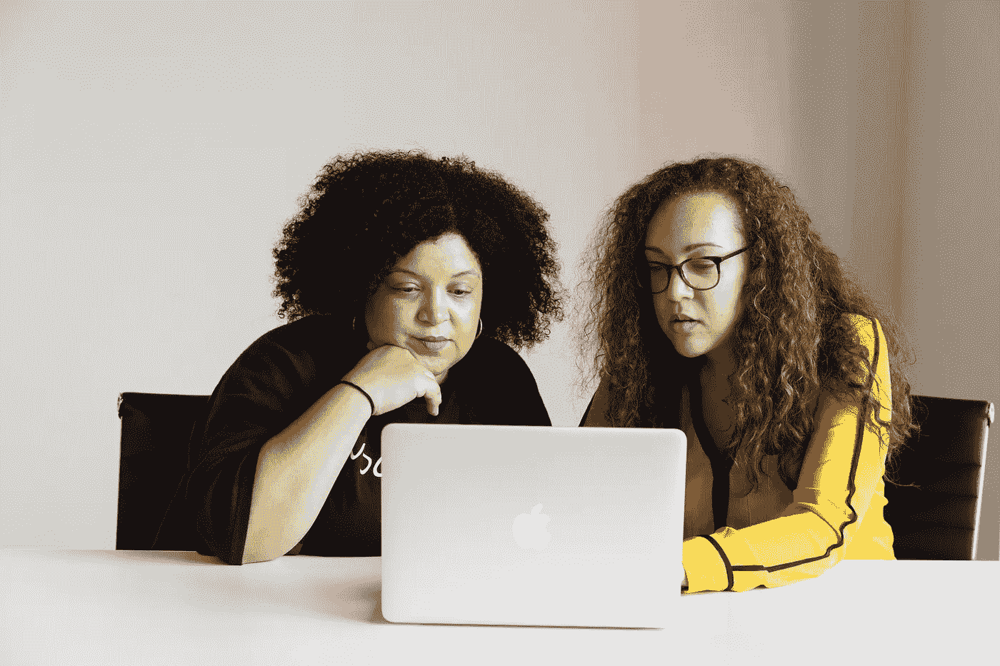

# 软件工程师面试和约会有什么不同

> 原文：<https://medium.com/codex/how-software-engineer-interviews-are-different-from-dates-8b7e1546a86b?source=collection_archive---------20----------------------->

## 除了非常明显的原因，我的意思是

克里斯蒂娜@ wocintechchat.com 在 [Unsplash](https://unsplash.com/s/photos/dating-software?utm_source=unsplash&utm_medium=referral&utm_content=creditCopyText) 上的照片[。显然上面的照片是一个非常非常无聊的第一次约会。](https://unsplash.com/@wocintechchat?utm_source=unsplash&utm_medium=referral&utm_content=creditCopyText)

我写了一篇关于软件工程师面试过程的热门博文，有 200，000 的浏览量……我从来没有闭嘴过，我也从来没有闭嘴过。老实说，这主要是我抱怨了几段关于我如何厌倦了软件工程之外的人声称如果你有一个计算机科学学位就很容易找到工作。你甚至可以说，这是针对一个脸书朋友的咆哮，直到它在 Reddit 上传播开来，你将是正确的。

我收到的一些评论非常刻薄，刻薄到我在博客上发了一整篇文章，名为“你在媒体上可能遇到的五种刻薄评论”有些人更积极。95-98%的人既不是积极的也不是消极的，他们只是对面试过程是否被破坏进行了严肃而冗长的争论……以及如果被破坏了我们该怎么做。

**我写的一句话是，软件工程真的很宽泛，所以最大的挑战是找到与你特定技能完全匹配的人。这和我们在约会中遇到的问题一模一样——因为桌子两边都有这么多选择，我们可以对自己的要求非常具体。**

一个隐藏的评论只是问为什么约会也这么难。我感谢你的评论。

# 我震惊的意识到

好吧，所以每当我在《福布斯》杂志上读到一篇关于软件工程师面试的文章，他们似乎总是将找工作的困难与约会的困难相比较。然后我了解了租男朋友和租女朋友的服务(显然是为了研究)，以及如何支付每小时 100 美元来模拟恋爱经历。你是在为与某人身体接触的经历买单——有轻微的身体接触、个人接触和付费的友善，但没有性的成分。在这种情况下，这有点像是唯一的粉丝的对立面。

这种服务提供了很多很多有趣的问题……但我所能想到的只有模拟面试。你可以付给在 FAANG 公司工作的人大约 200 美元进行模拟面试。为什么人们会付那么多钱？为了体验。他们希望这是很难的，这样他们就有希望拿到真题。相反，该日期是轻松模式下的日期。他们会立刻握住你的手，不怕和你拍照，还会说你的好话。如果约会和工作面试是相似的，你会想要一个他们不断和你争论或展示/寻找危险信号的艰难模式，以及他们不出现的不可能模式。

**我突然想到:约会和软件工程师面试的区别在于，约会很有趣，而面试却不是。**

现在，我知道你在想什么:

> 科特这太疯狂了。我完全不同意，因为那根本不真实或不明显。我最近错过了一个局域网聚会，因为我太专注于在 LeetCode 中获得高分。一个编码面试比迪士尼乐园还好玩！
> ———我猜是你

# 好极了。贴这个的目的是什么？

嗯，我真的认为从这件事中可以学到一些东西。

如果你是面试方，尽量让面试过程变得有趣。

是的，我知道…我可以想象求职面试的另一边的人对我挥舞拳头。你的采访已经很有趣了！他们教会了你很多。你会学到很多东西。是的，太棒了。

但是关于:

*   如果我们在你的公司面试，你送我们一个礼品篮
*   如果我们在贵公司面试，我们可以免费试用你们的软件产品
*   如果我们在你们公司面试，我们会得到 10 美元的餐券

好吧…好吧…我知道这不现实。但是在这些远程采访的日子里，老实说，我并不完全清楚为什么我们仍然这样做，我们似乎失去了任何潜在的好处。是的，显然面试很有趣。是的，显然我花在磨 LeetCode 和看 DSA 视频上的周末是我 20 多岁时最珍贵的回忆。但是有些事情我们曾经在现场采访中做过。免费午餐。免费赠送的水瓶。至少是一次办公室旅行。

现在，我们什么都不懂。你可以说我们通过免费的模拟面试节省了 200 美元…不尽然。似乎很少有公司提供有用的反馈(如果他们提供任何反馈的话)。

# 结束语

我会把这个贴上幽默贴的标签，但这仅仅是因为我认为任何人都会听我说这个的想法很搞笑。