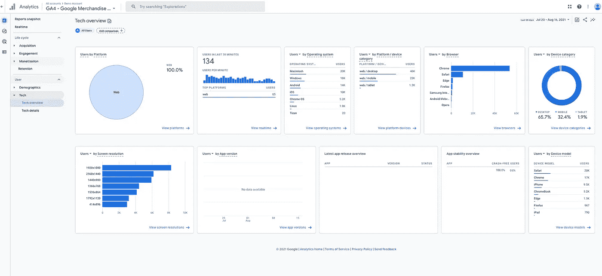

# 初创公司如何最好地利用分析技术报告

> 原文：<https://medium.com/codex/how-startups-can-best-use-analytic-tech-reports-8c2ec05e70d8?source=collection_archive---------5----------------------->

## 以下是谷歌分析中的技术报告如何帮助你的应用和软件发布计划

谷歌分析技术概览报告(作者通过谷歌分析截屏)

分析被用于许多营销需求。但是，分析解决方案中的一组报告在战略需求方面尤其有用。