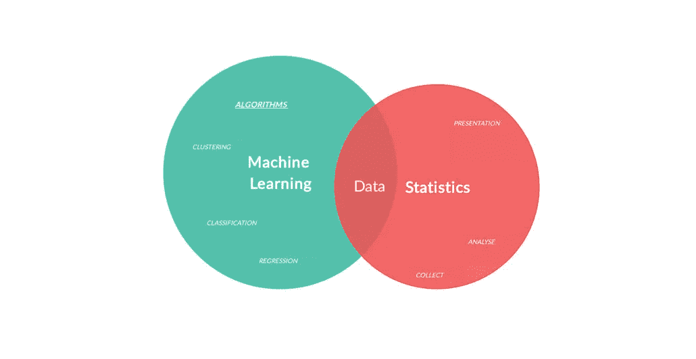

# 统计学是如何用于机器学习的？

> 原文：<https://medium.com/codex/how-statistics-is-used-in-machine-learning-8f26da9816a9?source=collection_archive---------23----------------------->

我提出了一个问题，比如为什么统计在**机器学习**或**数据科学**建立任何模型中如此重要。为此，我做了一些研究。这个博客包含了关于 ML 模型中统计重要性的内容。

# 什么是统计？

统计是我们从原始(垃圾)数据中获得一些有意义的完整信息的步骤之一，执行一些数学或统计分析。

# 定义

统计学是科学的一个分支，涉及大量数据的收集、分析和数据，以便您可以解决各种用例并得出结论，并提取一些有意义的完整信息，帮助您通过 ML 模型进行预测。

在统计中，数据分为两部分

*   描述的
*   推理的

# 什么是描述性的？

描述统计学理解数据集的特征。描述统计学有两种基本的度量方法:集中趋势的度量方法和可变性的度量方法。集中趋势的度量描述了数据集的中心位置。

# 推理的

推断统计用于使用样本数据生成总体概括..…这意味着从您的样本数据(例如样本平均值)中提取一个统计数据，并使用它来说明某个总体参数(即总体平均值)。

# 人口

一般来说，人口是指在特定时间内居住在某一地区的人口。但在统计学中，人口指的是你感兴趣的研究的数据。它可以是一组个人、对象、事件等。你用人口来推断。

例如，在投票后调查中，不可能在选举结束前收集所有给定的选票，投票后调查通过一群人预测这一点。这同样适用于**采样**也是如此。

# 抽样

当我们无法获得人口数据时，抽样数据用于预测所有人口的偏好，因此我们从不同领域的观点获得数据作为数据。

# 取样技术

## 随机**采样**:

*   他们随机选择相当好，但有一些缺点，如
*   重合
*   对于特定的用例，这是行不通的

## 分层抽样:

*   当您想要针对那些最放纵的特定群体时，可以使用这种抽样。例如，美容产品公司就是这种针对女性的公司。当我们收集数据时，我们避免不必要的分类。

## 系统取样:

*   系统抽样是一种概率抽样方法，在这种方法中，从较大的总体中选择一个具有固定周期间隔的随机样本。

# 集中趋势的度量

集中趋势是您使用**平均值、众数和中位数**计算的数据集的汇总。它告诉你最大的平均值，它也被称为**“数据的中心位置”。**

让我给大家举几个例子。

## 平均:

*   当记录保存值时，则使用平均值。即年龄= [ 33，22，55，44，55，44 43]，均值=总年龄/记录数。296 / 7 = 42.7

## 中位数:

*   例如，年龄= [ 5，4，11，15，11，9 90]，其中平均年龄在 5–10 之间，但由于 90，平均值为 20.0
*   这是无效的，中值得到中心值，对于奇数中心值和偶数相加(两个中心值)/2，对于奇数取中心中值= 15。

## 模式:

*   该记录保存重复的值，然后我们选择该反应值作为我们的模式。即年龄= [2，3，5，6，7，3，3]，中位数= 3

在 [Bigscal Technologies](https://www.bigscal.com/) ，你可以[雇佣机器学习开发人员，雇佣 ML 工程师，雇佣数据科学开发人员](https://www.bigscal.com/hire-developers/machine-learning-development-company/)，节省高达 60%的成本和时间，而且没有雇佣费用。

> 本文由 Rushikesh Chittes 在这里首次发表于[。](https://www.bigscal.com/blogs/ai-ml-blockchain/how-statistics-is-used-in-machine-learning/)
> 
> 点击此处继续阅读更多有趣的文章[。](https://www.bigscal.com/blogs/)