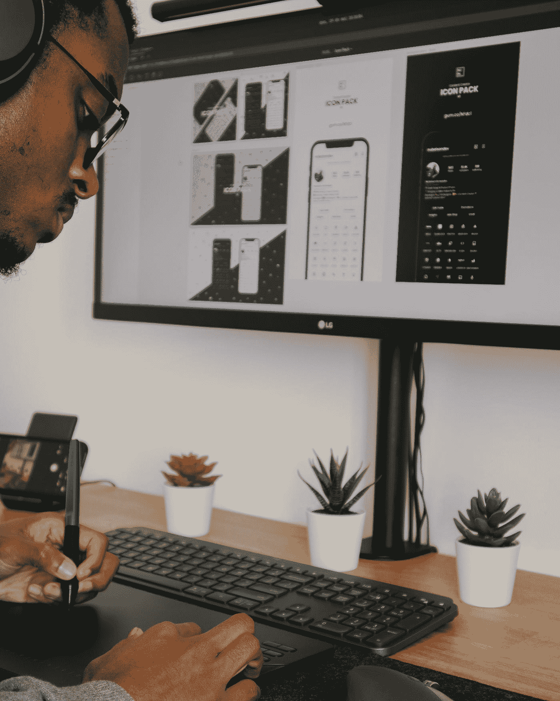

# 技术如何改变营销

> 原文：<https://medium.com/codex/how-technology-is-changing-marketing-323fb0be3f1c?source=collection_archive---------24----------------------->

## 从赞助广告到互动广告牌，新技术意味着普通人每天会看到 5000 多个广告。

Nubelson Fernandes 在 [Unsplash](https://unsplash.com?utm_source=medium&utm_medium=referral) 上的照片

虽然数据科学、金融科技、人工智能、机器学习和虚拟现实都不是什么新概念，但它们继续给所有人带来新的变化…