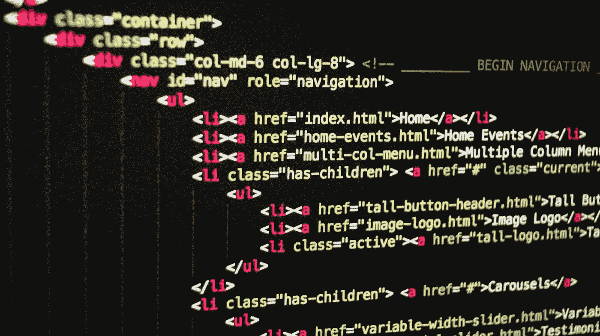

# 技术领导者如何在预算内按时超越

> 原文：<https://medium.com/codex/how-technology-leaders-can-transcend-on-time-and-under-budget-28e86f153684?source=collection_archive---------9----------------------->

## 按时并在预算内交付项目并不能保证成功。

按时和在预算内定义项目成功的黄金标准。谷歌返回 254，000，000 个搜索“预算内准时”的结果。

按时并在预算内交付项目并不能保证成功。用户会喜欢这个产品吗？粉丝会一次次回来吗？有人愿意为你提供的服务付费吗？

这些关于成功的问题与最初的项目评估无关。估算为预见一项工作需要多长时间提供了最好的猜测。估计错了。估计并不能预示未来。

对你已经做了十几次的事情的估计会非常好。一个为牙医做网站的团队，在过去几年里已经完成了 25 个这样的项目——他们可以很好地估算。

知道你要去哪里有助于评估。保持高质量，减少错误和意外有助于保持预测稳定。选择少于所有的功能可以将日期提前。

我们怎样才能成功？

# 从卓越的技术开始

[https://www.pexels.com/@skitterphoto](https://www.pexels.com/@skitterphoto)

最近在挪威的一次会议上，研究人员这样定义技术卓越。

> *我们发现技术卓越的配置由四个特征组成:(1)软件工艺，(2)软件质量，(3)追求卓越的心态，以及(4)与良好的软件工程实践的一致性。*
> 
> *—敏捷实践者如何解释和培养“技术卓越”？亚当·阿拉米，玛丽亚·帕西瓦拉。*

研究人员的定义提供了一些值得向往的优秀品质，同时也忽略了一个至关重要的方面。

我已经在这个领域开发软件超过 25 年了。我的职业生涯始于文档和国防部标准。然后，我转向极限编程和其他敏捷方法。这次旅行的结果是，我采用了一个更简单、更直接的定义。

技术上的卓越意味着在每次迭代结束时都能运行软件。

我用迭代来表示你对软件进行有意变更的每个周期。这个循环可能是 Scrum 的冲刺。当你在发展的时候，它也可能是一个单独的会议。无论时间框架如何，**工作软件才是目标**。

## 连续交货

Thoughtworks 的首席科学家 Martin Fowler 将技术卓越与持续交付联系在一起。

福勒将技术专家和企业的职责分开。开发人员负责部署软件。企业负责向客户发布软件。

这个定义导致了一系列支持连续交付的实践:

*   脚本部署
*   自动化测试
*   短命的树枝
*   持续集成
*   监视
*   小批量

## 目标

更少的错误，更快的可靠性。

高管和用户都希望他们的软件具有这些特征。每个人都想让事情正常运转。优秀的团队经常会提出新的想法。杰出的团队用他们解决的问题取悦他们的用户。如果开发人员错过了，补丁应该很快就会出现。

这些特征象征着卓越技术的成果。

# 优先考虑长期成功

这种激进的方法将工程工作的所有权放在工程师手中，并采取长期的战略方法来制定可以长期改变的解决方案。你的投资会得到回报，你最终会建立起一种文化。

在谷歌的[演讲中，约翰·奥斯特胡特教授描述了两种基于他的书*软件设计哲学*的软件设计方法。战术方法只关注让事情运转起来。战略方法超越了战术，消除了复杂性，产生了伟大的设计。](https://www.youtube.com/watch?v=bmSAYlu0NcY)

> 为什么我们想要一个伟大的设计？这样我们将来才能快速发展。真的都是关于投资的。今天就投资于好的设计，因为我们开发的大部分代码将会在未来出现。如果我们今天把事情搞砸了，我们在未来会拖慢自己的脚步。
> 
> 约翰·奥斯特胡特教授。

# 软件设计的案例

Ousterhout 证明了在软件设计上的投资是有回报的，因为它能够随着时间的推移而快速移动。

我曾在选择战术的公司工作过。不幸的是，这种选择导致了许多不必要的副作用。他们最终得到了系统中没人想碰的部分。因此，他们尝试不同的方法，将新代码“放到一边”这些努力导致了代码中的多种模式。更糟糕的是，它给用户留下了一个支离破碎的软件体验。

Ousterhout 声称团队应该在设计上投入 20%的时间。这种战略投资产生了可维护的代码，降低了复杂性，随着时间的推移会更快地产生结果。

我见过的那些只关注战术胜利的团队，最终的代码库无法处理他们当前系统中为用户改进产品所必需的变更。

> *用蹩脚的代码也能成功。你可以采取战术，建立成功的公司。用另一种方法你也可以成功。”*
> 
> 约翰·奥斯特胡特教授。

通过投资软件设计—**幕后的代码设计**和**客户体验的 UX 和视觉设计——即使是一个水下团队也可以很快达到这样一个点，即投资通过更好的用户体验和更好的开发者体验来提供回报。**

**团队在未来发展得更快，并且**真正地**为更多的客户提供更多的价值。**

## **在实践中**

**[**工程管理人员应处理好优先顺序**](/codex/how-engineering-managers-should-balance-system-reliability-and-new-features-761f160b921) **。他们将能够在向用户交付价值的功能性投资和代码进步之间做出权衡，代码进步的回报是降低复杂性和长期可维护性。****

**开发商可以消化财务权衡的影响。投资回报决策类似于我们所有人都做出的家政学选择。你花的比赚的少，战略性地举债，为未来投资一些钱，随着时间的推移积累越来越多的收益。**

**工程师也理解用户和他们的用例。接下来，他们分析他们正在解决的问题。最后，他们将知识转化为工作代码。**

**可读性、可维护性、可持续性、可操作性以及其他因素会给代码带来长期价值。不幸的是，非工程师不理解软件设计的权衡和优先级。对于非技术人员来说，理解工程问题是困难的，甚至是不可能的。软件工程文献将它们命名为“非功能性”需求。**

**战术方法只关注功能需求。正如奥特豪特解释的那样，战略方法考虑了整个工程领域。**

****产品经理应该为用户着想。他们应该提出他们认为产品需要改进的地方。他们应该用分析来支持他们的主张。****

**在一个授权的团队中，那些执行工作的人优先考虑和管理工作量。在这种情况下，工程工作量由工程经理进行优先排序和管理。然而，该工作负载的很大一部分是通过产品为用户服务的。因此，产品经理优先考虑工作负载中面向用户的部分。**

****产品经理处理产品优先级。团队将这些优先事项纳入他们的总体工作量中。该团队与工程经理一起优先考虑、管理和执行工作。****

**战略方法变成了工程驱动的方法，其中工程驱动工作负载优先级。总体工程工作量包括产品工作，产品工作由工程部门处理和管理，并与所有利益相关者共享。该团队平衡了短期成功与工作软件和长期投资，从而产生一个可以发展的产品。**

## **解决问题**

**在确定技术债务的优先级时，一个经常出现的考虑因素是:**

> ***“这对我们的用户有什么价值？”***

**产品经理根据对用户的价值进行优先排序。以牺牲代码库的长期可持续性为代价，只优先考虑面向用户的价值，导致团队采取战术方法。代码到了开发人员无法将软件转向下一次迭代的地步。**

**术语软件本身有词根 soft，意思是可延展的或可改变的。**

**额外的时间压力，无论是真实的还是想象的，都会促使团队走战术捷径。不幸的是，这些捷径导致努力推进当前的产品。除了在[一些“金奖券”的例子中，](/swlh/the-priority-paradox-8b888141e85b)谷歌让开发者设定软件交付的时间表，考虑到设计投资所需的时间。**

**人们可能会怀疑工程师是否会只专注于技术改进，但这并没有在大部分行业得到证实。相反，工程师从事 it 工作是为了构建有用的功能。这种激进的方法将工程工作的所有权交给工程人员，让团队采取长期的战略方法来制定解决方案，他们可以在未来很长一段时间内使用和改变这些解决方案。**

## **设计回报**

> ***真正优秀的软件开发人员去的地方，他们真的关心设计，他们做好编码。如果你有这种文化，你就能更好地招聘到最好的程序员。快速推出优秀产品的最好方法是找到最好的程序员。支持好的设计文化的最强有力的论据是，它允许你雇佣顶尖人才，这将给你带来优势。***
> 
> ***——约翰·奥斯特胡特教授。***

**你的投资会随着你最终建立的文化而得到回报。例如，一个重视软件设计的公司会吸引优秀的开发人员。反过来，这些开发人员将快速创造出下一代优秀的产品。**

# **数字时代伟大文化的四个标准**

**频率。自信。可靠性。反馈。**

****

**照片由 [Tosa Vlad](https://www.pexels.com/@tosa-vlad-66735?utm_content=attributionCopyText&utm_medium=referral&utm_source=pexels) 从 [Pexels](https://www.pexels.com/photo/grayscale-photography-of-playing-cards-placed-on-cloth-237857/?utm_content=attributionCopyText&utm_medium=referral&utm_source=pexels) 拍摄**

**自从**马克·安德森**发表他的著名文章解释“[为什么软件正在吞噬世界](https://future.a16z.com/software-is-eating-the-world/)”已经过去十年了**

**他以对未来企业家的指导结束了他的文章:**

> **[新公司]需要建立强大的文化，取悦客户，建立自己的竞争优势，当然，还要证明自己不断上升的估值是合理的。**

**强大的文化为获得授权的团队创造了发挥最佳水平的环境。这些高绩效团队创造了高价值的业务。**

**那些高绩效团队如何取悦客户并创造他们的竞争优势？运送伟大的软件！**

**使用这四个标准，你可以建立一个强大的文化。首先，将你的开发努力转化为满意的客户、有竞争力的业务和不断增长的估值。**

## **频率**

**经常出货。**

**致力于小块的功能。衡量什么是有用的，以决定你应该保留什么，需要从你的产品中去掉什么。通过小规模工作，你可以经常交付。你交付的次数越多，你就越有机会知道下一步该做什么。**

## **信心**

**满怀信心地交付。**

**投资开发人员构建高质量软件所需的工具。教你的团队测试驱动开发。编写一些端到端的测试，看看所有的部分是否都合适。保持测试的速度，以减少反馈的时间。**

## **可靠性**

**反复做。**

**建立一个自动管道来构建、测试和部署您的软件。只需一次点击，即可触发此管道。更好的是，随着你的团队对软件的每一个改变，触发这个管道。对不同的环境使用相同的管道。**

## **反馈**

**部署后跟踪您的软件。**

**开发人员应该关注性能、可伸缩性和错误。产品经理应该看到用户如何与你的软件交互。哪些流程比较顺畅？你的用户卡在哪里？**

**利用这个反馈来决定你的下一步。**

# **尽早投资于强大的技术领导力**

****

**照片由[大卫·麦克比](https://www.pexels.com/@davidmcbee?utm_content=attributionCopyText&utm_medium=referral&utm_source=pexels)从[派克斯](https://www.pexels.com/photo/round-silver-and-gold-coins-730564/?utm_content=attributionCopyText&utm_medium=referral&utm_source=pexels)拍摄**

**初创公司的创始技术团队为未来的机会设定轨迹。**

**创始人面临着艰难的挑战。你会在早期为有经验的开发者投资吗？还是选择一个不太贵，经验不太丰富的团队？当然，你的盈利能力在这个决定中起着很大的作用。**

## **无论如何你都要付钱**

**投资于可靠的开发人员会提前增加你的成本。干净的代码库的机会增加了。长期技术债务的可能性降低。你的成本会随着时间线性增长。**

## **提高期望**

**如果你早点选择更便宜的路线，你会在晚些时候减速。你以后还会付出更多。弱势文化越来越难吸引优秀人才。在没有工程学科的地方引入强有力的工程学科也变得很有挑战性。**

**大餐后放松腰带比勒紧腰带更容易。尽早为工程定下正确的基调更容易。**

## **跟随胜利者**

**我们所知的科技巨头 FAANG(或 MANGA)始于坚实的技术文化。**

**最重要的是确保你的早期雇员有坚实的技术基础。第一次招聘可能也是最艰难的。但随着时间的推移，这变得越来越容易。—杰夫·劳森，Twilio 的首席执行官和联合创始人**

**Twilio 也很早就建立了强大的技术文化，尽管他们比巨人还要小。他们投资于工程、工程工具和运营。Twilio 的投资带来了强大的文化、可持续的增长和盈利的公司。**

## **尽早投资**

**你越早引入“强大的技术能力”，就越容易调整你的文化。为开发人员提供自主权，让他们有时间做最好的工作。自主也使他们离开的机会最小化。**

# **工程小组必须由工程经理领导**

**谁应该领导工程队？这是一个非常重要的问题。它的影响远远超出了当前功能的发布时间。**

****

**来自[派克斯](https://www.pexels.com/photo/group-of-person-sitting-indoors-3184306/?utm_content=attributionCopyText&utm_medium=referral&utm_source=pexels)的[派克斯](https://www.pexels.com/@fauxels?utm_content=attributionCopyText&utm_medium=referral&utm_source=pexels)的照片**

**这个问题在初创企业中时有发生。**

## **不仅仅是功能**

**工程学需要的不仅仅是编写特性。**

**工程师关心的是不恰当的非功能性需求。除了软件中的特性之外，这些都是工程中的其他问题。**

**性能。安全。可靠性。监控。容量。可扩展性。测试。可维护性。可读性。可操作性。**

**当团队领导来自非技术领域时，这些关键需求会被忽略。**

**忽视技术需求会导致大量的事故、支持请求、错误报告和代码库，这是任何工程师都不愿意面对的。**

## **测试极限**

**想象一个由产品经理、设计师和工程师组成的小团队。我们把角色一个个去掉，看看阵容会怎么样。**

**当你移除产品经理时，你就失去了他们提供的一些洞察力。团队将不再听取客户访谈。工程师可能需要站出来帮助解释分析。事情可能会进展得慢一点，但工作可以继续进行。**

**当您移除设计器时，可视化设计会停止。工程师和产品经理可以在用户体验上合作。开发人员可以借用其他应用程序的交互。Bootstrap、Material、Tailwind 等框架允许工程师开发合理的设计。同样，事情可能会很艰难，但工作可以继续进行。**

**当你移除了工程师，开发就会停滞不前。无法开发新功能。代码无法重构。bug 无法修复。你唯一的选择就是引入另一个工程师。**

**工程师是软件团队的关键。**

**很自然，工程经理应该领导这个团队。**

# **设置变量不需要请求许可**

****做好你的工作不需要请求许可。****

**在我领导开发团队的过程中，我加入了许多组织，那里的工程师抱怨他们不能做“正确的事情”**

****

**【https://www.pexels.com/@pixabay **

**在许多组织中，软件开发人员没有权力做好他们的工作。**

## **你不需要许可**

**我试图用一种轻松而尖锐的观点来说服开发者。**

> **你是否请求允许给一个变量赋值？还是写一个循环？一个条件？**

**团队希望编写干净的代码，可以长时间维护。与此同时，开发人员并不认为自己有权决定如何编写干净的代码。我见过一些团体认为无 bug 代码与企业想要的不一致。**

## **这是所有的发展过程**

**开发软件不仅仅是编程。**

**正如我们的  行业二十多年来一直在说的那样，[“打字不是瓶颈。”](https://www.computerworld.com/article/2798053/are-smart-coders-the-enemy-.html)**

*   **理解问题**
*   **对解决方案进行三角分析**
*   **使其工作**
*   **做正确的事**
*   **动作快点**
*   **下周让你自己也能读懂。**

**然后是将软件展示在用户面前的部分。**

## **它始于强大的技术领导力**

**根据我的经验，很难将现代实践引入到现有流程中。系统的惯性击退了所有的挑战者。此外，快速而肮脏的过程持续的时间越长，事情就越难改变。**

**开发干净代码的最好方法是从干净的代码开始。第二个最好的方法是在团队中嵌入高级技术人员。这些前辈介绍实践并维护标准。**

**您的团队可以用多种方式定义干净的代码。自动化测试，可读代码，重构，代码审查，分离设计。你越早引入这些实践，成功的机会就越大。**

# **像 CTO 一样思考软件开发**

**我用我使用的第一种语言学习了类型。**

**例如，知道何时使用整数、字符串或布尔值来使我的程序工作是很有帮助的。**

****

**来自 [Pexels](https://www.pexels.com/photo/different-sizes-and-forms-of-scissors-4226911/?utm_content=attributionCopyText&utm_medium=referral&utm_source=pexels) 的 [Karolina Grabowska](https://www.pexels.com/@karolina-grabowska?utm_content=attributionCopyText&utm_medium=referral&utm_source=pexels) 摄影**

**当我开始我的软件开发生涯时，我学习了抽象数据类型。在许多语言中，这些是我们创建的接口。我使用接口将想法和实现分开——将“是什么”和“如何”分开。**

**我使用几种不同的数据类型来解释软件开发是如何工作的。**

## **1.商业**

**开发人员将工人可以费力完成的任务自动化。计算机可以完成比手工更多的动作。因此，我们可以承担比用铅笔和纸大得多的工作。**

**想象一下，一个人可以在一小时内用 1000 个数字进行运算。计算机可以在一秒钟内完成同样的计算。突然，我们可以考虑使用更大的数据集进行更复杂的计算。**

**软件为我们提供动力。电脑给了我们一个工具，让我们加倍努力，多次重复我们的动作。杠杆为我们打开了机会之门。**

## **2.工程**

**作为一门工程学科，软件开发将科学、商业和约束结合在一起。**

**开发人员建立在集体经验的基础上，使用已知的工作实践来开发解决方案，以节俭的方式解决手头的问题。**

## **3.科学**

**计算机，也就是软件开发，建立在开发人员需要理解的基础构件之上。**

**记忆。计算。输入。输出。存储。声明。任务。决定。循环。迭代。执行。**

**软件开发建立在基础组件之上。开发人员将这些组件排列成层，隐藏了复杂性，同时创建了一些有价值的东西。当软件令人愉悦时，用户看到了魔力。**

## **4.手艺**

**我的祖父在 20 世纪 50 年代作为铁匠制造马车和童车。然而，他的店里没有装配线。因此，我爷爷根据客户的要求制造了每辆乡村汽车。**

**软件开发不是在流水线上运行的。因此，每个项目都不同于所有其他项目。**

**有时，我爷爷需要一种特殊的工具来完成他的项目。但是，不幸的是，他不能跑到最近的家得宝去买他需要的东西。因此，相反，他会花一些时间来构建工具，然后使用该工具来完成项目。**

**作为开发人员，我们很幸运能够构建我们的工具。我们在开发产品时精心制作工具的能力给了我们优势，无论我们是为日常任务制作自动化脚本还是框架，**

## **5.实践**

**软件开发人员参与软件开发的实践。**

**你不会为了了解软件开发而去阅读它。相反，你通过做这件事，通过开发软件来发展技能。你模仿伟人。你向他人学习并分享你所知道的。你找到一个导师。你把你所知道的传递给下一代。**

## **6.协力**

**构建软件的社会影响比大多数人想承认的要大。**

**我们可以一起合作开发出比任何一个开发者单独工作都更有意义、更令人兴奋的产品。我们扩展我们的软件和我们想象伟大事物的能力。我们把一个团体的才能结合成比个人的总和更有意义的东西。**

## **7.艺术**

**这项工作有创造性的成分。**

**在解决一个以前没有人解决过的问题时，我们没有现成的方法可以遵循。因此，开发人员会探索不同的解决方案，看看哪些可能有效。时间、空间和流动因素来解决新的挑战。**

## **以上皆是**

**软件开发实现了所有这些接口。我们的工作由所有这些数据类型组成。**

**我确信我在整理这个列表时遗漏了一些方面。你如何向别人解释软件开发？你如何看待软件开发？**

# **设定高期望以实现创新**

**高管们可以利用皮格马利翁效应，通过为开发团队设定正确的期望来获得他们想要的东西。**

****

**照片由 [Pexels](https://www.pexels.com/photo/person-holding-black-chalk-board-9755375/?utm_content=attributionCopyText&utm_medium=referral&utm_source=pexels) 的 [Towfiqu barbhuiya](https://www.pexels.com/@towfiqu-barbhuiya-3440682?utm_content=attributionCopyText&utm_medium=referral&utm_source=pexels) 拍摄**

> *****当我们预期他人的某些行为时，我们很可能会以使预期行为更有可能发生的方式行事。*** *—罗森塔尔和巴巴德，1985 年***

**这项始于 1985 年的研究揭示了所谓的皮格马利翁效应。人们根据我们设定的期望起起落落。这项研究主要针对教师和学生，但这一概念适用于所有领域。**

**高管对他们的业务有什么期望？**

> ****在一个开发组织中，这不是磨出特性和代码。****

**你的开发人员在解决你最大的问题时有多大的创造力？**

## **为您的用户创新**

**今天的用户对他们的软件有很高的期望。他们每天使用的优秀解决方案提高了用户的期望值。你的用户也消费脸书、优步、Spotify 等。不管你是政府还是创业公司，你的用户要求都很高。**

**软件加快了变化的步伐，跟不上变化的公司变得无关紧要。MVP 是一个最小可行的产品，可以以低成本快速构建，并允许收集少量用户的反馈来决定下一步开发什么。从我们在学校的训练中建立起来的，有一个在商业中达到 100%成功率的潜在期望。**

**你必须打破对实验的恐惧，创造一种创新文化。**

## **它始于领导层**

**高管必须向整个公司灌输主人翁意识。围绕企业最大的问题，通过“呼吁解决方案”让每个人都参与进来。**

**当奥巴马总统在硅谷召集了一个团队来修复 healthcare.gov 时，他并没有给他们提供一份需要开发的功能清单。相反，他提出了一个使命:“你的国家需要你。”**

**与开发人员分享问题会让用户更开心，提高质量，缩短周期，留住人才。这些恰好是高管们希望从他们的开发团队那里得到的所有东西。**

## **产品经理能做出什么贡献**

**伟大的产品经理确保开发人员理解客户的问题。产品经理简化沟通，放弃错误的假设，避免先入为主的解决方案，消除层级。**

**用和你的客户一样的方式使用软件，找出棘手的部分，并加以改进。**

**Basecamp 为其开发者提供了一个需要解决的问题。然后，经理们揭示为什么这个问题是至关重要的，以及这些想法是从哪里来的。最后，领导者通过责任、代理和自主权来完成工作。**

## **如何把它弄错**

**管理人员代表开发人员承诺最终期限会导致快速而肮脏的实现，超出时间表的特性，或者开发人员脱离组织。**

**从规范开始工作会孤立开发人员，导致产品中的错误，并且花费很长时间，因为开发人员没有关心问题的内在动机。**

****这两种方法都不会有好结果。没有人会快乐——无论是高管、用户、开发人员还是你的企业。****

# **8 对技术卓越的期望**

****

**照片由 [Yan Krukov](https://www.pexels.com/@yankrukov?utm_content=attributionCopyText&utm_medium=referral&utm_source=pexels) 从 [Pexels](https://www.pexels.com/photo/woman-in-white-shirt-sitting-on-chair-in-front-of-macbook-4458421/?utm_content=attributionCopyText&utm_medium=referral&utm_source=pexels)**

## **1.船舶软件**

**把你的软件交到用户手中。没有用户，你的软件就是废物，积灰在架子上。因此，交付软件的能力是你的主要焦点。**

## **2.重复装运**

**无论你是今天发货，明天发货，还是下周发货，你都需要对这个过程充满信心。按钮式或脚本式轮班是你的朋友。通过一个可重复的过程，你可以缩短你的时间表。**

## **3.经常出货**

**航运需要枯燥。你需要一次又一次地运送。你出货越频繁，你学习的次数就越多。学习是软件开发的核心。通过持续运输，你将增加你的学习周期。**

## **4.自信地装运**

**你需要在发货前知道你发货的东西会起作用。有许多方法可以解决这个问题。**

**为特定的功能编写单元测试。接下来，与其他工程师一起检查代码，寻找设计错误。最后，与其他团队成员一起检查功能。别人会看到你没看到的东西。**

## **5.措施**

**一旦您发布了，您的测试和同行就不再存在了。然而，您需要确信您的代码运行良好。在这里，能够看到您的代码在生产中做了什么是至关重要的。日志、事件、遥测是您的首选工具。仪表板可以帮助您可视化基本元素。**

## **6.更换软件**

**在你的软件上线后，你会从使用模式中了解到什么可行，什么不可行。设计软件，使变化是直截了当的。你可能需要用重构之类的技巧重新设计，以使你的改变清晰明了。**

## **7.做所有的事情**

**反复、频繁、自信地运输是工程的核心。测量产量关闭了反馈回路，让我们学习。一起做这些事情允许我们把我们的软件塑造成用户期望的样子。**

## **8.适应**

**将你的基本活动从运输提升到学习。随着您的过程变得更加可重复，更频繁地重复该过程。这个方法的每一个循环都提供了一个为你的最终受众——你的用户——做一些伟大事情的机会。**

# **软件工程师需要了解什么是敏捷性**

**今天的技术可以让你在几分钟内将一个全新的改变投入生产。这是向往的标准。**

****

**来自 [Pexels](https://www.pexels.com/photo/white-clock-reading-at-2-12-1537268/?utm_content=attributionCopyText&utm_medium=referral&utm_source=pexels) 的 [Stas Knop](https://www.pexels.com/@stasknop?utm_content=attributionCopyText&utm_medium=referral&utm_source=pexels) 摄影**

***我刚刚加入一家初创公司，成为他们的第一位工程主管。公司的领导对一切都花了这么长时间感到沮丧。我渴望成名。***

**在每周一次的计划会议上，我要求花几分钟时间来演示发布代码需要做些什么。我们找到了一个可以修复的页面类型。我调好计时器，开始了。**

***我搜索代码寻找类型。只出现了一个文件。我更新了该文件中的副本，并在本地运行了测试。一切都过去了！所以我把代码推给了 GitHub，然后是 Heroku。***

**整个过程花了大约 10 分钟，包括向每个人解释每一步的内容。**

***高管们喜欢这个演示。***

## **如果每一次软件变更都被视为拷贝变更会怎样？**

**让我们试着将软件过程分解成基本原则。**

**对于要被**使用的软件**，它需要在某个地方的机器上运行。为了**运行**，你需要**部署**软件。在部署之前，你需要**构建**你的软件。为了自信地构建，你需要**测试**它。为了通过测试，你需要编写你的**代码**。在编写代码或测试之前，你需要理解你试图解决的问题。**

**这些构件允许你把你的软件发布给用户。**

## **工具之上的结果**

**票证、验收标准、代码审查和等待。**

**这些工具可能会有所帮助，但在软件发布中它们并不是必不可少的。它们提供了一些好处，但是每一种都有相关的成本。**

## **如果我们能像复制改变一样做每一个改变，会发生什么？**

**我们马上知道需要做什么。我们不需要门票来跟踪这项工作。我们也不需要在验收标准上达成一致；我们的目标是在页面上有正确的拼写。**

**变化很小，而且是独立的。我们不需要进行代码审查或打开拉取请求。**

**最后，我们知道我们可以在几分钟内完成，所以我们不需要计划等待。**

**工程师们浏览着演示。我为什么要这么做？新的期望正在形成。在这种速度下，工程工作量会增加哪些职责？**

**手中有这么大的权力，我们能做些什么呢？**

***👏🏻给我鼓掌* ***跟着*** *如果你喜欢这篇文章。***

# **📋关于米洛**

**我是一名科技高管、作家、演说家、企业家和发明家。我从 1995 年开始开发软件，过去十年一直在开发团队。🚀**

**我写关于软件、工程、管理和领导力的文章。**

***你也可以* [*在 Twitter 上关注我*](https://twitter.com/milotodorovich) *。🐦***