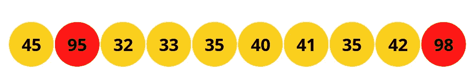
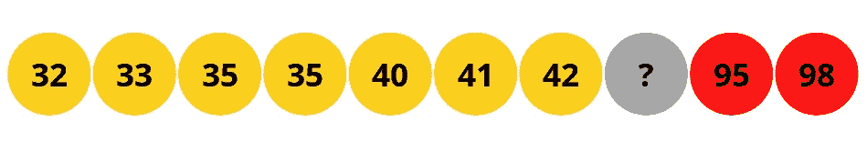
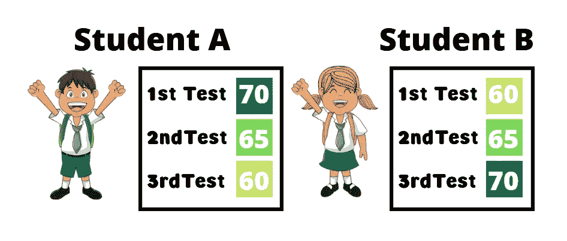

# 为什么平均值是一个不好的统计指标…

> 原文：<https://medium.com/codex/how-the-mean-is-a-bad-statistical-measure-40aecf12cfa2?source=collection_archive---------5----------------------->

作者图片

外行人称之为**平均值**，统计学家称之为**算术平均值**。平均值是最常用的集中趋势的量度之一。单个值向我们显示了数据的中心和数据的样子。但是它有它的警告；

# 极值

当数据中的某个或某组观察值过高或过低时，就会出现这种情况。这样一个数字将对平均值产生巨大的影响。让我们看一下 **10** 名学生在一次数学突击测验中的分数，分数等级为 **100** 。

作者图片

观察值的平均值约为 **50** ，这是无效的。如果你看看数据。大部分学生的分数都在**30–45**之间，但由于有两个学生的分数很高 **95** 和 **98** 。平均值表示数据的中心位于 **50** 处，这是错误的！

去掉这两个数字，取平均值，

你大概有 **38** ，它描述了数据中心的样子。

# 缺少值

与众数和中位数不同，如果缺少一个值，我们无法计算平均值。使用上面相同的例子，

图像作者

这里第 8 个**数据点**丢失了，但是不管这个值是多少，我们确定众数是 **35** 并且中位数是 **40.5。**

# 无法通过检查来确定。

不像众数和中位数，我们可以通过观察数据，我们需要进行计算，以获得平均值。虽然，有时，我们可以认为这是平均值相对于中位数和众数的一个优势。因为我们确信研究人员不会对结果有偏见。

# 无法用图表来确定

与我们可以通过绘制累积频率曲线来确定的中值不同，

或者我们可以通过定位直方图上的最高点来可视化的模式。这是不可能的。

# 含义的不同

两个学生可以有相同的平均分，同时有不同的含意；

作者图片

他们的平均值可能是一样的，但是学生 A 变得越来越差，而学生 B 正在进步。

尽管有缺点，这种方法仍然有一些优点:

*   它很容易使用和理解
*   它受采样的影响最小。总体样本的平均值，我们可以用它来确定总体的整体平均值。因此使其可靠。
*   它的显著的数学性质，使它在推断统计中很受欢迎。

# 结论

了解这一弱点，会让数据科学家知道什么时候不使用它。

总之，我们知道当数据集中有极值和缺失值时，平均值将是一个不好的度量。我们不能用它来暗示或从视觉上看到它。

作者 GIF