# 疫情如何在 Reddit 上塑造阴谋论？

> 原文：<https://medium.com/codex/how-the-pandemic-changed-conspiracy-theories-on-reddit-7739209de425?source=collection_archive---------11----------------------->


信用:[汤姆·拉德茨基](https://unsplash.com/@tomradetzki)

r/阴谋的情感和话题分析

*代码有 R 和 Python*[这里](https://github.com/nszoni/reddit_conspiracy_theories)

# 假设

自疫情爆发以来，阴谋论重新浮出水面，错误信息/虚假新闻层出不穷。为了证实这一假设，我的想法是使用 NLP 的广泛工具，并比较 COVID 之前和之后 r/阴谋论子编辑中的帖子。

我希望看到更强烈的负面情绪，以及转向与社会、性别、种族、权利和社交媒体相关的话题。

# 数据收集

## 抓取 Reddit API

抓取 Reddit 的传统方式是使用 API 和 [PRAW](https://praw.readthedocs.io/en/stable/) 包装器。然而，API 被限制为每小时 1000 个请求，并且不能抓取由窗口定义的历史数据。这对于我们的目的来说是不够的，而我们的数据将是高度不平衡和不具代表性的。

## 克服 Pushift API 的局限性

幸运的是，有一项服务允许我们从 Reddit 上抓取历史数据。这个服务叫做 [Pushift API](https://github.com/pushshift/api) 。简而言之，它让你控制刮擦窗口。API 的 python 包装器被称为 [PSAW](https://psaw.readthedocs.io/en/latest/) ，但还有一个多线程版本被称为 [PMAW](https://github.com/mattpodolak/pmaw) ，它在接近数十万条记录的高容量中更高效。

## 刮削过程

我使用了一种方法，将经典的 PRAW 和 PSAW 的用法融合在一起。使用 PSAW，我们只能从 API 获得提交的唯一标识符，然后我把它输入到 PRAW 的提交端点。通过这种方式，我们可以获得 PRAW 提供的更多功能，但克服其收集历史数据的局限性。

# 数据摄取

我在 2018 年至 2019 年期间收集了 2500 份提交材料，用于分析阴谋论和 subreddit 活动。作为比较，我也得到了 2021 年和 2022 年之间的相同数量的数据，这应该是代理全球疫情的后果的一个体面的基线。

# 数据清理

## 特征生成

在 Reddit 上，我们你可能已经看到删除或移除内容的帖子，要么是因为违反了用户条款(让我们面对这在类似的论坛上经常发生)，要么是作者自己决定删除它们。这引入了许多不能用于分析的记录。

我决定把每个帖子的标题和正文粘在一起。这种策略的局限性在于，在某些情况下，标题只是正文的第一行，因此我们会以信息重复而告终。

```
# replace pattern delete and removed
# with missing
rc <- rc |>
    mutate(body = gsub("\\[deleted\\]|\\[removed\\]","", body))

# glue together titles and bodies
rc$text <- paste(rc$title, rc$body, sep = " ")
```

# 文本预处理

## 扩展停用词语料库

tidytext 停用词语料库比 Python 中的 nltk 停用词语料库要广泛得多(这要归功于它使用的多种词典)。

然而，我仍然任意地用不增加文本含义的词扩展了语料库，但是根据我使用 nltk 的经验，我希望经常出现这种情况。

```
# collect stopwords
data(stop_words)extension <- c("use", "people", "person",
    "like", "think", "know", "case", "want",
    "mean", "one", "many", "well", "two",
    "say", "would", "make", "get", "go",
    "thing", "much", "time", "even", "new",
    "also", "could")

# create dataframe for extensions
extension_df <- data.frame(word = extension, lexicon = rep("custom", length(extension))) # union
stop_words <- rbind(stop_words, extension_df)
```

我创建了一个文本处理器功能

*   清除文本中的噪音(如用户名处理程序、超链接、非字母元素、空格等)。)
*   标记文本
*   删除停用词
*   对生成的记号进行引理
*   过滤掉少于三个字符的所有单词。

```
text_preprocesser <- function(text) {

    # lowercase text
    text <- tolower(text)

    # remove junk
    pattern <- "@[^\\s]+|http\\S+|\\W|\\s+[a-zA-Z]\\s+|\\d+|\\s+"
    text <- gsub(pattern, " ", text)

    # split to tokens
    tokens <- unlist(strsplit(text, "\\s+"))

    # filter out stopwords
    tokens <- tokens[!(tokens %in% stop_words$word)]

    # lemmatize tokens
    tokens <- lemmatize_words(tokens)

    # filter out tokens with less than 3 characters
    tokens <- tokens[length(tokens) >= 3]

    # join words back together
    preprocessed_text <- paste(tokens, collapse = " ")

    return(preprocessed_text)

}
```

应用文本预处理程序，我们可以看到它在整体上做得很好，因为我们成功地过滤掉了停用词，并引入了标准化的词汇语料库。请注意，通过从第一篇文章中删除中的*，解释可能会发生很大变化。*

```
rc$cleaned <- lapply(rc$text, text_preprocesser)
```

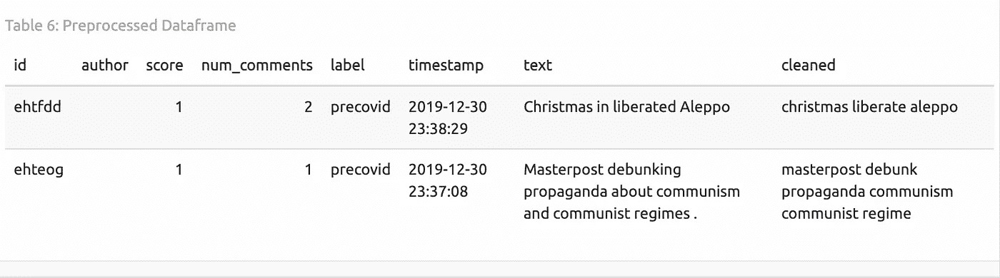

预处理的 Reddit 数据

## 提取表情符号

在分析社交媒体数据时，我们不能忽略这样一个事实，即人们通过表情符号表达自己是一种趋势，它慢慢取代了通过实际语言进行交流的方式。

我在这里的目的是准备数据集，用于分析多个部分(时期或情绪)中常用的表情符号，因此我收集了所有表情符号并提交到一个列表中，并使用[表情包](https://github.com/hadley/emo)为每个表情符号添加了一个计数器。

```
rc <- rc |>
    mutate(emoji = emo::ji_extract_all(text))

rc$emoji_count <- sapply(rc$emoji, length)
```

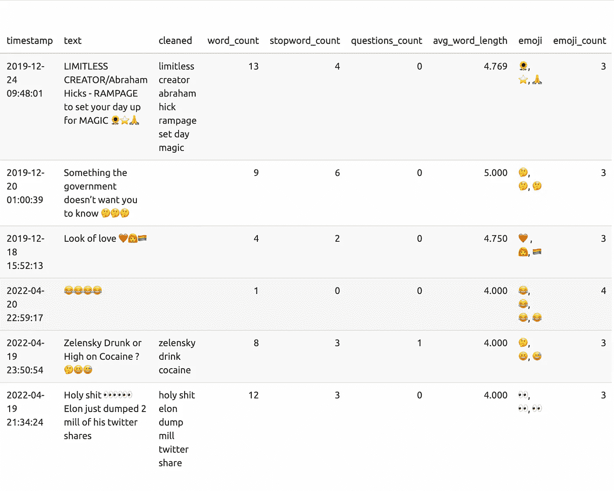

## TF-IDF

通过将 tf-idf 模型与清理后的文本相匹配来查看哪些关键词驱动了每个提交。

> tf-idf 的思想是通过降低常用词的权重并增加文档集合或语料库中不经常使用的词的权重来找到每个文档内容的重要词

*这里有一个片段:*

```
rc_tfidf <- rc |>
    unnest_tokens(word, cleaned) |>
    count(label, word, sort = TRUE) |>
    ungroup()

total_words <- rc_tfidf |>
    group_by(label) |>
    summarize(total = sum(n))

rc_tfidf <- left_join(rc_tfidf, total_words)rc_tfidf <- rc_tfidf |>
    bind_tf_idf(word, label, n)

tfidf <- rc_tfidf |>
    arrange(desc(tf_idf)) |>
    mutate(word = factor(word, levels = rev(unique(word)))) |>
    group_by(label) |>
    top_n(10) |>
    ungroup() |>
    ggplot(aes(word, tf_idf, fill = label)) +
    geom_col(show.legend = FALSE) + labs(x = NULL,
    y = "tf-idf") + facet_wrap(~label, scales = "free") +
    coord_flip()
```

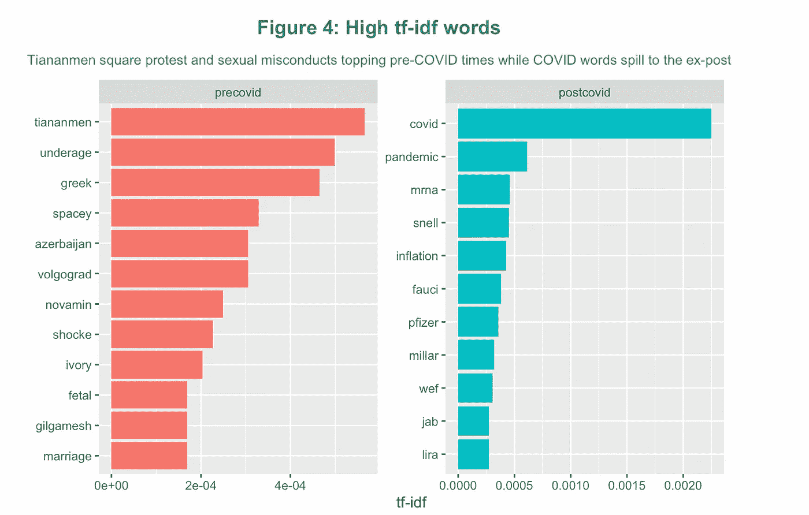

高 tf-idf 字

似乎与凯文·史派西丑闻和政治冲突(中国抗议)相关的关键词是 COVID 之前提交的最相关的词。在疫情之后，疫苗接种的关键词作为争议的驱动因素出现了。

## 情感分析

为了根据总情感贡献对每个词进行排名，我使用了 AFINN 词典，并对每个标签的所有分数进行求和，以获得一个词的总贡献。

> AFINN lexicon 是由 Finn RUP Nielsen 在 2009 年至 2011 年期间人工评定化合价的英语术语列表，其整数范围为-5(负)至+5(正)。

下图表明，在 COVID 前后，正负项之间有相当多的重叠。

如果非要我挑出某些不一样的话，那就是*虐*因为疫情和*禁令前的所有性行为不端，薪酬*和*危机*因为疫情之后的后续经济下滑，以及所有与对俄制裁相关的词汇。

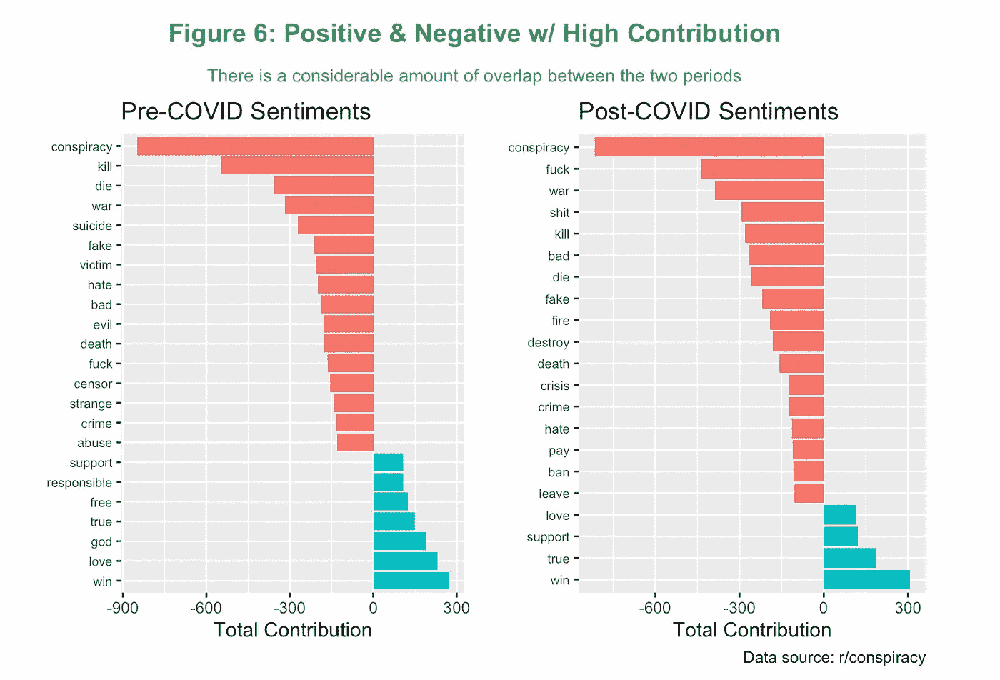

情感贡献

## 情感类别

我们还可以利用其他情感词汇，比如 NRC，它非常适合识别情感类别。

> NRC 情绪词典是一个英语单词列表，列出了它们与八种基本情绪(愤怒、恐惧、期待、信任、惊讶、悲伤、快乐和厌恶)和两种情绪(消极和积极)的关联。注释是通过众包手动完成的。

我们可以看到，类别之间的排名没有太大变化，除了与*信任*相关的词相对更多。这与疫苗神话后放大的不确定性有轻微的联系，在疫苗神话中，人们质疑理论，假新闻在这里停留。

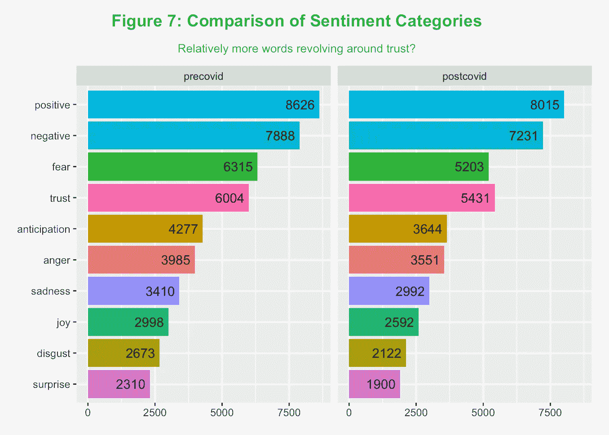

## 表情符号分析

使用文本处理部分收集的表情符号列表，我们可以看到最常用的表情符号是如何随着时间的推移而变化的。

我们可以看到，前 2 个表情符号没有变化，但在 COVID 之后出现了更多负面表情符号(如骷髅、小丑、可疑的眼睛)。国旗出现在两个词中，据称阿尔巴尼亚人(不得不谷歌自己)代表杜阿·利帕支持阿尔巴尼亚民族主义的推文。乌克兰国旗在那里是因为俄罗斯侵略者发起的战争。

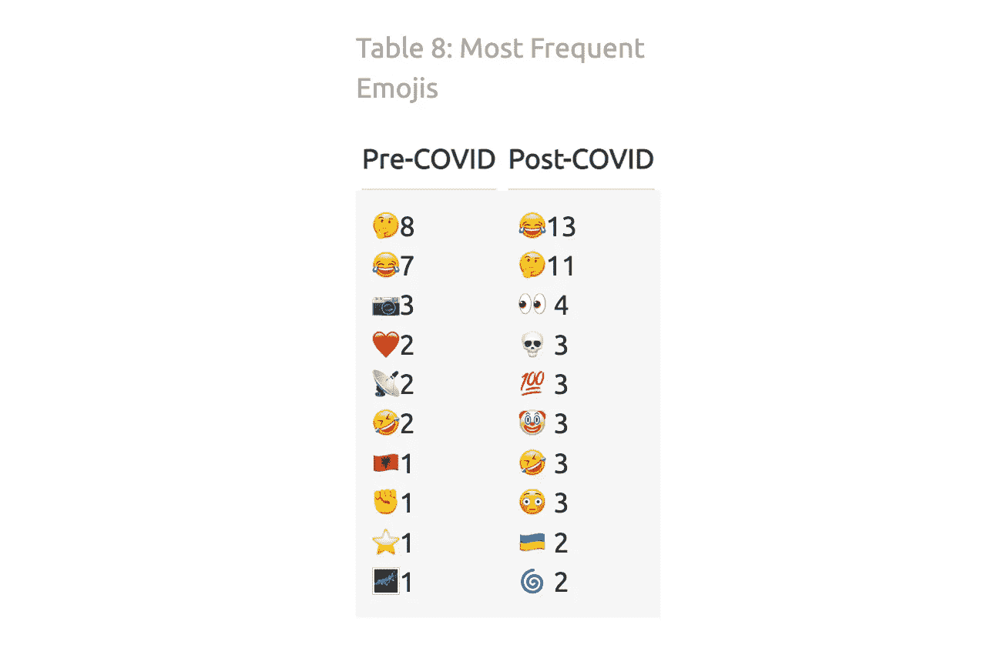

热门表情符号

## 词汇云

如果我们通过 bing 词典检查与情感相关的单词，我们可以在下面的单词云中看到最常见的单词。阴谋仍然是使用最多的负面词，而特朗普是最积极的。

> bing 词典以二元方式将单词分为积极和消极两类。

如果我们仔细观察那些没有压倒其余的词，我们可以看到差异正在从虐待、神秘的外星人、弹劾和监狱(分别与哈维·韦恩斯坦、UFO 发现、Trump 和 Jeffrey Epstein 相关)转移到病毒、炸弹和危机。就正迁移而言，特异性要小得多。

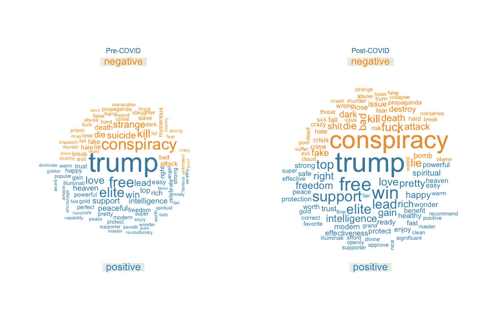

## 二元模型分析

将分析扩展到多个单词可能是个好主意。因此，我对每个提交的二元模型进行了 tf-idf 分析。代币一直与爱泼斯坦(*死于自杀，爱泼斯坦死于曼哈顿监狱*)和与外星人有关的争议(*奇怪的生物，生物森林*)密切相关，而在后 COVID 时期，二元模型在从疫苗接种到性别(*概念阴茎*)到性别歧视( *amp amp* )的主题方面更加分散。

```
rc_bigrams <- rc |>
    unnest_tokens(bigram, cleaned, token = "ngrams",
        n = 2)

rc_bigrams_tfidf <- rc_bigrams |>
    count(label, bigram) |>
    bind_tf_idf(bigram, label, n)
```

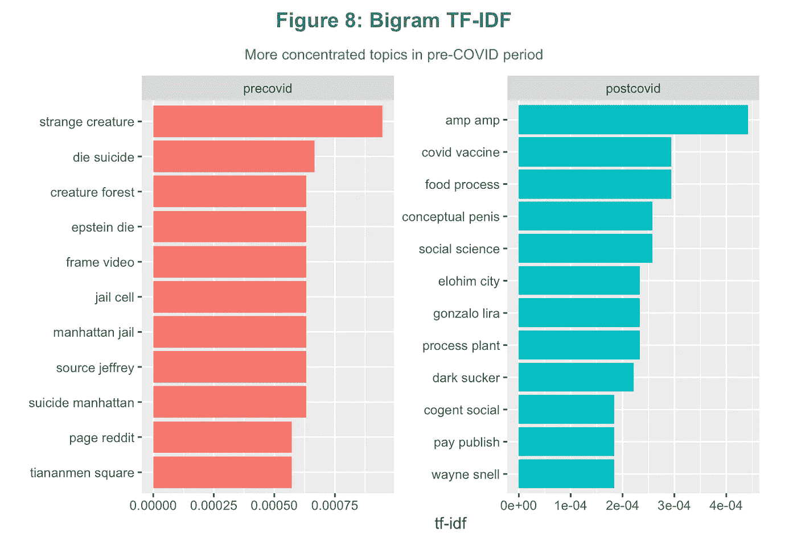

二元模型分析

我们甚至可以将二元模型的元素链接在一起，以查看经常一起提到的单词网络，从而创建一个完整的故事。最大的网站围绕着讨论外星人存在(左下角)、天安门广场的中国抗议者和爱泼斯坦丑闻的话题。这些都是前 COVID 时期的，而在疫情之后，持续的故事数量减少了。

*片段:*

```
bigrams_separated <- rc_bigrams |>
    separate(bigram, c("word1", "word2"),
        sep = " ")

# new bigram counts:
bigram_counts <- bigrams_separated |>
    count(word1, word2, sort = TRUE)

bigram_graph <- bigram_counts |>
    select(from = word1, to = word2, n = n) |>
    filter(n > 20) |>
    graph_from_data_frame()

a <- grid::arrow(type = "closed", length = unit(0.15,
    "inches"))

ggraph(bigram_graph, layout = "fr") + geom_edge_link(aes(edge_alpha = n),
    show.legend = FALSE, arrow = a, end_cap = circle(0.07,
        "inches")) + geom_node_point(color = "lightblue",
    size = 5) + geom_node_text(aes(label = name),
    vjust = 1, hjust = 1) + labs(title = "Network of bigrams",
    subtitle = "Long lineage about Epstein, the aliens, and protests") +
    theme_graph()
```

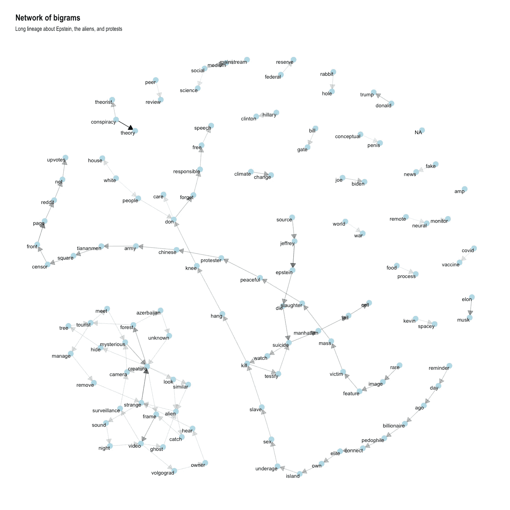

## 主题建模(LDA)

最后，我想使用潜在狄利克雷分配(LDA)来确定疫情前后的讨论主题。

> LDA 是潜在狄利克雷分配的缩写，是一种用于主题建模的技术。潜在的意思是隐藏的，尚未被发现的东西。Dirichlet 表示该模型假设文档中的主题和这些主题中的单词遵循 Dirichlet 分布。分配意味着给予一些东西，在这种情况下是话题。LDA 假设使用统计生成过程生成文档，使得每个文档是主题的混合，并且每个主题是单词的混合。

## 前 COVID

我们可以看到，话题从外星人到与特朗普有关的政治。有几个主题我可以用我的领域知识来标注。

*   话题 1: [爱泼斯坦案](https://www.bbc.com/news/world-us-canada-48913377)
*   话题 4: [外星人和不明飞行物的发现](https://eu.usatoday.com/story/tech/2019/06/11/bizarre-creature-caught-on-security-camera-viral-video/1411177001/)
*   话题 6: [谷歌 vs 中国](https://www.technologyreview.com/2018/12/19/138307/how-google-took-on-china-and-lost/)
*   话题 7:社交媒体审查
*   话题八:[特朗普被弹劾](https://en.wikipedia.org/wiki/First_impeachment_of_Donald_Trump)
*   主题 10:宗教和种族

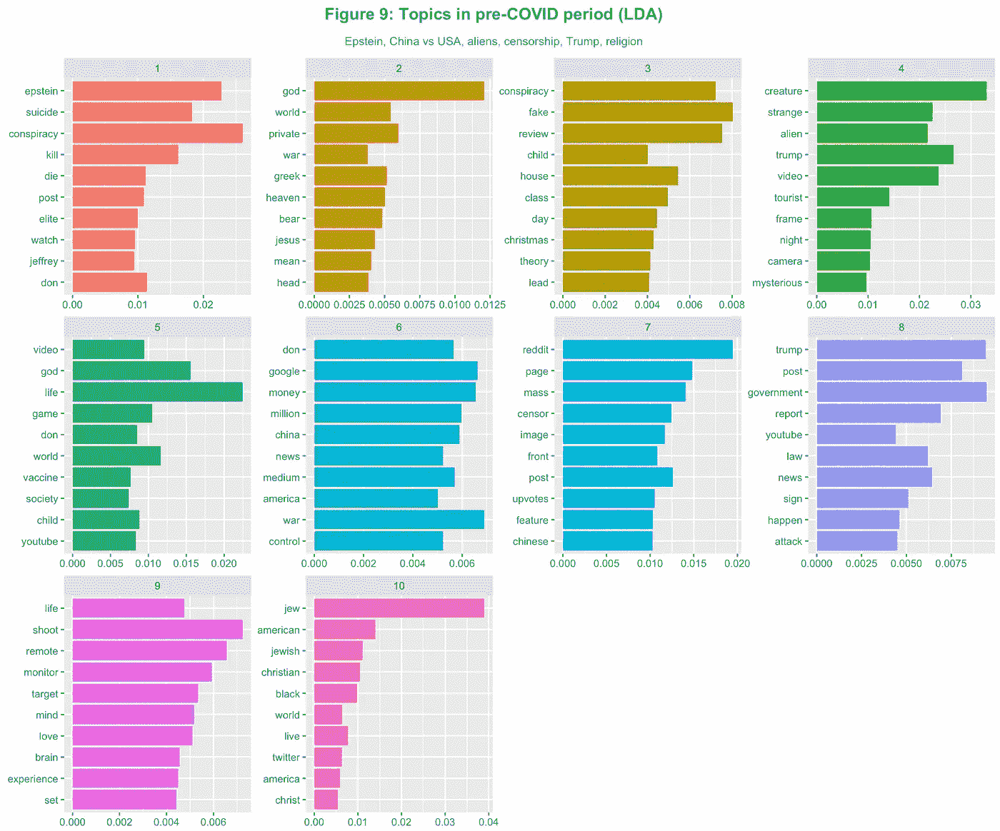

## 后 COVID

疫情之后，话题从乌克兰战争到疫苗接种，再到社会科学和性别。其他主题不够连贯，无法识别任何标签。这里列举几个话题:

*   话题 1: [理查德·韦恩·斯内尔](https://en.wikipedia.org/wiki/Richard_Snell_(criminal))和[蒂莫西·麦克维](https://en.wikipedia.org/wiki/Timothy_McVeigh)白人至上主义者和杀人犯
*   主题 5:与 COVID 相关的限制和政治(CDC，加拿大卡车抗议)
*   话题 6:美国政治
*   议题 7:俄罗斯和乌克兰的冲突以及潜在的核战争
*   话题 17: JFK 遇刺
*   主题 19:疫苗接种
*   主题 13:社会科学和性别

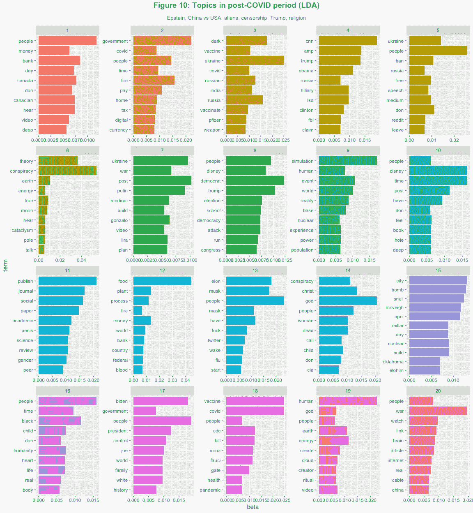

## 结论

不管怎样，我认为我们在这里学到了很多新东西，最终，我的假设成立了。

自疫情以来，社区内的不确定性被放大了。分类在信任情绪中的单词的相对频率增加了，越来越多的与怀疑和负面单词相关的表情符号出现了。后 COVID 时期的主题不如前疫情时期一致。现在许多讨论都是关于社会科学、性别、宗教。