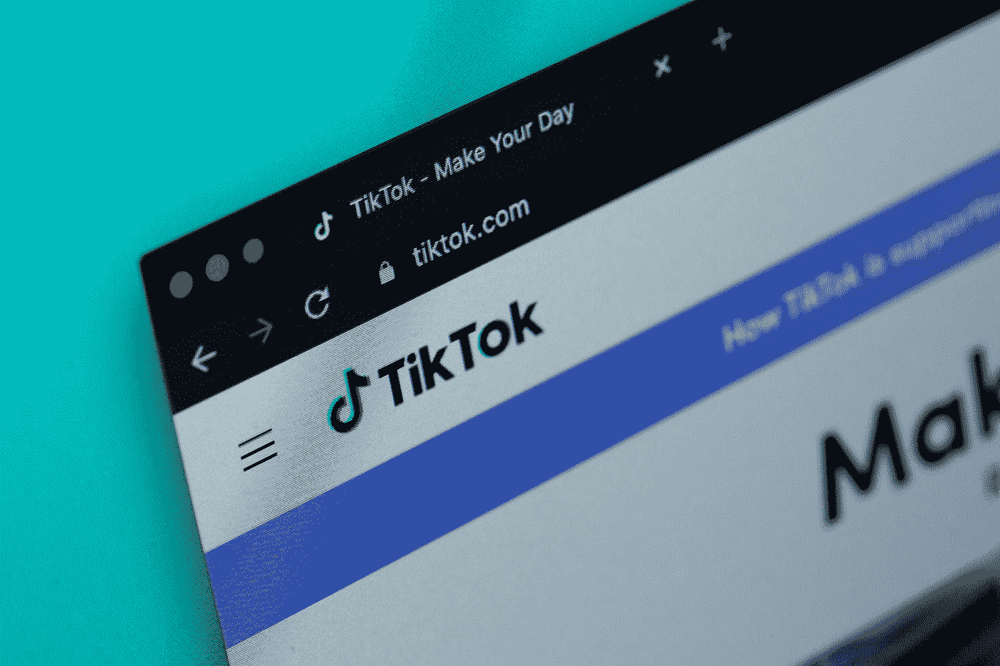

# 抖音的隐私政策从今天开始改变

> 原文：<https://medium.com/codex/how-tiktok-sneaks-away-from-consent-b86a0740176a?source=collection_archive---------15----------------------->

Solen Feyissa 在 [Unsplash](https://unsplash.com?utm_source=medium&utm_medium=referral) 上拍摄的照片

今年 6 月，抖音开始向欧盟、英国和瑞士的用户推出应用内通知，告知他们隐私政策的变化。最显著的变化是:从 7 月 13 日起，抖音将基于合法利益使用个性化广告。这是什么意思？

即使你过去拒绝了个性化广告，该应用程序现在也可以在未经你同意的情况下处理你的数据，因为他们声称拥有“合法利益”。

> 只要您在今天之后继续使用该应用程序，您就自动同意这一点。

如果你不使用抖音，你可能会想‘那又怎样？’。现在，如果你稍微关心一下数据保护，请继续阅读这一变化是如何侵蚀欧洲数据保护立法的。

## 什么是合法利益？

根据 GDPR，合法利益是处理个人数据的六个法律依据之一。它预先假定数据控制者(抖音)对处理数据主体(用户)的数据有合法的兴趣，数据主体(用户)必须能够对处理哪些数据和处理什么有合理的预期。

我知道，这听起来有点复杂，老实说，这是非常模糊的。GDPR 自己提到了两个例子:防止欺诈或出于营销目的。在任何情况下，不得对数据进行超出数据主体预期的进一步处理，例如将其出售给第三方。最后，当数据主体的基本权利和自由高于一切时，合法利益不适用。

一家公司是否拥有合法权益显然是一个(广义的法律)解释问题。对抖音来说，主要利益可能是收入。如果数据保护机构认为这一目的是合法利益，这可能不是消费者的最佳结果，但这是可能的。

但合法利益不能只用于黑幕营销处理。有趣的是，隐私研究者和权威人士已经推动了更多合法权益的实现。为什么？因为除了同意之外，合法利益需要仔细平衡数据控制者(公司)和理想情况下的数据主体(用户)的利益。在同意的情况下，人们可以被推动和操纵给予同意——特别是当他们在某种程度上依赖于使用某项服务时。相比之下，公司必须给出令人信服的解释，说明为什么他们有处理用户数据的合法权益。简言之；合法利益将评估加工的利益和后果的责任放在有资源这样做的公司身上。

无论如何，抖音在处理用户数据方面的合法利益需要进一步的法律思考，这绝对不是本文的主题。然而，相关的是抖音从同意到合法利益的转变。

## 抖音转向合法利益有什么问题？

2020 年，欧洲数据保护委员会(EDPB)出版了《GDPR 的采纳》，其中特别触及这个问题:同意与其他合法理由(如合法利益)之间的相互作用。它们在通过时指出:

> 换句话说，控制者不能从同意转换到其他合法的基础。例如，当同意的有效性遇到问题时，不允许追溯性地利用合法利益基础来证明处理的正当性。由于要求披露控制者在收集个人数据时所依据的法律依据，控制者必须在收集之前决定适用的法律依据。 [(EDPB，2020)](https://edpb.europa.eu/sites/default/files/files/file1/edpb_guidelines_202005_consent_en.pdf)

这意味着抖音不能征求你的同意，然后如果你拒绝，切换到合法利益，并使用您的数据进行个性化广告。然而，这正是他们计划要做的。

> 换句话说:抖音将从 7 月 13 日开始做的事情与 GDPR 不一致。

老实说，不管怎样，抖音可能能够根据大多数用户的同意来处理他们的数据。但我发现最令人不安的是，他们找到了一种方法来**绕过那些明确拒绝额外处理的少数用户。**尽管成员国采纳并实际执行“新的”(2 年前的)EDPB 准则还为时过早，但我们应该能够预计“不”仍然是“不”。如果这一举措毫无阻力地获得通过，它将为每一个数据控制者树立一个可怕的先例，他们需要迅速地将对额外数据处理的“不”变成“是”。

像抖音这样实施这些做法的公司公开承认，他们不尊重欧洲的数据保护准则，而欧盟无力执行这些准则，显然加剧了 GDPR 的侵蚀。让我们看看抖音的新隐私政策能坚持多久。