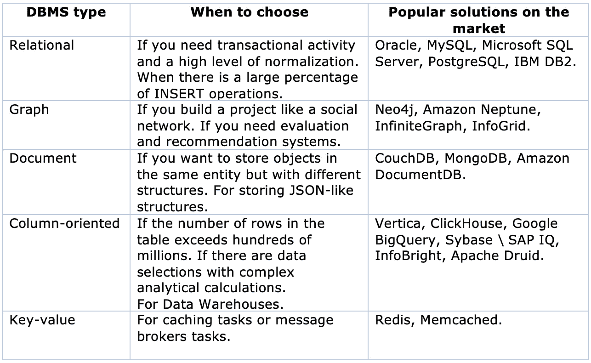

# 如何选择一个数据库管理系统来解决你的任务

> 原文：<https://medium.com/codex/how-to-%D1%81hoose-a-dbms-to-solve-your-tasks-943039388756?source=collection_archive---------9----------------------->

[万花筒](https://unsplash.com/@kaleidico?utm_source=medium&utm_medium=referral)在 [Unsplash](https://unsplash.com?utm_source=medium&utm_medium=referral) 上拍摄的照片

嗨，我叫叶夫根尼·萨莫连科，我是研发中心的负责人。我在一家欧洲金融科技公司工作。我在金融科技领域有超过 15 年的经验，为银行、中央银行、保险组织、基金、货币市场和支付提供商开发软件。我们使用数据库开发几乎每一个软件，我不时看到开发人员在选择正确的数据库时感到困惑。有时，哪种类型的 DBMS 是最佳选择并不明显。

这是关于数据库管理系统系列的第一篇文章，在这篇文章中，我将试图用简单的语言告诉您 DBMS 市场上存在哪些解决方案。还有，我会解释选择什么产品，如何根据你的任务做出正确的选择。

我的专业活动包括新员工的面试。我注意到当被问到“存在什么类型的数据库管理系统？”许多人回想起 NoSQL 和关系数据库。但是人们经常忘记 DBMS 类型或者不能表达它们之间的区别。以下是最常用的数据库管理系统列表:

●关系型

●图表

●文件

●面向列

●键值

查看本文末尾的表格，我在其中总结了本文，即，在哪些情况下，特定类型的 DBMS 是合适的，以及您可能会发现哪些流行的解决方案是适用的。如果你想跳过长篇大论的解释，欢迎直接入席。我应该指出，一些主要供应商配备了几种类型的 DBMS，既有独立的产品，也有内部实现。至于甲骨文，他们没有一样东西没有:一个经典的关系数据库；一个独立的 Oracle NoSQL 数据库产品，可用作列、文档和键值。自治数据仓库，专门用于数据仓库；Oracle Graph Server for graphs 和许多其他产品。人们可以就此写一系列文章——我想我会这样做。现在，我将继续向您介绍每种类型的 DBMS。

# 数据库管理系统的类型。如何选择正确的选项

# 关系数据库管理系统

这些是最常用于构建 OLTP 解决方案(在线事务处理)的经典系统。通过这些解决方案，DBMS 可以处理许多小型事务。该系统需要较短的响应时间，并能够在特定条件下撤销交易过程中所做的任何更改。如果您正在构建一个系统，希望在其中存储大量实体(表),它们之间有不同类型的关系(一对一、一对多、多对多),那么您很可能需要一个关系 DBMS。

## 最著名的关系数据库管理系统

●甲骨文

●微软 SQL

● PostgreSQL

● MySQL

● IBM DB2

## 何时选择关系数据库

表明您需要关系型 DBMS 的主要标志是高度的数据规范化。一个额外的提示是，需要处理许多带有大比例插入事务的短事务。

## 当你不应该选择关系数据库时

如果您想存储非结构化数据，最好考虑文档 DBMS。如果需要存储非常简单的键值结构，请选择专用的键值 DBMS。

不选择关系 DBMS 有意义的另一个标志是需要频繁地更新相同行中的值。这对关系数据库管理系统来说可能代价很高——你必须使用“高级魔法”来正确地做每一件事。如果有专家使用这种魔法，请忽略这一建议。或者你是否知道该怎么做。

# 图形数据库管理系统

它是一种特定类型的 DBMS，用于处理图形、图形的节点和属性以及节点之间的任意关系。一个简单的例子是构建像社交网络这样的应用。在那里，你需要根据不同的标准存储用户(节点)之间的联系:共同的兴趣、同事、亲戚。

## 最著名的图形数据库管理系统

● Neo4j

●亚马逊海王星

●无穷图

●信息网格

## 何时选择图形数据库

如果您正在构建某种社交网络或实现推荐和评级系统，那么值得关注 graph DBMS。也用它，当你深刻理解了什么是图，图是干什么用的。

## 当你不应该选择图形数据库管理系统

除上述情况外，几乎在所有其他情况下。

# 文档数据库管理系统

文档或面向文档的 DBMS 是最流行的 NoSQL DBMS 类型之一，其中逻辑数据模型的基本单元是具有特定语法的结构化文本(文档)。

相信文档 DBs 中的数据模型类似于面向对象 DBs 中的数据模型。这有一定的道理，但是它们之间的区别在于文档数据库只存储状态，而不存储对象的行为。文档 DBMS 正在积极发展，其中一些甚至支持模式验证。

## 最著名的文档数据库管理系统

● CouchDB

● MongoDB

●亚马逊文档数据库

## 何时选择文档数据库

文档数据库管理系统的应用范围很广。它可以用作单个微服务或大规模解决方案的小型数据库，也可以用作某些东西的状态存储。如果您希望在同一个实体中存储不同结构的对象，这是最好的选择。当您需要存储结构(包括对象、列表和字典)时，尤其是以类似于 JSON 的格式存储时，它也非常有用。

## 当你不应该选择一个文件数据库管理系统

文档系统不是实现事务模型的正确解决方案，当然也不是呈现帐户的最佳选择。

# 面向列的数据库管理系统

它们非常不同于关系数据库管理系统。是的，它们也由具有属性的行组成，并在表中分组。逻辑模型的差异很小。但是在物理存储级别，差异是显著的。

关系 DBMS 逐行存储数据。这意味着要读取特定列的值，您必须读取几乎整个行，至少从第一列到所需的列。在面向列的 DBMS 中，数据是逐列存储的。也就是说，一列显示为一个单独的表。将直接从特定的列进行读取。实际上，它工作得非常快——我已经在几个实现的数据仓库上测试过它。

## 面向列的 DBMS 的优势:

●针对大量数据高效执行复杂的分析查询

●简单且几乎即时的数据表重组

●大幅压缩，显著节省空间

## 最著名的面向列的 DBMS

●赛贝斯智商(SAP 智商)

● Vertica

●点击之家

●谷歌大查询

●信息光明

●阿帕奇德鲁伊

## 何时选择面向列的数据库

使用基于列的 DBMS 的主要原因是，您希望构建一个数据仓库，并计划使用复杂的分析计算进行选择。一个间接指标是要查询的行数是否超过数亿。

## 当您不应该选择面向列的 DBMS 时

如果查询的表中的行数少于数亿行，面向列的 DBMS 可能不会比关系型 DBMS 有多少优势。

鉴于系统的特殊性，如果您的查询足够简单并且每个查询的参数都是静态的，面向列的 DBMS 将是低效的。

请记住，面向列的 DBMS 可能有其他限制。例如，查询语言可能不同于传统的 SQL，或者可能没有事务支持。

# 键值数据库管理系统

这可能是最简单的 DBMS 类型之一。这是一种带有唯一键和绑定值的表，可以包含任何内容。这种 DBMS 最常用于缓存，因为它们速度很快，这是因为有一个唯一的键，并且一个查询只返回一个值。

有些键值 DBMS 可以完全在内存中运行，有些可以为记录设置一个生存时间(TTL ),超过这个时间记录就会被自动删除。

## 最著名的键值 DBMS

● Redis

●内存缓存

## 何时选择键值数据库

如果您需要 DBMS 来缓存数据或消息代理，这个系统是理想的。对于需要保持相当简单的结构并能快速访问它们的数据库来说，它也很棒。

## 当你不应该选择一个键值 DBMS 时

如果您在数据库中存储了大量实体(表)，并且这些实体具有不同数据类型的复杂结构，请不要选择此选项。此外，如果您希望进行返回大量行的复杂查询，请考虑另一个选项。

# 结论

有许多不同类型的数据库管理系统，选择正确的一个有时会很头疼。我相信我已经把这个问题说得更清楚了，现在你可以很容易地在一分钟内选择正确的数据库管理系统。

如果您计划构建一个复杂的解决方案，并且觉得需要多种类型的 DBMS，那就去做吧。此外，不要试图立即决定 DBMS 供应商，通常，这是一个次要的话题。

根据以下三点选择 DBMS 类型:

●你需要解决的任务类型

●要处理的数据类型

●增长前景和规模

请注意 DBMS 的普及性—它保证了广泛的开发人员和开发工具可以帮助您快速找到问题的答案。

在下面的表格中，我简要地汇编了本文中涉及的所有内容。

我希望我是有帮助的。在 DBMS 系列的下一篇文章中，您将了解如何在云和本地解决方案、付费和免费选项之间进行选择。

我喜欢帮助组织用数据来增强他们的业务，所以我很乐意在下面的评论中听到你对上述内容的想法，并随时通过 [LinkedIn](https://www.linkedin.com/in/yevgeniysamoilenko/) 与我联系。