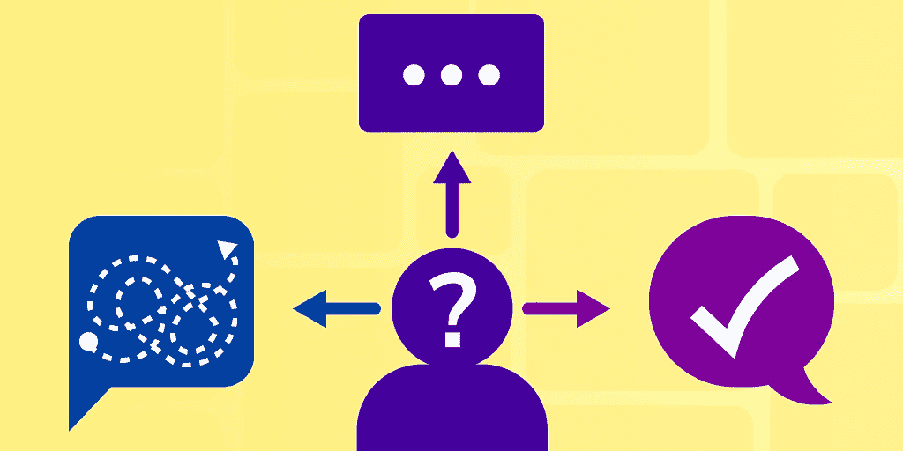

# 如何在解决不了问题的情况下赢得编码面试

> 原文：<https://medium.com/codex/how-to-ace-a-coding-interview-even-if-you-cant-solve-the-problem-1f08df3713c1?source=collection_archive---------2----------------------->

作者图片

在大多数大型科技公司，编码问题是面试过程中最重要的部分。一些主要的科技公司有如此困难的编码面试，以至于软件工程师经常花几个月的时间来准备。遗憾的是，无论你做了多少准备，也不可能对每个问题都做好准备。面试中的问题被设计得很难，甚至会难倒最有经验的开发人员。幸运的是，你可以采取一些措施来帮助自己摆脱困境。

在这里，我们列出了一个你可以遵循的过程，以及一些帮助你解决最困难问题的建议。

**我们将介绍:**

*   深吸一口气
*   澄清问题
*   创造好的例子
*   用手做
*   变得简单，然后优化
*   接受暗示
*   你学习的下一步

# 深吸一口气

当你认为自己解决不了问题的时候，首先要做的就是深呼吸。记住没有完美的面试，犯错是意料之中的。这些问题被设计成极具挑战性——没有人会马上有完美的答案。即使是最有经验的候选人也不会很快回答这些问题。从这里开始，你可以采取一些步骤来解决这个问题。

# 澄清问题

在采取进一步行动之前，先把问题搞清楚。有时候，面试官会故意忽略一些重要的细节。问问题是一件好事，会让你的面试官看到你正在深入思考这个问题，并试图更好地理解它。问一些澄清性的问题是你作为开发人员经常使用的技能，所以你的面试是展示这种技能的好地方。

# 创造好的例子

既然你已经阐明了你对这个问题的理解，那么是时候创造一些例子了。思考一些可能的输入，以及它们的预期输出是什么。考虑一些可能需要特别考虑的边缘情况。

> *记得大声解释你的过程。你的面试官不一定关心你是否能完美地解决这个具体问题，他们关心的是深入了解你解决问题的方法，这将有助于你申请的工作。*

# 用手做

如果没有立即想到解决方案，首先手动解决问题可能会有所帮助。暂时忘记这是一次编码面试。如果让你手算这道题，你会怎么处理？尝试逆向工程你的思维过程。有时候，紧张会导致我们陷入算法，但是去掉编码，我们可以很快找到解决方案。

# 变得简单，然后优化

有一个低效的解决方案总比没有解决方案好得多。很多时候，想出简单可行的方法更容易。从那里，你可以讨论你可以遵循的步骤来改进它或者提到潜在的瓶颈以及如何修复它们。

# 接受暗示

如果你完全卡住了，问一个提示是没问题的。提出要求并真正得到某个地方总比一无所获要好。如果可能的话，询问一些具体的提示，给你最好的摆脱困境的机会。记住，你的面试官是站在你这边的，希望看到你表现出色。

# 你学习的下一步

似乎编码面试变得越来越难，导致即使是最有经验的候选人也陷入困境。幸运的是，如果你在面试中遇到编码问题，你现在有了一个可以遵循的流程。你能做的最好的事情就是在面试前尽可能多的学习和准备。

*快乐学习！*

## 继续阅读编码面试

*   [编码面试常见问题:准备、评估和结构](https://www.educative.io/blog/coding-interview-faq-preparation-guide)
*   [破解亚马逊顶级编码面试问题](https://www.educative.io/blog/crack-amazon-coding-interview-questions)
*   在任何一家大的软件公司，我该如何准备面试？
*   [为编码面试做准备的 5 个可靠的技巧](https://www.educative.io/blog/5-tried-and-true-techniques-to-prepare-for-a-coding-interview)