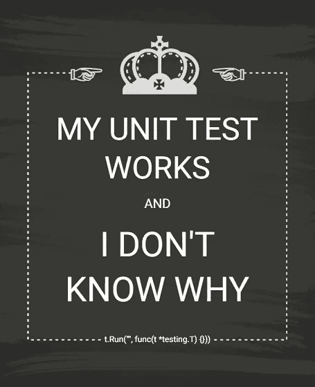
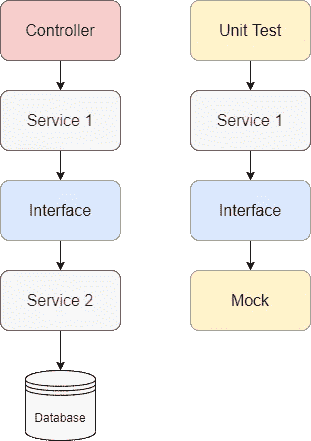

# 如何在 Golang 单元测试中实现 100%的代码覆盖率？

> 原文：<https://medium.com/codex/how-to-achieve-100-code-coverage-in-golang-unit-test-227b99746408?source=collection_archive---------2----------------------->



我知道你们中的一些人在这里是因为你们正在努力达到 100%的覆盖率。我知道那种感觉，因为我亲身经历过。但是在我们讨论如何去做之前，我们需要理解单元测试的目的。**单元测试是程序测试的第一道防线。目标是确保代码的每个单独部分的正确性。**因此，可靠的单元测试转化为可靠的功能。

> 创建单元测试时，心态很重要。仅仅追求覆盖率并不能保证一个好的单元测试。它是关于创建一个可靠的功能，正确地测试其 100%的代码。

然而，在单元测试中实现 100%的代码覆盖率是棘手和困难的。当且仅当您理解代码本身时，您才能做到这一点。一旦您理解了代码，您可能会意识到代码不支持全覆盖单元测试，需要重构。在本文中，我们将尝试讨论实现单元测试和实现 100%覆盖率的正确方法。

# 接口类型至关重要

真正的单元测试只是测试一个单元或单个功能。因此，单元测试不能允许其功能与其他功能或资源进行通信。这可以通过模仿函数的依赖性来实现。



左边的流程是原始代码。右边的流程是单元测试。注意，单元测试流通过使用模拟响应作为替代，消除了对数据库的依赖。

我们如何模仿函数的依赖性？**接口**型来拯救。在这种情况下，我们可以使函数的依赖成为接口类型。因此，我们可以用我们的 mock 进行**依赖注入**，然后函数将调用 mock 而不是实际的 mock。

> 该接口允许我们自由地使用任何实现该接口中所有功能的结构。让这个结构成为一个模仿。

接口是实现 100%代码覆盖率的主要关键。单元测试可以通过模拟外部函数的所有响应来运行每一个可能的用例。从而有效地证明了函数的正确性。例如，假设我们有一个如下所示的`retail`服务和`warehouse`服务。

在正常情况下，服务的初始化应该是:

```
myWarehouse := warehouse.New(db)
myRetail := retail.New(myWarehouse)// Get my products
products, err := myRetail.GetMyProduct()
```

但是，零售功能不能在单元测试上执行，因为它依赖于使用数据库的仓库。这是因为单元测试不应该使用真实的数据库或其他外部依赖。因此，我们需要创建一个实现所有`warehouseItf`功能的仓库模拟，以便在单元测试中模拟来自仓库服务的响应。

您可能会注意到，这种为单元测试创建模拟的方法太有限了。模拟响应是固定的，或者不够灵活，无法覆盖单元测试中的每个用例。这可以通过创建一个多用途的模拟来解决，可以为每个测试用例创建和分配一个响应。非常灵活的模拟。幸运的是，你不需要从头开始创建，因为已经有很多 Golang 的模仿工具了。

# 嘲弄框架

有几种方法可以模拟服务来补充 Golang 测试。您可以从头开始创建自己的模拟，或者使用外部模拟框架来提高灵活性和效率。这些框架包括:

1.  [**戈莫克**](https://github.com/golang/mock) 。它是模仿接口的最常见和最流行的模仿框架。你可以在[文档](https://pkg.go.dev/github.com/golang/mock/gomock)中阅读更多细节。
2.  [**Go Sqlmock**](https://github.com/DATA-DOG/go-sqlmock) 。数据狗 sqlmock 是模仿 Golang 的 SQL 的常见框架之一。您可以在[文档](https://pkg.go.dev/github.com/data-dog/go-sqlmock)中阅读更多详细信息。
3.  [**作证**](https://github.com/stretchr/testify) 。这个库也是模拟对象和 HTTP 活动的一个很好的替代品。我使用这个库作为它伟大的断言工具。你可以在[文档](https://pkg.go.dev/github.com/stretchr/testify)中阅读更多细节。

这些库是我的首选。有很多断言和 Golang 嘲讽工具。随意探索，找到自己的喜好。

我个人一直在使用所有这些框架。它们大部分时间从 HTTP、接口和数据库 SQL 满足了 Golang 单元测试的所有需求。您可以根据自己的需求，随意寻找其他第三方框架或创建自己的框架。然而，我不推荐使用*猴子补丁*，即使是对于单元测试。你可以自由尝试，但要自担风险。

## 断言的重要性

当您创建单元测试及其测试用例时，您会意识到功能变得越大越复杂，维护或扩展单元测试就变得越困难。我们可以通过**简化单元测试来克服这个问题，使所有的模拟尽可能本地化**。

单元测试变得难以维护的一个最常见的原因是，我们无法跟踪每个测试用例的流程。因此，建议所有模拟期望和断言尽可能详细。避免使用一般预期，如`assert.NoError()`、`gomock.Any()`或`sqlmock.AnyArg()`，因为**有可能产生假阳性结果**。

> 覆盖率可以代表功能的单元测试暴露。但是，这并不代表一个函数的正确性。这就是断言的作用。

# **本地化！**

仅仅模仿接口并不能保证你覆盖 100%的代码。在一些情况下，接口不能被使用，但是你需要模拟函数的响应，比如`json.Marshal()`或者`time.Now()`。

通过创建您自己的库来包含这些公共函数作为方法接收器，可以模仿这些公共函数。基本上，这个库将有一个结构来实现导入的包公共函数中的所有函数，并充当包装器。

这样，嘲笑公共函数将不再是一个问题。只要单元测试仍然在测试功能接收器的范围内，这种模拟方法将有助于模拟每一个可能的场景，从而达到 100%的覆盖率。

# 由变量覆盖

对于`fmt.Printf`或者`log.Fatal`这样的简单功能，有几个情况是光靠接口不够或者太麻烦。一个这样的例子是没有接收器的正常功能。

> 如何在 func main()中模拟这些函数并实现 100%的覆盖率？

另一种解决方案是通过变量使用依赖注入来覆盖公共函数。你可以用几种方法来达到这个目的。最简单的方法是创建一个引用公共函数的变量，如下所示:

```
var logFatal = log.Fatal
```

通过覆盖这个变量，您现在可以通过用模拟函数替换变量函数来模拟单元测试中的公共函数。最后，不要忘记将函数恢复到变量中，否则变量将在单元测试中总是引用模拟函数。

```
func TestLogFatal(t *testing.T) {
   logFatal = func(v ...interface{}) {
      return
   }
   defer func() {
      logFatal = log.Fatal
   }()
   // Do your unit test
}
```

**善意提醒**:将公共函数覆盖到局部变量中时，请将函数本身赋值到变量中，而不是将函数执行的结果赋值到变量中。这是一个常见的错误，也是一个致命的错误。

`var fmtPrintf = fmt.Printf()`不要

做:`var fmtPrintf = fmt.Printf`

**警告**:虽然这个方法简单多了，也更容易实现。它伴随着风险。由于 mock 使用了一个可以在整个包范围内访问的全局变量，当覆盖该变量时发生冲突的可能性将使单元测试变得不可靠。尤其是在并行运行单元测试时。

# 摘要

单元测试确实是困难的、棘手的，并且需要很多额外的工作。另一方面，单元测试也是必不可少的，它是防止错误和尽早解决错误的第一道防线。一个好的、可靠的单元测试是你的代码在其整个生命周期中最好的守护者。就像在现实生活中一样，一个好的安全系统绝不应该有任何不设防的部分或漏洞可以被入侵者利用。因此，100%覆盖率的单元测试是你的代码最好的安全系统。我希望这篇文章能帮助您实现全面覆盖。祝你的单元测试好运！